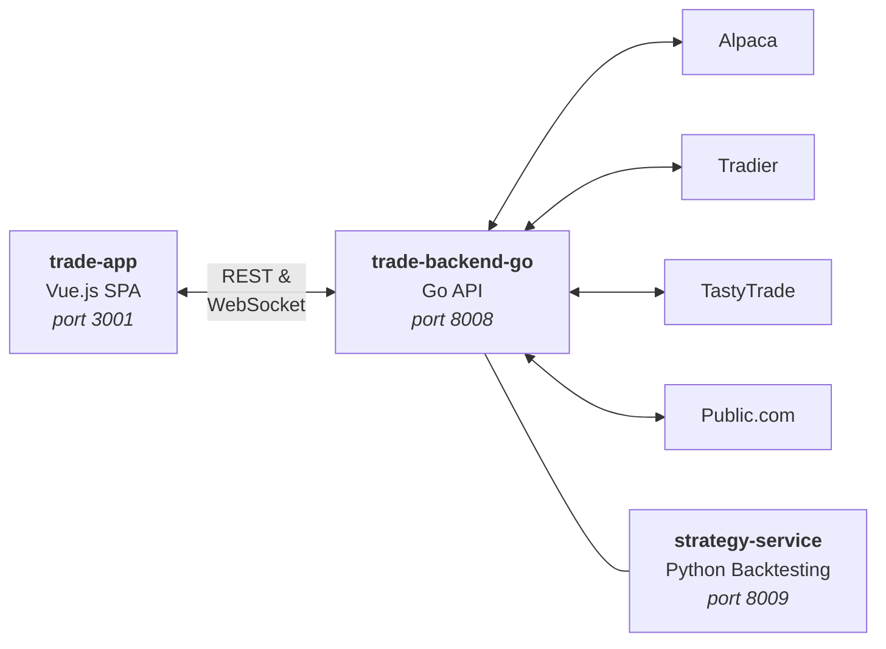

#  Juicy Trade

**A self-hosted options trading platform with real-time streaming, multi-broker support, and a professional trading interface.**

Juicy Trade connects to multiple brokerages through a unified API, letting you trade options, monitor positions, and analyze strategies — all from a single, fast interface. Use live data from one broker while paper trading on another. Your keys, your data, your rules.

---

## ✨ Key Features

- **Multi-Broker Support** — Alpaca, Tradier, TastyTrade, and Public.com with live & paper trading
- **Real-Time Streaming** — WebSocket-based price feeds with sleep/wake recovery and automatic reconnection
- **Options Chain** — Live bid/ask, Greeks, and interactive payoff charts for complex strategies
- **Strategy Simulation** — Backtest options strategies against historical data
- **Order Management** — Place single-leg, multi-leg, and combo orders with confirmation and P&L preview
- **Professional Charts** — TradingView-powered candlestick charts with multiple timeframes (1m to monthly)
- **Flexible Auth** — OAuth (Google, GitHub, Microsoft), simple login, token, header-based, or disabled for dev
- **Provider Routing** — Route different operations (quotes, orders, positions) to different brokers via UI or API
- **Watchlists** — Multiple watchlists with real-time updates and quick symbol switching
- **Self-Hosted** — Run it on your own machine or server. No cloud dependency, no subscription fees

## 🏗️ Architecture



| Service | Tech | Description |
|---------|------|-------------|
| **trade-backend-go** | Go 1.24 | Core API — broker connections, streaming, orders, positions |
| **trade-app** | Vue.js | Trading UI — charts, options chain, order panel, watchlists |
| **strategy-service** | Python | Backtesting engine — strategy simulation, historical data, analytics |

## 🚀 Getting Started

### Prerequisites

- **Go 1.24+**
- **Python 3.10+** (for strategy service)
- **Node.js 18+**
- **Docker** (optional, for containerized deployment)
- API credentials for at least one supported broker

### Quick Start (Development)

**Run all services with one command:**

```bash
make dev
```

This starts the backend, strategy service, and frontend concurrently:
- Backend: http://localhost:8008
- Strategy: http://localhost:8009
- Frontend: http://localhost:3001

### Run Individual Services

```bash
make run-backend      # Go backend on port 8008
make run-frontend     # Vue.js frontend on port 3001
make run-strategy     # Strategy service on port 8009
```

### Docker Deployment

```bash
# Build all images
make build

# Or build individually
make build-backend
make build-frontend
make build-strategy

# Run with Docker Compose
docker compose up -d
```

### Run Tests

```bash
make test              # Run all tests
make test-backend      # Go backend tests only
make test-strategy     # Strategy service tests only
```

### All Make Targets

```bash
make help              # Show all available targets
```

## ⚙️ Configuration

### Broker Setup

The easiest way to configure brokers is through the **Settings UI** in the app — no need to edit files manually.

1. Open the app and click the **Settings** icon
2. Go to **Providers** → **Provider Instances**
3. Add a provider (3-step wizard: type → account → credentials)
4. Go to **Service Routing** to assign providers to operations

Supported brokers:

| Provider | Trading | Paper | Streaming | Auth Method |
|----------|---------|-------|-----------|-------------|
| **Alpaca** | ✅ | ✅ | WebSocket | API Key + Secret |
| **Tradier** | ✅ | ✅ | WebSocket | Bearer Token |
| **TastyTrade** | ✅ | ✅ | DXLink | OAuth2 (refresh token) |
| **Public.com** | — | — | — | API Key (data only) |

### Authentication

Set `AUTH_METHOD` in your `.env` or environment:

| Method | Use Case |
|--------|----------|
| `disabled` | Local development — no login required |
| `simple` | Username/password for small deployments |
| `oauth` | Production — Google, GitHub, or Microsoft SSO |
| `token` | API access with bearer tokens |
| `header` | Reverse proxy / enterprise SSO integration |

```bash
# Development
AUTH_METHOD=disabled

# Production (example with Google OAuth)
AUTH_METHOD=oauth
AUTH_OAUTH_PROVIDER=google
AUTH_OAUTH_CLIENT_ID=your_client_id
AUTH_OAUTH_CLIENT_SECRET=your_client_secret
AUTH_OAUTH_REDIRECT_URI=https://yourdomain.com/auth/oauth/callback
AUTH_OAUTH_ALLOWED_EMAILS=you@company.com
```

### Environment Variables

Create a `.env` file in the project root. See `.env.example` for the full list. Key settings:

```bash
# Logging
LOG_LEVEL=INFO          # DEBUG, INFO, WARNING, ERROR, CRITICAL

# Auth
AUTH_METHOD=disabled     # For development

# JWT (required for simple/oauth auth)
AUTH_JWT_SECRET_KEY=change_me_in_production
```

## 📖 Documentation

- [DATA_FLOW.md](./DATA_FLOW.md) — Detailed data flow architecture
- [PROVIDER.md](./PROVIDER.md) — Provider implementation guide
- [AGENTS.md](./AGENTS.md) — AI agent integration docs

## 📄 License

[Apache License 2.0](./LICENSE) — Copyright 2025 schardosin
