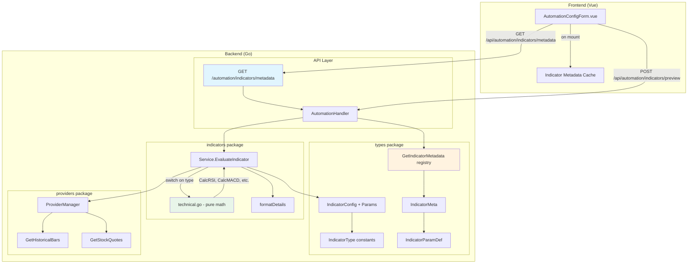
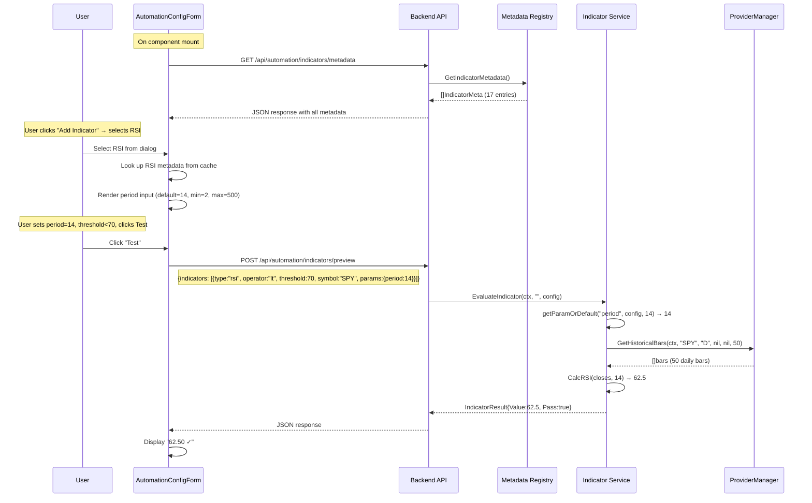

# Technical Design: Add Additional Indicators to Auto Trade

**GitHub Issue:** #4  
**Status:** Approved — Ready for Implementation  
**Author:** @architect

---

## 1. Overview & Scope

### 1.1 What We're Building

Extend the automation indicator system from 5 indicators to 17 by adding 12 new technical analysis indicators. The key architectural change is introducing a **self-describing indicator metadata system** that allows the frontend to dynamically render parameter fields without per-indicator hardcoding.

### 1.2 Indicators Summary

| # | Indicator | Type Constant | Category | Params |
|---|-----------|---------------|----------|--------|
| 1 | VIX | `vix` | market | none (existing) |
| 2 | Gap % | `gap` | market | none (existing) |
| 3 | Range % | `range` | market | none (existing) |
| 4 | Trend % | `trend` | market | none (existing) |
| 5 | FOMC Calendar | `calendar` | calendar | none (existing) |
| 6 | RSI | `rsi` | momentum | period |
| 7 | MACD | `macd` | momentum | fast_period, slow_period, signal_period |
| 8 | Momentum | `momentum` | momentum | period |
| 9 | CMO | `cmo` | momentum | period |
| 10 | Stochastic | `stoch` | momentum | k_period, d_period |
| 11 | Stochastic RSI | `stoch_rsi` | momentum | rsi_period, stoch_period, k_period, d_period |
| 12 | ADX | `adx` | trend | period |
| 13 | CCI | `cci` | trend | period |
| 14 | SMA | `sma` | trend | period |
| 15 | EMA | `ema` | trend | period |
| 16 | ATR | `atr` | volatility | period |
| 17 | Bollinger %B | `bb_percent` | volatility | period, std_dev |

### 1.3 Design Principles

1. **Metadata-driven UI** — The backend declares what parameters each indicator needs; the frontend renders them dynamically. Zero frontend code changes to add future indicators.
2. **Backward compatible** — Existing `IndicatorConfig` JSON with no `params` field deserializes correctly. Existing automations are unaffected.
3. **Separation of concerns** — Pure math functions in `technical.go` (stateless, testable), service integration in `service.go`, metadata in `types.go`.
4. **Consistent data source** — All new indicators use daily bars from `GetHistoricalBars()`, consistent with existing Gap/Range/Trend indicators.

---

## 2. System Architecture

### 2.1 Component Diagram



### 2.2 Data Flow: Adding a New Indicator



### 2.3 Data Flow: Indicator Evaluation During Automation Run

The automation engine's existing flow is unchanged. When the engine calls `EvaluateAllIndicators()`, it iterates over the config's `[]IndicatorConfig`. The switch statement in `EvaluateIndicator()` now has 12 additional cases. Each new case:

1. Resolves the symbol (from config or default "QQQ")
2. Extracts parameters from `config.Params` with defaults from metadata
3. Fetches historical bars via `GetHistoricalBars()`
4. Calls the pure calculation function from `technical.go`
5. Returns `IndicatorResult` with value, pass/fail, and details

The `AllIndicatorsPass()` function needs no changes — it already checks all enabled indicators.

---

## 3. Data Model Changes

### 3.1 New IndicatorType Constants

Add to `types.go` after the existing constants:

```go
const (
    // Existing
    IndicatorVIX      IndicatorType = "vix"
    IndicatorGap      IndicatorType = "gap"
    IndicatorRange    IndicatorType = "range"
    IndicatorTrend    IndicatorType = "trend"
    IndicatorCalendar IndicatorType = "calendar"

    // New — Momentum
    IndicatorRSI      IndicatorType = "rsi"
    IndicatorMACD     IndicatorType = "macd"
    IndicatorMomentum IndicatorType = "momentum"
    IndicatorCMO      IndicatorType = "cmo"
    IndicatorStoch    IndicatorType = "stoch"
    IndicatorStochRSI IndicatorType = "stoch_rsi"

    // New — Trend
    IndicatorADX      IndicatorType = "adx"
    IndicatorCCI      IndicatorType = "cci"
    IndicatorSMA      IndicatorType = "sma"
    IndicatorEMA      IndicatorType = "ema"

    // New — Volatility
    IndicatorATR       IndicatorType = "atr"
    IndicatorBBPercent IndicatorType = "bb_percent"
)
```

### 3.2 New Structs: IndicatorParamDef and IndicatorMeta

Add to `types.go`:

```go
// IndicatorParamDef describes a single parameter for an indicator type.
// The frontend uses this to dynamically render input fields.
type IndicatorParamDef struct {
    Key          string  `json:"key"`           // Parameter key, e.g. "period", "fast_period"
    Label        string  `json:"label"`         // Display label, e.g. "Period", "Fast Period"
    DefaultValue float64 `json:"default_value"` // Default value, e.g. 14
    Min          float64 `json:"min"`           // Minimum allowed value
    Max          float64 `json:"max"`           // Maximum allowed value
    Step         float64 `json:"step"`          // Input step increment
    Type         string  `json:"type"`          // "int" or "float"
}

// IndicatorMeta describes an indicator type's full metadata.
// Served to the frontend via GET /api/automation/indicators/metadata.
type IndicatorMeta struct {
    Type        IndicatorType     `json:"type"`         // e.g. "rsi"
    Label       string            `json:"label"`        // e.g. "RSI"
    Description string            `json:"description"`  // Human-readable description
    Category    string            `json:"category"`     // "momentum", "trend", "volatility", "market", "calendar"
    Params      []IndicatorParamDef `json:"params"`     // Ordered list of parameter definitions (empty for VIX, Calendar, etc.)
    ValueRange  string            `json:"value_range"`  // e.g. "0-100", "unbounded"
    NeedsSymbol bool              `json:"needs_symbol"` // Whether this indicator requires a symbol input
}
```

### 3.3 Updated IndicatorConfig

Add a `Params` field to the existing `IndicatorConfig`:

```go
type IndicatorConfig struct {
    ID        string             `json:"id,omitempty"`
    Type      IndicatorType      `json:"type"`
    Enabled   bool               `json:"enabled"`
    Operator  Operator           `json:"operator"`
    Threshold float64            `json:"threshold"`
    Symbol    string             `json:"symbol,omitempty"`
    Params    map[string]float64 `json:"params,omitempty"` // NEW: indicator-specific parameters
}
```

**Backward compatibility:** When `Params` is `nil` (existing configs), Go's `json.Unmarshal` leaves it as `nil`. The service layer uses a helper function that falls back to defaults from the metadata registry when a key is missing.

### 3.4 Helper: getParamOrDefault

Add to `service.go` (or a shared utility):

```go
// getParamOrDefault extracts a parameter value from the config's Params map.
// If the key is missing or Params is nil, returns the provided default value.
func getParamOrDefault(config types.IndicatorConfig, key string, defaultVal float64) float64 {
    if config.Params != nil {
        if val, ok := config.Params[key]; ok {
            return val
        }
    }
    return defaultVal
}

// getIntParam is a convenience wrapper that returns the param as an int.
func getIntParam(config types.IndicatorConfig, key string, defaultVal int) int {
    return int(getParamOrDefault(config, key, float64(defaultVal)))
}
```

### 3.5 Updated NewIndicatorConfig

Update the factory function to accept optional params:

```go
// NewIndicatorConfig creates a new indicator config with minimal defaults.
// For technical indicators, default params are populated from metadata.
func NewIndicatorConfig(indicatorType IndicatorType) IndicatorConfig {
    config := IndicatorConfig{
        ID:        GenerateIndicatorID(),
        Type:      indicatorType,
        Enabled:   true,
        Operator:  OperatorEqual,
        Threshold: 0,
        Symbol:    "",
    }
    // Populate default params from metadata
    for _, meta := range GetIndicatorMetadata() {
        if meta.Type == indicatorType && len(meta.Params) > 0 {
            config.Params = make(map[string]float64)
            for _, p := range meta.Params {
                config.Params[p.Key] = p.DefaultValue
            }
            break
        }
    }
    return config
}
```

---

## 4. Indicator Metadata Registry

### 4.1 Registry Function

Add to `types.go`:

```go
// GetIndicatorMetadata returns metadata for all available indicator types.
// This is the single source of truth for indicator definitions.
func GetIndicatorMetadata() []IndicatorMeta {
    return []IndicatorMeta{
        // ---- Existing: Market ----
        {
            Type: IndicatorVIX, Label: "VIX", Category: "market",
            Description: "CBOE Volatility Index — measures market fear/uncertainty",
            Params: []IndicatorParamDef{}, ValueRange: "0-100+", NeedsSymbol: false,
        },
        {
            Type: IndicatorGap, Label: "Gap %", Category: "market",
            Description: "Gap percentage: (Open - PrevClose) / PrevClose × 100",
            Params: []IndicatorParamDef{}, ValueRange: "unbounded", NeedsSymbol: true,
        },
        {
            Type: IndicatorRange, Label: "Range %", Category: "market",
            Description: "Range percentage: (High - Low) / Open × 100",
            Params: []IndicatorParamDef{}, ValueRange: "0+", NeedsSymbol: true,
        },
        {
            Type: IndicatorTrend, Label: "Trend %", Category: "market",
            Description: "Trend percentage: (Current - Open) / Open × 100",
            Params: []IndicatorParamDef{}, ValueRange: "unbounded", NeedsSymbol: true,
        },
        // ---- Existing: Calendar ----
        {
            Type: IndicatorCalendar, Label: "FOMC Calendar", Category: "calendar",
            Description: "FOMC meeting day indicator: 1 = FOMC day, 0 = not FOMC day",
            Params: []IndicatorParamDef{}, ValueRange: "0-1", NeedsSymbol: false,
        },
        // ---- New: Momentum ----
        {
            Type: IndicatorRSI, Label: "RSI", Category: "momentum",
            Description: "Relative Strength Index — measures overbought/oversold conditions",
            ValueRange: "0-100", NeedsSymbol: true,
            Params: []IndicatorParamDef{
                {Key: "period", Label: "Period", DefaultValue: 14, Min: 2, Max: 500, Step: 1, Type: "int"},
            },
        },
        {
            Type: IndicatorMACD, Label: "MACD", Category: "momentum",
            Description: "Moving Average Convergence Divergence — trend-following momentum (MACD line value)",
            ValueRange: "unbounded", NeedsSymbol: true,
            Params: []IndicatorParamDef{
                {Key: "fast_period", Label: "Fast Period", DefaultValue: 12, Min: 2, Max: 500, Step: 1, Type: "int"},
                {Key: "slow_period", Label: "Slow Period", DefaultValue: 26, Min: 2, Max: 500, Step: 1, Type: "int"},
                {Key: "signal_period", Label: "Signal Period", DefaultValue: 9, Min: 2, Max: 500, Step: 1, Type: "int"},
            },
        },
        {
            Type: IndicatorMomentum, Label: "Momentum", Category: "momentum",
            Description: "Price momentum — rate of change: (Close - Close[n]) / Close[n] × 100",
            ValueRange: "unbounded", NeedsSymbol: true,
            Params: []IndicatorParamDef{
                {Key: "period", Label: "Period", DefaultValue: 10, Min: 1, Max: 500, Step: 1, Type: "int"},
            },
        },
        {
            Type: IndicatorCMO, Label: "CMO", Category: "momentum",
            Description: "Chande Momentum Oscillator — measures momentum on a -100 to +100 scale",
            ValueRange: "-100 to 100", NeedsSymbol: true,
            Params: []IndicatorParamDef{
                {Key: "period", Label: "Period", DefaultValue: 14, Min: 2, Max: 500, Step: 1, Type: "int"},
            },
        },
        {
            Type: IndicatorStoch, Label: "Stochastic", Category: "momentum",
            Description: "Stochastic Oscillator — compares closing price to price range (%K value)",
            ValueRange: "0-100", NeedsSymbol: true,
            Params: []IndicatorParamDef{
                {Key: "k_period", Label: "K Period", DefaultValue: 14, Min: 1, Max: 500, Step: 1, Type: "int"},
                {Key: "d_period", Label: "D Period", DefaultValue: 3, Min: 1, Max: 500, Step: 1, Type: "int"},
            },
        },
        {
            Type: IndicatorStochRSI, Label: "Stochastic RSI", Category: "momentum",
            Description: "Stochastic oscillator applied to RSI values (%K value)",
            ValueRange: "0-100", NeedsSymbol: true,
            Params: []IndicatorParamDef{
                {Key: "rsi_period", Label: "RSI Period", DefaultValue: 14, Min: 2, Max: 500, Step: 1, Type: "int"},
                {Key: "stoch_period", Label: "Stoch Period", DefaultValue: 14, Min: 1, Max: 500, Step: 1, Type: "int"},
                {Key: "k_period", Label: "K Period", DefaultValue: 3, Min: 1, Max: 500, Step: 1, Type: "int"},
                {Key: "d_period", Label: "D Period", DefaultValue: 3, Min: 1, Max: 500, Step: 1, Type: "int"},
            },
        },
        // ---- New: Trend ----
        {
            Type: IndicatorADX, Label: "ADX", Category: "trend",
            Description: "Average Directional Index — measures trend strength regardless of direction",
            ValueRange: "0-100", NeedsSymbol: true,
            Params: []IndicatorParamDef{
                {Key: "period", Label: "Period", DefaultValue: 14, Min: 2, Max: 500, Step: 1, Type: "int"},
            },
        },
        {
            Type: IndicatorCCI, Label: "CCI", Category: "trend",
            Description: "Commodity Channel Index — identifies cyclical trends",
            ValueRange: "unbounded", NeedsSymbol: true,
            Params: []IndicatorParamDef{
                {Key: "period", Label: "Period", DefaultValue: 20, Min: 2, Max: 500, Step: 1, Type: "int"},
            },
        },
        {
            Type: IndicatorSMA, Label: "SMA", Category: "trend",
            Description: "Simple Moving Average — average closing price over N periods",
            ValueRange: "price", NeedsSymbol: true,
            Params: []IndicatorParamDef{
                {Key: "period", Label: "Period", DefaultValue: 20, Min: 1, Max: 500, Step: 1, Type: "int"},
            },
        },
        {
            Type: IndicatorEMA, Label: "EMA", Category: "trend",
            Description: "Exponential Moving Average — weighted average favoring recent prices",
            ValueRange: "price", NeedsSymbol: true,
            Params: []IndicatorParamDef{
                {Key: "period", Label: "Period", DefaultValue: 20, Min: 1, Max: 500, Step: 1, Type: "int"},
            },
        },
        // ---- New: Volatility ----
        {
            Type: IndicatorATR, Label: "ATR", Category: "volatility",
            Description: "Average True Range — measures price volatility in points",
            ValueRange: "0+", NeedsSymbol: true,
            Params: []IndicatorParamDef{
                {Key: "period", Label: "Period", DefaultValue: 14, Min: 1, Max: 500, Step: 1, Type: "int"},
            },
        },
        {
            Type: IndicatorBBPercent, Label: "Bollinger %B", Category: "volatility",
            Description: "Bollinger Band %B — position within Bollinger Bands (0=lower, 1=upper)",
            ValueRange: "typically 0-1", NeedsSymbol: true,
            Params: []IndicatorParamDef{
                {Key: "period", Label: "Period", DefaultValue: 20, Min: 2, Max: 500, Step: 1, Type: "int"},
                {Key: "std_dev", Label: "Std Deviations", DefaultValue: 2.0, Min: 0.5, Max: 5.0, Step: 0.1, Type: "float"},
            },
        },
    }
}
```

### 4.2 Design Decision: Registry Location

The registry lives in `types.go` (not `service.go`) because:
- It's pure data — no dependencies on the service layer or providers
- Both the API handler and the service need access to it
- It keeps the `types` package as the single source of truth for indicator definitions

**Trade-off:** This means `types.go` grows larger, but it avoids circular dependencies and keeps the metadata co-located with the type constants it references.

---

## 5. API Contract

### 5.1 GET /api/automation/indicators/metadata

**Purpose:** Returns metadata for all available indicator types, enabling the frontend to dynamically render parameter fields.

**Route:** `g.GET("/automation/indicators/metadata", h.GetIndicatorMetadata)`

**Request:** No parameters.

**Response (200 OK):**

```json
{
  "success": true,
  "data": {
    "indicators": [
      {
        "type": "vix",
        "label": "VIX",
        "description": "CBOE Volatility Index — measures market fear/uncertainty",
        "category": "market",
        "params": [],
        "value_range": "0-100+",
        "needs_symbol": false
      },
      {
        "type": "gap",
        "label": "Gap %",
        "description": "Gap percentage: (Open - PrevClose) / PrevClose × 100",
        "category": "market",
        "params": [],
        "value_range": "unbounded",
        "needs_symbol": true
      },
      {
        "type": "rsi",
        "label": "RSI",
        "description": "Relative Strength Index — measures overbought/oversold conditions",
        "category": "momentum",
        "params": [
          {
            "key": "period",
            "label": "Period",
            "default_value": 14,
            "min": 2,
            "max": 500,
            "step": 1,
            "type": "int"
          }
        ],
        "value_range": "0-100",
        "needs_symbol": true
      },
      {
        "type": "macd",
        "label": "MACD",
        "description": "Moving Average Convergence Divergence — trend-following momentum (MACD line value)",
        "category": "momentum",
        "params": [
          {
            "key": "fast_period",
            "label": "Fast Period",
            "default_value": 12,
            "min": 2,
            "max": 500,
            "step": 1,
            "type": "int"
          },
          {
            "key": "slow_period",
            "label": "Slow Period",
            "default_value": 26,
            "min": 2,
            "max": 500,
            "step": 1,
            "type": "int"
          },
          {
            "key": "signal_period",
            "label": "Signal Period",
            "default_value": 9,
            "min": 2,
            "max": 500,
            "step": 1,
            "type": "int"
          }
        ],
        "value_range": "unbounded",
        "needs_symbol": true
      },
      {
        "type": "bb_percent",
        "label": "Bollinger %B",
        "description": "Bollinger Band %B — position within Bollinger Bands (0=lower, 1=upper)",
        "category": "volatility",
        "params": [
          {
            "key": "period",
            "label": "Period",
            "default_value": 20,
            "min": 2,
            "max": 500,
            "step": 1,
            "type": "int"
          },
          {
            "key": "std_dev",
            "label": "Std Deviations",
            "default_value": 2.0,
            "min": 0.5,
            "max": 5.0,
            "step": 0.1,
            "type": "float"
          }
        ],
        "value_range": "typically 0-1",
        "needs_symbol": true
      }
    ],
    "total": 17
  },
  "message": "Retrieved indicator metadata"
}
```

> **Note:** The response above is abbreviated — all 17 indicator entries are included in the actual response. The full registry is defined in Section 4.1.

### 5.2 Handler Implementation

Add to `automation.go`:

```go
// GetIndicatorMetadata returns metadata for all available indicator types
func (h *AutomationHandler) GetIndicatorMetadata(c *gin.Context) {
    metadata := types.GetIndicatorMetadata()
    c.JSON(http.StatusOK, gin.H{
        "success": true,
        "data": gin.H{
            "indicators": metadata,
            "total":      len(metadata),
        },
        "message": "Retrieved indicator metadata",
    })
}
```

### 5.3 Route Registration

Add to `registerAutomationRoutes()` in `main.go`:

```go
// Indicator metadata (no :id param, so register before /:id routes)
g.GET("/automation/indicators/metadata", h.GetIndicatorMetadata)
```

**Important:** This route MUST be registered **before** `g.GET("/automation/configs/:id", ...)` to avoid Gin treating `indicators` as an `:id` parameter. Place it right after the FOMC dates route.

### 5.4 Existing Endpoints: No Changes Required

The existing `POST /api/automation/indicators/preview` (EvaluateIndicatorsPreview) already accepts `[]IndicatorConfig` in the request body. Since we're adding `params` as an `omitempty` field, existing calls without `params` continue to work. The backend uses `getParamOrDefault()` to handle missing params.

The existing `PUT /api/automation/configs/:id` and `POST /api/automation/configs` endpoints also need no changes — they accept `AutomationConfig` which contains `[]IndicatorConfig`, and the new `Params` field serializes/deserializes automatically.

---

## 6. Technical Indicator Calculations

All calculation functions live in a new file: `trade-backend-go/internal/automation/indicators/technical.go`

These are **pure functions** — they take slices of float64 (prices) and return a float64 result. They have no dependencies on the service layer, providers, or caching. This makes them trivially unit-testable.

### 6.1 Data Fetching Strategy

All new indicators use `GetHistoricalBars()` to fetch daily bars. The number of bars to fetch depends on the indicator's warm-up requirement:

```
barsNeeded = max(maxPeriodParam * 3, 50)
```

We use `3×` the period (rather than `2×` from the requirements) to provide extra warm-up for indicators that depend on other indicators (e.g., Stochastic RSI needs RSI warm-up + Stochastic warm-up). The `50` minimum ensures we always have enough data for the default periods.

**Bars are returned in ascending order** (oldest first) by the provider — this is confirmed by the existing `GetDailyData()` method which uses `bars[len(bars)-1]` for the most recent bar.

### 6.2 Helper: Extract OHLC Arrays from Bars

```go
// extractOHLC converts raw bar data into typed slices.
// Bars must be in ascending chronological order (oldest first).
// Returns opens, highs, lows, closes slices.
func extractOHLC(bars []map[string]interface{}) (opens, highs, lows, closes []float64) {
    n := len(bars)
    opens = make([]float64, n)
    highs = make([]float64, n)
    lows = make([]float64, n)
    closes = make([]float64, n)
    for i, bar := range bars {
        opens[i] = getFloatFromBar(bar, "open")
        highs[i] = getFloatFromBar(bar, "high")
        lows[i] = getFloatFromBar(bar, "low")
        closes[i] = getFloatFromBar(bar, "close")
    }
    return
}
```

### 6.3 SMA — Simple Moving Average

```
Function: CalcSMA(closes []float64, period int) (float64, error)

Algorithm:
  if len(closes) < period: return error "insufficient data"
  sum = sum of closes[len-period : len]
  return sum / period

Output: Price value (e.g., 445.32)
```

### 6.4 EMA — Exponential Moving Average

```
Function: CalcEMA(closes []float64, period int) (float64, error)

Algorithm:
  if len(closes) < period: return error "insufficient data"
  multiplier = 2.0 / (period + 1)
  
  // Seed EMA with SMA of first `period` values
  ema = average(closes[0:period])
  
  // Apply EMA formula from period onward
  for i = period; i < len(closes); i++:
    ema = (closes[i] - ema) * multiplier + ema
  
  return ema

Output: Price value (e.g., 446.18)
```

### 6.5 RSI — Relative Strength Index (Wilder's Smoothing)

```
Function: CalcRSI(closes []float64, period int) (float64, error)

Algorithm:
  if len(closes) < period + 1: return error "insufficient data"
  
  // Calculate price changes
  changes = [closes[i] - closes[i-1] for i in 1..len(closes)]
  
  // First average gain/loss (simple average of first `period` changes)
  avgGain = average(positive changes in first `period` changes)
  avgLoss = average(abs(negative changes) in first `period` changes)
  
  // Wilder's smoothing for remaining changes
  for i = period; i < len(changes); i++:
    gain = max(changes[i], 0)
    loss = abs(min(changes[i], 0))
    avgGain = (avgGain * (period - 1) + gain) / period
    avgLoss = (avgLoss * (period - 1) + loss) / period
  
  // Edge case: all prices same → avgLoss = 0
  if avgLoss == 0: return 100 if avgGain > 0, else 50
  
  rs = avgGain / avgLoss
  rsi = 100 - (100 / (1 + rs))
  return rsi

Output: 0-100 scale
```

### 6.6 MACD — Moving Average Convergence Divergence

```
Function: CalcMACD(closes []float64, fastPeriod, slowPeriod, signalPeriod int) (float64, error)

Algorithm:
  if len(closes) < slowPeriod + signalPeriod: return error "insufficient data"
  
  // Calculate fast EMA and slow EMA over all data points
  fastEMA = calcEMASeries(closes, fastPeriod)  // returns []float64
  slowEMA = calcEMASeries(closes, slowPeriod)   // returns []float64
  
  // MACD line = fast EMA - slow EMA (from slowPeriod onward where both are valid)
  macdLine = [fastEMA[i] - slowEMA[i] for i where both are valid]
  
  // Signal line = EMA of MACD line
  signalLine = calcEMASeries(macdLine, signalPeriod)
  
  // Return the most recent MACD line value
  return macdLine[last]

Note: We return the MACD line value, not the histogram or signal.
      The user compares this against their threshold (e.g., MACD > 0).
Output: Unbounded (can be positive or negative)
```

**Helper — calcEMASeries:** Returns a full series of EMA values (needed by MACD to compute the signal line). This is an internal helper, not exported.

### 6.7 Momentum — Rate of Change

```
Function: CalcMomentum(closes []float64, period int) (float64, error)

Algorithm:
  if len(closes) < period + 1: return error "insufficient data"
  
  current = closes[last]
  previous = closes[last - period]
  
  if previous == 0: return error "zero division"
  
  momentum = ((current - previous) / previous) * 100
  return momentum

Output: Unbounded percentage (e.g., +2.5 means price is 2.5% higher than N periods ago)
```

### 6.8 CMO — Chande Momentum Oscillator

```
Function: CalcCMO(closes []float64, period int) (float64, error)

Algorithm:
  if len(closes) < period + 1: return error "insufficient data"
  
  // Use the last (period+1) closes to compute `period` changes
  relevantCloses = closes[len-period-1 : len]
  
  sumUp = 0
  sumDown = 0
  for i = 1; i <= period; i++:
    change = relevantCloses[i] - relevantCloses[i-1]
    if change > 0: sumUp += change
    else: sumDown += abs(change)
  
  if sumUp + sumDown == 0: return 0  // No movement
  
  cmo = ((sumUp - sumDown) / (sumUp + sumDown)) * 100
  return cmo

Output: -100 to +100
```

### 6.9 Stochastic Oscillator

```
Function: CalcStochastic(highs, lows, closes []float64, kPeriod, dPeriod int) (float64, error)

Algorithm:
  if len(closes) < kPeriod + dPeriod - 1: return error "insufficient data"
  
  // Calculate raw %K values for enough periods to compute %D
  rawKValues = []
  for i from (len - kPeriod - dPeriod + 1) to (len - 1):
    window_highs = highs[i-kPeriod+1 : i+1]
    window_lows  = lows[i-kPeriod+1 : i+1]
    highestHigh = max(window_highs)
    lowestLow   = min(window_lows)
    
    if highestHigh == lowestLow:
      rawK = 50  // No range, neutral
    else:
      rawK = ((closes[i] - lowestLow) / (highestHigh - lowestLow)) * 100
    
    rawKValues.append(rawK)
  
  // %K = SMA of raw %K over dPeriod (this is the "slow stochastic" %K)
  // For our use case, we return the most recent raw %K (fast stochastic)
  // which is more responsive. User can use dPeriod=1 for raw %K.
  //
  // Actually: Standard convention is:
  //   Fast %K = raw calculation above
  //   Slow %K (= Fast %D) = SMA(Fast %K, dPeriod)
  //   Slow %D = SMA(Slow %K, dPeriod)
  //
  // We return Fast %K (the raw value for the most recent bar).
  return rawKValues[last]

Output: 0-100 scale
```

**Design note:** We return the raw (fast) %K value. The `d_period` parameter is included in metadata for users who want to smooth it, but the compared value is the unsmoothed %K. This is the most common behavior in trading systems where users set specific thresholds.

### 6.10 Stochastic RSI

```
Function: CalcStochRSI(closes []float64, rsiPeriod, stochPeriod, kPeriod, dPeriod int) (float64, error)

Algorithm:
  // Need enough data for RSI warm-up + stochastic calculation
  minBars = rsiPeriod + stochPeriod + kPeriod + dPeriod
  if len(closes) < minBars: return error "insufficient data"
  
  // Step 1: Calculate RSI series
  rsiSeries = calcRSISeries(closes, rsiPeriod)  // returns []float64 of RSI values
  
  // Step 2: Apply Stochastic formula to RSI values
  if len(rsiSeries) < stochPeriod: return error "insufficient RSI data"
  
  // Get stochastic of RSI over stochPeriod
  window = rsiSeries[len-stochPeriod : len]
  highestRSI = max(window)
  lowestRSI  = min(window)
  
  if highestRSI == lowestRSI: return 50  // Neutral
  
  stochRSI = ((rsiSeries[last] - lowestRSI) / (highestRSI - lowestRSI)) * 100
  return stochRSI

Output: 0-100 scale
```

**Helper — calcRSISeries:** Returns a full series of RSI values (similar to how calcEMASeries works for MACD). This internal helper is needed because Stochastic RSI applies the Stochastic formula to RSI values rather than prices.

### 6.11 ADX — Average Directional Index

```
Function: CalcADX(highs, lows, closes []float64, period int) (float64, error)

Algorithm:
  if len(closes) < period * 2 + 1: return error "insufficient data"
  
  // Step 1: True Range, +DM, -DM for each bar
  for i = 1 to len:
    TR = max(high[i]-low[i], abs(high[i]-close[i-1]), abs(low[i]-close[i-1]))
    upMove = high[i] - high[i-1]
    downMove = low[i-1] - low[i]
    
    +DM = upMove if (upMove > downMove AND upMove > 0) else 0
    -DM = downMove if (downMove > upMove AND downMove > 0) else 0
  
  // Step 2: Wilder's smoothed averages of TR, +DM, -DM over `period`
  smoothedTR  = Wilder smooth of TR series
  smoothed+DM = Wilder smooth of +DM series
  smoothed-DM = Wilder smooth of -DM series
  
  // Step 3: +DI and -DI
  +DI = (smoothed+DM / smoothedTR) * 100
  -DI = (smoothed-DM / smoothedTR) * 100
  
  // Step 4: DX = abs(+DI - -DI) / (+DI + -DI) * 100
  // Step 5: ADX = Wilder smooth of DX over `period`
  
  return ADX[last]

Output: 0-100 scale (>25 = trending, <20 = weak trend)
```

**Wilder's smoothing formula:**
```
first_value = sum(data[0:period]) / period
subsequent = (prev * (period - 1) + current) / period
```

### 6.12 CCI — Commodity Channel Index

```
Function: CalcCCI(highs, lows, closes []float64, period int) (float64, error)

Algorithm:
  if len(closes) < period: return error "insufficient data"
  
  // Typical price for each bar
  TP[i] = (highs[i] + lows[i] + closes[i]) / 3
  
  // SMA of typical price over last `period` bars
  tpSMA = average(TP[len-period : len])
  
  // Mean deviation = average of |TP[i] - tpSMA| over last `period` bars
  meanDev = average(abs(TP[i] - tpSMA) for i in last period bars)
  
  if meanDev == 0: return 0
  
  CCI = (TP[last] - tpSMA) / (0.015 * meanDev)
  return CCI

Output: Unbounded (typically -200 to +200)
Note: The constant 0.015 is Lambert's original constant, ensuring ~75% of values fall between -100 and +100.
```

### 6.13 ATR — Average True Range

```
Function: CalcATR(highs, lows, closes []float64, period int) (float64, error)

Algorithm:
  if len(closes) < period + 1: return error "insufficient data"
  
  // True Range for each bar (starting from index 1)
  for i = 1 to len:
    TR[i] = max(
      highs[i] - lows[i],
      abs(highs[i] - closes[i-1]),
      abs(lows[i] - closes[i-1])
    )
  
  // First ATR = simple average of first `period` TRs
  atr = average(TR[1 : period+1])
  
  // Wilder's smoothing for remaining
  for i = period+1 to len(TR):
    atr = (atr * (period - 1) + TR[i]) / period
  
  return atr

Output: Price value in points (e.g., 12.35)
```

### 6.14 Bollinger %B

```
Function: CalcBollingerPercentB(closes []float64, period int, stdDevMultiplier float64) (float64, error)

Algorithm:
  if len(closes) < period: return error "insufficient data"
  
  // SMA of last `period` closes
  window = closes[len-period : len]
  sma = average(window)
  
  // Standard deviation
  variance = average((window[i] - sma)^2 for all i)
  stdDev = sqrt(variance)
  
  // Bollinger Bands
  upperBand = sma + (stdDevMultiplier * stdDev)
  lowerBand = sma - (stdDevMultiplier * stdDev)
  
  // %B = (Close - Lower) / (Upper - Lower)
  bandWidth = upperBand - lowerBand
  if bandWidth == 0: return 0.5  // Flat bands, price at middle
  
  percentB = (closes[last] - lowerBand) / bandWidth
  return percentB

Output: Typically 0-1 (0 = at lower band, 1 = at upper band, can exceed both)
```

### 6.15 Bars Needed Per Indicator

| Indicator | Formula for barsNeeded |
|-----------|----------------------|
| SMA | `period` |
| EMA | `period * 2` |
| RSI | `period * 3` (warm-up for Wilder's smoothing) |
| MACD | `slow_period + signal_period + slow_period` |
| Momentum | `period + 1` |
| CMO | `period + 1` |
| Stochastic | `k_period + d_period` |
| Stochastic RSI | `rsi_period * 3 + stoch_period` |
| ADX | `period * 3` (needs TR + DI + DX warm-up) |
| CCI | `period` |
| ATR | `period * 2` |
| Bollinger %B | `period` |

The service layer computes `barsNeeded` per indicator type and requests `max(barsNeeded, 50)` from `GetHistoricalBars()`.

### 6.16 Function Signatures Summary

All exported functions in `technical.go`:

```go
package indicators

// Single-series indicators (only need closes)
func CalcSMA(closes []float64, period int) (float64, error)
func CalcEMA(closes []float64, period int) (float64, error)
func CalcRSI(closes []float64, period int) (float64, error)
func CalcMACD(closes []float64, fastPeriod, slowPeriod, signalPeriod int) (float64, error)
func CalcMomentum(closes []float64, period int) (float64, error)
func CalcCMO(closes []float64, period int) (float64, error)
func CalcBollingerPercentB(closes []float64, period int, stdDev float64) (float64, error)

// Multi-series indicators (need highs, lows, closes)
func CalcStochastic(highs, lows, closes []float64, kPeriod, dPeriod int) (float64, error)
func CalcStochRSI(closes []float64, rsiPeriod, stochPeriod, kPeriod, dPeriod int) (float64, error)
func CalcADX(highs, lows, closes []float64, period int) (float64, error)
func CalcCCI(highs, lows, closes []float64, period int) (float64, error)
func CalcATR(highs, lows, closes []float64, period int) (float64, error)

// Internal helpers (unexported)
func calcEMASeries(data []float64, period int) []float64
func calcRSISeries(closes []float64, period int) []float64
```

---

## 7. Backend Implementation Plan

### 7.1 File: `trade-backend-go/internal/automation/types/types.go`

**Action:** MODIFY

Changes:
1. Add 12 new `IndicatorType` constants (Section 3.1)
2. Add `IndicatorParamDef` struct (Section 3.2)
3. Add `IndicatorMeta` struct (Section 3.2)
4. Add `Params map[string]float64` field to `IndicatorConfig` (Section 3.3)
5. Add `GetIndicatorMetadata()` function returning `[]IndicatorMeta` (Section 4.1)
6. Update `NewIndicatorConfig()` to populate default params (Section 3.5)

**No existing code is removed or modified** — only additions. The existing 5 `IndicatorType` constants remain unchanged.

### 7.2 File: `trade-backend-go/internal/automation/indicators/technical.go`

**Action:** CREATE (new file)

This file contains all pure calculation functions for the 12 new technical indicators. See Section 6 for complete algorithm specifications.

Contents:
- `extractOHLC()` helper
- `CalcSMA()`, `CalcEMA()`, `CalcRSI()`, `CalcMACD()`, `CalcMomentum()`, `CalcCMO()`
- `CalcStochastic()`, `CalcStochRSI()`, `CalcADX()`, `CalcCCI()`, `CalcATR()`, `CalcBollingerPercentB()`
- Internal helpers: `calcEMASeries()`, `calcRSISeries()`

**Design constraint:** These functions must NOT import anything from outside the `indicators` package (except standard library `math` and `fmt`). They take plain `[]float64` slices and return `(float64, error)`.

### 7.3 File: `trade-backend-go/internal/automation/indicators/service.go`

**Action:** MODIFY

Changes:

**a) Add helper functions** at the top of the file:

```go
func getParamOrDefault(config types.IndicatorConfig, key string, defaultVal float64) float64
func getIntParam(config types.IndicatorConfig, key string, defaultVal int) int
```

**b) Add a `getHistoricalBarsForIndicator()` method** — shared data fetching for all new indicators:

```go
// getHistoricalBarsForIndicator fetches daily bars and returns OHLC arrays.
// symbol defaults to "QQQ" if empty.
func (s *Service) getHistoricalBarsForIndicator(ctx context.Context, symbol string, barsNeeded int) (
    opens, highs, lows, closes []float64, actualSymbol string, err error) {
    
    if symbol == "" {
        symbol = "QQQ"
    }
    if barsNeeded < 50 {
        barsNeeded = 50
    }
    
    bars, err := s.providerManager.GetHistoricalBars(ctx, symbol, "D", nil, nil, barsNeeded)
    if err != nil {
        return nil, nil, nil, nil, symbol, fmt.Errorf("failed to get historical bars for %s: %w", symbol, err)
    }
    
    opens, highs, lows, closes = extractOHLC(bars)
    return opens, highs, lows, closes, symbol, nil
}
```

**c) Add 12 new cases to `EvaluateIndicator()` switch statement.**

Each case follows this pattern:

```go
case types.IndicatorRSI:
    symbol := config.Symbol
    if symbol == "" {
        symbol = "QQQ"
    }
    period := getIntParam(config, "period", 14)
    barsNeeded := period * 3
    _, _, _, closes, actualSymbol, fetchErr := s.getHistoricalBarsForIndicator(ctx, symbol, barsNeeded)
    if fetchErr != nil {
        err = fetchErr
    } else {
        result.Value, err = CalcRSI(closes, period)
    }
    result.Symbol = actualSymbol
```

Complete mapping for all 12 indicators:

| Type | Default Symbol | Param Extraction | Bars Formula | Calc Function |
|------|---------------|------------------|-------------|---------------|
| `rsi` | QQQ | `period=14` | `period*3` | `CalcRSI(closes, period)` |
| `macd` | QQQ | `fast=12, slow=26, signal=9` | `slow+signal+slow` | `CalcMACD(closes, fast, slow, signal)` |
| `momentum` | QQQ | `period=10` | `period+1` | `CalcMomentum(closes, period)` |
| `cmo` | QQQ | `period=14` | `period+1` | `CalcCMO(closes, period)` |
| `stoch` | QQQ | `kPeriod=14, dPeriod=3` | `kPeriod+dPeriod` | `CalcStochastic(highs, lows, closes, kPeriod, dPeriod)` |
| `stoch_rsi` | QQQ | `rsiP=14, stochP=14, kP=3, dP=3` | `rsiP*3+stochP` | `CalcStochRSI(closes, rsiP, stochP, kP, dP)` |
| `adx` | QQQ | `period=14` | `period*3` | `CalcADX(highs, lows, closes, period)` |
| `cci` | QQQ | `period=20` | `period` | `CalcCCI(highs, lows, closes, period)` |
| `sma` | QQQ | `period=20` | `period` | `CalcSMA(closes, period)` |
| `ema` | QQQ | `period=20` | `period*2` | `CalcEMA(closes, period)` |
| `atr` | QQQ | `period=14` | `period*2` | `CalcATR(highs, lows, closes, period)` |
| `bb_percent` | QQQ | `period=20, stdDev=2.0` | `period` | `CalcBollingerPercentB(closes, period, stdDev)` |

**d) Add formatting cases to `formatDetails()`:**

```go
case types.IndicatorRSI:
    return fmt.Sprintf("RSI(%d) %.2f %s %.2f (%s)",
        getIntParam(/* from config context */), result.Value, operatorStr, result.Threshold, passStr)
case types.IndicatorMACD:
    return fmt.Sprintf("MACD(%.0f/%.0f/%.0f) %.4f %s %.4f (%s)",
        /* fast, slow, signal */, result.Value, operatorStr, result.Threshold, passStr)
// ... similar for all 12 new types
```

**Note on formatDetails:** The `formatDetails` method currently only receives `*IndicatorResult`, which doesn't include the config params. We have two options:

**Option A (recommended):** Include a compact param summary in the `Details` string by setting it in the switch case *before* calling formatDetails. Add a `ParamSummary` field to `IndicatorResult`:

```go
// Add to IndicatorResult
ParamSummary string `json:"param_summary,omitempty"` // e.g., "14" or "12/26/9"
```

Set it in the switch case:
```go
case types.IndicatorRSI:
    period := getIntParam(config, "period", 14)
    result.ParamSummary = fmt.Sprintf("%d", period)
    // ... calculation ...
```

Then in formatDetails:
```go
case types.IndicatorRSI:
    return fmt.Sprintf("RSI(%s) %.2f %s %.2f (%s)",
        result.ParamSummary, result.Value, operatorStr, result.Threshold, passStr)
```

**Option B:** Pass the config to formatDetails. This changes the method signature, which is a larger change.

**Decision: Use Option A** — adding `ParamSummary` to `IndicatorResult` is minimal and keeps the formatDetails signature unchanged.

### 7.4 File: `trade-backend-go/internal/api/handlers/automation.go`

**Action:** MODIFY

Add one new method:

```go
// GetIndicatorMetadata returns metadata for all available indicator types
func (h *AutomationHandler) GetIndicatorMetadata(c *gin.Context) {
    metadata := types.GetIndicatorMetadata()
    c.JSON(http.StatusOK, gin.H{
        "success": true,
        "data": gin.H{
            "indicators": metadata,
            "total":      len(metadata),
        },
        "message": "Retrieved indicator metadata",
    })
}
```

### 7.5 File: `trade-backend-go/cmd/server/main.go`

**Action:** MODIFY

In `registerAutomationRoutes()`, add the new route **before** the `/:id` routes:

```go
func registerAutomationRoutes(g *gin.RouterGroup, h *handlers.AutomationHandler) {
    // Config CRUD
    g.GET("/automation/configs", h.ListConfigs)
    g.POST("/automation/configs", h.CreateConfig)
    
    // Indicator metadata — MUST be before /:id routes
    g.GET("/automation/indicators/metadata", h.GetIndicatorMetadata)
    
    // Existing routes continue...
    g.GET("/automation/configs/:id", h.GetConfig)
    // ...
}
```

### 7.6 File: `trade-backend-go/internal/automation/types/types.go` — IndicatorResult Extension

**Action:** MODIFY (minor addition)

Add `ParamSummary` field to `IndicatorResult`:

```go
type IndicatorResult struct {
    Type          IndicatorType `json:"type"`
    Symbol        string        `json:"symbol"`
    Value         float64       `json:"value"`
    LastGoodValue *float64      `json:"last_good_value,omitempty"`
    Stale         bool          `json:"stale"`
    Threshold     float64       `json:"threshold"`
    Operator      Operator      `json:"operator"`
    Pass          bool          `json:"pass"`
    Enabled       bool          `json:"enabled"`
    Timestamp     time.Time     `json:"timestamp"`
    Details       string        `json:"details,omitempty"`
    Error         string        `json:"error,omitempty"`
    ParamSummary  string        `json:"param_summary,omitempty"` // NEW: e.g., "14" or "12/26/9"
}
```

---

## 8. Frontend Implementation Plan

### 8.1 File: `trade-app/src/components/automation/AutomationConfigForm.vue`

**Action:** MODIFY

This is the most complex frontend change. The key transformation is from hardcoded indicator definitions to a metadata-driven approach.

### 8.2 Changes Overview

1. **Add metadata fetching** — Call the metadata API on mount
2. **Replace hardcoded `indicatorTypes`** — Use metadata from API
3. **Dynamic parameter rendering** — Render input fields based on metadata params
4. **Update `addIndicator()`** — Include default params
5. **Update indicator display** — Show param summary
6. **Update helpers** — `formatIndicatorType()`, `getIndicatorDescription()`, `getIndicatorDefaultSymbol()`

### 8.3 Metadata Fetching

Add to `setup()`:

```javascript
// Indicator metadata from API
const indicatorMetadata = ref([])
const indicatorMetadataMap = ref({}) // keyed by type for quick lookup

const fetchIndicatorMetadata = async () => {
  try {
    const response = await api.getIndicatorMetadata()
    const indicators = response.data?.indicators || response.indicators || []
    indicatorMetadata.value = indicators
    // Build lookup map
    const map = {}
    indicators.forEach(meta => { map[meta.type] = meta })
    indicatorMetadataMap.value = map
  } catch (err) {
    console.error('Failed to fetch indicator metadata:', err)
    // Fallback to hardcoded types if API fails (backward compat)
    indicatorMetadata.value = fallbackIndicatorTypes
  }
}
```

Call on mount:
```javascript
onMounted(async () => {
  await fetchIndicatorMetadata()
  if (isEditMode.value) {
    await loadConfig()
  }
})
```

### 8.4 Replace Hardcoded `indicatorTypes`

Replace the current:
```javascript
const indicatorTypes = [
  { value: 'vix', label: 'VIX Level', description: '...' },
  // ...
]
```

With a computed property from metadata:
```javascript
const indicatorTypes = computed(() => {
  return indicatorMetadata.value.map(meta => ({
    value: meta.type,
    label: meta.label,
    description: meta.description,
    category: meta.category,
  }))
})
```

### 8.5 Dynamic Parameter Rendering

In the indicator row template, add parameter inputs after the threshold:

```html
<div class="indicator-config" :class="{ 'dimmed': !indicator.enabled }">
  <!-- Operator dropdown (existing) -->
  <Dropdown v-model="indicator.operator" ... />
  
  <!-- Threshold input (existing) -->
  <InputNumber v-model="indicator.threshold" ... />
  
  <!-- Dynamic parameter inputs (NEW) -->
  <template v-if="getIndicatorParams(indicator.type).length > 0">
    <div
      v-for="paramDef in getIndicatorParams(indicator.type)"
      :key="paramDef.key"
      class="param-input-group"
    >
      <label class="param-label">{{ paramDef.label }}</label>
      <InputNumber
        v-model="indicator.params[paramDef.key]"
        :min="paramDef.min"
        :max="paramDef.max"
        :step="paramDef.step"
        :minFractionDigits="paramDef.type === 'float' ? 1 : 0"
        :maxFractionDigits="paramDef.type === 'float' ? 2 : 0"
        class="param-value-input"
        :disabled="!indicator.enabled"
      />
    </div>
  </template>
  
  <!-- Symbol input (existing, conditionally shown) -->
  <InputText
    v-if="getIndicatorNeedsSymbol(indicator.type)"
    v-model="indicator.symbol"
    :placeholder="getIndicatorDefaultSymbol(indicator.type)"
    class="symbol-input"
    :disabled="!indicator.enabled"
  />
</div>
```

### 8.6 Helper Methods from Metadata

Replace the hardcoded lookup methods:

```javascript
const getIndicatorParams = (type) => {
  return indicatorMetadataMap.value[type]?.params || []
}

const getIndicatorNeedsSymbol = (type) => {
  const meta = indicatorMetadataMap.value[type]
  if (!meta) return type !== 'calendar' // fallback
  return meta.needs_symbol
}

const formatIndicatorType = (type) => {
  return indicatorMetadataMap.value[type]?.label || type
}

const getIndicatorDescription = (type) => {
  return indicatorMetadataMap.value[type]?.description || ''
}

const getIndicatorDefaultSymbol = (type) => {
  // Technical indicators default to QQQ; VIX defaults to VIX
  if (type === 'vix') return 'VIX'
  if (type === 'calendar') return ''
  return 'QQQ'
}
```

### 8.7 Updated `addIndicator()`

When adding a new indicator, pre-populate default params from metadata:

```javascript
const addIndicator = (type) => {
  const meta = indicatorMetadataMap.value[type]
  const params = {}
  if (meta && meta.params) {
    meta.params.forEach(p => {
      params[p.key] = p.default_value
    })
  }
  
  const newIndicator = {
    id: generateIndicatorId(),
    type: type,
    enabled: true,
    operator: 'eq',
    threshold: 0,
    symbol: '',
    params: Object.keys(params).length > 0 ? params : undefined,
  }
  config.value.indicators.push(newIndicator)
  showAddIndicatorDialog.value = false
}
```

### 8.8 Indicator Display in Row

For a compact display, show param summary next to the type label:

```javascript
const formatIndicatorTypeWithParams = (indicator) => {
  const label = formatIndicatorType(indicator.type)
  const params = getIndicatorParams(indicator.type)
  if (params.length === 0 || !indicator.params) return label
  
  // Build compact summary: "RSI (14)" or "MACD (12/26/9)"
  const values = params.map(p => {
    const val = indicator.params[p.key] ?? p.default_value
    return p.type === 'float' ? val.toFixed(1) : Math.round(val)
  })
  return `${label} (${values.join('/')})`
}
```

Use this in the template:
```html
<span class="type-label">{{ formatIndicatorTypeWithParams(indicator) }}</span>
```

### 8.9 Add Indicator Dialog — Grouped by Category

Enhance the dialog to show indicators grouped by category:

```javascript
const groupedIndicatorTypes = computed(() => {
  const groups = {}
  indicatorTypes.value.forEach(type => {
    const cat = type.category || 'other'
    if (!groups[cat]) groups[cat] = []
    groups[cat].push(type)
  })
  return groups
})

const categoryLabels = {
  market: 'Market',
  calendar: 'Calendar',
  momentum: 'Momentum',
  trend: 'Trend',
  volatility: 'Volatility',
}
```

```html
<div v-for="(types, category) in groupedIndicatorTypes" :key="category">
  <h4 class="category-header">{{ categoryLabels[category] || category }}</h4>
  <div
    v-for="type in types"
    :key="type.value"
    class="indicator-type-option"
    @click="addIndicator(type.value)"
  >
    <span class="option-label">{{ type.label }}</span>
    <p class="option-description">{{ type.description }}</p>
  </div>
</div>
```

### 8.10 API Service Addition

Add to `trade-app/src/services/api.js`:

```javascript
getIndicatorMetadata() {
  return this.get('/automation/indicators/metadata')
}
```

### 8.11 CSS Additions

Add styles for the parameter input fields:

```css
.param-input-group {
  display: flex;
  align-items: center;
  gap: 4px;
}

.param-label {
  font-size: 0.75rem;
  color: var(--text-color-secondary);
  white-space: nowrap;
}

.param-value-input {
  width: 70px;
}

.category-header {
  color: var(--primary-color);
  font-size: 0.85rem;
  text-transform: uppercase;
  letter-spacing: 0.05em;
  margin: 12px 0 6px 0;
  padding-bottom: 4px;
  border-bottom: 1px solid var(--surface-border);
}
```

### 8.12 Mobile Responsiveness

The existing `isMobile` detection handles responsive layout. For the param inputs on mobile:

```css
@media (max-width: 768px) {
  .param-input-group {
    flex-direction: column;
    align-items: flex-start;
  }
  .param-value-input {
    width: 100%;
  }
}
```

---

## 9. Testing Strategy

### 9.1 File: `trade-backend-go/internal/automation/indicators/technical_test.go`

**Action:** CREATE (new file)

Unit tests for all calculation functions. Each test should verify:
1. Correct output for known inputs
2. Error on insufficient data
3. Edge cases (all-same prices, zero values)

### 9.2 Test Cases Per Indicator

**CalcSMA:**
- Known: `[1,2,3,4,5]` with period=3 → `(3+4+5)/3 = 4.0`
- Known: `[10,20,30]` with period=3 → `20.0`
- Error: period > len(data)

**CalcEMA:**
- Known: Verify against a spreadsheet calculation
- Verify EMA converges to SMA for constant prices
- Error: period > len(data)

**CalcRSI:**
- Known: All prices rising → RSI near 100
- Known: All prices falling → RSI near 0
- Edge: All same prices → RSI = 50
- Error: insufficient data

**CalcMACD:**
- Known: Verify fast EMA > slow EMA → positive MACD
- Error: insufficient data for slow period + signal

**CalcMomentum:**
- Known: `[100, 105]` with period=1 → `5.0` (5% gain)
- Known: `[100, 95]` with period=1 → `-5.0`

**CalcCMO:**
- Known: Monotonically rising → CMO near +100
- Known: Monotonically falling → CMO near -100
- Edge: No movement → CMO = 0

**CalcStochastic:**
- Known: Close at highest high → %K = 100
- Known: Close at lowest low → %K = 0
- Known: Close at midpoint → %K = 50

**CalcStochRSI:**
- Verify it produces values between 0-100
- Verify extreme RSI produces extreme StochRSI

**CalcADX:**
- Known: Strong trend → ADX > 25
- Known: Flat/ranging → ADX < 20
- Error: insufficient data

**CalcCCI:**
- Known: Price at SMA → CCI = 0
- Error: insufficient data

**CalcATR:**
- Known: Constant range bars → ATR equals that range
- Verify Wilder's smoothing behaves correctly

**CalcBollingerPercentB:**
- Known: Close at SMA → %B = 0.5
- Known: Close at upper band → %B = 1.0
- Known: Close at lower band → %B = 0.0
- Error: insufficient data

### 9.3 Test Data Approach

Use small, hand-calculated datasets. For example:

```go
func TestCalcRSI_Basic(t *testing.T) {
    // 15 closing prices with known RSI result
    closes := []float64{44, 44.34, 44.09, 43.61, 44.33, 44.83, 45.10, 
                         45.42, 45.84, 46.08, 45.89, 46.03, 45.61, 46.28, 46.28}
    rsi, err := CalcRSI(closes, 14)
    assert.NoError(t, err)
    assert.InDelta(t, 70.46, rsi, 0.5) // Allow small floating point variance
}
```

### 9.4 Integration Testing Guidance

Beyond unit tests, the developer should manually verify:
1. Each indicator evaluates successfully via "Test" button in the UI
2. The metadata endpoint returns all 17 indicators
3. Existing automations with VIX/Gap/Range/Trend/Calendar still work
4. A new automation with RSI + MACD can be created, saved, and run
5. Parameters persist across save/load cycles

---

## 10. File Change Summary

### 10.1 Files to CREATE (2 new files)

| File | Description |
|------|-------------|
| `trade-backend-go/internal/automation/indicators/technical.go` | Pure calculation functions for 12 technical indicators |
| `trade-backend-go/internal/automation/indicators/technical_test.go` | Unit tests for all calculation functions |

### 10.2 Files to MODIFY (4 existing files)

| File | Changes |
|------|---------|
| `trade-backend-go/internal/automation/types/types.go` | Add 12 IndicatorType constants, IndicatorParamDef struct, IndicatorMeta struct, Params field on IndicatorConfig, ParamSummary field on IndicatorResult, GetIndicatorMetadata() function, update NewIndicatorConfig() |
| `trade-backend-go/internal/automation/indicators/service.go` | Add getParamOrDefault/getIntParam helpers, add getHistoricalBarsForIndicator() method, add extractOHLC() helper, add 12 switch cases in EvaluateIndicator(), add 12 formatDetails cases |
| `trade-backend-go/internal/api/handlers/automation.go` | Add GetIndicatorMetadata() handler method |
| `trade-backend-go/cmd/server/main.go` | Add `g.GET("/automation/indicators/metadata", h.GetIndicatorMetadata)` route in registerAutomationRoutes() |

### 10.3 Frontend Files to MODIFY (2 files)

| File | Changes |
|------|---------|
| `trade-app/src/components/automation/AutomationConfigForm.vue` | Metadata fetching, dynamic param rendering, update addIndicator(), update formatIndicatorType/getIndicatorDescription/getIndicatorDefaultSymbol, grouped Add Indicator dialog, param display in rows, CSS for param inputs |
| `trade-app/src/services/api.js` | Add `getIndicatorMetadata()` method |

### 10.4 Implementation Order

**Recommended order for the developer:**

1. **types.go** — Add constants, structs, metadata registry. This is the foundation everything else depends on.
2. **technical.go** — Pure calculation functions. Can be developed and tested independently.
3. **technical_test.go** — Unit tests. Run these to verify calculations before integrating.
4. **service.go** — Add switch cases, helpers, and formatting. This wires the calculations into the evaluation flow.
5. **automation.go** (handler) — Add the metadata endpoint handler.
6. **main.go** — Register the route.
7. **api.js** — Add the API method.
8. **AutomationConfigForm.vue** — Frontend changes. This should be last since it depends on the API being available.

### 10.5 Artifact Destinations

Per the project configuration:
- Backend files go to `trade_backend` subpath → branch `fleet/add-indicators`
- Frontend files go to `trade-app` subpath → branch `fleet/add-indicators`
- Docker files: No changes needed

---

## Appendix A: Design Decisions & Trade-offs

| Decision | Choice | Alternative | Reasoning |
|----------|--------|-------------|-----------|
| Metadata location | `types.go` | Separate `metadata.go` file | Co-location with type constants avoids import cycles; single source of truth |
| Param storage | `map[string]float64` | Typed structs per indicator | Map is flexible, backward-compatible (nil = no params), and JSON-friendly |
| Calculation file | Single `technical.go` | One file per indicator | 12 indicators with ~20-40 lines each fits in one file (~400 lines); easier to navigate |
| Pure functions | Stateless, take `[]float64` | Methods on Service | Testable without mocking; separation of concerns |
| Return MACD line | MACD line value | Histogram or signal | MACD line is the most common comparison target; histogram can be derived |
| Stochastic return | Fast %K | Slow %K (%D) | Raw %K is more responsive; user has d_period for reference |
| Route placement | Before `/:id` routes | After (with path prefix) | Gin's routing requires specific routes before parameterized ones |
| formatDetails approach | ParamSummary field | Pass config to formatDetails | Minimal change; no method signature change needed |
| Bars fetched | `max(formula, 50)` | Exact minimum | Extra bars provide warm-up buffer; 50 is trivial overhead |
| Frontend fallback | Hardcoded fallback if API fails | No fallback | Ensures existing indicators work even if new endpoint isn't deployed yet |
