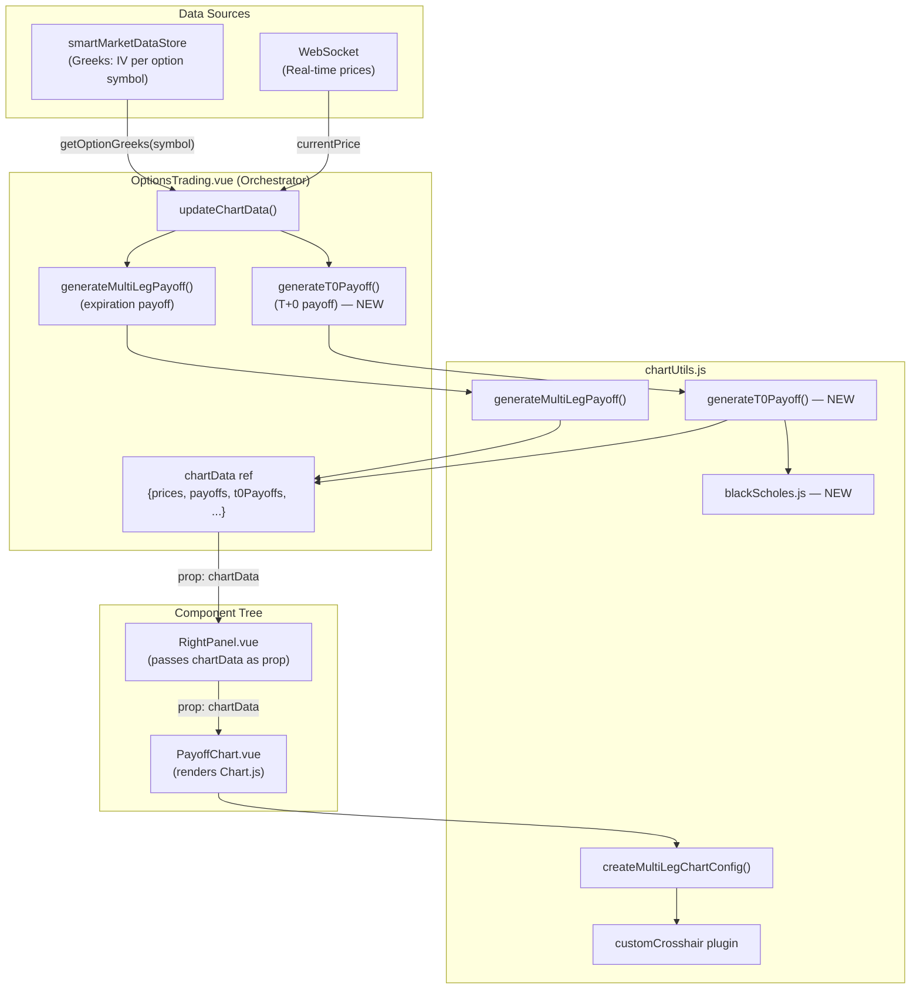

# Technical Architecture: Enhance Payoff Chart with T+0 (Today) Line

**Issue:** [#14 — Enhance Payoff Chart](https://github.com/schardosin/juicytrade/issues/14)
**Requirements:** [requirements.md](./requirements.md)
**Date:** 2025-01-28
**Status:** Draft

---

## 1. Overview & Design Goals

### 1.1 Summary

This design adds a **T+0 (Today) payoff line** to the existing expiration payoff chart in the Analysis tab. The T+0 line shows estimated P&L if the underlying price moved *right now*, using Black-Scholes option pricing with current implied volatility and time-to-expiration.

This is a **frontend-only change** affecting 4 files in `trade-app/`:
- 1 new file: `trade-app/src/utils/blackScholes.js`
- 3 modified files: `chartUtils.js`, `PayoffChart.vue`, `OptionsTrading.vue`

### 1.2 Design Principles

1. **Minimal disruption** — The existing chart is sensitive to re-renders. The T+0 line is added as a new Chart.js dataset alongside the existing 3 datasets. No changes to chart destruction/creation logic.
2. **Pure computation** — Black-Scholes logic is a pure utility with zero side effects and no Vue/Chart.js dependencies.
3. **Same data pipeline** — T+0 data flows through the identical prop chain as expiration data, participating in the same debounced/frozen update lifecycle.
4. **Graceful degradation** — If IV data is unavailable for any leg, the T+0 dataset is simply omitted. No errors, no visual artifacts.

### 1.3 Key Trade-offs

| Decision | Trade-off | Rationale |
|---|---|---|
| Black-Scholes in a separate file | Extra import vs. inline | Testability, reusability, separation of concerns |
| T+0 data generated in `OptionsTrading.vue` | Coupling to parent vs. lower-level generation | Greeks data access is easiest here; matches existing `generateMultiLegPayoff()` call site |
| Flat IV assumption (no smile/skew) | Less accurate at extreme strikes | Standard simplification; matches professional tools' T+0 behavior |
| Hardcoded risk-free rate (5%) | Not configurable | Sufficient for this iteration; easily parameterized later |
| T+0 dataset at index 1 (after expiration) | Requires shifting existing dataset indices | Clean visual layering; zero line and current price line shift to indices 2 and 3 |

---

## 2. System Architecture & Component Diagram

### 2.1 Data Flow Overview



### 2.2 Dataset Layout (Chart.js)

The current chart has 3 datasets. The T+0 line is inserted at **index 1**, shifting the zero line and current price line:

| Index | Dataset | Color | Style | Change |
|---|---|---|---|---|
| 0 | Position Payoff (expiration) | `rgb(33, 37, 41)` | Solid, gradient fill | Unchanged |
| **1** | **Today (T+0)** | **`rgb(0, 150, 255)`** | **Dashed, no fill** | **NEW** |
| 2 | Zero Line | `rgba(128, 128, 128, 0.6)` | Dashed | Index shift 1→2 |
| 3 | Current Price | `rgba(54, 162, 235, 0.8)` | Dashed vertical | Index shift 2→3 |

> **Critical note:** `PayoffChart.vue` references datasets by label (e.g., `d.label.startsWith("Position Payoff")`), NOT by index. The `computeFromChart()` method finds the position dataset by label. The `performMinorUpdate()` method matches datasets by label (`ds.label === newDs.label`). Therefore, inserting a new dataset at index 1 is **safe** — no index-based lookups need updating.

---

## 3. New Module: `blackScholes.js`

### 3.1 File Location

```
trade-app/src/utils/blackScholes.js
```

### 3.2 Purpose

A pure utility module implementing the Black-Scholes option pricing model. This module has:
- **Zero dependencies** (no Vue, no Chart.js, no external libraries)
- **Pure functions** (no side effects, no state)
- **Full testability** (input → output, deterministic)

### 3.3 API Contract

```javascript
/**
 * Cumulative standard normal distribution function.
 * Uses the rational approximation by Abramowitz and Stegun (Handbook of
 * Mathematical Functions, formula 26.2.17). Accuracy: |error| < 7.5e-8.
 *
 * @param {number} x - The z-score
 * @returns {number} - Probability P(Z <= x), in range [0, 1]
 */
export function cumulativeNormalDistribution(x)

/**
 * Calculate the Black-Scholes theoretical price for a European option.
 *
 * @param {Object} params
 * @param {string} params.optionType - "call" or "put"
 * @param {number} params.S - Current underlying price (the hypothetical price point)
 * @param {number} params.K - Strike price
 * @param {number} params.T - Time to expiration in years (e.g., 30/365 = 0.0822)
 * @param {number} params.r - Risk-free interest rate (e.g., 0.05 for 5%)
 * @param {number} params.sigma - Implied volatility (e.g., 0.25 for 25%)
 * @returns {number} - Theoretical option price (per share)
 */
export function blackScholesPrice({ optionType, S, K, T, r, sigma })

/**
 * Calculate T+0 payoff array for a multi-leg options position.
 *
 * For each price point in the given prices array, computes the theoretical
 * P&L of the entire position using Black-Scholes pricing for each leg.
 *
 * @param {Object} params
 * @param {number[]} params.prices - Array of underlying price points (x-axis)
 * @param {Array<Object>} params.legs - Array of leg objects, each containing:
 *   @param {number} legs[].strike_price - Strike price
 *   @param {string} legs[].option_type - "call" or "put"
 *   @param {number} legs[].qty - Signed quantity (+long, -short)
 *   @param {number} legs[].avg_entry_price - Entry price per share
 *   @param {number} legs[].iv - Implied volatility for this leg
 *   @param {number} legs[].T - Time to expiration in years for this leg
 * @param {number} [params.riskFreeRate=0.05] - Risk-free rate
 * @param {number} [params.creditAdjustment=0] - Credit/debit adjustment in dollars
 * @returns {number[]} - Array of T+0 P&L values (same length as prices array)
 */
export function calculateT0Payoffs({ prices, legs, riskFreeRate, creditAdjustment })
```

### 3.4 Mathematical Formulas

#### Cumulative Normal Distribution (CND)

Using the Abramowitz & Stegun approximation (26.2.17):

```
N(x) = 1 - n(x) * (a1*k + a2*k² + a3*k³ + a4*k⁴ + a5*k⁵)  for x >= 0
N(x) = 1 - N(-x)                                              for x < 0

where:
  k = 1 / (1 + 0.2316419 * |x|)
  n(x) = (1 / √(2π)) * e^(-x²/2)      // standard normal PDF

  a1 =  0.319381530
  a2 = -0.356563782
  a3 =  1.781477937
  a4 = -1.821255978
  a5 =  1.330274429
```

This approximation is accurate to ~7 decimal places and very fast (no iteration, no lookup tables).

#### Black-Scholes Pricing

```
d1 = [ln(S/K) + (r + σ²/2) * T] / (σ * √T)
d2 = d1 - σ * √T

Call price = S * N(d1) - K * e^(-rT) * N(d2)
Put price  = K * e^(-rT) * N(-d2) - S * N(-d1)
```

Where:
- `S` = underlying price (the hypothetical x-axis price point)
- `K` = strike price
- `T` = time to expiration in years
- `r` = risk-free rate (0.05)
- `σ` = implied volatility
- `N()` = cumulative normal distribution

#### Edge case: T ≤ 0 (expired option)

When `T <= 0`, the option's theoretical value equals its intrinsic value:
- Call: `max(S - K, 0)`
- Put: `max(K - S, 0)`

This ensures the T+0 line converges with the expiration line for 0 DTE options (AC-4).

#### Edge case: σ ≤ 0 (zero volatility)

When `sigma <= 0`, return intrinsic value (same as expiration). This prevents `NaN` from division by zero in `d1`/`d2`.

### 3.5 Performance Design

The `calculateT0Payoffs()` function is designed for performance:

```
For a 4-leg iron condor with 500 price points:
  = 4 legs × 500 points = 2,000 Black-Scholes evaluations
  Each evaluation: ~10 floating-point operations (ln, exp, sqrt, CND)
  Total: ~20,000 float ops → well under 1ms on modern hardware
```

**Optimization: Pre-compute per-leg constants outside the price loop:**

```javascript
// Pre-computed once per leg (outside price loop):
const sqrtT = Math.sqrt(T);
const sigmaSqrtT = sigma * sqrtT;
const d1Constant = (r + sigma * sigma / 2) * T;
const discountFactor = Math.exp(-r * T);

// Inside price loop (per price point):
const d1 = (Math.log(S / K) + d1Constant) / sigmaSqrtT;
const d2 = d1 - sigmaSqrtT;
```

This reduces per-iteration cost to: 1 `Math.log`, 1 division, 2 CND evaluations, and a few multiplications.

---

## 4. Changes to `chartUtils.js`

### 4.1 Overview of Changes

The `chartUtils.js` file requires two categories of changes:

1. **`createMultiLegChartConfig()` function** — Conditionally add the T+0 dataset when `chartData.t0Payoffs` is present.
2. **`customCrosshairPlugin`** — Extend to render two intersection circles and display two P&L values in the tooltip.

The `generateMultiLegPayoff()` function itself is **NOT modified**. T+0 calculation is handled by the new `calculateT0Payoffs()` function in `blackScholes.js`, called from `OptionsTrading.vue`.

### 4.2 New Import

```javascript
// At top of chartUtils.js — no new imports needed.
// blackScholes.js is NOT imported here; it is called from OptionsTrading.vue.
// chartUtils.js only receives the pre-computed t0Payoffs array via chartData.
```

### 4.3 `chartData` Object Extension

The `chartData` object passed to `createMultiLegChartConfig()` gains one optional field:

```javascript
// Existing fields (unchanged):
{
  prices: number[],        // x-axis price points
  payoffs: number[],       // expiration P&L values
  breakEvenPoints: number[],
  maxProfit: number,
  maxLoss: number,
  currentUnrealizedPL: number,
  netCredit: number,
  positionCount: number,
  strikes: number[],

  // NEW optional field:
  t0Payoffs: number[] | null  // T+0 P&L values, same length as prices[]
                               // null/undefined = T+0 data not available
}
```

### 4.4 T+0 Dataset Configuration

Inside `createMultiLegChartConfig()`, after the existing expiration dataset is built, conditionally add the T+0 dataset before the zero line and current price datasets:

```javascript
// Build datasets array
const datasets = [
  // Index 0: Position Payoff (expiration) — UNCHANGED
  { label: `Position Payoff (${positionCount} legs)`, ... },
];

// Conditionally add T+0 dataset at index 1
if (chartData.t0Payoffs && chartData.t0Payoffs.length === prices.length) {
  const t0ChartPoints = prices.map((price, index) => ({
    x: price,
    y: chartData.t0Payoffs[index],
  }));

  datasets.push({
    label: "Today (T+0)",
    data: t0ChartPoints,
    borderColor: "rgb(0, 150, 255)",
    borderWidth: 2,
    borderDash: [6, 3],
    pointRadius: 0,
    fill: false,
    tension: 0,
    order: 0,  // Render ABOVE the expiration line (lower order = on top)
  });
}

// Index 2 (or 1 if no T+0): Zero Line — UNCHANGED
datasets.push({ label: "Zero Line", ... });

// Index 3 (or 2 if no T+0): Current Price — UNCHANGED
datasets.push({ label: "Current Price", ... });
```

**Key design points:**
- The T+0 dataset uses `order: 0` so it renders above the expiration line (`order: 1`). This matches FR-2: "The T+0 line should render above the expiration line."
- `fill: false` ensures no gradient beneath the T+0 line (avoiding visual clutter per FR-2).
- `borderDash: [6, 3]` creates a dashed line clearly distinguishable from the solid expiration line.
- If `t0Payoffs` is `null` or `undefined`, the dataset is simply not added, and the chart renders exactly as before (graceful degradation per FR-6).

### 4.5 Plugin Options Extension

The `customCrosshair` plugin options block is extended to pass T+0 data:

```javascript
plugins: {
  customCrosshair: {
    prices: prices,
    payoffs: payoffs,
    t0Payoffs: chartData.t0Payoffs || null,  // NEW — pass T+0 data to plugin
  },
  tooltip: { enabled: false },
  // ... rest unchanged
}
```

### 4.6 Y-Axis Dynamic Range Update

The existing dynamic Y-axis `min`/`max` functions iterate over `payoffs[]` to find visible values. These must also consider `t0Payoffs[]` when present, since the T+0 line may have values outside the expiration payoff range (especially for strategies with significant time value):

```javascript
// Inside the y-axis min/max functions:
// After collecting visiblePayoffs from the expiration line...
if (chartData.t0Payoffs) {
  for (let i = 0; i < prices.length; i++) {
    if (prices[i] >= visibleMin && prices[i] <= visibleMax) {
      visiblePayoffs.push(chartData.t0Payoffs[i]);
    }
  }
}
```

This ensures the Y-axis auto-scales to show both lines completely.

---

## 5. Crosshair Plugin Enhancement

### 5.1 Current Behavior

The `customCrosshairPlugin` currently:
1. Draws a vertical dashed line at the mouse x-position.
2. Interpolates the P&L value at that x-position using `options.prices` and `options.payoffs`.
3. Draws one filled circle at the intersection point on the expiration line.
4. Renders a tooltip box with: `$<price>` and `P&L: $<value>`.

### 5.2 Enhanced Behavior

The plugin is extended to:
1. Draw a vertical dashed line at the mouse x-position — **unchanged**.
2. Interpolate **two** P&L values: one from `options.payoffs` (expiration) and one from `options.t0Payoffs` (T+0).
3. Draw **two** filled circles: one in `rgb(33, 37, 41)` (expiration) and one in `rgb(0, 150, 255)` (T+0).
4. Render a tooltip box with **three lines**: `$<price>`, `Expiry P&L: $<value>`, and `Today P&L: $<value>`.

### 5.3 Detailed `afterDraw` Changes

The `afterDraw` hook changes are focused in three areas:

#### 5.3.1 T+0 Interpolation (add after existing interpolation)

```javascript
// Existing: interpolate expiration P&L
const yVal = y1 + t * (y2 - y1);  // expiration P&L value
const yPixel = scales.y.getPixelForValue(yVal);

// NEW: interpolate T+0 P&L (only if data available)
let t0YVal = null;
let t0YPixel = null;
if (options.t0Payoffs && options.t0Payoffs.length > 0) {
  const t0Y1 = options.t0Payoffs[i - 1];
  const t0Y2 = options.t0Payoffs[i];
  t0YVal = t0Y1 + t * (t0Y2 - t0Y1);
  t0YPixel = scales.y.getPixelForValue(t0YVal);
}
```

Note: The interpolation reuses the same index `i` and ratio `t` computed from the prices array, since both payoff arrays share the same x-axis price points.

#### 5.3.2 Second Intersection Circle (add after existing circle)

```javascript
// Existing: expiration circle (dark)
ctx.beginPath();
ctx.fillStyle = "rgb(33, 37, 41)";
ctx.arc(crosshair.x, yPixel, 5, 0, 2 * Math.PI);
ctx.fill();

// NEW: T+0 circle (blue) — only if data available and within chart area
if (t0YPixel !== null && t0YPixel >= top && t0YPixel <= bottom) {
  ctx.beginPath();
  ctx.fillStyle = "rgb(0, 150, 255)";
  ctx.arc(crosshair.x, t0YPixel, 5, 0, 2 * Math.PI);
  ctx.fill();
}
```

#### 5.3.3 Enhanced Tooltip Box

The tooltip box grows from 2 lines to 3 lines when T+0 data is present:

```javascript
// Tooltip text lines
const priceText = `$${Math.round(xVal)}`;
const hasT0 = t0YVal !== null;
const expiryPlText = hasT0 ? `Expiry P&L: $${Math.round(yVal)}` : `P&L: $${Math.round(yVal)}`;
const todayPlText = hasT0 ? `Today P&L: $${Math.round(t0YVal)}` : null;

// Measure text for box sizing
ctx.font = "bold 12px sans-serif";
const priceWidth = ctx.measureText(priceText).width;
const expiryPlWidth = ctx.measureText(expiryPlText).width;
const todayPlWidth = hasT0 ? ctx.measureText(todayPlText).width : 0;
const boxWidth = Math.max(priceWidth, expiryPlWidth, todayPlWidth) + 16;
const boxHeight = hasT0 ? 56 : 40;  // 56px for 3 lines, 40px for 2 lines

// ... box positioning logic (unchanged) ...

// Draw text lines
ctx.fillStyle = "#333";
ctx.textAlign = "left";
ctx.fillText(priceText, boxX + 8, boxY + 16);
ctx.fillText(expiryPlText, boxX + 8, boxY + 32);
if (hasT0) {
  ctx.fillStyle = "rgb(0, 150, 255)";  // Blue color for T+0 text
  ctx.fillText(todayPlText, boxX + 8, boxY + 48);
}
```

**Backward-compatible:** When `t0Payoffs` is `null`/`undefined`, the tooltip renders exactly as before (2 lines, one circle). The label changes from `P&L:` to `Expiry P&L:` only when T+0 data is present, to distinguish the two values.

### 5.4 Label Naming Consistency

When T+0 data is **not** available:
- Tooltip shows: `P&L: $xxx` (current behavior, unchanged)

When T+0 data **is** available:
- Tooltip shows: `Expiry P&L: $xxx` and `Today P&L: $xxx`

This avoids confusing existing users who only see the expiration line — the label stays `P&L:` as before.

---

## 6. Data Flow Design

### 6.1 Where IV Data Is Fetched

**Decision: IV data is fetched in `OptionsTrading.vue`, inside the `updateChartData()` function.**

Rationale:
- `OptionsTrading.vue` already uses the `useMarketData()` composable (imported at line ~186), which exposes `getOptionGreeks(symbol)`.
- The `updateChartData()` function already has access to the `positions` array (which contains each leg's `symbol`).
- Fetching IV here keeps the `blackScholes.js` module pure — it receives IV values as plain numbers, with no dependency on Vue reactivity or the market data store.

### 6.2 Changes to `OptionsTrading.vue`

#### 6.2.1 New Import

```javascript
// Add to existing imports from chartUtils.js:
import { generateMultiLegPayoff } from "../utils/chartUtils";  // existing
import { calculateT0Payoffs } from "../utils/blackScholes";     // NEW
```

#### 6.2.2 Destructure `getOptionGreeks` from `useMarketData`

The `useMarketData()` composable is already called in `OptionsTrading.vue` (at approximately line 223). The developer must add `getOptionGreeks` to the destructured properties:

```javascript
// Existing (approximately line 223):
const { getStockPrice, getOptionPrice, /* ...other methods... */ } = useMarketData();

// Updated — add getOptionGreeks:
const { getStockPrice, getOptionPrice, getOptionGreeks, /* ...other methods... */ } = useMarketData();
```

#### 6.2.3 Modified `updateChartData()` Function

The `updateChartData()` function (approximately line 758) is extended to:
1. Call `generateMultiLegPayoff()` as before (expiration payoff).
2. Attempt to build T+0 leg data by reading IV from Greeks.
3. Call `calculateT0Payoffs()` if all IV data is available.
4. Attach `t0Payoffs` to the `chartData` result object.

```javascript
const updateChartData = async (positions = null) => {
  if (!positions || positions.length === 0) {
    chartData.value = null;
    return;
  }

  try {
    // Step 1: Generate expiration payoff (UNCHANGED)
    const payoffData = generateMultiLegPayoff(
      positions,
      currentPrice.value,
      adjustedNetCredit.value
    );

    if (payoffData) {
      // Step 2: Attempt T+0 calculation (NEW)
      let t0Payoffs = null;
      try {
        t0Payoffs = computeT0ForPositions(positions, payoffData);
      } catch (e) {
        // Silently fail — T+0 is optional
        console.warn("T+0 calculation failed:", e.message);
      }

      // Step 3: Attach T+0 data to chartData
      payoffData.t0Payoffs = t0Payoffs;

      chartData.value = {
        ...payoffData,
        timestamp: Date.now(),
      };
    } else {
      chartData.value = null;
    }
  } catch (e) {
    console.error("Error generating chart data:", e);
    chartData.value = null;
  }
};
```

#### 6.2.4 New Helper: `computeT0ForPositions()`

A local helper function in `OptionsTrading.vue` that bridges between the position data and the `calculateT0Payoffs()` API:

```javascript
/**
 * Attempt to compute T+0 payoff data for the given positions.
 * Returns null if IV data is not available for ALL legs.
 */
const computeT0ForPositions = (positions, payoffData) => {
  const optionPositions = positions.filter(
    (pos) => pos.asset_class === "us_option"
  );

  if (optionPositions.length === 0) return null;

  const now = new Date();
  const legs = [];

  for (const pos of optionPositions) {
    // Get IV from Greeks data
    const greeksRef = getOptionGreeks(pos.symbol);
    const greeks = greeksRef.value;  // unwrap computed ref

    if (!greeks || !greeks.implied_volatility) {
      // IV not available for this leg — cannot compute T+0
      return null;  // Per FR-6: if ANY leg lacks IV, skip T+0 entirely
    }

    // Calculate time to expiration in years
    const expiryDate = new Date(pos.expiry_date + "T16:00:00");  // Market close time
    const msToExpiry = expiryDate.getTime() - now.getTime();
    const T = Math.max(msToExpiry / (365.25 * 24 * 60 * 60 * 1000), 0);

    legs.push({
      strike_price: pos.strike_price,
      option_type: pos.option_type,
      qty: pos.qty,
      avg_entry_price: pos.avg_entry_price || 0,
      iv: greeks.implied_volatility,
      T: T,
    });
  }

  // Reuse the same creditAdjustment that was computed for the expiration payoff
  // The existing generateMultiLegPayoff applies creditAdjustment inside the payoff loop.
  // For T+0, we pass the same adjustment to calculateT0Payoffs.
  // NOTE: The creditAdjustment is already baked into payoffData.payoffs by
  // generateMultiLegPayoff. We need to compute it the same way for T+0.
  // The cleanest approach: calculateT0Payoffs receives creditAdjustment as
  // computed by the same logic in generateMultiLegPayoff. Since that logic
  // is complex (symmetrical vs asymmetrical strategies), we extract it.
  //
  // However, to avoid duplicating the credit adjustment logic, we use a
  // simpler approach: pass the adjustedNetCredit value and let
  // calculateT0Payoffs apply the same per-position P&L formula.
  // The creditAdjustment parameter maps to the dollar offset already
  // computed by the watcher. We recompute it identically here.

  return calculateT0Payoffs({
    prices: payoffData.prices,
    legs: legs,
    riskFreeRate: 0.05,
    creditAdjustment: payoffData._creditAdjustment || 0,
  });
};
```

#### 6.2.5 Credit Adjustment Plumbing

The existing `generateMultiLegPayoff()` computes a `creditAdjustment` value internally (based on `adjustedNetCredit`) and applies it to each payoff value. The T+0 calculation needs the same adjustment.

**Solution:** Expose the computed `creditAdjustment` from `generateMultiLegPayoff()` by adding it to the return object:

```javascript
// In generateMultiLegPayoff() — add to the return object:
const result = {
  prices,
  payoffs,
  breakEvenPoints,
  maxProfit,
  maxLoss,
  currentUnrealizedPL,
  netCredit,
  positionCount: optionPositions.length,
  strikes,
  _creditAdjustment: creditAdjustment,  // NEW — expose for T+0 calculation
};
```

The underscore prefix (`_creditAdjustment`) signals this is an internal implementation detail, not a display value.

### 6.3 Reactive Data Flow Summary

```
selectedLegs / activePositions change
  → watcher triggers (deep, immediate)
  → builds positionsForChart array
  → calls updateChartData(positionsForChart)
    → generateMultiLegPayoff() → expiration payoffs + _creditAdjustment
    → computeT0ForPositions()
      → reads getOptionGreeks(symbol).value.implied_volatility for each leg
      → calculates T per leg
      → calls calculateT0Payoffs() → t0Payoffs array
    → chartData.value = { ...payoffData, t0Payoffs, timestamp }
  → chartData prop flows to RightPanel → PayoffChart
  → PayoffChart watch triggers
    → calls createMultiLegChartConfig(chartData, underlyingPrice)
      → conditionally adds T+0 dataset
      → passes t0Payoffs to customCrosshair plugin options
    → chart update (debounced, respecting frozen state)
```

### 6.4 RightPanel.vue — No Changes

`RightPanel.vue` passes `chartData` through untouched as a computed prop:
```javascript
const chartData = computed(() => props.chartData);
```
Since `t0Payoffs` is just an additional field on the `chartData` object, it passes through automatically. **No changes needed to RightPanel.vue.**

---

## 7. Chart Update Lifecycle Integration

### 7.1 Why This Is Critical

The customer explicitly noted: *"We need to be very careful with the modification, once the chart is very sensitive."* The `PayoffChart.vue` component has a sophisticated update mechanism:

- **Debounced updates** (200ms) — prevents rapid re-renders
- **Frozen state** during pan/zoom — queues updates
- **Minor vs. full updates** — minor updates mutate data in place; full updates may recreate
- **View state preservation** — saves/restores zoom center and range
- **Strike change detection** — forces chart destruction and recreation

### 7.2 T+0 Participates in Existing Lifecycle (Zero New Mechanisms)

The T+0 data requires **no new update mechanisms**. Here's why:

1. **T+0 data arrives via `chartData` prop** — the same prop that carries expiration data.
2. **The existing `watch(() => props.chartData, ...)` already handles all updates** — it detects minor vs. full changes, respects frozen state, and debounces.
3. **`createMultiLegChartConfig()` already runs on every update** — it reads `chartData.t0Payoffs` and conditionally includes the T+0 dataset. If T+0 data appears or disappears, the dataset is added or removed as part of the normal config generation.

### 7.3 Update Type Classification

The existing update type detection in `PayoffChart.vue` works as follows:

| Condition | Update Type | T+0 Impact |
|---|---|---|
| Strikes or position count changed | Full update (chart destroy + recreate) | T+0 dataset naturally included in new chart |
| Same strikes, payoffs changed (e.g., price tick) | Minor update (mutate data in place) | T+0 data mutated alongside expiration data |
| Only `underlyingPrice` changed | Price-only update (annotations only) | No T+0 impact — price-only updates don't touch payoff data |

### 7.4 Minor Update Path — Label-Based Matching

The `performMinorUpdate()` method mutates datasets in place by matching on label:

```javascript
config.data.datasets.forEach((newDs, j) => {
  const ds = chart.value.data.datasets[j];
  if (ds && ds.label === newDs.label) {
    newDs.data.forEach((y, k) => {
      ds.data[k] = y;
    });
  }
});
```

This already works correctly with the T+0 dataset because:
- When T+0 is present: `config.data.datasets` has 4 entries, `chart.value.data.datasets` has 4 entries, labels match.
- When T+0 appears mid-session (IV data becomes available): labels won't match the old 3-dataset chart → falls back to full update. This is the correct behavior.
- When T+0 disappears (IV data lost): same — label mismatch → full update.

### 7.5 Plugin Data Sync

The existing code already syncs plugin options during updates:

```javascript
// Already in performMinorUpdate() and minimalPriceUpdate():
chart.value.options.plugins.customCrosshair =
  config.options?.plugins?.customCrosshair || { prices: [], payoffs: [] };
```

Since `createMultiLegChartConfig()` now includes `t0Payoffs` in the plugin options, this sync automatically picks up T+0 data. **No changes needed to the sync code.**

### 7.6 Dataset Count Change Handling

When the T+0 dataset appears or disappears (e.g., IV data becomes available or is lost), the number of datasets changes from 3 to 4 (or vice versa). The `performMinorUpdate()` method compares dataset counts implicitly:

```javascript
if (config.data.labels.length !== chart.value.data.labels.length) {
  // Falls back to full update
  await performChartUpdate();
  return;
}
```

This checks **labels** (price points) length, not datasets count. However, the label-matching loop in minor update will simply skip the extra/missing dataset — but the chart won't display it until a full update re-renders all datasets.

**Recommendation:** Add an explicit dataset count check in `performMinorUpdate()`:

```javascript
// NEW: Fall back to full update if dataset count changed (T+0 appeared/disappeared)
if (config.data.datasets.length !== chart.value.data.datasets.length) {
  console.log("Dataset count changed, falling back to full update");
  await performChartUpdate();
  return;
}
```

This ensures a clean transition when T+0 data availability changes.

---

## 8. File Structure & Change Summary

### 8.1 New Files

| File | Purpose |
|---|---|
| `trade-app/src/utils/blackScholes.js` | Black-Scholes pricing model: `cumulativeNormalDistribution()`, `blackScholesPrice()`, `calculateT0Payoffs()` |

### 8.2 Modified Files

| File | Changes |
|---|---|
| `trade-app/src/utils/chartUtils.js` | (1) In `createMultiLegChartConfig()`: conditionally add T+0 dataset at index 1; (2) Pass `t0Payoffs` to crosshair plugin options; (3) Enhance `customCrosshairPlugin.afterDraw` for dual interpolation, dual circles, 3-line tooltip; (4) Update Y-axis dynamic `min`/`max` functions to include T+0 values; (5) In `generateMultiLegPayoff()`: expose `_creditAdjustment` in return object |
| `trade-app/src/views/OptionsTrading.vue` | (1) Import `calculateT0Payoffs` from `blackScholes.js`; (2) Destructure `getOptionGreeks` from `useMarketData()`; (3) Add `computeT0ForPositions()` helper function; (4) Extend `updateChartData()` to compute and attach `t0Payoffs` to `chartData` |
| `trade-app/src/components/PayoffChart.vue` | (1) Add dataset count check in `performMinorUpdate()` to trigger full update when T+0 appears/disappears |

### 8.3 Unchanged Files

| File | Why No Changes |
|---|---|
| `trade-app/src/components/RightPanel.vue` | Passes `chartData` through as-is; `t0Payoffs` flows through automatically |
| `trade-app/src/services/smartMarketDataStore.js` | Already provides `getOptionGreeks(symbol)` with `implied_volatility` field |
| `trade-app/src/composables/useMarketData.js` | Already exposes `getOptionGreeks` — just needs to be destructured in `OptionsTrading.vue` |

---

## 9. Edge Cases & Graceful Degradation

### 9.1 Missing IV Data (FR-6)

**Scenario:** Greeks data not available for one or more legs (market closed, no streaming subscription, new symbol).

**Behavior:** `computeT0ForPositions()` returns `null` → `chartData.t0Payoffs` is `null` → `createMultiLegChartConfig()` skips T+0 dataset → chart shows only expiration line (current behavior).

**No errors:** The `try/catch` around `computeT0ForPositions()` in `updateChartData()` ensures any exception is caught and logged as a warning.

### 9.2 0 DTE Options (FR-6, AC-4)

**Scenario:** Option expires today.

**Behavior:** Time to expiration `T` is very small (approaching 0). Black-Scholes with very small `T` produces prices very close to intrinsic value. When `T ≤ 0` (past 4:00 PM market close), `blackScholesPrice()` returns intrinsic value exactly. Result: T+0 line converges with expiration line. This is correct behavior.

### 9.3 Mixed Expirations (FR-6)

**Scenario:** Legs have different expiration dates (e.g., calendar spread).

**Behavior:** Each leg's `T` is calculated independently in `computeT0ForPositions()`. `calculateT0Payoffs()` uses per-leg `T` values. The T+0 line correctly reflects the composite position with different time values per leg.

### 9.4 Negative Time to Expiration (FR-6)

**Scenario:** An option is past its expiration date.

**Behavior:** `T = Math.max(msToExpiry / ..., 0)` clamps to 0. `blackScholesPrice()` returns intrinsic value. This leg behaves identically in both the expiration and T+0 calculations.

### 9.5 T+0 Data Appears Mid-Session

**Scenario:** User opens the chart before Greeks data is streaming. After a few seconds, IV data arrives.

**Behavior:** The watcher in `OptionsTrading.vue` re-runs whenever `selectedLegs`, `activePositions`, or `currentPrice` changes. On the next trigger (typically a price tick within seconds), `computeT0ForPositions()` succeeds, and `t0Payoffs` is attached. The dataset count changes from 3 to 4 → `performMinorUpdate()` detects the count mismatch (per section 7.6) → falls back to a full update → T+0 line appears smoothly.

### 9.6 Very Deep ITM/OTM Price Points

**Scenario:** The price array extends far from the strike (e.g., $50 stock, evaluating at $500).

**Behavior:** Black-Scholes naturally handles extreme S/K ratios. For very deep ITM, the option price approaches `S - K * e^(-rT)` (call) or `K * e^(-rT) - S` (put), which is essentially intrinsic value with discount. The T+0 line converges with the expiration line at the extremes, which is correct.

### 9.7 S ≤ 0 Price Points

**Scenario:** The price array may include 0 or negative values (from the wide range generation).

**Behavior:** `Math.log(S/K)` is undefined for `S ≤ 0`. The `blackScholesPrice()` function should handle this: when `S ≤ 0`, return 0 for calls and `K * e^(-rT)` for puts (the maximum put value). Alternatively, skip computation for `S ≤ 0` and return 0. The developer should add a guard clause.

---

## 10. Trade-offs & Decisions

### 10.1 Why Not Compute T+0 Inside `generateMultiLegPayoff()`?

**Considered:** Extending `generateMultiLegPayoff()` to accept IV data and compute both expiration and T+0 payoffs in a single pass.

**Rejected because:**
- `generateMultiLegPayoff()` is a pure function that operates on position data. Adding IV/Greeks dependency would couple it to the market data layer.
- The existing function is already complex (300+ lines with credit adjustment logic). Adding Black-Scholes would make it harder to maintain.
- Separate computation allows T+0 to fail independently without affecting expiration payoff.

### 10.2 Why Not Compute T+0 in `PayoffChart.vue`?

**Considered:** Computing T+0 inside the chart component, which has direct access to the rendered chart.

**Rejected because:**
- `PayoffChart.vue` is a presentation component. Adding Greeks data fetching would violate separation of concerns.
- The component would need to import `useMarketData()` and know about option symbols — not appropriate for a generic chart component.
- The current data flow pattern (`OptionsTrading.vue` generates data → passes down as props) is well-established and should be preserved.

### 10.3 Why Abramowitz & Stegun for CND?

**Considered alternatives:**
- `Math.erf()` — Not available in JavaScript.
- Lookup table — Requires interpolation, more code, less accurate.
- Hart's rational approximation — Slightly more complex, similar accuracy.
- External library (jstat, math.js) — Adds dependency for a single function.

**Chosen:** Abramowitz & Stegun (26.2.17) because:
- Self-contained (~15 lines of code)
- Accuracy to 7.5e-8 (more than sufficient for financial calculations)
- Fast (no iteration, just polynomial evaluation)
- Well-known in quantitative finance literature

### 10.4 Why `T16:00:00` for Expiry Time?

Options expire at market close (4:00 PM ET). Using `T16:00:00` (without timezone) provides a reasonable approximation. A more precise implementation would use the exchange timezone, but this adds complexity for negligible accuracy improvement in the T+0 context.

### 10.5 Risk-Free Rate: 5% Hardcoded

The risk-free rate has minimal impact on T+0 pricing for short-dated options (which is the primary use case). For a 30-day option with a $100 strike, changing `r` from 0% to 5% changes the option price by ~$0.04. Hardcoding 5% is a pragmatic choice that avoids the complexity of fetching Treasury rates.

---

## Appendix A: Acceptance Criteria Mapping

| AC# | Requirement | Design Coverage |
|---|---|---|
| AC-1 | Two lines when IV available | Section 4.4 (conditional T+0 dataset), Section 6.2.3 (IV check) |
| AC-2 | Visually distinct style | Section 4.4 (dashed, blue color, no fill) |
| AC-3 | Correct Black-Scholes pricing | Section 3.4 (formulas), Section 3.3 (API contract) |
| AC-4 | 0 DTE convergence | Section 3.4 (T ≤ 0 edge case), Section 9.2 |
| AC-5 | Dual tooltip values | Section 5.3 (crosshair enhancement) |
| AC-6 | Graceful degradation without IV | Section 9.1, Section 6.2.3 (`return null` on missing IV) |
| AC-7 | Zoom/pan preserved | Section 7 (no new update mechanisms) |
| AC-8 | No flickering/unnecessary re-renders | Section 7.2 (same lifecycle), Section 7.6 (dataset count check) |
| AC-9 | Legend shows both entries | Section 4.4 (label: "Today (T+0)") |
| AC-10 | Existing tests pass | No existing logic is removed; new code is additive |
