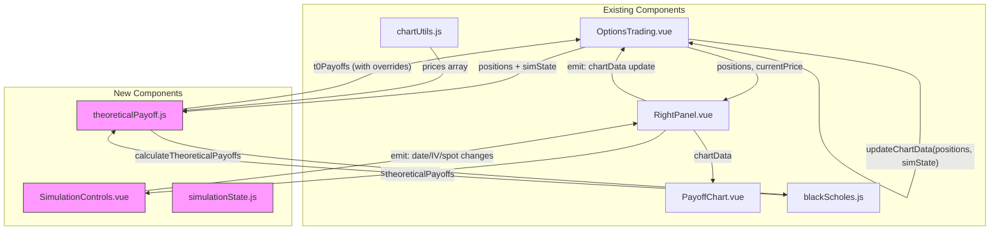
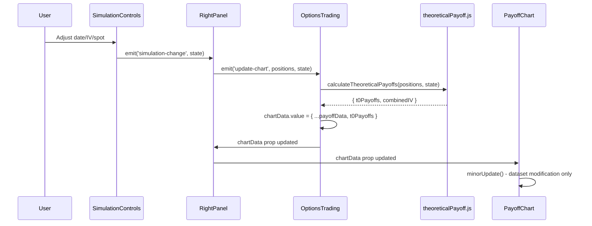

# Architecture: Enhance Payoff Chart with T+X Line

**Issue:** [#16 — Enhance Payoff Chart with T+X line](https://github.com/schardosin/juicytrade/issues/16)  
**Date:** 2025-01-28  
**Status:** Draft

---

## 1. System Overview

### 1.1 Purpose

This architecture extends the existing Payoff Chart to support interactive simulation controls that allow traders to analyze their positions under different scenarios:
- **T+X Date Simulation** - See theoretical P/L at any date between today and expiration
- **Volatility Adjustment** - Simulate P/L under different IV assumptions
- **Spot Price Simulation** - See P/L at different underlying prices
- **Line Visibility Toggles** - Show/hide individual P/L lines

### 1.2 Architecture Principles

| Principle | Rationale |
|-----------|-----------|
| **Minimal Chart Disruption** | The PayoffChart component is sensitive to re-renders. All updates must use dataset modification, not chart destruction/recreation. |
| **Pure Functions for Calculation** | Black-Scholes calculations remain pure functions with no side effects, making them easy to test and reason about. |
| **Reactive State Management** | Use Vue's native reactivity (refs, computed) without external state management. |
| **Graceful Degradation** | If IV data is unavailable, controls are disabled but chart remains functional. |
| **Incremental Enhancement** | Phase 1 focuses on core controls; Phase 2 adds advanced features. |

### 1.3 Component Diagram



### 1.4 Data Flow Summary



---

## 2. Component Architecture

### 2.1 New Components

#### 2.1.1 SimulationControls.vue

**Purpose:** Container component for all simulation control inputs.

**Location:** `trade-app/src/components/SimulationControls.vue`

**Template Structure:**
```
┌─────────────────────────────────────────────────┐
│ SimulationControls.vue                          │
├─────────────────────────────────────────────────┤
│ ┌─────────────────────────────────────────────┐ │
│ │ DateSelector.vue (or inline)                │ │
│ │  [◀]  [  Jan 30, 2025  ]  [📅]             │ │
│ └─────────────────────────────────────────────┘ │
│ ┌─────────────────────────────────────────────┐ │
│ │ IVSelector.vue (or inline)                 │ │
│ │  [−]  [   37.7%   ]  [+]                   │ │
│ │  Current: 32.7% (+5.0%)                    │ │
│ │  ☐ Use per-contract IVs                    │ │
│ └─────────────────────────────────────────────┘ │
│ ┌─────────────────────────────────────────────┐ │
│ │ SpotPriceSelector.vue (Phase 2)            │ │
│ └─────────────────────────────────────────────┘ │
│ ┌─────────────────────────────────────────────┐ │
│ │ LineToggles.vue                            │ │
│ │  ☑ P/L at Expiration   ☑ P/L Theoretical  │ │
│ └─────────────────────────────────────────────┘ │
│ ┌─────────────────────────────────────────────┐ │
│ │         [Reset to Defaults]                │ │
│ └─────────────────────────────────────────────┘ │
└─────────────────────────────────────────────────┘
```

**Props:**
```javascript
props: {
  positions: { type: Array, required: true },      // Option positions for IV extraction
  currentUnderlyingPrice: { type: Number, required: true },
  maxExpirationDate: { type: Date, required: true }, // Latest expiration among legs
  ivAvailable: { type: Boolean, default: true },   // False if any leg lacks IV
  defaultIV: { type: Number, default: null },      // Weighted average IV
}
```

**Emits:**
```javascript
emits: ['simulation-change']  // Emits full SimulationState object
```

**Internal State:**
```javascript
// All state is reactive and synced to parent via emit
const selectedDate = ref(new Date())              // T+X date
const selectedIV = ref(null)                      // IV override (null = use default)
const usePerContractIV = ref(false)               // Phase 2: per-leg IV mode
const perContractIVs = ref({})                    // Phase 2: { symbol: IV }
const showExpirationLine = ref(true)
const showTheoreticalLine = ref(true)
```

#### 2.1.2 useSimulationState.js (Composable)

**Purpose:** Manages simulation state and provides computed values for chart calculation.

**Location:** `trade-app/src/composables/useSimulationState.js`

**Exports:**
```javascript
export function useSimulationState(positions, marketData) {
  // Reactive state
  const selectedDate = ref(new Date())
  const selectedIVOverride = ref(null)
  const showExpirationLine = ref(true)
  const showTheoreticalLine = ref(true)
  
  // Computed values
  const defaultIV = computed(() => calculateWeightedAverageIV(positions, marketData))
  const effectiveIV = computed(() => selectedIVOverride.value ?? defaultIV.value)
  const minDate = computed(() => new Date()) // Today
  const maxDate = computed(() => getMaxExpiration(positions))
  const ivAvailable = computed(() => allLegsHaveIV(positions, marketData))
  
  // Methods
  function reset() {
    selectedDate.value = new Date()
    selectedIVOverride.value = null
    // ...
  }
  
  return {
    selectedDate,
    selectedIVOverride,
    effectiveIV,
    minDate,
    maxDate,
    ivAvailable,
    reset
  }
}
```

### 2.2 Modified Components

#### 2.2.1 RightPanel.vue

**Changes:**
1. Import `SimulationControls.vue`
2. Add `<SimulationControls>` to the Analysis section template
3. Emit `simulation-change` events to parent
4. Pass `showExpirationLine` and `showTheoreticalLine` to `PayoffChart.vue`

**Template Addition:**
```html
<!-- In Analysis section -->
<SimulationControls
  :positions="allPositions"
  :current-underlying-price="currentPrice"
  :max-expiration-date="maxExpiration"
  :iv-available="ivAvailable"
  :default-i-v="defaultCombinedIV"
  @simulation-change="onSimulationChange"
/>
```

#### 2.2.2 PayoffChart.vue

**Changes:**
1. Add props for line visibility toggles
2. Modify `minorUpdate()` to conditionally render datasets based on toggles
3. Rename "Today (T+0)" label to "P/L Theoretical"

**New Props:**
```javascript
props: {
  // ... existing props
  showExpirationLine: { type: Boolean, default: true },
  showTheoreticalLine: { type: Boolean, default: true },
}
```

**Dataset Rendering (in minorUpdate):**
```javascript
// Expiration line
if (this.showExpirationLine) {
  this.datasets[0].hidden = false
} else {
  this.datasets[0].hidden = true
}

// Theoretical line
if (this.showTheoreticalLine && this.chartData.t0Payoffs) {
  this.datasets[1].hidden = false
} else {
  this.datasets[1].hidden = true
}
```

#### 2.2.3 OptionsTrading.vue

**Changes:**
1. Accept simulation state from `RightPanel.vue` via emit
2. Pass simulation state to `updateChartData()` function
3. Use new `theoreticalPayoff.js` module for T+X calculations

**New Handler:**
```javascript
function onSimulationChange(simState) {
  simulationState.value = simState
  updateChartData(checkedPositions.value, simState)
}
```

---

## 3. Data Structures

### 3.1 SimulationState

```typescript
interface SimulationState {
  // Date selection
  selectedDate: Date              // Target date for T+X calculation
  minDate: Date                   // Today (read-only)
  maxDate: Date                   // Latest expiration among legs (read-only)
  
  // IV adjustment
  ivMode: 'expiration' | 'per-contract'
  selectedIV: number              // IV override (null uses default)
  perContractIVs: Record<string, number>  // { optionSymbol: IV }
  defaultIV: number               // Calculated weighted average (read-only)
  
  // Spot price simulation (Phase 2)
  selectedSpotPrice: number | null // null = use market price
  
  // Line visibility
  showExpirationLine: boolean
  showTheoreticalLine: boolean
}
```

### 3.2 Enhanced Leg Data for Black-Scholes

```typescript
interface LegData {
  strike_price: number
  option_type: 'call' | 'put'
  qty: number                    // Signed: +long, -short
  avg_entry_price: number
  iv: number                      // Implied volatility (decimal, e.g., 0.32)
  T: number                       // Time to expiry in YEARS
  expiry_date: string             // ISO date string (needed for T+X)
  symbol: string                  // Option symbol (for per-contract IV)
}
```

### 3.3 Chart Data Structure (Existing, Extended)

```typescript
interface ChartData {
  prices: number[]               // X-axis price points
  payoffs: number[]              // Expiration P/L values
  t0Payoffs: number[] | null     // Theoretical P/L at selected date/IV
  breakEvenPoints: number[]
  maxProfit: number
  maxLoss: number
  strikes: number[]
  _creditAdjustment: number
  
  // New fields
  _simulation?: {
    date: Date
    iv: number
    spotOverride: number | null
  }
}
```

---

## 4. Black-Scholes Extension

### 4.1 New Module: theoreticalPayoff.js

**Location:** `trade-app/src/utils/theoreticalPayoff.js`

**Purpose:** Calculate theoretical P/L at arbitrary dates with custom IV.

**Key Functions:**

```javascript
/**
 * Calculate time from selected date to expiry for each leg
 * @param {Date} selectedDate - User-selected T+X date
 * @param {Array} positions - Option positions with expiry_date
 * @returns {Array} Time-to-expiry values in years for each leg
 */
export function calculateTimesToExpiry(selectedDate, positions) {
  const selected = new Date(selectedDate)
  selected.setHours(0, 0, 0, 0)
  
  return positions.map(pos => {
    const expiry = new Date(pos.expiry_date + 'T16:00:00')  // Market close
    const diff = expiry - selected
    const T = diff / (365.25 * 24 * 60 * 60 * 1000)  // Years
    return Math.max(T, 0)  // 0 if already expired at selected date
  })
}

/**
 * Calculate weighted average IV for all legs
 * @param {Array} positions - Option positions
 * @param {Function} getIV - Function to get IV for a symbol
 * @returns {number|null} Weighted average IV (decimal) or null if unavailable
 */
export function calculateWeightedAverageIV(positions, getIV) {
  let totalWeight = 0
  let weightedSum = 0
  
  for (const pos of positions) {
    const iv = getIV(pos.symbol)
    if (iv == null) return null
    
    // Weight by absolute notional (|qty| * strike)
    const weight = Math.abs(pos.qty) * pos.strike_price
    weightedSum += iv * weight
    totalWeight += weight
  }
  
  return totalWeight > 0 ? weightedSum / totalWeight : null
}

/**
 * Calculate theoretical P/L at a specific date and IV
 * @param {Object} params
 * @param {number[]} params.prices - Price points for X-axis
 * @param {Array} params.positions - Option positions
 * @param {Date} params.selectedDate - Target date for calculation
 * @param {number} params.selectedIV - IV override (decimal)
 * @param {Function} params.getIV - Function to get market IV for a symbol
 * @param {number} params.riskFreeRate - Risk-free rate (default 0.05)
 * @param {number} params.creditAdjustment - Net credit adjustment
 * @returns {number[]|null} Theoretical P/L array, or null if IV unavailable
 */
export function calculateTheoreticalPayoffs({
  prices,
  positions,
  selectedDate,
  selectedIV,
  getIV,
  riskFreeRate = 0.05,
  creditAdjustment = 0
}) {
  // Build leg data with adjusted T and IV
  const timesToExpiry = calculateTimesToExpiry(selectedDate, positions)
  
  const legs = positions.map((pos, i) => {
    const marketIV = getIV(pos.symbol)
    const effectiveIV = selectedIV ?? marketIV  // Use override or market IV
    
    return {
      strike_price: pos.strike_price,
      option_type: pos.option_type,
      qty: pos.qty,
      avg_entry_price: pos.avg_entry_price,
      iv: effectiveIV,
      T: timesToExpiry[i]
    }
  })
  
  // Check if any leg has missing IV
  if (legs.some(leg => leg.iv == null)) {
    return null
  }
  
  // Use existing calculateT0Payoffs with modified leg data
  return calculateT0Payoffs({
    prices,
    legs,
    riskFreeRate,
    creditAdjustment
  })
}
```

### 4.2 Modifications to blackScholes.js

**No breaking changes required.** The existing `calculateT0Payoffs` function already accepts:
- `legs[].T` - Time to expiry (we'll pass adjusted values)
- `legs[].iv` - Implied volatility (we'll pass user-selected values)

**Minor Enhancement (Optional):**
Add a helper for per-contract IV mode:

```javascript
/**
 * Build legs array with per-contract IV overrides
 * @param {Array} positions - Option positions
 * @param {Object} ivOverrides - { symbol: IV } overrides
 * @param {Function} getIV - Function to get market IV
 * @param {Date} selectedDate - Target date
 * @returns {Array} Legs array for calculateT0Payoffs
 */
export function buildLegsWithPerContractIV(positions, ivOverrides, getIV, selectedDate) {
  const timesToExpiry = calculateTimesToExpiry(selectedDate, positions)
  
  return positions.map((pos, i) => ({
    strike_price: pos.strike_price,
    option_type: pos.option_type,
    qty: pos.qty,
    avg_entry_price: pos.avg_entry_price,
    iv: ivOverrides[pos.symbol] ?? getIV(pos.symbol),
    T: timesToExpiry[i]
  }))
}
```

---

## 5. State Management

### 5.1 State Location

The simulation state is managed in `RightPanel.vue` and emitted to `OptionsTrading.vue` for chart recalculation.

**Rationale:**
- Controls are in the right panel → state lives near the UI
- Chart data calculation happens in `OptionsTrading.vue` → state is emitted up
- No global store needed → state is scoped to the current position view

### 5.2 State Lifecycle

```mermaid
stateDiagram-v2
    [*] --> Default: Component Mount
    Default --> Modified: User Adjusts Control
    Modified --> Modified: User Adjusts Control
    Modified --> Default: Reset Button
    Modified --> Default: Position Changed
    Default --> [*]: Component Unmount
    Modified --> [*]: Component Unmount
```

### 5.3 Reset Triggers

The simulation state resets to defaults when:
1. User clicks "Reset" button
2. User selects different legs (selectedLegs changes)
3. User switches to a different underlying symbol
4. User toggles a position checkbox (changes checked positions)

**Implementation:**
```javascript
// In OptionsTrading.vue
watch([selectedLegs, symbol], () => {
  // Reset simulation state when position changes
  resetSimulationState()
})
```

### 5.4 Debouncing

To prevent excessive recalculations during rapid adjustments:

```javascript
// In SimulationControls.vue
import { debounce } from '@/utils/debounce'

const debouncedEmit = debounce((state) => {
  emit('simulation-change', state)
}, 100)  // 100ms debounce

function onDateChange(newDate) {
  selectedDate.value = newDate
  debouncedEmit(getState())
}

function onIVChange(newIV) {
  selectedIV.value = newIV
  debouncedEmit(getState())
}
```

---

## 6. UI Component Design

### 6.1 Date Selector

**Component:** Inline in `SimulationControls.vue` (or separate `DateSelector.vue`)

**PrimeVue Components:**
- `Calendar` for date picker
- `Button` for arrow navigation

**Template:**
```html
<div class="date-selector">
  <label>Evaluate at Date</label>
  <div class="date-controls">
    <Button icon="pi pi-chevron-left" @click="decrementDate" :disabled="isMinDate" />
    <Calendar v-model="selectedDate" :minDate="minDate" :maxDate="maxDate" 
              date-format="M d, yy" :show-icon="true" />
    <Button icon="pi pi-chevron-right" @click="incrementDate" :disabled="isMaxDate" />
  </div>
</div>
```

**Behavior:**
- Arrow buttons increment/decrement by 1 day
- Calendar icon opens date picker
- Disabled when min/max date reached

### 6.2 IV Selector

**Component:** Inline in `SimulationControls.vue`

**PrimeVue Components:**
- `InputNumber` for IV display
- `Button` for increment/decrement

**Template:**
```html
<div class="iv-selector">
  <label>Implied Volatility</label>
  <div class="iv-controls">
    <Button label="−" @click="decrementIV" :disabled="isMinIV || !ivAvailable" />
    <InputNumber v-model="selectedIVPercent" 
                 :min="5" :max="200" :step="1"
                 suffix="%" :disabled="!ivAvailable" />
    <Button label="+" @click="incrementIV" :disabled="isMaxIV || !ivAvailable" />
  </div>
  <div class="iv-info" v-if="ivAvailable">
    <span>Current: {{ defaultIVPercent }}%</span>
    <span v-if="ivDelta !== 0">({{ ivDelta > 0 ? '+' : '' }}{{ ivDelta }}%)</span>
  </div>
  <div class="iv-unavailable" v-else>
    <span class="disabled-hint">IV data unavailable</span>
  </div>
</div>
```

**Computed Values:**
```javascript
const selectedIVPercent = computed({
  get: () => Math.round((selectedIV.value ?? defaultIV.value ?? 0) * 100),
  set: (val) => { selectedIV.value = val / 100 }
})

const defaultIVPercent = computed(() => 
  Math.round((defaultIV.value ?? 0) * 100)
)

const ivDelta = computed(() => 
  selectedIVPercent.value - defaultIVPercent.value
)
```

### 6.3 Line Toggles

**Component:** Inline in `SimulationControls.vue`

**PrimeVue Components:**
- `Checkbox` for toggles

**Template:**
```html
<div class="line-toggles">
  <label>Lines</label>
  <div class="toggle-row">
    <Checkbox v-model="showExpirationLine" inputId="exp-line" :binary="true" />
    <label for="exp-line">P/L at Expiration</label>
  </div>
  <div class="toggle-row">
    <Checkbox v-model="showTheoreticalLine" inputId="theo-line" :binary="true" />
    <label for="theo-line">P/L Theoretical</label>
  </div>
</div>
```

### 6.4 Reset Button

**Template:**
```html
<Button label="Reset to Defaults" icon="pi pi-refresh" 
        @click="reset" :disabled="isDefaultState" />
```

### 6.5 Styling

All controls use the existing dark theme from `theme.css`:
- Background: `var(--surface-card)` (#1e1e1e)
- Text: `var(--text-color)` (#e0e0e0)
- Border: `var(--surface-border)` (#404040)
- Accent: `var(--primary-color)` (#10b981)

---

## 7. Chart Integration

### 7.1 Dataset Update Strategy

The `PayoffChart.vue` component has two update paths:
1. **Full re-render** - When strikes change (new position)
2. **Minor update** - When only data values change (price movement, simulation)

**For simulation changes, we use the minor update path:**

```javascript
// In PayoffChart.vue - minorUpdate()
minorUpdate() {
  if (!this.chart) return
  
  const datasets = this.chart.data.datasets
  
  // Update expiration line data (unchanged)
  datasets[0].data = this.chartData.payoffs
  
  // Update theoretical line data
  if (this.chartData.t0Payoffs) {
    datasets[1].data = this.chartData.t0Payoffs
    datasets[1].hidden = !this.showTheoreticalLine
  } else {
    datasets[1].hidden = true
  }
  
  // Update expiration line visibility
  datasets[0].hidden = !this.showExpirationLine
  
  // No chart.update() needed - Chart.js auto-updates on next tick
  this.chart.update('none')  // 'none' mode = no animation
}
```

### 7.2 Label Change

The theoretical line label changes from "Today (T+0)" to "P/L Theoretical":

```javascript
// In chartUtils.js or PayoffChart.vue
const theoreticalDataset = {
  label: 'P/L Theoretical',  // Changed from 'Today (T+0)'
  data: t0Payoffs,
  borderColor: 'rgb(0, 150, 255)',
  // ... rest of config
}
```

### 7.3 Tooltip Update

The tooltip label also changes:

```javascript
// In PayoffChart.vue tooltip callback
tooltip.callbacks = {
  label: function(context) {
    if (context.dataset.label === 'P/L Theoretical') {
      return `Theoretical P/L: $${context.parsed.y.toFixed(2)}`
    }
    // ... other labels
  }
}
```

---

## 8. Performance Considerations

### 8.1 Calculation Performance

**Target:** < 50ms for typical 4-leg strategy

**Approach:**
- Black-Scholes calculation is already optimized with pre-computed constants
- For 200 price points × 4 legs = 800 B-S calculations
- Each B-S call is ~0.01ms → total ~8ms (well under target)

### 8.2 Debounce Strategy

```javascript
// Debounce rapid control adjustments
const DEBOUNCE_MS = 100

// For IV adjustments (user holding + button)
const debouncedIVUpdate = debounce((iv) => {
  emitSimulationChange()
}, DEBOUNCE_MS)

// For date adjustments (user clicking arrows rapidly)
const debouncedDateUpdate = debounce((date) => {
  emitSimulationChange()
}, DEBOUNCE_MS)
```

### 8.3 Computed Caching

Use Vue's computed properties to cache expensive calculations:

```javascript
// In OptionsTrading.vue
const theoreticalPayoffs = computed(() => {
  if (!simulationState.value || !positions.value.length) return null
  return calculateTheoreticalPayoffs({
    prices: chartData.value.prices,
    positions: positions.value,
    selectedDate: simulationState.value.selectedDate,
    selectedIV: simulationState.value.selectedIV,
    getIV: (symbol) => getOptionGreeks(symbol).value?.implied_volatility,
    creditAdjustment: chartData.value._creditAdjustment
  })
})
```

### 8.4 Avoiding Unnecessary Recalculations

```javascript
// Only recalculate when relevant state changes
watch([simulationState, positions], () => {
  updateChartData()
}, { deep: true })

// Don't recalculate on unrelated state changes (e.g., UI state)
```

---

## 9. File Structure

### 9.1 New Files

```
trade-app/src/
├── components/
│   └── SimulationControls.vue      # New: Simulation control panel
├── composables/
│   └── useSimulationState.js        # New: State management composable
└── utils/
    └── theoreticalPayoff.js         # New: T+X calculation functions
```

### 9.2 Modified Files

```
trade-app/src/
├── components/
│   ├── RightPanel.vue               # Add SimulationControls
│   └── PayoffChart.vue             # Add visibility props, rename label
├── views/
│   └── OptionsTrading.vue          # Handle simulation state, pass to chart
└── utils/
    └── blackScholes.js             # Minor: export helper functions
```

---

## 10. Implementation Sequence

### Phase 1: Core Controls (MVP)

**Step 1: Foundation**
1. Create `theoreticalPayoff.js` with `calculateTimesToExpiry` and `calculateWeightedAverageIV`
2. Add unit tests for new functions

**Step 2: State Management**
1. Create `useSimulationState.js` composable
2. Add state to `OptionsTrading.vue` (simulationState ref)

**Step 3: UI Controls**
1. Create `SimulationControls.vue` with:
   - Date selector (arrows + calendar)
   - IV selector (increment/decrement)
   - Line visibility toggles
   - Reset button
2. Add to `RightPanel.vue` Analysis section

**Step 4: Chart Integration**
1. Modify `PayoffChart.vue`:
   - Add visibility props
   - Update `minorUpdate()` for visibility toggling
   - Rename "Today (T+0)" to "P/L Theoretical"
2. Connect state flow: Controls → RightPanel → OptionsTrading → Chart

**Step 5: Testing**
1. Manual testing of all controls
2. Verify chart stability (no flickering)
3. Test edge cases (0 DTE, missing IV, mixed expirations)

### Phase 2: Enhanced Features

**Step 6: Per-Contract IV Mode**
1. Add checkbox for "Use per-contract IVs"
2. Add per-leg IV controls when enabled
3. Update `calculateTheoreticalPayoffs` to accept per-contract IVs

**Step 7: Spot Price Simulation**
1. Add spot price selector
2. Update theoretical P/L calculation for spot override
3. Sync crosshair position with theoretical spot

**Step 8: Greek Overlay (Optional)**
1. Add Greek selector dropdown
2. Calculate Greek values across price points
3. Render as additional dataset (purple line)

---

## 11. Risk Mitigation

### 11.1 Chart Stability

**Risk:** The PayoffChart is sensitive to re-renders.

**Mitigation:**
- All updates go through `minorUpdate()`, never recreate chart
- Use `chart.update('none')` to skip animations
- Test thoroughly with rapid control adjustments

### 11.2 IV Data Availability

**Risk:** Some options may not have IV data.

**Mitigation:**
- Check IV availability before rendering controls
- Disable controls with tooltip explanation
- Chart still shows expiration line

### 11.3 Mixed Expirations

**Risk:** Calendar spreads have legs expiring at different dates.

**Mitigation:**
- Calculate T for each leg independently
- Handle expired legs (T=0) gracefully
- Set max date picker date to latest expiration

### 11.4 Time Zone Handling

**Risk:** Date calculations may be affected by time zones.

**Mitigation:**
- Use market close time (4:00 PM ET) for expiration
- Normalize dates to midnight for comparison
- Test with positions expiring on different dates

---

## 12. Testing Strategy

### 12.1 Unit Tests

**File:** `trade-app/tests/utils/theoreticalPayoff.test.js`

```javascript
describe('calculateTimesToExpiry', () => {
  it('returns 0 for expired legs', () => {
    const selectedDate = new Date('2025-02-01')
    const positions = [{ expiry_date: '2025-01-15' }]
    const result = calculateTimesToExpiry(selectedDate, positions)
    expect(result[0]).toBe(0)
  })
  
  it('calculates correct T for future expiry', () => {
    const selectedDate = new Date('2025-01-15')
    const positions = [{ expiry_date: '2025-02-15' }]  // 31 days
    const result = calculateTimesToExpiry(selectedDate, positions)
    expect(result[0]).toBeCloseTo(31/365.25, 4)
  })
})

describe('calculateWeightedAverageIV', () => {
  it('returns null if any leg lacks IV', () => {
    const positions = [{ symbol: 'A' }, { symbol: 'B' }]
    const getIV = (sym) => sym === 'A' ? 0.3 : null
    expect(calculateWeightedAverageIV(positions, getIV)).toBeNull()
  })
  
  it('calculates weighted average correctly', () => {
    const positions = [
      { symbol: 'A', qty: 1, strike_price: 100 },
      { symbol: 'B', qty: -1, strike_price: 110 }
    ]
    const getIV = (sym) => sym === 'A' ? 0.3 : 0.2
    // Weight A: 1*100=100, Weight B: 1*110=110
    // Weighted avg: (0.3*100 + 0.2*110) / 210 = 0.2476
    const result = calculateWeightedAverageIV(positions, getIV)
    expect(result).toBeCloseTo(0.2476, 4)
  })
})
```

### 12.2 Integration Tests

**File:** `trade-app/tests/components/SimulationControls.test.js`

```javascript
describe('SimulationControls', () => {
  it('emits simulation-change on date adjustment', async () => {
    const wrapper = mount(SimulationControls, { props: { ... } })
    await wrapper.find('.date-arrow-right').trigger('click')
    expect(wrapper.emitted('simulation-change')).toBeTruthy()
  })
  
  it('disables IV controls when IV unavailable', () => {
    const wrapper = mount(SimulationControls, { 
      props: { ivAvailable: false } 
    })
    expect(wrapper.find('.iv-selector input').attributes('disabled')).toBe('')
  })
})
```

### 12.3 Manual Test Checklist

| Test Case | Expected Result |
|-----------|-----------------|
| Adjust date forward | Theoretical line shows time decay |
| Adjust date to expiration | Theoretical line matches expiration line |
| Adjust IV up | Theoretical line shows vega impact |
| Toggle expiration line off | Green line disappears |
| Toggle theoretical line off | Blue line disappears |
| Click Reset | All controls return to defaults |
| Select different legs | Controls reset to defaults |
| Position with missing IV | IV controls disabled, tooltip shown |
| 0 DTE position | Date picker disabled, lines overlap |
| Calendar spread | Date picker max = later expiration |

---

## 13. Summary

This architecture extends the Payoff Chart with interactive simulation controls following TastyTrade's UI patterns. The design:

1. **Preserves chart stability** - Uses minor updates, no chart recreation
2. **Uses pure functions** - Black-Scholes calculations remain testable
3. **Manages state reactively** - Vue reactivity without external stores
4. **Degrades gracefully** - Controls disabled when data unavailable
5. **Implements incrementally** - Phase 1 MVP, Phase 2 advanced features

The implementation follows a clear sequence: foundation → state → UI → integration → testing, ensuring each step builds on verified work.