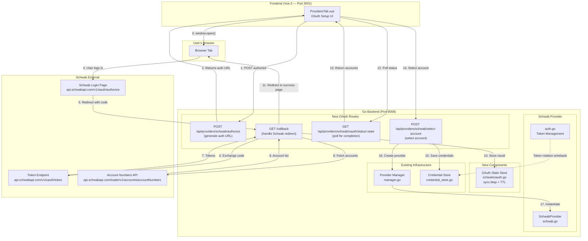
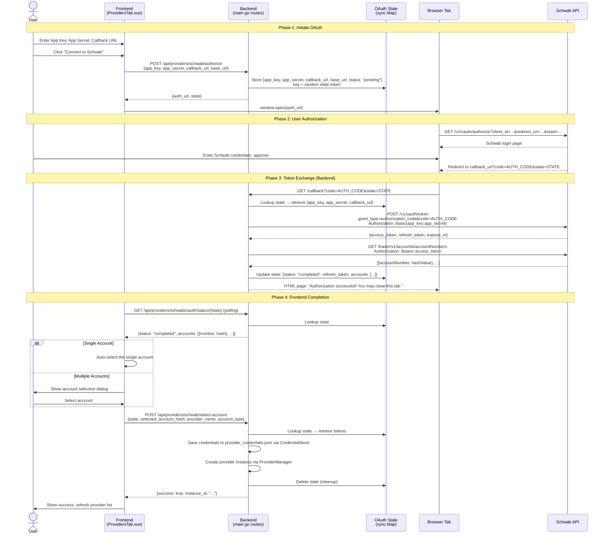
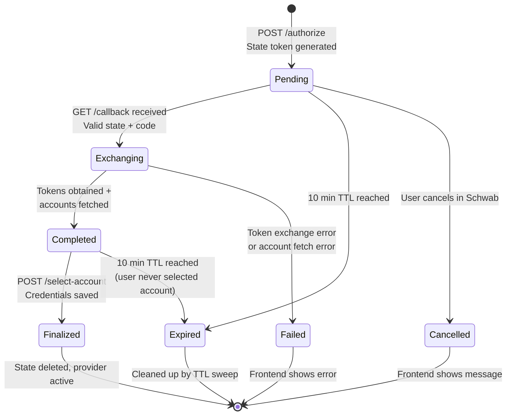
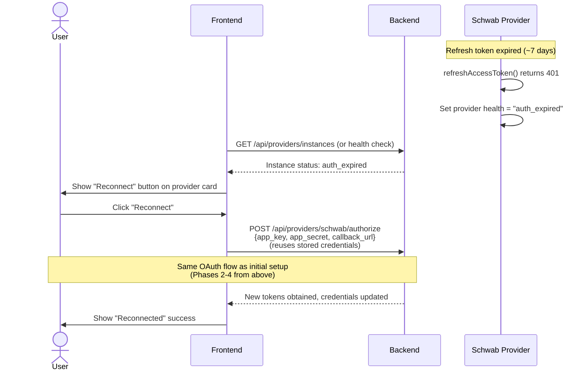
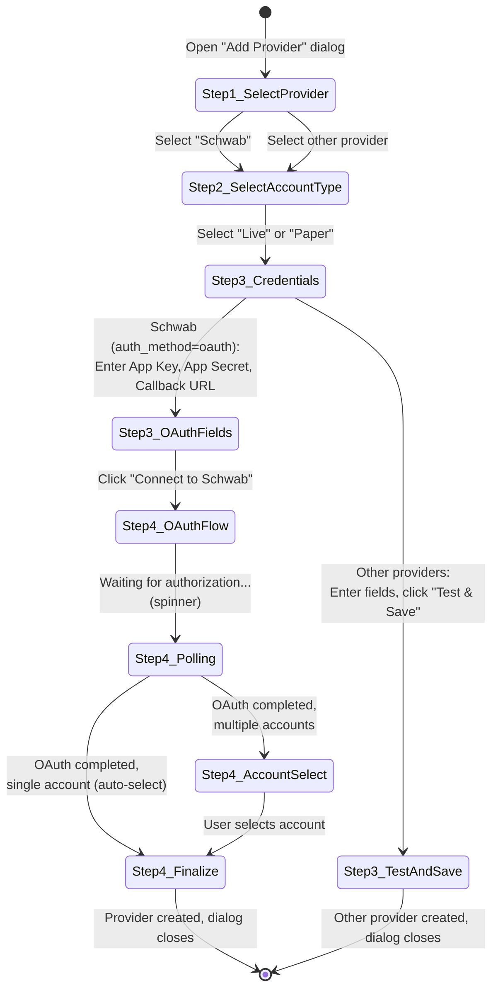
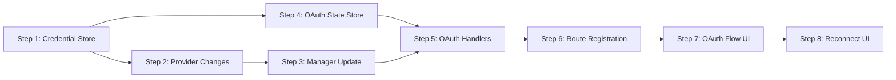

# Technical Architecture: Schwab OAuth Authorization Flow

**Issue:** [#20 - TD Ameritrade as a Provider](https://github.com/schardosin/juicytrade/issues/20) — OAuth Enhancement
**Requirements:** [requirements-oauth-flow.md](./requirements-oauth-flow.md)
**Parent Architecture:** [architecture.md](./architecture.md)
**Date:** 2025-07-15
**Status:** Draft

---

## Table of Contents

1. [Overview & Design Goals](#1-overview--design-goals)
2. [System Context & Flow Diagrams](#2-system-context--flow-diagrams)
3. [Backend: OAuth Route Design](#3-backend-oauth-route-design)
4. [Backend: OAuth State Management](#4-backend-oauth-state-management)
5. [Backend: Authorization Code Exchange](#5-backend-authorization-code-exchange)
6. [Backend: Credential Store Enhancement](#6-backend-credential-store-enhancement)
7. [Backend: Provider Changes](#7-backend-provider-changes)
8. [Frontend: OAuth Setup UI](#8-frontend-oauth-setup-ui)
9. [API Contracts](#9-api-contracts)
10. [File Change Inventory](#10-file-change-inventory)
11. [Error Handling & Edge Cases](#11-error-handling--edge-cases)
12. [Security Considerations](#12-security-considerations)
13. [Implementation Guidance & Phasing](#13-implementation-guidance--phasing)

---

## 1. Overview & Design Goals

### 1.1 Problem

The current Schwab provider requires users to manually provide a **Refresh Token** and **Account Hash** as credential fields. These values are difficult to obtain — users would need to perform the OAuth flow externally (via curl, Postman, or developer tools), extract tokens, and separately look up their account hash. This is a poor user experience and a security concern (copying tokens through external tools).

### 1.2 Solution

Replace the manual credential entry with a **browser-based OAuth Authorization Code flow** built into JuicyTrade. The user provides only their **App Key** and **App Secret** (from the Schwab Developer Portal), clicks **"Connect to Schwab"**, authorizes in their browser, and the application handles everything else: token exchange, account hash retrieval, and token persistence.

### 1.3 Design Principles

| Principle | Application |
|-----------|-------------|
| **Minimal invasion** | Add new routes and files; avoid restructuring existing provider infrastructure. The credential store gets one new method; the provider manager gets a small callback mechanism. |
| **Follow existing patterns** | The OAuth state management mirrors the existing `auth/handlers.go` CSRF pattern (`sync.Map` for state storage). Route registration follows the established `main.go` pattern. |
| **Backward compatible** | Existing Schwab instances with manually-provided refresh tokens continue to work. The provider constructor accepts both OAuth-obtained and manually-provided tokens. |
| **Frontend-driven UX** | The frontend controls the OAuth flow — it initiates authorization, polls for completion, and handles account selection. The backend provides API endpoints that the frontend orchestrates. |
| **Secure by default** | State parameters prevent CSRF. Tokens are never logged in plaintext. Authorization codes have a 10-minute TTL. The callback route validates state before processing. |

### 1.4 Key Trade-offs

| Decision | Alternative | Rationale |
|----------|-------------|-----------|
| **Frontend polling** for OAuth completion vs. WebSocket push | WebSocket push would be more responsive | Polling is simpler, requires no new WebSocket infrastructure, and the OAuth flow is infrequent (once per setup). A 2-second poll interval gives acceptable UX. |
| **New `/callback` root route** vs. reusing `/auth/oauth/callback` | Reusing existing auth callback | Schwab's registered callback URLs are `https://127.0.0.1/callback` and `https://juicytrade.muxpie.com/callback`. We must match these exactly. The existing `/auth/oauth/callback` is for JuicyTrade's own app authentication — different purpose. |
| **`CredentialUpdater` callback** on provider vs. providers directly accessing credential store | Direct credential store access would be simpler | Providers shouldn't know about the credential store's implementation. A callback function injected at construction time maintains the separation of concerns and is easily testable (inject a mock). |
| **Single `/callback` route** handling all Schwab instances vs. per-instance routes | Per-instance routes would avoid state correlation | Only one callback URL is registered with Schwab — we must use state parameters to correlate callbacks to specific provider instances. This is standard OAuth practice. |
| **Account selection in frontend** vs. auto-selecting first account | Auto-select would be simpler | The requirements specify users should choose when multiple accounts exist. Most users probably have one account, so we auto-select in the single-account case. |

---

## 2. System Context & Flow Diagrams

### 2.1 Component Diagram



### 2.2 End-to-End OAuth Flow (Sequence Diagram)



### 2.3 OAuth State Machine



### 2.4 Re-Authentication Flow (Expired Refresh Token)



---

## 3. Backend: OAuth Route Design

### 3.1 New Routes Overview

| Route | Method | Auth Required | Purpose |
|-------|--------|--------------|---------|
| `POST /api/providers/schwab/authorize` | POST | No* | Generate Schwab authorization URL and create pending OAuth state |
| `GET /callback` | GET | No | Handle Schwab's OAuth redirect with authorization code |
| `GET /api/providers/schwab/oauth/status/:state` | GET | No* | Poll for OAuth flow completion status |
| `POST /api/providers/schwab/select-account` | POST | No* | Finalize provider setup with selected account |

*\*Note: These routes are under `/api/providers/` which is registered **before** the auth middleware in `main.go` (lines ~180-220). Provider management routes are already unauthenticated. Only the `/callback` route needs special placement since it's at the root level.*

### 3.2 Route Registration in main.go

The existing `main.go` registers routes in this order:
1. Root-level routes: `/`, `/health`, `/ws` (no auth)
2. API provider management routes: `/api/providers/*` (no auth — registered before middleware)
3. Auth middleware applied: `api.Use(auth.AuthenticationMiddleware(...))`
4. Authenticated API routes: `/api/market/*`, `/api/options/*`, etc.

**New route registration placement:**

```go
// === Root-level routes (existing) ===
router.GET("/", serveIndex)
router.GET("/health", handlers.NewHealthHandler(pm).HealthCheck)
router.GET("/ws", wsHandler)

// NEW: Schwab OAuth callback at root level (must match registered callback URL)
router.GET("/callback", schwabOAuthHandler.HandleCallback)

// === API group (existing) ===
api := router.Group("/api")

// Provider management routes (existing, before auth middleware)
providerRoutes := api.Group("/providers")
{
    // ... existing CRUD routes ...

    // NEW: Schwab OAuth routes (under /api/providers/schwab/)
    schwabOAuth := providerRoutes.Group("/schwab")
    {
        schwabOAuth.POST("/authorize", schwabOAuthHandler.HandleAuthorize)
        schwabOAuth.GET("/oauth/status/:state", schwabOAuthHandler.HandleOAuthStatus)
        schwabOAuth.POST("/select-account", schwabOAuthHandler.HandleSelectAccount)
    }
}

// Auth middleware (existing)
api.Use(auth.AuthenticationMiddleware(authConfig, pm))

// ... authenticated routes ...
```

### 3.3 Handler Struct

A new handler struct encapsulates all OAuth flow logic:

```go
// SchwabOAuthHandler handles the Schwab OAuth authorization flow.
// Registered in main.go alongside other handlers.
type SchwabOAuthHandler struct {
    oauthStore      *SchwabOAuthStore  // Temporary state storage
    credentialStore *CredentialStore   // For persisting final credentials
    providerManager *ProviderManager   // For creating provider instances
}

func NewSchwabOAuthHandler(
    credStore *CredentialStore,
    pm *ProviderManager,
) *SchwabOAuthHandler
```

**Location:** `trade-backend-go/internal/providers/schwab/oauth.go`

This handler is in the `schwab` package but is instantiated in `main.go` and registered as route handlers. This keeps all Schwab-specific OAuth logic in one package while maintaining the existing pattern where `main.go` wires up handlers.

### 3.4 Why Not Reuse the Existing Auth OAuth?

The existing `internal/auth/` OAuth system (`handlers.go`, `routes.go`) serves a completely different purpose:
- **Auth OAuth:** Authenticates JuicyTrade *users* via an external identity provider → creates a JWT session
- **Schwab OAuth:** Authenticates the *application* with Schwab → obtains API tokens for a provider instance

They share no code paths: different token endpoints, different state semantics, different outcomes. Reusing the auth system would create a confusing coupling. The Schwab OAuth handler is self-contained.

---

## 4. Backend: OAuth State Management

### 4.1 Overview

The OAuth flow is inherently asynchronous — the user leaves JuicyTrade, logs into Schwab in a separate browser tab, and Schwab redirects back. We need temporary server-side state to correlate the callback with the original request and securely hold credentials during the flow.

### 4.2 State Store Design

```go
// SchwabOAuthStore manages temporary OAuth flow state.
// Uses sync.Map for thread-safe concurrent access.
// State entries auto-expire after 10 minutes.
type SchwabOAuthStore struct {
    states sync.Map // map[string]*OAuthFlowState
}

// OAuthFlowState represents one in-progress OAuth authorization flow.
type OAuthFlowState struct {
    // --- Set at creation (POST /authorize) ---
    AppKey      string    `json:"-"`           // Never serialized to responses
    AppSecret   string    `json:"-"`           // Never serialized to responses
    CallbackURL string    `json:"callback_url"`
    BaseURL     string    `json:"base_url"`
    CreatedAt   time.Time `json:"created_at"`
    Status      string    `json:"status"`      // "pending", "exchanging", "completed", "failed"

    // --- Set after callback (GET /callback) ---
    RefreshToken string                  `json:"-"`        // Never serialized to responses
    AccessToken  string                  `json:"-"`        // Never serialized to responses
    TokenExpiry  time.Time               `json:"-"`        // Never serialized to responses
    Accounts     []SchwabAccountInfo     `json:"accounts"` // Only in status responses
    Error        string                  `json:"error,omitempty"`

    // --- Re-auth context (optional) ---
    ExistingInstanceID string `json:"-"` // Set when re-authenticating an existing provider

    // --- Mutex for state transitions ---
    mu sync.Mutex `json:"-"`
}

// SchwabAccountInfo represents an account returned by the account numbers endpoint.
type SchwabAccountInfo struct {
    AccountNumber string `json:"account_number"` // Masked for display (e.g., "****1234")
    HashValue     string `json:"hash_value"`     // Used as account_hash for API calls
}
```

### 4.3 State Lifecycle Methods

```go
// CreateState generates a new state token and stores the initial OAuth flow data.
// Returns the state token (32 bytes, base64url-encoded, 43 characters).
func (s *SchwabOAuthStore) CreateState(appKey, appSecret, callbackURL, baseURL string) (string, error)

// GetState retrieves the state by token. Returns nil if not found or expired.
func (s *SchwabOAuthStore) GetState(stateToken string) *OAuthFlowState

// UpdateState atomically updates the state. Uses the state's internal mutex.
func (s *SchwabOAuthStore) UpdateState(stateToken string, updateFn func(*OAuthFlowState)) bool

// DeleteState removes a state entry (called after finalization or on error).
func (s *SchwabOAuthStore) DeleteState(stateToken string)

// StartCleanup launches a background goroutine that periodically removes expired states.
// Called once at startup. Runs every 60 seconds, removes states older than 10 minutes.
func (s *SchwabOAuthStore) StartCleanup(ctx context.Context)
```

### 4.4 State Token Generation

State tokens serve dual purposes: CSRF protection and flow correlation.

```go
func generateStateToken() (string, error) {
    b := make([]byte, 32)
    if _, err := crypto_rand.Read(b); err != nil {
        return "", fmt.Errorf("failed to generate state token: %w", err)
    }
    return base64.RawURLEncoding.EncodeToString(b), nil
}
```

**Properties:**
- 32 bytes of cryptographic randomness → 43-character base64url string
- Unguessable — prevents CSRF attacks
- URL-safe — can be included in Schwab's redirect URL as a query parameter
- Same approach as the existing `auth/handlers.go` which uses 32-byte random state tokens

### 4.5 TTL and Cleanup

**Why 10 minutes?** The OAuth flow requires the user to:
1. See the Schwab login page load (~2-5 seconds)
2. Enter credentials and approve (~30-60 seconds)
3. Wait for the callback to complete (~2-5 seconds)
4. Frontend polls and gets the result (~2-4 seconds)
5. User selects an account and finalizes (~10-30 seconds)

Total expected time: under 2 minutes. The 10-minute TTL provides a generous buffer for slow networks, users who step away briefly, or multi-factor authentication prompts. It also limits the window of vulnerability if a state token is somehow leaked.

**Cleanup goroutine:** Runs every 60 seconds, iterates `sync.Map`, removes entries where `time.Since(CreatedAt) > 10*time.Minute`. This is a lightweight operation — the map will typically contain 0-1 entries (one user setting up at a time).

### 4.6 Concurrency Safety

- **`sync.Map`** for the outer store — optimized for the case where entries are written once and read many times (state is created, then read during polling)
- **`sync.Mutex`** within each `OAuthFlowState` — protects against race conditions between the callback handler (writes tokens/accounts) and the status polling handler (reads status)
- **Atomic state transitions:** The `UpdateState` method locks the state's mutex, calls the update function, then unlocks. This ensures that status transitions (pending → exchanging → completed) are atomic.

### 4.7 Re-Authentication Support

When re-authenticating an existing provider (refresh token expired), the flow is identical except:
1. `POST /authorize` receives an additional `instance_id` field
2. The `ExistingInstanceID` is stored in the state
3. `POST /select-account` updates the existing provider instance's credentials instead of creating a new one
4. The frontend skips the "provider name" and "account type" fields since they already exist

---

## 5. Backend: Authorization Code Exchange

### 5.1 HandleAuthorize — Generate Authorization URL

**Route:** `POST /api/providers/schwab/authorize`

```go
func (h *SchwabOAuthHandler) HandleAuthorize(c *gin.Context) {
    // 1. Parse request body
    var req struct {
        AppKey      string `json:"app_key" binding:"required"`
        AppSecret   string `json:"app_secret" binding:"required"`
        CallbackURL string `json:"callback_url" binding:"required"`
        BaseURL     string `json:"base_url"`
        InstanceID  string `json:"instance_id"` // Optional: for re-auth
    }

    // 2. Validate callback URL (must be a valid https:// URL)

    // 3. Default base URL if not provided
    if req.BaseURL == "" {
        req.BaseURL = "https://api.schwabapi.com"
    }

    // 4. Generate state token and store state
    stateToken, _ := h.oauthStore.CreateState(
        req.AppKey, req.AppSecret, req.CallbackURL, req.BaseURL,
    )

    // 5. If re-auth, store the existing instance ID
    if req.InstanceID != "" {
        h.oauthStore.UpdateState(stateToken, func(s *OAuthFlowState) {
            s.ExistingInstanceID = req.InstanceID
        })
    }

    // 6. Build Schwab authorization URL
    authURL := fmt.Sprintf(
        "%s/v1/oauth/authorize?client_id=%s&redirect_uri=%s&response_type=code&state=%s",
        req.BaseURL,
        url.QueryEscape(req.AppKey),
        url.QueryEscape(req.CallbackURL),
        url.QueryEscape(stateToken),
    )

    // 7. Return auth URL and state token to frontend
    c.JSON(200, gin.H{
        "auth_url": authURL,
        "state":    stateToken,
    })
}
```

### 5.2 HandleCallback — Process Schwab Redirect

**Route:** `GET /callback`

This is the most critical handler — it receives the authorization code from Schwab and performs the token exchange.

```go
func (h *SchwabOAuthHandler) HandleCallback(c *gin.Context) {
    // 1. Extract query parameters
    code := c.Query("code")
    stateToken := c.Query("state")
    errorParam := c.Query("error") // Schwab sends this if user cancels

    // 2. If error parameter present (user cancelled), update state and show error page
    if errorParam != "" {
        h.oauthStore.UpdateState(stateToken, func(s *OAuthFlowState) {
            s.Status = "failed"
            s.Error = "Authorization cancelled by user"
        })
        c.Data(200, "text/html", renderCallbackPage("cancelled", ""))
        return
    }

    // 3. Validate state token exists and is in "pending" status
    state := h.oauthStore.GetState(stateToken)
    if state == nil {
        c.Data(200, "text/html", renderCallbackPage("error", "Invalid or expired authorization request"))
        return
    }

    // 4. Transition state to "exchanging" (prevents duplicate processing)
    alreadyProcessing := false
    h.oauthStore.UpdateState(stateToken, func(s *OAuthFlowState) {
        if s.Status != "pending" {
            alreadyProcessing = true
            return
        }
        s.Status = "exchanging"
    })
    if alreadyProcessing {
        c.Data(200, "text/html", renderCallbackPage("error", "This authorization has already been processed"))
        return
    }

    // 5. Exchange authorization code for tokens
    tokens, err := exchangeCodeForTokens(state.BaseURL, state.AppKey, state.AppSecret, state.CallbackURL, code)
    if err != nil {
        h.oauthStore.UpdateState(stateToken, func(s *OAuthFlowState) {
            s.Status = "failed"
            s.Error = fmt.Sprintf("Token exchange failed: %v", err)
        })
        c.Data(200, "text/html", renderCallbackPage("error", "Failed to exchange authorization code"))
        return
    }

    // 6. Fetch account numbers using the access token
    accounts, err := fetchAccountNumbers(state.BaseURL, tokens.AccessToken)
    if err != nil {
        h.oauthStore.UpdateState(stateToken, func(s *OAuthFlowState) {
            s.Status = "failed"
            s.Error = fmt.Sprintf("Failed to fetch accounts: %v", err)
        })
        c.Data(200, "text/html", renderCallbackPage("error", "Failed to fetch account information"))
        return
    }

    // 7. Validate at least one account exists
    if len(accounts) == 0 {
        h.oauthStore.UpdateState(stateToken, func(s *OAuthFlowState) {
            s.Status = "failed"
            s.Error = "No accounts found"
        })
        c.Data(200, "text/html", renderCallbackPage("error", "No accounts found in your Schwab account"))
        return
    }

    // 8. Update state with tokens and accounts
    h.oauthStore.UpdateState(stateToken, func(s *OAuthFlowState) {
        s.Status = "completed"
        s.RefreshToken = tokens.RefreshToken
        s.AccessToken = tokens.AccessToken
        s.TokenExpiry = time.Now().Add(time.Duration(tokens.ExpiresIn) * time.Second)
        s.Accounts = accounts
    })

    // 9. Render success HTML page
    c.Data(200, "text/html", renderCallbackPage("success", ""))
}
```

### 5.3 Token Exchange Function

```go
// exchangeCodeForTokens exchanges an authorization code for OAuth tokens.
// This is a standalone function (not a method on SchwabProvider) because
// the provider instance doesn't exist yet during initial setup.
func exchangeCodeForTokens(baseURL, appKey, appSecret, callbackURL, code string) (*tokenExchangeResult, error) {
    // 1. Build request
    tokenURL := baseURL + "/v1/oauth/token"
    data := url.Values{
        "grant_type":   {"authorization_code"},
        "code":         {code},
        "redirect_uri": {callbackURL},
    }

    req, _ := http.NewRequest("POST", tokenURL, strings.NewReader(data.Encode()))
    req.Header.Set("Content-Type", "application/x-www-form-urlencoded")

    // 2. Set Basic Auth header: base64(appKey:appSecret)
    req.SetBasicAuth(appKey, appSecret)

    // 3. Execute request (30-second timeout)
    client := &http.Client{Timeout: 30 * time.Second}
    resp, err := client.Do(req)
    // ... error handling ...

    // 4. Parse response
    var tokenResp schwabTokenResponse
    json.NewDecoder(resp.Body).Decode(&tokenResp)

    return &tokenExchangeResult{
        AccessToken:  tokenResp.AccessToken,
        RefreshToken: tokenResp.RefreshToken,
        ExpiresIn:    tokenResp.ExpiresIn,
    }, nil
}

type tokenExchangeResult struct {
    AccessToken  string
    RefreshToken string
    ExpiresIn    int
}
```

### 5.4 Fetch Account Numbers Function

```go
// fetchAccountNumbers retrieves the list of account numbers and hashes.
func fetchAccountNumbers(baseURL, accessToken string) ([]SchwabAccountInfo, error) {
    url := baseURL + "/trader/v1/accounts/accountNumbers"

    req, _ := http.NewRequest("GET", url, nil)
    req.Header.Set("Authorization", "Bearer "+accessToken)
    req.Header.Set("Accept", "application/json")

    client := &http.Client{Timeout: 15 * time.Second}
    resp, err := client.Do(req)
    // ... error handling ...

    // Parse response: [{"accountNumber": "123456789", "hashValue": "ABC123DEF..."}, ...]
    var accounts []struct {
        AccountNumber string `json:"accountNumber"`
        HashValue     string `json:"hashValue"`
    }
    json.NewDecoder(resp.Body).Decode(&accounts)

    // Convert to SchwabAccountInfo with masked account numbers
    result := make([]SchwabAccountInfo, len(accounts))
    for i, acct := range accounts {
        result[i] = SchwabAccountInfo{
            AccountNumber: maskAccountNumber(acct.AccountNumber),
            HashValue:     acct.HashValue,
        }
    }
    return result, nil
}

// maskAccountNumber masks all but the last 4 digits: "123456789" → "****6789"
func maskAccountNumber(number string) string {
    if len(number) <= 4 {
        return number
    }
    return strings.Repeat("*", len(number)-4) + number[len(number)-4:]
}
```

### 5.5 HandleOAuthStatus — Poll for Completion

**Route:** `GET /api/providers/schwab/oauth/status/:state`

```go
func (h *SchwabOAuthHandler) HandleOAuthStatus(c *gin.Context) {
    stateToken := c.Param("state")

    state := h.oauthStore.GetState(stateToken)
    if state == nil {
        c.JSON(404, gin.H{"error": "OAuth flow not found or expired"})
        return
    }

    // Build response based on current status
    response := gin.H{"status": state.Status}

    switch state.Status {
    case "completed":
        response["accounts"] = state.Accounts
    case "failed":
        response["error"] = state.Error
    }
    // "pending" and "exchanging" just return the status — frontend keeps polling

    c.JSON(200, response)
}
```

### 5.6 HandleSelectAccount — Finalize Setup

**Route:** `POST /api/providers/schwab/select-account`

```go
func (h *SchwabOAuthHandler) HandleSelectAccount(c *gin.Context) {
    var req struct {
        State        string `json:"state" binding:"required"`
        AccountHash  string `json:"account_hash" binding:"required"`
        ProviderName string `json:"provider_name"` // Required for new, ignored for re-auth
        AccountType  string `json:"account_type"`  // Required for new, ignored for re-auth
    }

    // 1. Parse and validate request
    // 2. Lookup state — must be in "completed" status
    state := h.oauthStore.GetState(req.State)
    if state == nil || state.Status != "completed" {
        c.JSON(400, gin.H{"error": "Invalid or incomplete OAuth flow"})
        return
    }

    // 3. Validate the selected account hash is in the accounts list
    validHash := false
    for _, acct := range state.Accounts {
        if acct.HashValue == req.AccountHash {
            validHash = true
            break
        }
    }
    if !validHash {
        c.JSON(400, gin.H{"error": "Invalid account selection"})
        return
    }

    // 4. Build credential map
    credentials := map[string]interface{}{
        "app_key":       state.AppKey,
        "app_secret":    state.AppSecret,
        "callback_url":  state.CallbackURL,
        "base_url":      state.BaseURL,
        "refresh_token": state.RefreshToken,
        "account_hash":  req.AccountHash,
    }

    if state.ExistingInstanceID != "" {
        // 5a. Re-authentication: update existing instance credentials
        credStore := NewCredentialStore("")
        existing := credStore.GetInstance(state.ExistingInstanceID)
        if existing == nil {
            c.JSON(404, gin.H{"error": "Provider instance not found"})
            return
        }
        existingCreds, _ := existing["credentials"].(map[string]interface{})
        if existingCreds == nil {
            existingCreds = make(map[string]interface{})
        }
        // Merge new tokens into existing credentials
        existingCreds["refresh_token"] = state.RefreshToken
        existingCreds["account_hash"] = req.AccountHash
        existing["credentials"] = existingCreds
        credStore.UpdateInstance(state.ExistingInstanceID, existing)

        // Reinitialize the provider instance with new credentials
        h.providerManager.ReinitializeInstance(state.ExistingInstanceID)

        h.oauthStore.DeleteState(req.State)
        c.JSON(200, gin.H{
            "success":     true,
            "instance_id": state.ExistingInstanceID,
            "message":     "Provider re-authenticated successfully",
        })
    } else {
        // 5b. New provider: create instance via credential store
        if req.ProviderName == "" {
            c.JSON(400, gin.H{"error": "provider_name is required for new providers"})
            return
        }
        if req.AccountType == "" {
            req.AccountType = "live"
        }

        instanceID := generateInstanceID() // e.g., "schwab_live_1" or UUID
        instanceData := map[string]interface{}{
            "provider_type": "schwab",
            "account_type":  req.AccountType,
            "name":          req.ProviderName,
            "enabled":       true,
            "credentials":   credentials,
        }

        credStore := NewCredentialStore("")
        credStore.AddInstance(instanceID, instanceData)

        // Initialize the provider instance
        h.providerManager.InitializeInstance(instanceID)

        h.oauthStore.DeleteState(req.State)
        c.JSON(200, gin.H{
            "success":     true,
            "instance_id": instanceID,
            "message":     "Schwab provider created successfully",
        })
    }
}
```

### 5.7 Callback HTML Page

The callback endpoint returns a simple HTML page (not JSON) because it's loaded directly in the browser tab that Schwab redirected to. The page shows a success/error message and can optionally auto-close.

```go
// renderCallbackPage generates a minimal HTML page for the OAuth callback result.
func renderCallbackPage(status, errorMessage string) []byte {
    // Simple HTML with inline CSS (no external dependencies)
    // Status: "success" → green checkmark, "Authorization successful! You may close this tab."
    // Status: "error" → red X, error message
    // Status: "cancelled" → yellow warning, "Authorization was cancelled."
    //
    // The page does NOT auto-close (window.close() is blocked by browsers for non-script-opened windows).
    // Instead, it shows a clear message that the user can close the tab manually.
}
```

**Design note:** We intentionally render an HTML page rather than redirecting back to the JuicyTrade frontend. The callback URL is `https://127.0.0.1/callback` which points to the Go backend (port 8008 in dev, but may be reverse-proxied in production). The frontend is on a different port (3001) or path. Redirecting to the frontend would require knowing the frontend's URL, which is environment-dependent. Instead, the frontend polls for completion independently.

---

## 6. Backend: Credential Store Enhancement

### 6.1 Problem: Providers Cannot Persist Token Rotations

Currently, when Schwab rotates the refresh token during an access token refresh, the `auth.go` code detects the new token but can only log a warning:

```go
// Current code in auth.go refreshAccessToken():
if tokenResp.RefreshToken != "" && tokenResp.RefreshToken != s.refreshToken {
    s.logger.Warn("Schwab rotated refresh token — new token NOT persisted",
        "note", "Manually update provider credentials if needed")
    s.refreshToken = tokenResp.RefreshToken // Updates in-memory only
}
```

This means:
1. After a server restart, the old (now invalid) refresh token is loaded from disk
2. Authentication fails — the user must re-authenticate

### 6.2 Solution: CredentialUpdater Callback

Introduce a simple callback function type that the provider manager injects into providers at construction time:

```go
// CredentialUpdater is a callback function that providers can use to persist
// credential changes back to the credential store. The provider calls this
// with its instance ID and a map of credential fields to update.
//
// Defined in: providers/credential_updater.go (new file)
type CredentialUpdater func(instanceID string, updates map[string]interface{}) error
```

This is a **function type**, not an interface — lightweight and easy to mock in tests.

### 6.3 Credential Store: New UpdateCredentialFields Method

The existing `UpdateInstance` replaces top-level keys. We need a targeted method that updates only specific credential fields without overwriting the entire credentials map:

```go
// UpdateCredentialFields updates specific fields within an instance's credentials sub-map.
// This performs a deep merge — only the specified fields are updated, others are preserved.
//
// Example: UpdateCredentialFields("schwab_live_1", map[string]interface{}{"refresh_token": "new_token"})
// This updates only refresh_token within the credentials map, leaving app_key, app_secret, etc. untouched.
func (cs *CredentialStore) UpdateCredentialFields(instanceID string, fieldUpdates map[string]interface{}) error {
    // 1. Load current instance data from file
    // 2. Extract the "credentials" sub-map
    // 3. Merge fieldUpdates into the credentials sub-map
    // 4. Write back to the instance
    // 5. Save to disk
    // Note: The credential store creates a new instance per call and re-reads from disk,
    //       so this is safe for concurrent access (file-level atomicity via os.WriteFile).
}
```

### 6.4 Wiring the Callback in ProviderManager

The provider manager creates a closure that captures the instance ID and calls the credential store:

```go
// In manager.go, within createProviderInstance():
case "schwab":
    // ... existing credential extraction ...

    // Create credential updater callback for this instance
    instanceID := instanceConfig.ID // capture for closure
    credentialUpdater := func(credInstanceID string, updates map[string]interface{}) error {
        cs := NewCredentialStore("")
        return cs.UpdateCredentialFields(credInstanceID, updates)
    }

    provider = schwab.NewSchwabProvider(
        appKey, appSecret, callbackURL, refreshToken,
        accountHash, baseURL, accountType, instanceConfig.Name,
        instanceID,          // NEW: instance ID for self-identification
        credentialUpdater,   // NEW: callback for token persistence
    )
```

### 6.5 Provider Manager: ReinitializeInstance

For the re-authentication flow, we need a way to reinitialize an existing provider instance with updated credentials without restarting the server:

```go
// ReinitializeInstance destroys the current provider instance and creates a new one
// from the updated credentials in the store. Used after OAuth re-authentication.
func (pm *ProviderManager) ReinitializeInstance(instanceID string) error {
    // 1. Get the instance config from credential store
    // 2. Remove the old provider from the internal map
    // 3. Call createProviderInstance with the updated config
    // 4. Register the new instance in the internal map
    // 5. If streaming was active, reconnect streaming
}
```

### 6.6 Backward Compatibility

The `CredentialUpdater` callback is **optional**. If a provider is constructed with a `nil` updater (e.g., in tests or for providers that don't need it), token rotation is still handled in-memory — the warning log remains. The persistence is best-effort.

```go
// In auth.go, updated refreshAccessToken():
if tokenResp.RefreshToken != "" && tokenResp.RefreshToken != s.refreshToken {
    s.refreshToken = tokenResp.RefreshToken // Always update in-memory

    if s.credentialUpdater != nil && s.instanceID != "" {
        if err := s.credentialUpdater(s.instanceID, map[string]interface{}{
            "refresh_token": tokenResp.RefreshToken,
        }); err != nil {
            s.logger.Error("Failed to persist rotated refresh token", "error", err)
        } else {
            s.logger.Info("Persisted rotated refresh token to credential store")
        }
    } else {
        s.logger.Warn("Schwab rotated refresh token — persistence not configured")
    }
}
```

---

## 7. Backend: Provider Changes

### 7.1 Updated SchwabProvider Struct (schwab.go)

Two new fields are added to the `SchwabProvider` struct:

```go
type SchwabProvider struct {
    *base.BaseProviderImpl

    // --- Configuration (immutable after construction) ---
    appKey       string
    appSecret    string
    callbackURL  string
    refreshToken string
    accountHash  string
    baseURL      string
    accountType  string

    // NEW: Instance identity and credential persistence
    instanceID        string             // Provider instance ID (e.g., "schwab_live_1")
    credentialUpdater CredentialUpdater   // Callback to persist credential changes (may be nil)

    // --- OAuth Token State (protected by tokenMu) ---
    tokenMu     sync.Mutex
    accessToken string
    tokenExpiry time.Time

    // NEW: Auth health status for re-authentication signaling
    authExpired bool  // Set to true when refresh token is confirmed expired

    // --- Rate Limiter ---
    rateLimiter *rateLimiter

    // --- Streaming State (unchanged) ---
    // ... existing streaming fields ...
}
```

### 7.2 Updated Constructor Signature

```go
// NewSchwabProvider creates a new Schwab provider instance.
// instanceID and credentialUpdater are optional — pass "" and nil for tests.
func NewSchwabProvider(
    appKey string,
    appSecret string,
    callbackURL string,
    refreshToken string,
    accountHash string,
    baseURL string,
    accountType string,
    name string,
    instanceID string,                   // NEW
    credentialUpdater CredentialUpdater,  // NEW (may be nil)
) *SchwabProvider
```

**Backward compatibility:** The constructor accepts two additional parameters. All existing test code that calls `NewSchwabProvider` must be updated to pass `"", nil` for the new parameters. This is a compile-time breakage that's easy to fix.

### 7.3 Auth Health Status

The `authExpired` field signals to the frontend that the provider needs re-authentication. It's set in `refreshAccessToken()` when a 401 is received from the token endpoint:

```go
// In auth.go refreshAccessToken():
if resp.StatusCode == 401 {
    s.authExpired = true
    return ErrRefreshTokenExpired
}
```

This status is exposed through the existing provider health/status endpoint. The frontend can check this to show the "Reconnect" button.

### 7.4 TestCredentials() Enhancement

The `TestCredentials()` method is updated to report the `authExpired` status:

```go
func (s *SchwabProvider) TestCredentials(ctx context.Context) (map[string]interface{}, error) {
    // ... existing logic ...

    // If auth is expired, return a specific status
    if s.authExpired {
        return map[string]interface{}{
            "success": false,
            "message": "Refresh token expired. Please reconnect to Schwab.",
            "auth_expired": true,
        }, nil
    }

    // ... rest of validation ...
}
```

### 7.5 Updated provider_types.go Credential Fields

The credential field definitions are updated to remove `refresh_token` and `account_hash` from user-facing required fields and add `callback_url`:

```go
"schwab": {
    Name:        "Schwab",
    Description: "Charles Schwab Trader API (formerly TD Ameritrade)",
    AccountTypes: []string{"live", "paper"},
    AuthMethod:  "oauth",  // NEW: signals to frontend that this provider uses OAuth
    Capabilities: ProviderCapabilities{
        // ... unchanged ...
    },
    CredentialFields: map[string][]CredentialField{
        "live": {
            {Name: "app_key", Label: "App Key", Type: "text", Required: true,
             HelpText: "From Schwab Developer Portal (developer.schwab.com)"},
            {Name: "app_secret", Label: "App Secret", Type: "password", Required: true,
             HelpText: "From Schwab Developer Portal"},
            {Name: "callback_url", Label: "Callback URL", Type: "text", Required: true,
             Default: "https://127.0.0.1/callback",
             HelpText: "OAuth redirect URI registered with Schwab"},
            {Name: "base_url", Label: "Base URL", Type: "text", Required: false,
             Default: "https://api.schwabapi.com",
             HelpText: "Schwab API base URL (advanced)"},
            // refresh_token and account_hash are NOT listed here
            // They are obtained automatically via the OAuth flow
        },
        "paper": {
            // Same fields as live — paper uses the same API with sandbox app
            {Name: "app_key", Label: "App Key", Type: "text", Required: true,
             HelpText: "From Schwab Developer Portal (developer.schwab.com)"},
            {Name: "app_secret", Label: "App Secret", Type: "password", Required: true,
             HelpText: "From Schwab Developer Portal"},
            {Name: "callback_url", Label: "Callback URL", Type: "text", Required: true,
             Default: "https://127.0.0.1/callback",
             HelpText: "OAuth redirect URI registered with Schwab"},
            {Name: "base_url", Label: "Base URL", Type: "text", Required: false,
             Default: "https://api.schwabapi.com",
             HelpText: "Schwab API base URL (⚠️ Sandbox has known limitations)"},
        },
    },
},
```

**Key changes:**
1. **`refresh_token` removed** from user-facing fields (obtained via OAuth)
2. **`account_hash` removed** from user-facing fields (obtained via OAuth)
3. **`callback_url` added** with default `https://127.0.0.1/callback`
4. **`AuthMethod: "oauth"` added** — new field on the provider type definition that the frontend uses to detect OAuth providers and render the appropriate UI

### 7.6 ProviderType Struct Update

The `ProviderType` struct in `provider_types.go` needs a new optional field:

```go
type ProviderType struct {
    Name             string                         `json:"name"`
    Description      string                         `json:"description"`
    AccountTypes     []string                       `json:"account_types"`
    Capabilities     ProviderCapabilities           `json:"capabilities"`
    CredentialFields map[string][]CredentialField   `json:"credential_fields"`
    AuthMethod       string                         `json:"auth_method,omitempty"` // NEW: "oauth" or "" (default = simple)
}
```

This is backward compatible — existing providers don't set `AuthMethod`, so it serializes as an empty string or is omitted from JSON. The frontend checks `if (providerType.auth_method === 'oauth')` to render the OAuth flow.

### 7.7 Manager.go Factory Case Update

The existing Schwab factory case in `createProviderInstance()` is updated to pass the new parameters:

```go
case "schwab":
    appKey := getCredStr("app_key")
    appSecret := getCredStr("app_secret")
    callbackURL := getCredStr("callback_url")
    refreshToken := getCredStr("refresh_token")
    accountHash := getCredStr("account_hash")
    baseURL := getCredStr("base_url")
    if baseURL == "" {
        baseURL = "https://api.schwabapi.com"
    }
    if callbackURL == "" {
        callbackURL = "https://127.0.0.1/callback"
    }
    accountType := instanceConfig.AccountType
    if accountType == "" {
        accountType = "live"
    }

    // Create credential updater callback
    instID := instanceConfig.ID
    credUpdater := func(id string, updates map[string]interface{}) error {
        cs := NewCredentialStore("")
        return cs.UpdateCredentialFields(id, updates)
    }

    provider = schwab.NewSchwabProvider(
        appKey, appSecret, callbackURL, refreshToken,
        accountHash, baseURL, accountType, instanceConfig.Name,
        instID, credUpdater, // NEW parameters
    )
```

---

## 8. Frontend: OAuth Setup UI

### 8.1 Overview

The frontend changes are concentrated in `ProvidersTab.vue`. The existing 3-step dialog flow (select provider → select account type → enter credentials) is extended with a **4th step** for Schwab OAuth providers: the OAuth authorization and account selection.

### 8.2 Modified Dialog Flow



### 8.3 Step 3 Modifications (Credential Form)

When the selected provider has `auth_method === "oauth"`, the credential form renders differently:

**For OAuth providers (Schwab):**
1. Show only the user-facing credential fields (App Key, App Secret, Callback URL, Base URL)
2. Replace the "Test & Save" button with a **"Connect to Schwab"** button
3. The "Connect to Schwab" button is styled prominently (primary action) with the Schwab logo

**For non-OAuth providers (unchanged):**
1. Show all credential fields as before
2. Keep the existing "Test & Save" button

```javascript
// In ProvidersTab.vue, computed or method:
const isOAuthProvider = computed(() => {
    if (!newProvider.value.provider_type) return false
    const pt = providerTypes.value[newProvider.value.provider_type]
    return pt && pt.auth_method === 'oauth'
})
```

### 8.4 Step 4: OAuth Flow (New)

After clicking "Connect to Schwab":

1. **Frontend calls** `POST /api/providers/schwab/authorize` with the entered credentials
2. **Frontend receives** `{auth_url, state}` and stores the `state` token in a reactive ref
3. **Frontend opens** `auth_url` in a new browser tab via `window.open(authURL, '_blank')`
4. **Frontend starts polling** `GET /api/providers/schwab/oauth/status/{state}` every 2 seconds
5. **UI shows** a loading state: "Waiting for Schwab authorization..." with a spinner and a "Cancel" button

```javascript
// Polling logic
const oauthState = ref(null)
const oauthStatus = ref('pending')
const oauthAccounts = ref([])
const oauthError = ref(null)
let pollInterval = null

async function startOAuth() {
    const { data } = await api.post('/api/providers/schwab/authorize', {
        app_key: newProvider.value.credentials.app_key,
        app_secret: newProvider.value.credentials.app_secret,
        callback_url: newProvider.value.credentials.callback_url,
        base_url: newProvider.value.credentials.base_url,
    })
    oauthState.value = data.state
    window.open(data.auth_url, '_blank')

    // Start polling
    oauthStatus.value = 'pending'
    pollInterval = setInterval(pollOAuthStatus, 2000)
}

async function pollOAuthStatus() {
    try {
        const { data } = await api.get(`/api/providers/schwab/oauth/status/${oauthState.value}`)
        oauthStatus.value = data.status

        if (data.status === 'completed') {
            clearInterval(pollInterval)
            oauthAccounts.value = data.accounts

            if (data.accounts.length === 1) {
                // Auto-select single account
                await finalizeOAuth(data.accounts[0].hash_value)
            }
            // else: show account selection UI (dialogStep = 4)
        } else if (data.status === 'failed') {
            clearInterval(pollInterval)
            oauthError.value = data.error
        }
    } catch (err) {
        clearInterval(pollInterval)
        oauthError.value = 'Lost connection to server'
    }
}
```

### 8.5 Account Selection UI

When multiple accounts are returned, a selection UI is shown:

```html
<!-- Account selection step (shown when oauthAccounts.length > 1) -->
<div v-if="oauthStatus === 'completed' && oauthAccounts.length > 1">
    <h3>Select Account</h3>
    <p>Multiple Schwab accounts found. Select which account to use:</p>
    <div v-for="account in oauthAccounts" :key="account.hash_value"
         class="account-card"
         :class="{ selected: selectedAccountHash === account.hash_value }"
         @click="selectedAccountHash = account.hash_value">
        <span class="account-number">{{ account.account_number }}</span>
    </div>
    <Button label="Continue" @click="finalizeOAuth(selectedAccountHash)"
            :disabled="!selectedAccountHash" />
</div>
```

### 8.6 Finalize Function

```javascript
async function finalizeOAuth(accountHash) {
    const { data } = await api.post('/api/providers/schwab/select-account', {
        state: oauthState.value,
        account_hash: accountHash,
        provider_name: newProvider.value.name,
        account_type: newProvider.value.account_type,
    })

    if (data.success) {
        // Success — close dialog and refresh provider list
        showDialog.value = false
        await refreshProviderList()
        toast.add({ severity: 'success', summary: 'Schwab provider added successfully' })
    }
}
```

### 8.7 "Reconnect" Button on Provider Card

For existing Schwab provider instances that have `auth_expired: true`:

```html
<!-- In the provider instance card/list -->
<div v-if="instance.provider_type === 'schwab' && instance.auth_expired" class="auth-warning">
    <i class="pi pi-exclamation-triangle" />
    <span>Authentication expired</span>
    <Button label="Reconnect" severity="warning" size="small"
            @click="startReconnect(instance)" />
</div>
```

The `startReconnect` function:
1. Reads the existing credentials (App Key, App Secret, Callback URL) from the instance
2. Calls `POST /api/providers/schwab/authorize` with `instance_id` set to the existing instance
3. Opens the OAuth flow — same as initial setup, but `select-account` updates instead of creates

### 8.8 Sensitive Field Masking

Update the `isSensitiveField` helper to include Schwab-specific fields:

```javascript
function isSensitiveField(fieldName) {
    return ['password', 'api_key', 'api_secret', 'app_key', 'app_secret', 'refresh_token'].includes(fieldName)
}
```

### 8.9 API Service Additions (api.js)

No new Axios instance is needed — the existing `api` object handles all calls. The OAuth endpoints are called directly in `ProvidersTab.vue` using the existing `api.post()` and `api.get()` methods. No new service module is required since the OAuth flow is entirely contained within the provider setup dialog.

---

## 9. API Contracts

### 9.1 POST /api/providers/schwab/authorize

**Purpose:** Initiate the Schwab OAuth authorization flow.

**Request:**
```json
{
    "app_key": "your-schwab-app-key",
    "app_secret": "your-schwab-app-secret",
    "callback_url": "https://127.0.0.1/callback",
    "base_url": "https://api.schwabapi.com",
    "instance_id": ""
}
```

| Field | Type | Required | Description |
|-------|------|----------|-------------|
| `app_key` | string | Yes | Schwab Developer Portal App Key |
| `app_secret` | string | Yes | Schwab Developer Portal Secret |
| `callback_url` | string | Yes | Registered OAuth redirect URI |
| `base_url` | string | No | API base URL (default: `https://api.schwabapi.com`) |
| `instance_id` | string | No | Existing instance ID for re-authentication |

**Response (200):**
```json
{
    "auth_url": "https://api.schwabapi.com/v1/oauth/authorize?client_id=...&redirect_uri=...&response_type=code&state=...",
    "state": "a1B2c3D4e5F6g7H8i9J0k1L2m3N4o5P6q7R8s9T0u1V2"
}
```

**Error (400):**
```json
{
    "error": "app_key is required"
}
```

### 9.2 GET /callback

**Purpose:** Handle Schwab's OAuth redirect. Returns HTML, not JSON.

**Query Parameters:**

| Param | Description |
|-------|-------------|
| `code` | Authorization code from Schwab |
| `state` | State token for flow correlation |
| `session` | Session ID from Schwab (ignored) |
| `error` | Error code if user cancelled |

**Response (200 — HTML):**

Success:
```html
<!DOCTYPE html>
<html>
<head><title>Schwab Authorization</title></head>
<body>
    <h1>✅ Authorization Successful</h1>
    <p>You may close this tab and return to JuicyTrade.</p>
</body>
</html>
```

Error:
```html
<!DOCTYPE html>
<html>
<head><title>Schwab Authorization</title></head>
<body>
    <h1>❌ Authorization Failed</h1>
    <p>Error: Invalid or expired authorization request</p>
    <p>Please close this tab and try again in JuicyTrade.</p>
</body>
</html>
```

### 9.3 GET /api/providers/schwab/oauth/status/:state

**Purpose:** Poll for OAuth flow completion status.

**Response — Pending (200):**
```json
{
    "status": "pending"
}
```

**Response — Exchanging (200):**
```json
{
    "status": "exchanging"
}
```

**Response — Completed (200):**
```json
{
    "status": "completed",
    "accounts": [
        {
            "account_number": "*****6789",
            "hash_value": "ABC123DEF456GHI789"
        },
        {
            "account_number": "*****4321",
            "hash_value": "XYZ987UVW654TSR321"
        }
    ]
}
```

**Response — Failed (200):**
```json
{
    "status": "failed",
    "error": "Token exchange failed: HTTP 401 Unauthorized"
}
```

**Response — Not Found (404):**
```json
{
    "error": "OAuth flow not found or expired"
}
```

### 9.4 POST /api/providers/schwab/select-account

**Purpose:** Finalize provider setup by selecting an account and persisting credentials.

**Request (new provider):**
```json
{
    "state": "a1B2c3D4e5F6g7H8i9J0k1L2m3N4o5P6q7R8s9T0u1V2",
    "account_hash": "ABC123DEF456GHI789",
    "provider_name": "My Schwab Account",
    "account_type": "live"
}
```

**Request (re-authentication):**
```json
{
    "state": "a1B2c3D4e5F6g7H8i9J0k1L2m3N4o5P6q7R8s9T0u1V2",
    "account_hash": "ABC123DEF456GHI789"
}
```

| Field | Type | Required | Description |
|-------|------|----------|-------------|
| `state` | string | Yes | OAuth state token from the authorize response |
| `account_hash` | string | Yes | Selected account's hash value |
| `provider_name` | string | New only | Display name for the provider instance |
| `account_type` | string | New only | `"live"` or `"paper"` (default: `"live"`) |

**Response — Success (200):**
```json
{
    "success": true,
    "instance_id": "schwab_live_abc123",
    "message": "Schwab provider created successfully"
}
```

**Response — Re-auth Success (200):**
```json
{
    "success": true,
    "instance_id": "schwab_live_existing",
    "message": "Provider re-authenticated successfully"
}
```

**Error (400):**
```json
{
    "error": "Invalid or incomplete OAuth flow"
}
```


---

## 10. File Change Inventory

### 10.1 New Files

| File | Est. Lines | Description |
|------|-----------|-------------|
| `trade-backend-go/internal/providers/schwab/oauth.go` | ~450 | OAuth handler struct, state store, all 4 handler methods (HandleAuthorize, HandleCallback, HandleOAuthStatus, HandleSelectAccount), token exchange function, account fetch function, callback HTML renderer, state cleanup goroutine |
| `trade-backend-go/internal/providers/schwab/oauth_test.go` | ~400 | Tests for OAuth state store lifecycle, token exchange (with httptest), account fetching, callback HTML rendering, state expiry, CSRF validation, duplicate callback handling |
| `trade-backend-go/internal/providers/credential_updater.go` | ~15 | `CredentialUpdater` function type definition |

**Total new files: 3** (~865 lines)

### 10.2 Modified Files

| File | Changes | Est. Diff |
|------|---------|-----------|
| `trade-backend-go/internal/providers/schwab/schwab.go` | Add `instanceID` and `credentialUpdater` fields to struct; update constructor to accept new params | ~+15 lines |
| `trade-backend-go/internal/providers/schwab/auth.go` | Update `refreshAccessToken()` to persist rotated tokens via callback; add `authExpired` flag setting on 401 | ~+20 lines |
| `trade-backend-go/internal/providers/provider_types.go` | Update Schwab credential fields (remove `refresh_token`, `account_hash`; add `callback_url`); add `AuthMethod` to `ProviderType` struct; set `AuthMethod: "oauth"` on Schwab entry | ~+10, -10 lines |
| `trade-backend-go/internal/providers/credential_store.go` | Add `UpdateCredentialFields()` method for deep-merging credential sub-map updates | ~+30 lines |
| `trade-backend-go/internal/providers/manager.go` | Update Schwab factory case to pass `instanceID` and `credentialUpdater`; add `ReinitializeInstance()` and `InitializeInstance()` methods | ~+60 lines |
| `trade-backend-go/cmd/server/main.go` | Import schwab package; instantiate `SchwabOAuthHandler`; register `GET /callback` root route; register `/api/providers/schwab/*` OAuth routes | ~+20 lines |
| `trade-app/src/components/settings/ProvidersTab.vue` | Add OAuth flow detection (`isOAuthProvider`); add "Connect to Schwab" button; add OAuth polling logic; add account selection UI; add "Reconnect" button for expired auth; update `isSensitiveField` | ~+150 lines |
| `trade-backend-go/internal/providers/schwab/schwab_test.go` | Update test constructor calls to include new `instanceID` and `credentialUpdater` params | ~+5 lines per test |
| `trade-backend-go/internal/providers/schwab/auth_test.go` | Add tests for token rotation persistence via callback; add test for `authExpired` flag | ~+40 lines |
| `trade-backend-go/internal/providers/schwab/helpers_test.go` | Update any constructor calls | ~+5 lines |
| `trade-backend-go/internal/providers/schwab/market_data_test.go` | Update any constructor calls | ~+5 lines |
| `trade-backend-go/internal/providers/schwab/account_test.go` | Update any constructor calls | ~+5 lines |
| `trade-backend-go/internal/providers/schwab/orders_test.go` | Update any constructor calls | ~+5 lines |
| `trade-backend-go/internal/providers/schwab/streaming_test.go` | Update any constructor calls | ~+5 lines |

**Total modified files: 14**

### 10.3 Summary

| Category | New Files | Modified Files | Est. New Lines |
|----------|-----------|----------------|----------------|
| Backend (Go) | 3 | 12 | ~700 |
| Frontend (Vue) | 0 | 1 | ~150 |
| **Total** | **3** | **13** | **~850** |

---

## 11. Error Handling & Edge Cases

### 11.1 OAuth Flow Errors

| Scenario | Detection | Handling | User Experience |
|----------|-----------|---------|-----------------|
| **User cancels in Schwab** | Schwab redirects with `?error=access_denied` | Callback updates state to "failed", renders cancellation page | Frontend poll sees "failed" status, shows "Authorization was cancelled" message with retry option |
| **Invalid/expired auth code** | Token exchange returns 400/401 | Callback updates state to "failed" with error detail | Frontend shows "Token exchange failed" with retry option |
| **Network error during exchange** | HTTP request timeout (30s) or connection error | Callback updates state to "failed" | Frontend shows "Failed to exchange authorization code" |
| **No accounts found** | Empty array from accountNumbers endpoint | Callback updates state to "failed" | Frontend shows "No accounts found in your Schwab account" |
| **Invalid state token** | State not found in store (expired or fabricated) | Return error HTML page | Browser shows "Invalid or expired authorization request" |
| **Duplicate callback** | State already in "exchanging" or later status | Return error HTML page, state unchanged | Browser shows "This authorization has already been processed" |
| **State expired (10 min TTL)** | `GetState()` returns nil after cleanup | Status endpoint returns 404 | Frontend stops polling, shows "Authorization timed out — please try again" |
| **Frontend loses poll connection** | API call fails | Frontend catches error, stops polling | Shows "Lost connection to server" with retry option |
| **App Key/Secret invalid** | Token exchange returns 401 | State set to "failed" | Frontend shows "Invalid App Key or App Secret" |
| **Callback URL mismatch** | Token exchange returns 400 `redirect_uri_mismatch` | State set to "failed" | Frontend shows "Callback URL does not match the registered URL" |

### 11.2 Token Rotation Errors

| Scenario | Detection | Handling |
|----------|-----------|---------|
| **Token rotation, persist succeeds** | `credentialUpdater` returns nil | Log at INFO, continue normally |
| **Token rotation, persist fails** | `credentialUpdater` returns error | Log at ERROR, continue with in-memory token. Next restart will fail (re-auth needed) |
| **Token rotation, no updater** | `credentialUpdater` is nil | Log at WARN, continue with in-memory token only |
| **Refresh token expired** | Token endpoint returns 401 | Set `authExpired = true`, return `ErrRefreshTokenExpired`. All subsequent API calls fail until re-auth |

### 11.3 Re-Authentication Errors

| Scenario | Detection | Handling |
|----------|-----------|---------|
| **Instance not found during re-auth** | `GetInstance()` returns nil | Return 404 to frontend |
| **Re-auth with different account** | User selects a different account hash | Allowed — the provider is reinitialized with the new account |
| **Re-auth while provider is streaming** | `ReinitializeInstance` detects active streaming | Disconnect streaming, reinitialize, reconnect streaming |

### 11.4 Concurrency Edge Cases

| Scenario | Protection |
|----------|-----------|
| **Two users start OAuth simultaneously** | Each gets a unique state token; flows are independent |
| **Same user starts OAuth twice** | Second flow creates a new state; first flow's state expires normally |
| **Callback and status poll race** | `OAuthFlowState.mu` mutex ensures atomic state reads/writes |
| **Token refresh and credential update race** | `tokenMu` in the provider ensures only one refresh at a time |

---

## 12. Security Considerations

### 12.1 CSRF Protection

The OAuth state parameter serves as a CSRF token:
- **32 bytes of cryptographic randomness** — unguessable
- **Validated on callback** — the state must match an existing pending flow
- **Single use** — once processed, the state transitions away from "pending" and cannot be reused
- **Time-limited** — expires after 10 minutes

### 12.2 Token Security

| Token | Storage | Exposure |
|-------|---------|----------|
| **App Key** | `provider_credentials.json` (disk) + OAuth state (memory) | Sent to Schwab only; never logged; `json:"-"` prevents serialization to API responses |
| **App Secret** | `provider_credentials.json` (disk) + OAuth state (memory) | Sent to Schwab only; never logged; `json:"-"` prevents serialization |
| **Authorization Code** | Never stored — used immediately in callback | Exists only for the duration of the token exchange HTTP call |
| **Access Token** | In-memory only (`SchwabProvider.accessToken`) | Sent to Schwab API as Bearer token; never persisted to disk; never logged |
| **Refresh Token** | `provider_credentials.json` (disk) + OAuth state (memory) | Sent to Schwab token endpoint only; `json:"-"` prevents serialization; masked in sensitive field UI |
| **State Token** | In-memory (`sync.Map`) | Included in Schwab authorization URL and callback URL; visible in browser address bar briefly |

### 12.3 No Plaintext Logging

All logging of sensitive values is prohibited. Specifically:
- Access tokens: logged as `"access_token": "[REDACTED]"` or not at all
- Refresh tokens: never logged
- App secrets: never logged
- Authorization codes: never logged
- Only log: token refresh success/failure, state transitions, error messages (without token values)

### 12.4 HTTPS Requirement

The callback URLs registered with Schwab (`https://127.0.0.1/callback`, `https://juicytrade.muxpie.com/callback`) both use HTTPS. The Go backend must be configured with TLS for the callback to work, or a reverse proxy (e.g., nginx) must terminate TLS.

**Design note:** For local development, `https://127.0.0.1` requires a self-signed certificate. This is a Schwab requirement — they do not allow HTTP callback URLs. The developer must configure TLS on the Go backend or use a reverse proxy.

### 12.5 Credential File Security

The `provider_credentials.json` file contains sensitive tokens. Security recommendations (documentation, not enforced by code):
- File permissions should be `600` (owner read/write only)
- The file should not be committed to version control (already in `.gitignore`)
- In production, consider encrypting the file at rest or using a secrets manager

---

## 13. Implementation Guidance & Phasing

### 13.1 Implementation Order

The implementation should follow this order to ensure each step builds on the previous one and can be tested independently:

#### Phase 1: Backend Foundation (Steps 1-3)

**Step 1: Credential Store Enhancement**
- Add `CredentialUpdater` type definition (`credential_updater.go`)
- Add `UpdateCredentialFields()` to `credential_store.go`
- Write tests for `UpdateCredentialFields`
- **Test:** Unit tests for credential field merging

**Step 2: Provider Changes**
- Update `SchwabProvider` struct with `instanceID`, `credentialUpdater`, `authExpired` fields
- Update `NewSchwabProvider` constructor signature
- Update `refreshAccessToken()` in `auth.go` to use `credentialUpdater`
- Update `TestCredentials()` to report `authExpired`
- Fix all existing test files to pass new constructor params (`"", nil`)
- **Test:** All existing Schwab tests still pass; new test for token rotation persistence

**Step 3: Manager & Provider Types Update**
- Add `AuthMethod` field to `ProviderType` struct
- Update Schwab credential fields in `provider_types.go` (remove `refresh_token`, `account_hash`; add `callback_url`)
- Update Schwab factory case in `manager.go` (pass `instanceID`, `credentialUpdater`)
- Add `ReinitializeInstance()` and `InitializeInstance()` stubs to manager
- **Test:** Provider types endpoint returns correct fields; factory creates provider with updater

#### Phase 2: OAuth Backend (Steps 4-6)

**Step 4: OAuth State Store**
- Implement `SchwabOAuthStore` with `CreateState`, `GetState`, `UpdateState`, `DeleteState`
- Implement `StartCleanup` goroutine
- Implement `generateStateToken()`
- **Test:** State creation, retrieval, expiry, concurrent access

**Step 5: OAuth Handlers**
- Implement `SchwabOAuthHandler` struct and `NewSchwabOAuthHandler`
- Implement `HandleAuthorize` (generate auth URL)
- Implement `HandleCallback` (token exchange, account fetch)
- Implement `HandleOAuthStatus` (polling)
- Implement `HandleSelectAccount` (finalize setup)
- Implement `renderCallbackPage` (HTML generation)
- Implement `exchangeCodeForTokens` and `fetchAccountNumbers` helper functions
- **Test:** All handlers with httptest; mock Schwab API responses; state transitions

**Step 6: Route Registration**
- Update `main.go` to instantiate `SchwabOAuthHandler`
- Register `GET /callback` at root level
- Register `/api/providers/schwab/*` OAuth routes
- **Test:** Routes respond correctly; callback is accessible without auth

#### Phase 3: Frontend (Steps 7-8)

**Step 7: OAuth Flow UI**
- Add `isOAuthProvider` computed property
- Add "Connect to Schwab" button (replaces "Test & Save" for Schwab)
- Implement `startOAuth()` function (calls authorize, opens window, starts polling)
- Implement `pollOAuthStatus()` function
- Implement account selection UI (when multiple accounts)
- Implement `finalizeOAuth()` function (calls select-account)
- Update `isSensitiveField` to include `app_key`, `app_secret`
- **Test:** Manual testing with Schwab developer account

**Step 8: Reconnect UI**
- Add `auth_expired` detection on provider instance cards
- Add "Reconnect" button with `startReconnect()` function
- Implement re-auth flow (reuses existing credentials, passes `instance_id`)
- **Test:** Manual testing with expired refresh token

### 13.2 Testing Strategy

| Phase | Test Type | What to Test |
|-------|-----------|-------------|
| Phase 1 | Unit tests | Credential store deep merge; constructor changes; token rotation persistence callback; all existing tests still pass |
| Phase 2 | Unit tests + integration | OAuth state store lifecycle; handler request/response with httptest; mock Schwab API responses; CSRF validation; duplicate callback handling; state expiry |
| Phase 3 | Manual + integration | Full OAuth flow with real Schwab developer account; account selection; re-authentication; error scenarios (cancel, invalid credentials) |

### 13.3 Dependencies Between Steps



Steps 1 and 4 can be developed in parallel. Steps 2-3 depend on Step 1. Step 5 depends on both Steps 3 and 4. Frontend work (Steps 7-8) depends on all backend work being complete.

### 13.4 Estimated Effort

| Phase | Steps | Est. Time | Risk |
|-------|-------|-----------|------|
| Phase 1: Backend Foundation | 1-3 | 2-3 hours | Low — straightforward struct/method additions |
| Phase 2: OAuth Backend | 4-6 | 4-6 hours | Medium — OAuth flow complexity, state management, HTTP handler testing |
| Phase 3: Frontend | 7-8 | 3-4 hours | Medium — Vue dialog flow changes, polling logic, UX polish |
| **Total** | 8 steps | **9-13 hours** | |

### 13.5 Rollback Plan

If the OAuth flow needs to be reverted:
1. The `CredentialUpdater` callback and `UpdateCredentialFields` method are additive — they can remain in place even if OAuth is reverted
2. The `provider_types.go` credential fields can be reverted to include `refresh_token` and `account_hash` as user-facing fields
3. The OAuth routes can be removed from `main.go` without affecting existing functionality
4. Existing manually-configured Schwab instances continue to work regardless of whether OAuth is implemented

---

## End of Document
