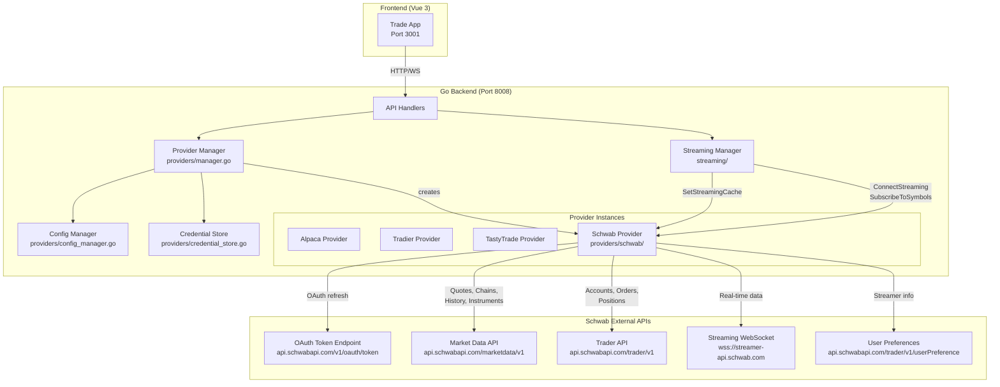
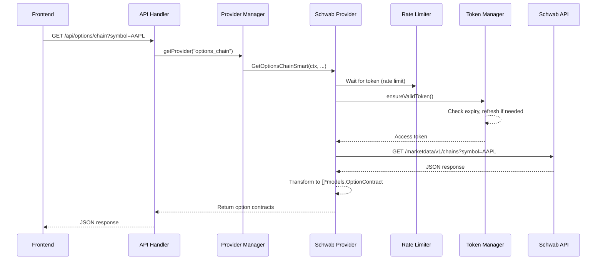
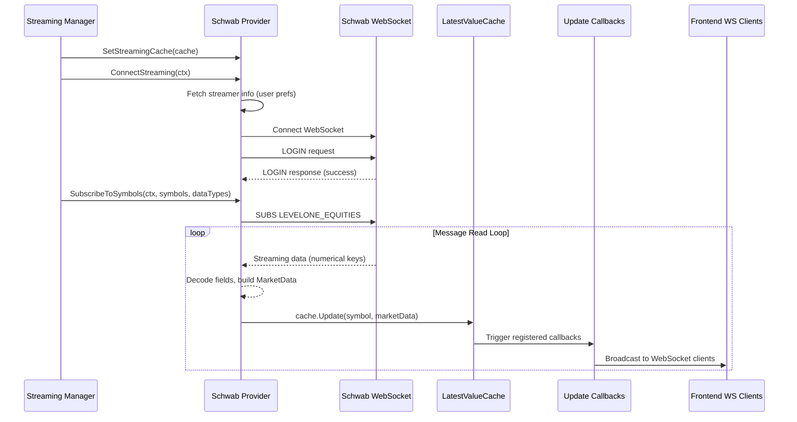
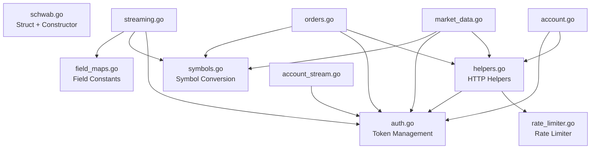
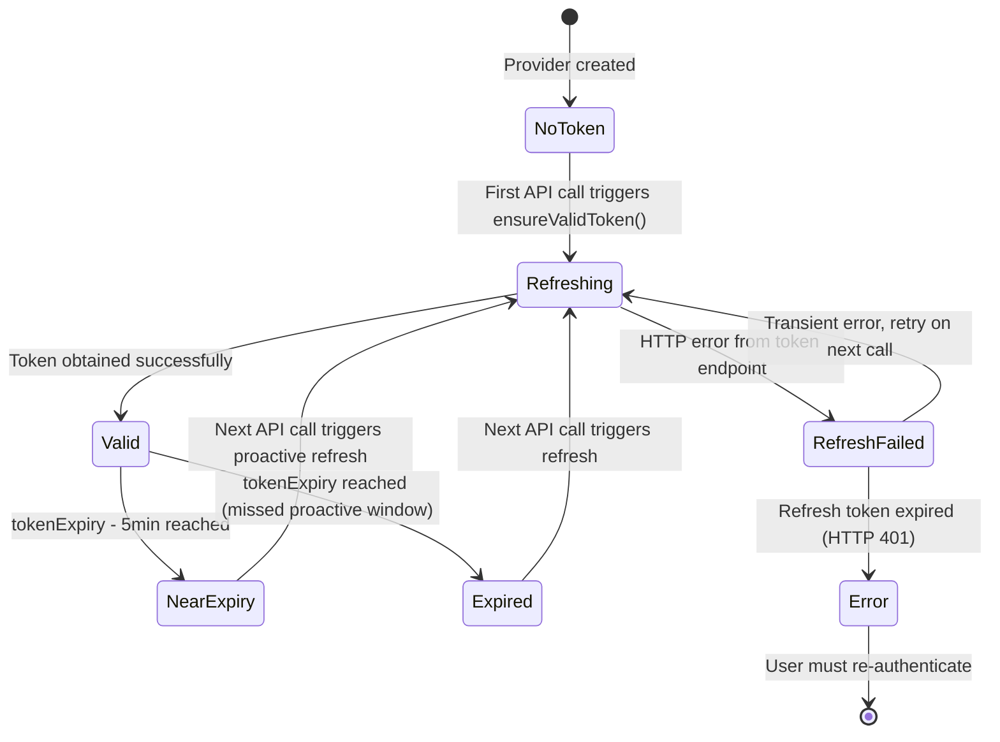
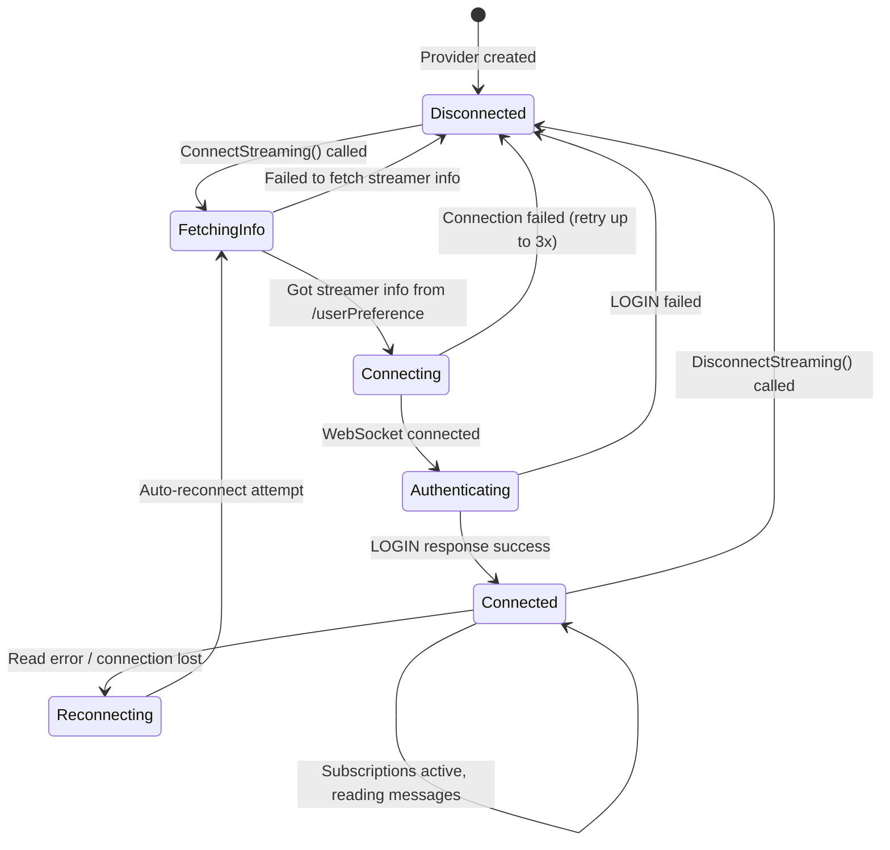
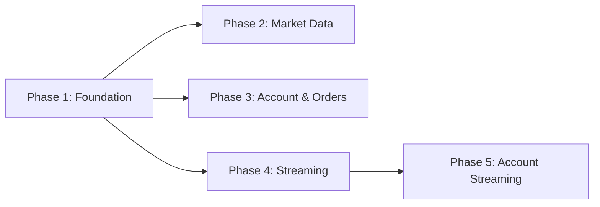

# Technical Architecture: Schwab Provider (Issue #20)

**Issue:** [#20 - TD Ameritrade as a Provider](https://github.com/schardosin/juicytrade/issues/20)
**Requirements:** [requirements.md](./requirements.md)
**Date:** 2025-07-15
**Status:** Draft

---

## Table of Contents

1. [Overview & Design Goals](#1-overview--design-goals)
2. [System Context & Integration Points](#2-system-context--integration-points)
3. [Package & File Structure](#3-package--file-structure)
4. [Struct Design & Type Definitions](#4-struct-design--type-definitions)
5. [Provider Registration & Factory Integration](#5-provider-registration--factory-integration)
6. [OAuth 2.0 Token Management](#6-oauth-20-token-management)
7. [REST Client Design](#7-rest-client-design)
8. [Rate Limiting Strategy](#8-rate-limiting-strategy)
9. [Data Transformation Layer](#9-data-transformation-layer)
10. [WebSocket Streaming Architecture](#10-websocket-streaming-architecture)
11. [Account Event Streaming](#11-account-event-streaming)
12. [Error Handling & Resilience Patterns](#12-error-handling--resilience-patterns)
13. [Paper Account (Sandbox) Support](#13-paper-account-sandbox-support)
14. [Implementation Guidance & Phasing](#14-implementation-guidance--phasing)
15. [Appendix: Schwab Streaming Field Maps](#15-appendix-schwab-streaming-field-maps)

---

## 1. Overview & Design Goals

### 1.1 Summary

This document describes the technical architecture for adding a **Schwab** (formerly TD Ameritrade) broker provider to JuicyTrade. The Schwab provider implements the full `base.Provider` interface (28 methods) and integrates with the existing provider manager, streaming manager, and frontend discovery system.

### 1.2 Design Principles

| Principle | Application |
|-----------|-------------|
| **Follow existing patterns** | The Schwab provider mirrors the structure of the existing TastyTrade and Tradier providers. Embedding `BaseProviderImpl`, using the same factory pattern, same streaming cache integration. |
| **Multi-file organization** | Unlike existing providers (single large file), the Schwab provider splits into focused files. The TastyTrade provider is 5,438 lines in one file — this is unwieldy. We split by responsibility. |
| **Thread-safe by default** | All mutable state (tokens, streaming connections, subscriptions) protected by `sync.RWMutex`. |
| **Fail gracefully** | Clear error messages for authentication failures, expired refresh tokens, rate limits, and unsupported operations. |
| **Zero frontend changes required** | The provider auto-registers via `provider_types.go` and appears in the UI through the dynamic `GET /api/providers/types` endpoint. Optional logo and about-section updates are non-blocking. |

### 1.3 Key Trade-offs

| Decision | Trade-off | Rationale |
|----------|-----------|-----------|
| **Multi-file split** vs single file | Deviates from existing single-file pattern (tastytrade.go, tradier.go) | A single file would exceed 4,000+ lines. Multiple focused files improve readability, testability, and allow parallel development. The package boundary (`providers/schwab/`) keeps it cohesive. |
| **No embedded OAuth browser flow** | Users must obtain refresh tokens externally | Matches TastyTrade's approach. Building a browser-based OAuth flow is complex and out of scope per customer approval. |
| **Client-side rate limiting** | May be overly conservative or insufficient | Schwab doesn't publish official limits. 120 req/min is based on community experience. The token bucket is configurable for easy adjustment. |
| **Proactive token refresh** vs on-demand | Slightly more complexity, slightly more API calls | Avoids request failures due to token expiry mid-flight. Matches TastyTrade's pattern (refresh 5 min before expiry). |
| **Schwab sandbox as "paper"** | Sandbox has known limitations | Customer explicitly approved this. We expose it with clear warnings rather than hiding it. |

---

## 2. System Context & Integration Points

### 2.1 Component Diagram



### 2.2 Integration Points

The Schwab provider integrates with the existing system at exactly **four** touch points — no other system changes are required for core functionality:

| # | Integration Point | File | Change Type |
|---|---|---|---|
| 1 | **Provider type registration** | `providers/provider_types.go` | Add `"schwab"` entry to `ProviderTypes` map |
| 2 | **Factory instantiation** | `providers/manager.go` | Add `case "schwab":` to `createProviderInstance()` switch |
| 3 | **Provider package** | `providers/schwab/*.go` | New package (all new files) |
| 4 | **Legacy capabilities** | `providers/provider_types.go` | Add `"schwab"` entry to `LegacyProviderCapabilities` |

Optional (non-blocking) frontend additions:
- `trade-app/public/logos/schwab.svg` — Logo file
- `ProvidersTab.vue`, `WizardStep2Providers.vue`, `WizardStep5Complete.vue` — Add `"schwab"` to `svgProviders` arrays
- `SettingsDialog.vue` — Update About section text

### 2.3 Data Flow — REST Request



### 2.4 Data Flow — Streaming



---

## 3. Package & File Structure

### 3.1 Rationale for Multi-File Split

The existing providers use a single-file approach:
- `tastytrade/tastytrade.go` — **5,438 lines**
- `tradier/tradier.go` — **3,857 lines**
- `alpaca/alpaca.go` — large single file

The Schwab provider would be similarly large in a single file. We split by responsibility to improve:
- **Readability** — Each file has a single concern
- **Testability** — Test files correspond to focused source files
- **Parallel development** — Multiple files can be worked on independently
- **Code review** — Smaller, focused diffs

### 3.2 File Map

```
trade-backend-go/internal/providers/schwab/
├── schwab.go              # Provider struct, constructor, TestCredentials, LookupSymbols
├── auth.go                # OAuth token management (refresh, mutex, token state)
├── market_data.go         # GetStockQuote(s), GetExpirationDates, GetOptionsChain*, GetOptionsGreeksBatch, GetHistoricalBars
├── account.go             # GetAccount, GetPositions, GetPositionsEnhanced, GetOrders
├── orders.go              # PlaceOrder, PlaceMultiLegOrder, PreviewOrder, CancelOrder
├── streaming.go           # ConnectStreaming, SubscribeToSymbols, UnsubscribeFromSymbols, DisconnectStreaming, message read loop
├── account_stream.go      # StartAccountStream, StopAccountStream, IsAccountStreamConnected, SetOrderEventCallback
├── symbols.go             # OCC ↔ Schwab option symbol conversion helpers
├── field_maps.go          # Streaming numerical field key → name mappings (constants)
├── helpers.go             # Shared HTTP helpers, response parsing, error extraction
├── rate_limiter.go        # Token bucket rate limiter
├── schwab_test.go         # Unit tests for constructor, TestCredentials, symbol conversion
├── market_data_test.go    # Unit tests for quote/chain/history transformations
├── account_test.go        # Unit tests for account/position transformations
├── orders_test.go         # Unit tests for order transformations
├── streaming_test.go      # Unit tests for streaming message decoding
└── auth_test.go           # Unit tests for token refresh logic
```

### 3.3 File Responsibilities

| File | Lines (est.) | Responsibility |
|------|-------------|----------------|
| `schwab.go` | ~250 | `SchwabProvider` struct definition, `NewSchwabProvider()` constructor, `TestCredentials()`, `LookupSymbols()`, `GetNextMarketDate()`. This is the entry point — it defines the struct that all other files' methods attach to. |
| `auth.go` | ~200 | Token state struct, `ensureValidToken()`, `refreshAccessToken()`, `tokenRefreshMutex` usage. Isolated so token logic can be tested independently. |
| `market_data.go` | ~600 | All market data methods: quotes, option chains, Greeks batch, historical bars, expiration dates. Largest file due to many data transformation functions. |
| `account.go` | ~300 | Account info, positions, enhanced positions. Parsing of Schwab account/position JSON into JuicyTrade models. |
| `orders.go` | ~350 | Order placement (single + multi-leg), cancel, preview. Schwab order JSON construction is verbose. |
| `streaming.go` | ~500 | WebSocket lifecycle, login handshake, subscription management, message read loop with numerical field decoding. Second largest file. |
| `account_stream.go` | ~150 | Account activity streaming. Separated from market streaming for clarity — different message format and callback pattern. |
| `symbols.go` | ~100 | `convertSchwabOptionToOCC()` and `convertOCCToSchwab()`. Small but critical — used by market_data.go, streaming.go, and orders.go. |
| `field_maps.go` | ~150 | `var equityFieldMap` and `var optionFieldMap` mapping `int → string`. Pure data, no logic. |
| `helpers.go` | ~200 | `doAuthenticatedRequest()`, `parseErrorResponse()`, `buildMarketDataURL()`, `buildTraderURL()`. Shared by all files that make HTTP calls. |
| `rate_limiter.go` | ~80 | Token bucket implementation with configurable rate. Used by `doAuthenticatedRequest()`. |

**Estimated total:** ~2,880 lines of source + ~1,500 lines of tests ≈ **4,380 lines** across all files.

### 3.4 Dependency Graph Between Files



All files are in the same Go package (`package schwab`) and share access to the `SchwabProvider` struct via method receivers. The dependency graph shows which files call functions/methods defined in other files.

---

## 4. Struct Design & Type Definitions

### 4.1 SchwabProvider Struct (schwab.go)

The main provider struct embeds `BaseProviderImpl` (matching TastyTrade/Tradier pattern) and adds Schwab-specific state for authentication, streaming, and account streaming.

```go
// SchwabProvider implements the base.Provider interface for Charles Schwab
// (formerly TD Ameritrade) brokerage accounts.
type SchwabProvider struct {
    *base.BaseProviderImpl

    // --- Configuration (immutable after construction) ---
    appKey       string // Schwab Developer Portal App Key (client_id)
    appSecret    string // Schwab Developer Portal Secret (client_secret)
    callbackURL  string // OAuth redirect URI
    refreshToken string // OAuth2 refresh token (long-lived, ~7 days)
    accountHash  string // Schwab account hash (not raw account number)
    baseURL      string // API base URL (production or sandbox)
    accountType  string // "live" or "paper"

    // --- OAuth Token State (protected by tokenMu) ---
    tokenMu       sync.Mutex
    accessToken   string
    tokenExpiry   time.Time

    // --- Rate Limiter ---
    rateLimiter *rateLimiter

    // --- Market Data Streaming State (protected by streamMu) ---
    streamMu         sync.RWMutex
    streamConn       *websocket.Conn
    streamCustomerID string // SchwabClientCustomerId from user preferences
    streamCorrelID   string // SchwabClientCorrelId from user preferences
    streamSocketURL  string // WebSocket URL from user preferences
    streamRequestID  int    // Auto-incrementing request ID for stream messages
    streamStopChan   chan struct{}
    streamDoneChan   chan struct{}

    // --- Account Event Streaming State (protected by acctStreamMu) ---
    acctStreamMu       sync.RWMutex
    acctStreamActive   bool
    orderEventCallback func(*models.OrderEvent)

    // --- Logger ---
    logger *slog.Logger
}
```

**Design notes:**
- **Immutable config fields** (top section) are set once in the constructor and never modified. No mutex needed.
- **Token state** uses `sync.Mutex` (not `RWMutex`) because token reads and writes are both short operations, and we want to ensure only one goroutine refreshes at a time. This matches the pattern where `ensureValidToken()` checks expiry and potentially refreshes — both under the same lock.
- **Streaming state** uses `sync.RWMutex` because the message read loop reads `streamConn` frequently, while connect/disconnect are infrequent writes.
- **Account streaming** shares the same WebSocket connection as market streaming (Schwab uses a single WebSocket for all services). The `acctStreamActive` flag tracks whether ACCT_ACTIVITY is subscribed.
- The `streamRequestID` is incremented for each request sent to the WebSocket. Schwab requires unique request IDs.

### 4.2 Comparison with Existing Providers

| Field Category | TastyTrade (22 fields) | Tradier (36 fields) | Schwab (design) |
|---|---|---|---|
| **Config** | accountID, baseURL, clientID, clientSecret, refreshToken, authCode, redirectURI | accountID, baseURL, accessToken | appKey, appSecret, callbackURL, refreshToken, accountHash, baseURL, accountType |
| **Token** | sessionToken, sessionExpires | (none — static token) | accessToken, tokenExpiry, tokenMu |
| **Market Stream** | wsConn, dxlinkToken, dxlinkURL, channel, keepaliveTimeout, stopChan, doneChan | wsConn, streamSessionID, streamStopChan, streamDoneChan | streamConn, streamCustomerID, streamCorrelID, streamSocketURL, streamRequestID, streamStopChan, streamDoneChan, streamMu |
| **Account Stream** | accountStreamConn, accountStreamLock, accountStreamStopChan, accountStreamDoneChan | accountStreamClient (separate struct) | acctStreamActive, acctStreamMu, orderEventCallback (shares market stream WebSocket) |
| **Rate Limit** | (none) | (none) | rateLimiter |

**Key difference: Single WebSocket for all services.** Unlike TastyTrade (separate DXLink WebSocket for market data, separate WebSocket for account stream) and Tradier (separate AccountStreamClient), Schwab uses a **single WebSocket connection** for all streaming services (LEVELONE_EQUITIES, LEVELONE_OPTIONS, ACCT_ACTIVITY). This simplifies connection management but means we must multiplex all subscriptions on one connection.

### 4.3 Constructor Signature (schwab.go)

```go
// NewSchwabProvider creates a new Schwab provider instance.
// Called by the provider manager's createProviderInstance() factory.
func NewSchwabProvider(
    appKey string,
    appSecret string,
    callbackURL string,
    refreshToken string,
    accountHash string,
    baseURL string,
    accountType string,
    name string,
) *SchwabProvider
```

The constructor:
1. Creates `BaseProviderImpl` with the provider name
2. Sets all config fields
3. Initializes the rate limiter (default: 120 requests/minute)
4. Creates `slog.Logger` with `"provider"` = `"schwab"` attribute
5. Does NOT authenticate — tokens are lazily obtained on first API call via `ensureValidToken()`

### 4.4 Supporting Types

#### Token Response (auth.go)

```go
// schwabTokenResponse represents the JSON response from the OAuth token endpoint.
type schwabTokenResponse struct {
    AccessToken  string `json:"access_token"`
    TokenType    string `json:"token_type"`
    ExpiresIn    int    `json:"expires_in"`    // seconds until expiry (~1800)
    RefreshToken string `json:"refresh_token"` // new refresh token (if rotated)
    Scope        string `json:"scope"`
    IDToken      string `json:"id_token"`
}
```

#### Streamer Info (streaming.go)

```go
// schwabStreamerInfo holds connection details from the user preferences endpoint.
type schwabStreamerInfo struct {
    StreamerSocketURL       string `json:"streamerSocketUrl"`
    SchwabClientCustomerID  string `json:"schwabClientCustomerId"`
    SchwabClientCorrelID    string `json:"schwabClientCorrelId"`
    SchwabClientChannel     string `json:"schwabClientChannel"`
    SchwabClientFunctionID  string `json:"schwabClientFunctionId"`
}
```

#### Streaming Request/Response (streaming.go)

```go
// schwabStreamRequest represents a message sent to the Schwab WebSocket.
type schwabStreamRequest struct {
    Requests []schwabStreamRequestItem `json:"requests"`
}

type schwabStreamRequestItem struct {
    RequestID              string                 `json:"requestid"`
    Service                string                 `json:"service"`
    Command                string                 `json:"command"`
    SchwabClientCustomerID string                 `json:"SchwabClientCustomerId"`
    SchwabClientCorrelID   string                 `json:"SchwabClientCorrelId"`
    Parameters             map[string]interface{} `json:"parameters"`
}

// schwabStreamResponse represents a message received from the Schwab WebSocket.
type schwabStreamResponse struct {
    Response []schwabStreamResponseItem `json:"response,omitempty"`
    Notify   []schwabStreamNotifyItem   `json:"notify,omitempty"`
    Data     []schwabStreamDataItem     `json:"data,omitempty"`
}

type schwabStreamResponseItem struct {
    Service   string                 `json:"service"`
    RequestID string                 `json:"requestid"`
    Command   string                 `json:"command"`
    Timestamp int64                  `json:"timestamp"`
    Content   map[string]interface{} `json:"content"`
}

type schwabStreamDataItem struct {
    Service   string                   `json:"service"`
    Timestamp int64                    `json:"timestamp"`
    Command   string                   `json:"command"`
    Content   []map[string]interface{} `json:"content"`
}

type schwabStreamNotifyItem struct {
    Heartbeat int64 `json:"heartbeat,omitempty"`
}
```

#### Rate Limiter (rate_limiter.go)

```go
// rateLimiter implements a simple token bucket rate limiter.
type rateLimiter struct {
    mu       sync.Mutex
    tokens   float64
    maxTokens float64
    refillRate float64   // tokens per second
    lastRefill time.Time
}
```

#### Schwab Order Request (orders.go)

```go
// schwabOrderRequest represents the JSON body for placing an order via the Schwab API.
type schwabOrderRequest struct {
    Session           string                `json:"session"`
    Duration          string                `json:"duration"`
    OrderType         string                `json:"orderType"`
    Price             float64               `json:"price,omitempty"`
    StopPrice         float64               `json:"stopPrice,omitempty"`
    OrderStrategyType string                `json:"orderStrategyType"`
    OrderLegCollection []schwabOrderLeg     `json:"orderLegCollection"`
}

type schwabOrderLeg struct {
    Instruction string           `json:"instruction"`
    Quantity    int              `json:"quantity"`
    Instrument  schwabInstrument `json:"instrument"`
}

type schwabInstrument struct {
    Symbol    string `json:"symbol"`
    AssetType string `json:"assetType"` // "EQUITY" or "OPTION"
}
```

---

## 5. Provider Registration & Factory Integration

### 5.1 Provider Type Registration (provider_types.go)

Add a new entry to the `ProviderTypes` map. This follows the exact pattern used by existing providers (TastyTrade, Tradier, Alpaca):

```go
"schwab": {
    Name:        "Schwab",
    Description: "Charles Schwab Trader API (formerly TD Ameritrade)",
    AccountTypes: []string{"live", "paper"},
    Capabilities: ProviderCapabilities{
        REST: []string{
            "stock_quotes",
            "options_chain",
            "trade_account",
            "symbol_lookup",
            "historical_data",
            "market_calendar",
            "greeks",
            "expiration_dates",
            "next_market_date",
        },
        Streaming: []string{
            "streaming_quotes",
            "streaming_greeks",
            "trade_account",
        },
    },
    CredentialFields: map[string][]CredentialField{
        "live": {
            {Name: "app_key", Label: "App Key", Type: "text", Required: true, HelpText: "Schwab Developer Portal App Key (client_id)"},
            {Name: "app_secret", Label: "App Secret", Type: "password", Required: true, HelpText: "Schwab Developer Portal Secret"},
            {Name: "callback_url", Label: "Callback URL", Type: "text", Required: true, Default: "https://127.0.0.1", HelpText: "OAuth redirect URI registered with Schwab"},
            {Name: "refresh_token", Label: "Refresh Token", Type: "password", Required: true, HelpText: "OAuth2 refresh token (expires ~7 days, must be re-obtained externally)"},
            {Name: "account_hash", Label: "Account Hash", Type: "text", Required: true, HelpText: "Account hash from /accounts/accountNumbers endpoint"},
            {Name: "base_url", Label: "Base URL", Type: "text", Required: false, Default: "https://api.schwabapi.com", HelpText: "Schwab API base URL"},
        },
        "paper": {
            {Name: "app_key", Label: "App Key", Type: "text", Required: true, HelpText: "Schwab Developer Portal App Key (client_id)"},
            {Name: "app_secret", Label: "App Secret", Type: "password", Required: true, HelpText: "Schwab Developer Portal Secret"},
            {Name: "callback_url", Label: "Callback URL", Type: "text", Required: true, Default: "https://127.0.0.1", HelpText: "OAuth redirect URI registered with Schwab"},
            {Name: "refresh_token", Label: "Refresh Token", Type: "password", Required: true, HelpText: "OAuth2 refresh token (expires ~7 days, must be re-obtained externally)"},
            {Name: "account_hash", Label: "Account Hash", Type: "text", Required: true, HelpText: "Account hash from /accounts/accountNumbers endpoint"},
            {Name: "base_url", Label: "Base URL", Type: "text", Required: false, Default: "https://api.schwabapi.com", HelpText: "Schwab sandbox API base URL (⚠️ Sandbox has known limitations: some order types may be rejected and behavior may be inconsistent)"},
        },
    },
},
```

**Note on paper vs. live credential fields:** The fields are identical. The difference is handled at runtime — when `accountType == "paper"`, the provider uses the sandbox base URL and adds a warning to `TestCredentials()` response. The `base_url` default could differ for paper if Schwab provides a separate sandbox URL; otherwise both default to the production URL (the sandbox behavior is controlled by the app registration on Schwab's developer portal, not by the URL).

### 5.2 Legacy Provider Capabilities (provider_types.go)

Add to the `LegacyProviderCapabilities` map:

```go
"schwab": {
    "stock_quotes":     true,
    "options_chain":    true,
    "trade_account":    true,
    "symbol_lookup":    true,
    "historical_data":  true,
    "market_calendar":  true,
    "greeks":           true,
    "streaming_quotes": true,
    "streaming_greeks": true,
    "expiration_dates": true,
    "next_market_date": true,
},
```

### 5.3 Factory Case (manager.go)

Add to the `createProviderInstance()` switch statement:

```go
case "schwab":
    appKey := getCredStr("app_key")
    appSecret := getCredStr("app_secret")
    callbackURL := getCredStr("callback_url")
    refreshToken := getCredStr("refresh_token")
    accountHash := getCredStr("account_hash")
    baseURL := getCredStr("base_url")
    if baseURL == "" {
        baseURL = "https://api.schwabapi.com"
    }
    accountType := instanceConfig.AccountType
    if accountType == "" {
        accountType = "live"
    }
    provider = schwab.NewSchwabProvider(
        appKey, appSecret, callbackURL, refreshToken,
        accountHash, baseURL, accountType, instanceConfig.Name,
    )
```

This follows the exact pattern used by the TastyTrade factory case: extract credentials from the map using a helper, apply defaults, and call the constructor.

### 5.4 Import Addition (manager.go)

Add the import for the new package:

```go
import (
    // ... existing imports ...
    "trade-backend-go/internal/providers/schwab"
)
```

---

## 6. OAuth 2.0 Token Management

### 6.1 Token Lifecycle

Schwab uses OAuth 2.0 Authorization Code flow with two token types:

| Token | Lifetime | Storage | Refresh Method |
|-------|----------|---------|----------------|
| **Access Token** | ~30 minutes | In-memory (`accessToken` field) | Auto-refreshed using refresh token |
| **Refresh Token** | ~7 days | Credential store (persistent) | Must be manually re-obtained by user |

The access token is the only token used for API requests. It is included as a `Bearer` token in the `Authorization` header. The refresh token is used exclusively to obtain new access tokens.

### 6.2 Token Refresh Flow



### 6.3 ensureValidToken() — Core Logic (auth.go)

```go
// ensureValidToken ensures the access token is valid, refreshing if necessary.
// Called before every API request. Thread-safe via tokenMu.
func (s *SchwabProvider) ensureValidToken() error {
    s.tokenMu.Lock()
    defer s.tokenMu.Unlock()

    // If token exists and won't expire for at least 5 minutes, use it
    if s.accessToken != "" && time.Until(s.tokenExpiry) > 5*time.Minute {
        return nil
    }

    // Token missing, expired, or about to expire — refresh it
    return s.refreshAccessToken()
}
```

**Key design decisions:**
- **Mutex scope:** The entire check-and-refresh is under a single `Lock()`. This ensures only one goroutine refreshes at a time. Concurrent callers block until the refresh completes, then all use the new token.
- **5-minute buffer:** Proactive refresh 5 minutes before expiry. With ~30-minute token lifetime, this means tokens are refreshed at ~25 minutes. This matches TastyTrade's approach.
- **No background timer:** Unlike an alternative design with a background goroutine, we refresh lazily on demand. This is simpler and avoids refreshing tokens for idle providers.

### 6.4 refreshAccessToken() — HTTP Call (auth.go)

```go
// refreshAccessToken exchanges the refresh token for a new access token.
// Must be called with tokenMu held.
func (s *SchwabProvider) refreshAccessToken() error {
    // 1. Build request to token endpoint
    //    POST https://api.schwabapi.com/v1/oauth/token
    //    Content-Type: application/x-www-form-urlencoded
    //    Authorization: Basic base64(appKey:appSecret)
    //    Body: grant_type=refresh_token&refresh_token=<token>

    // 2. Parse response into schwabTokenResponse

    // 3. Update in-memory state:
    //    s.accessToken = response.AccessToken
    //    s.tokenExpiry = time.Now().Add(time.Duration(response.ExpiresIn) * time.Second)

    // 4. If response includes a new refresh token (token rotation),
    //    log a warning — we cannot persist it back to credential store
    //    from here. This is a known limitation.

    // 5. Log token refresh at INFO level
}
```

**Token endpoint details:**
- **URL:** `{baseURL}/v1/oauth/token`
- **Method:** POST
- **Auth:** HTTP Basic with `appKey:appSecret` (Base64 encoded)
- **Body:** `grant_type=refresh_token&refresh_token={refreshToken}`
- **Response:** JSON with `access_token`, `expires_in`, `token_type`, optionally `refresh_token`

**Important:** The token refresh request does NOT go through the rate limiter or the `doAuthenticatedRequest()` helper — it uses a direct HTTP call with Basic auth (not Bearer). This avoids a circular dependency (rate limiter needs a token, but we're trying to get one).

### 6.5 Error Handling for Token Refresh

| HTTP Status | Meaning | Action |
|---|---|---|
| 200 | Success | Update token and expiry |
| 400 | Bad request (malformed) | Return error with details |
| 401 | Refresh token expired or invalid | Return `ErrRefreshTokenExpired` — user must re-authenticate |
| 500+ | Schwab server error | Return error; next API call will retry |

Define a sentinel error for expired refresh tokens:

```go
var ErrRefreshTokenExpired = fmt.Errorf("schwab: refresh token expired, user must re-authenticate at developer.schwab.com")
```

This error propagates up to the API handler and ultimately to the frontend, where it can be displayed to the user with instructions to update their refresh token.

### 6.6 TestCredentials() — Validation (schwab.go)

```go
// TestCredentials validates the stored credentials by:
// 1. Attempting to refresh the access token
// 2. Making a real API call to GET /trader/v1/accounts/accountNumbers
// 3. Verifying the accountHash matches one of the returned accounts
func (s *SchwabProvider) TestCredentials(ctx context.Context) (map[string]interface{}, error)
```

Returns:
- `{"success": true, "message": "Schwab credentials validated successfully"}` on success
- `{"success": true, "message": "⚠️ Schwab sandbox credentials validated. Note: sandbox has known limitations..."}` for paper accounts
- `{"success": false, "message": "...detailed error..."}` on failure

---

## 7. REST Client Design

### 7.1 Dual Base Path Architecture

Schwab separates its API into two base paths under the same domain:

| API Group | Base Path | Used For |
|---|---|---|
| **Market Data** | `{baseURL}/marketdata/v1` | Quotes, chains, history, instruments |
| **Trader** | `{baseURL}/trader/v1` | Accounts, orders, positions, preferences |

Both paths use the same access token for authentication.

### 7.2 URL Builder Helpers (helpers.go)

```go
// buildMarketDataURL constructs a URL for the market data API.
// Example: buildMarketDataURL("/quotes") → "https://api.schwabapi.com/marketdata/v1/quotes"
func (s *SchwabProvider) buildMarketDataURL(path string) string {
    return s.baseURL + "/marketdata/v1" + path
}

// buildTraderURL constructs a URL for the trader API.
// Example: buildTraderURL("/accounts/" + s.accountHash) → "https://api.schwabapi.com/trader/v1/accounts/ABC123"
func (s *SchwabProvider) buildTraderURL(path string) string {
    return s.baseURL + "/trader/v1" + path
}
```

### 7.3 Authenticated Request Helper (helpers.go)

All API calls (except token refresh) go through a centralized helper that handles authentication, rate limiting, and error parsing:

```go
// doAuthenticatedRequest performs an HTTP request with OAuth Bearer token,
// rate limiting, and standard error handling.
func (s *SchwabProvider) doAuthenticatedRequest(ctx context.Context, method, url string, body io.Reader) ([]byte, int, error) {
    // 1. Wait for rate limiter
    s.rateLimiter.wait()

    // 2. Ensure valid access token
    if err := s.ensureValidToken(); err != nil {
        return nil, 0, fmt.Errorf("authentication failed: %w", err)
    }

    // 3. Build HTTP request
    req, err := http.NewRequestWithContext(ctx, method, url, body)
    // Set headers:
    //   Authorization: Bearer {accessToken}
    //   Accept: application/json
    //   Content-Type: application/json (for POST/PUT)

    // 4. Execute request using utils.HTTPClient (shared client from codebase)
    resp, err := utils.HTTPClient.Do(req)

    // 5. Read response body

    // 6. Handle error status codes:
    //    - 401: Token may have expired mid-request → refresh and retry once
    //    - 429: Rate limited → log warning, return error (backoff handled by caller)
    //    - 400/403/404/500+: Parse error message from response body

    // 7. Return body bytes, status code, nil error
}
```

**Retry on 401:** If the API returns 401 (Unauthorized), it may mean the token expired between `ensureValidToken()` and the actual request (race condition with very short-lived tokens). In this case:
1. Force-refresh the token (ignore the 5-minute buffer)
2. Retry the request once
3. If the retry also fails, return the error

This single-retry pattern avoids infinite retry loops while handling the most common case.

### 7.4 Request/Response Pattern

All provider methods follow this pattern:

```go
func (s *SchwabProvider) GetStockQuote(ctx context.Context, symbol string) (*models.StockQuote, error) {
    // 1. Build URL
    url := s.buildMarketDataURL("/quotes?symbols=" + symbol)

    // 2. Make authenticated request
    body, statusCode, err := s.doAuthenticatedRequest(ctx, "GET", url, nil)
    if err != nil {
        return nil, fmt.Errorf("schwab: GetStockQuote failed: %w", err)
    }

    // 3. Parse JSON response
    var response map[string]interface{}
    if err := json.Unmarshal(body, &response); err != nil {
        return nil, fmt.Errorf("schwab: failed to parse quote response: %w", err)
    }

    // 4. Transform to JuicyTrade model
    quote := transformSchwabQuote(response, symbol)
    return quote, nil
}
```

### 7.5 Endpoint Map

| Method | HTTP | URL | Notes |
|---|---|---|---|
| `GetStockQuote` | GET | `/marketdata/v1/quotes?symbols={sym}` | Single symbol |
| `GetStockQuotes` | GET | `/marketdata/v1/quotes?symbols={csv}` | Comma-separated |
| `GetExpirationDates` | GET | `/marketdata/v1/chains?symbol={sym}` | Extract dates from chain |
| `GetOptionsChainBasic` | GET | `/marketdata/v1/chains?symbol={sym}&fromDate={d}&toDate={d}&strikeCount={n}` | Without Greeks emphasis |
| `GetOptionsChainSmart` | GET | `/marketdata/v1/chains?symbol={sym}&fromDate={d}&toDate={d}&includeUnderlyingQuote=true` | With Greeks |
| `GetOptionsGreeksBatch` | GET | `/marketdata/v1/quotes?symbols={option_syms}` | Option quotes with Greeks |
| `GetHistoricalBars` | GET | `/marketdata/v1/pricehistory?symbol={sym}&periodType={pt}&frequencyType={ft}&frequency={f}` | OHLCV data |
| `GetAccount` | GET | `/trader/v1/accounts/{hash}?fields=positions` | Account + positions |
| `GetPositions` | GET | `/trader/v1/accounts/{hash}?fields=positions` | Extract positions |
| `GetOrders` | GET | `/trader/v1/accounts/{hash}/orders` | Filtered by status |
| `PlaceOrder` | POST | `/trader/v1/accounts/{hash}/orders` | JSON body |
| `PlaceMultiLegOrder` | POST | `/trader/v1/accounts/{hash}/orders` | Multi-leg JSON |
| `CancelOrder` | DELETE | `/trader/v1/accounts/{hash}/orders/{id}` | |
| `LookupSymbols` | GET | `/marketdata/v1/instruments?symbol={q}&projection=symbol-search` | |
| `TestCredentials` | GET | `/trader/v1/accounts/accountNumbers` | Validation |
| Streamer Info | GET | `/trader/v1/userPreference` | For streaming setup |

---

## 8. Rate Limiting Strategy

### 8.1 Approach: Token Bucket

Schwab does not publish official rate limits. Community experience suggests approximately **120 requests per minute** before throttling. We implement a **token bucket** rate limiter:

| Parameter | Value | Rationale |
|-----------|-------|-----------|
| **Max tokens** | 120 | 120 requests burst capacity |
| **Refill rate** | 2.0 tokens/second | 120 tokens/minute sustained rate |
| **Wait behavior** | Block until token available | Simple, predictable backpressure |

### 8.2 Implementation (rate_limiter.go)

```go
// newRateLimiter creates a token bucket rate limiter.
func newRateLimiter(maxTokens float64, refillRate float64) *rateLimiter {
    return &rateLimiter{
        tokens:     maxTokens,
        maxTokens:  maxTokens,
        refillRate: refillRate,
        lastRefill: time.Now(),
    }
}

// wait blocks until a token is available, then consumes one.
func (rl *rateLimiter) wait() {
    for {
        rl.mu.Lock()
        // Refill tokens based on elapsed time
        now := time.Now()
        elapsed := now.Sub(rl.lastRefill).Seconds()
        rl.tokens = math.Min(rl.maxTokens, rl.tokens+elapsed*rl.refillRate)
        rl.lastRefill = now

        if rl.tokens >= 1.0 {
            rl.tokens -= 1.0
            rl.mu.Unlock()
            return
        }
        rl.mu.Unlock()

        // No tokens available — sleep briefly and retry
        time.Sleep(50 * time.Millisecond)
    }
}
```

### 8.3 HTTP 429 Handling

If Schwab returns HTTP 429 (Too Many Requests) despite client-side limiting, the `doAuthenticatedRequest()` helper:

1. Logs a warning: `"schwab: rate limited by server (HTTP 429)"`
2. Returns the error to the caller
3. Does NOT automatically retry — the caller (API handler) decides how to handle it

The streaming manager's health check will detect stale data and can reconnect if rate limiting caused streaming disruptions.

### 8.4 Exclusions from Rate Limiting

The following requests are **NOT** rate limited:
- **Token refresh** (`refreshAccessToken()`) — Uses Basic auth, separate endpoint, critical for operation
- **WebSocket messages** — WebSocket is a persistent connection, not subject to REST rate limits

---

## 9. Data Transformation Layer

### 9.1 Overview

Every Schwab API response must be transformed into JuicyTrade's internal model types before returning to callers. The transformation layer is implemented as private helper functions within each file (e.g., `transformSchwabQuote()` in `market_data.go`).

**Key principle:** All transformation functions are **pure functions** — they take raw JSON data (as `map[string]interface{}`) and return typed model structs. No side effects, no API calls, no mutex access. This makes them trivially testable.

### 9.2 Stock Quote Transformation (market_data.go)

Schwab quote response → `*models.StockQuote`:

| Schwab Field | JuicyTrade Field | Type |
|---|---|---|
| `bidPrice` | `Bid` | float64 |
| `askPrice` | `Ask` | float64 |
| `lastPrice` | `Last` | float64 |
| `quoteTimeInLong` / `tradeTimeInLong` | `Timestamp` | string (ISO 8601) |
| (key from request) | `Symbol` | string |

### 9.3 Option Chain Transformation (market_data.go)

Schwab chains response → `[]*models.OptionContract`:

The Schwab option chain response organizes contracts by expiration date and strike price in a nested structure:
```json
{
  "callExpDateMap": {
    "2025-01-17:180": {
      "150.0": [{ "putCall": "CALL", "symbol": "AAPL  250117C00150000", ... }]
    }
  },
  "putExpDateMap": { ... }
}
```

Transformation steps:
1. Iterate `callExpDateMap` and `putExpDateMap`
2. For each contract, extract: symbol, strike, bid, ask, last, volume, open interest, expiry date, option type
3. Convert Schwab option symbol to OCC format using `convertSchwabOptionToOCC()`
4. If `includeGreeks` is true, also extract: delta, gamma, theta, vega, rho, implied volatility
5. Build `*models.OptionContract` for each

### 9.4 Position Transformation (account.go)

Schwab positions → `[]*models.Position`:

| Schwab Field | JuicyTrade Field | Notes |
|---|---|---|
| `instrument.symbol` | `Symbol` | Convert option symbols to OCC format |
| `instrument.assetType` | `AssetClass` | `"EQUITY"` → `"us_equity"`, `"OPTION"` → `"us_option"` |
| `longQuantity` - `shortQuantity` | `Quantity` | Net quantity |
| `averagePrice` | `AverageEntryPrice` | |
| `marketValue` | `MarketValue` | |
| `currentDayProfitLoss` | `UnrealizedPL` | |
| `currentDayProfitLossPercentage` | `UnrealizedPLPercent` | |

For option positions, additionally parse from the OCC symbol:
- Underlying symbol
- Option type (call/put)
- Strike price
- Expiration date

### 9.5 Order Transformation (orders.go)

**Outbound (JuicyTrade → Schwab):**

| JuicyTrade Order Field | Schwab Order Field |
|---|---|
| `side`: `"buy"` | `instruction`: `"BUY"` (equity) or `"BUY_TO_OPEN"` (option) |
| `side`: `"sell"` | `instruction`: `"SELL"` (equity) or `"SELL_TO_CLOSE"` (option) |
| `type`: `"market"` | `orderType`: `"MARKET"` |
| `type`: `"limit"` | `orderType`: `"LIMIT"` |
| `duration`: `"day"` | `duration`: `"DAY"` |
| `duration`: `"gtc"` | `duration`: `"GOOD_TILL_CANCEL"` |

For multi-leg orders, each leg maps to a `schwabOrderLeg` entry with the appropriate instruction (`BUY_TO_OPEN`, `SELL_TO_OPEN`, `BUY_TO_CLOSE`, `SELL_TO_CLOSE`).

**Inbound (Schwab → JuicyTrade):**

Parse order from `GET /orders` response into `*models.Order`, extracting:
- Order ID (from response or URL)
- Status mapping: `"WORKING"` → `"open"`, `"FILLED"` → `"filled"`, `"CANCELED"` → `"canceled"`, etc.
- Legs with symbol, side, quantity, fill price
- Timestamps

### 9.6 Historical Bars Transformation (market_data.go)

Schwab price history → `[]map[string]interface{}`:

| Schwab Candle Field | JuicyTrade Field |
|---|---|
| `open` | `open` |
| `high` | `high` |
| `low` | `low` |
| `close` | `close` |
| `volume` | `volume` |
| `datetime` | `timestamp` (convert epoch ms → ISO 8601) |

Timeframe mapping for the request:

| JuicyTrade Timeframe | Schwab `frequencyType` | Schwab `frequency` |
|---|---|---|
| `"1min"` | `minute` | `1` |
| `"5min"` | `minute` | `5` |
| `"15min"` | `minute` | `15` |
| `"30min"` | `minute` | `30` |
| `"1D"` / `"daily"` | `daily` | `1` |
| `"1W"` / `"weekly"` | `weekly` | `1` |

### 9.7 Option Symbol Conversion (symbols.go)

Bidirectional conversion between Schwab format and standard OCC format:

**OCC Format:** `AAPL250117C00150000` (no spaces, 8-digit padded strike × 1000)
- Chars 1-6: Underlying symbol (left-padded with spaces in some formats, but OCC standard is no padding)
- Chars 7-12: Date as YYMMDD
- Char 13: `C` or `P`
- Chars 14-21: Strike price × 1000, zero-padded to 8 digits

**Schwab Format:** `AAPL  250117C00150000` (may include spaces) or `.AAPL250117C150`

```go
// convertSchwabOptionToOCC converts a Schwab option symbol to standard OCC format.
// Handles both space-padded format and dot-prefix format.
func convertSchwabOptionToOCC(schwabSymbol string) string

// convertOCCToSchwab converts a standard OCC option symbol to Schwab's expected format.
func convertOCCToSchwab(occSymbol string) string
```

**Test cases (critical):**
- `"AAPL  250117C00150000"` → `"AAPL250117C00150000"`
- `".AAPL250117C150"` → `"AAPL250117C00150000"`
- `"AAPL250117C00150000"` → `"AAPL  250117C00150000"` (reverse)
- `"SPY   250321P00500000"` → `"SPY250321P00500000"`
- Edge: single-character underlying like `"F"`, long underlying like `"GOOGL"`

### 9.8 Streaming Data Transformation (streaming.go)

Schwab streaming messages use **numerical field keys** that must be decoded. For example, a LEVELONE_EQUITIES data message:

```json
{"service":"LEVELONE_EQUITIES","timestamp":1715908546054,"command":"SUBS",
 "content":[{"key":"AAPL","1":187.44,"2":187.45,"3":187.42,"8":52341234}]}
```

The `"1"`, `"2"`, `"3"` keys map to `BID_PRICE`, `ASK_PRICE`, `LAST_PRICE` via `equityFieldMap`. After decoding, the data is transformed into `*models.MarketData`:

**For equity quotes (DataType: `"quote"`):**

```go
marketData := &models.MarketData{
    Symbol:   symbol, // from "key" field
    DataType: "quote",
    Data: map[string]interface{}{
        "bid":      decodedFields["BID_PRICE"],
        "ask":      decodedFields["ASK_PRICE"],
        "last":     decodedFields["LAST_PRICE"],
        "bid_size": decodedFields["BID_SIZE"],
        "ask_size": decodedFields["ASK_SIZE"],
    },
}
```

**For option Greeks (DataType: `"greeks"`):**

```go
marketData := &models.MarketData{
    Symbol:   convertSchwabOptionToOCC(symbol),
    DataType: "greeks",
    Data: map[string]interface{}{
        "delta":              decodedFields["DELTA"],
        "gamma":              decodedFields["GAMMA"],
        "theta":              decodedFields["THETA"],
        "vega":               decodedFields["VEGA"],
        "implied_volatility": decodedFields["VOLATILITY"],
        "volume":             decodedFields["TOTAL_VOLUME"],
    },
}
```

The `Data` map keys (`"bid"`, `"ask"`, `"delta"`, etc.) MUST match what the frontend expects. These are standardized across all providers — see TastyTrade's `processFeedEvents()` for the canonical key names.

---

## 10. WebSocket Streaming Architecture

### 10.1 Connection Lifecycle



### 10.2 ConnectStreaming() — Step by Step (streaming.go)

1. **Fetch streamer info:** `GET /trader/v1/userPreference` → extract `streamerInfo` block containing WebSocket URL, customer ID, and correlation ID
2. **Store streamer metadata:** Save `streamSocketURL`, `streamCustomerID`, `streamCorrelID` on the provider struct
3. **Connect WebSocket:** Dial the `streamSocketURL` using `gorilla/websocket` with retry (3 attempts, exponential backoff: 1s, 2s, 4s)
4. **Send LOGIN request:**
   ```json
   {
     "requests": [{
       "requestid": "0",
       "service": "ADMIN",
       "command": "LOGIN",
       "SchwabClientCustomerId": "<customerID>",
       "SchwabClientCorrelId": "<correlID>",
       "parameters": {
         "Authorization": "<accessToken>",
         "SchwabClientChannel": "IO",
         "SchwabClientFunctionId": "Tradeticket"
       }
     }]
   }
   ```
5. **Wait for LOGIN response:** Read message, verify `response[0].content.code == 0` (success)
6. **Start message read loop:** Launch `go s.streamReadLoop()` goroutine
7. **Set state:** `s.IsConnected = true`, initialize `streamStopChan` and `streamDoneChan`

### 10.3 SubscribeToSymbols() (streaming.go)

Separates symbols into equity and option subscriptions based on symbol format (option symbols contain digits and C/P indicator):

```go
func (s *SchwabProvider) SubscribeToSymbols(ctx context.Context, symbols []string, dataTypes []string) error {
    equitySymbols, optionSymbols := classifySymbols(symbols)

    if len(equitySymbols) > 0 {
        s.sendSubscription("LEVELONE_EQUITIES", equitySymbols, equityFieldNumbers)
    }
    if len(optionSymbols) > 0 {
        schwabOptionSymbols := convertOCCSymbolsToSchwab(optionSymbols)
        s.sendSubscription("LEVELONE_OPTIONS", schwabOptionSymbols, optionFieldNumbers)
    }

    // Track in SubscribedSymbols map (inherited from BaseProviderImpl)
    for _, sym := range symbols {
        s.SubscribedSymbols[sym] = true
    }
    return nil
}
```

**Batching:** If subscribing to more than 50 symbols, batch into groups of 50 with 100ms delay between batches (same pattern as TastyTrade). This avoids overwhelming the stream.

### 10.4 Subscription Message Format

```json
{
  "requests": [{
    "requestid": "1",
    "service": "LEVELONE_EQUITIES",
    "command": "SUBS",
    "SchwabClientCustomerId": "<customerID>",
    "SchwabClientCorrelId": "<correlID>",
    "parameters": {
      "keys": "AAPL,MSFT,SPY",
      "fields": "0,1,2,3,4,5,8,10,11,12,15,24,28,29"
    }
  }]
}
```

Commands:
- `SUBS` — Subscribe (replaces existing subscriptions for this service)
- `ADD` — Add symbols to existing subscription
- `UNSUBS` — Unsubscribe symbols
- `VIEW` — Change which fields are returned

### 10.5 Message Read Loop — streamReadLoop() (streaming.go)

```go
func (s *SchwabProvider) streamReadLoop() {
    defer close(s.streamDoneChan)

    for {
        select {
        case <-s.streamStopChan:
            return
        default:
            // Set read deadline for stale connection detection (120 seconds)
            s.streamConn.SetReadDeadline(time.Now().Add(120 * time.Second))

            _, message, err := s.streamConn.ReadMessage()
            if err != nil {
                // Connection lost — log and attempt reconnection
                s.logger.Error("stream read error", "error", err)
                s.handleStreamDisconnect()
                return
            }

            // Update last data time for health monitoring
            s.LastDataTime = time.Now()

            // Parse and dispatch message
            var response schwabStreamResponse
            json.Unmarshal(message, &response)

            // Handle heartbeats (notify)
            for _, notify := range response.Notify {
                if notify.Heartbeat > 0 {
                    // Heartbeat received — connection is alive
                }
            }

            // Handle data messages
            for _, data := range response.Data {
                s.processStreamData(data)
            }

            // Handle responses (subscription confirmations, errors)
            for _, resp := range response.Response {
                s.processStreamResponse(resp)
            }
        }
    }
}
```

### 10.6 processStreamData() — Field Decoding (streaming.go)

```go
func (s *SchwabProvider) processStreamData(data schwabStreamDataItem) {
    var fieldMap map[int]string

    switch data.Service {
    case "LEVELONE_EQUITIES":
        fieldMap = equityFieldMap
    case "LEVELONE_OPTIONS":
        fieldMap = optionFieldMap
    case "ACCT_ACTIVITY":
        s.processAccountActivity(data)
        return
    default:
        return
    }

    for _, item := range data.Content {
        symbol := item["key"].(string)

        // Decode numerical keys to named fields
        decoded := make(map[string]interface{})
        for key, value := range item {
            if key == "key" {
                continue
            }
            if numKey, err := strconv.Atoi(key); err == nil {
                if name, ok := fieldMap[numKey]; ok {
                    decoded[name] = value
                }
            } else {
                // Already named (some fields come pre-decoded)
                decoded[key] = value
            }
        }

        // Build and dispatch MarketData
        s.dispatchMarketData(data.Service, symbol, decoded)
    }
}
```

### 10.7 Reconnection Strategy

On stream disconnect:
1. Log the disconnection reason
2. Set `s.IsConnected = false`
3. Wait 5 seconds
4. Attempt to reconnect (call `ConnectStreaming()` again)
5. If reconnected, re-subscribe to all symbols in `s.SubscribedSymbols`
6. Retry up to 5 times with exponential backoff (5s, 10s, 20s, 40s, 60s)
7. After 5 failures, stop retrying and log an error — the streaming manager's health check will detect the stale connection

### 10.8 DisconnectStreaming() (streaming.go)

1. Close `streamStopChan` to signal the read loop to stop
2. Wait for `streamDoneChan` to confirm the read loop exited
3. Send LOGOUT message to the WebSocket (best-effort)
4. Close the WebSocket connection
5. Set `s.IsConnected = false`
6. Clear `s.SubscribedSymbols`

---

## 11. Account Event Streaming

### 11.1 Design: Shared WebSocket

Unlike TastyTrade (separate WebSocket) and Tradier (separate `AccountStreamClient`), Schwab uses the **same WebSocket connection** for account activity as for market data. The `ACCT_ACTIVITY` service is just another subscription on the existing stream.

This means:
- `StartAccountStream()` does NOT open a new connection — it sends a SUBS message for `ACCT_ACTIVITY` on the existing `streamConn`
- The message read loop (`streamReadLoop()`) already handles all services, including `ACCT_ACTIVITY`
- If the market stream is not connected, `StartAccountStream()` must call `ConnectStreaming()` first

### 11.2 StartAccountStream() (account_stream.go)

```go
func (s *SchwabProvider) StartAccountStream(ctx context.Context) error {
    // Ensure market stream is connected (required for WebSocket)
    if !s.IsConnected {
        if err := s.ConnectStreaming(ctx); err != nil {
            return fmt.Errorf("schwab: cannot start account stream, streaming not connected: %w", err)
        }
    }

    // Subscribe to ACCT_ACTIVITY service
    s.sendSubscription("ACCT_ACTIVITY", nil, nil) // No keys or fields needed

    s.acctStreamMu.Lock()
    s.acctStreamActive = true
    s.acctStreamMu.Unlock()

    return nil
}
```

### 11.3 Account Activity Message Processing

When the read loop receives an `ACCT_ACTIVITY` data message:

```go
func (s *SchwabProvider) processAccountActivity(data schwabStreamDataItem) {
    s.acctStreamMu.RLock()
    callback := s.orderEventCallback
    active := s.acctStreamActive
    s.acctStreamMu.RUnlock()

    if !active || callback == nil {
        return
    }

    for _, item := range data.Content {
        // Parse account activity into OrderEvent
        event := &models.OrderEvent{
            // Map Schwab activity fields to normalized event
        }
        callback(event)
    }
}
```

### 11.4 SetOrderEventCallback() (account_stream.go)

```go
func (s *SchwabProvider) SetOrderEventCallback(callback func(*models.OrderEvent)) {
    s.acctStreamMu.Lock()
    defer s.acctStreamMu.Unlock()
    s.orderEventCallback = callback
}
```

### 11.5 StopAccountStream() / IsAccountStreamConnected() (account_stream.go)

```go
func (s *SchwabProvider) StopAccountStream() {
    // Send UNSUBS for ACCT_ACTIVITY
    s.sendUnsubscription("ACCT_ACTIVITY", nil)

    s.acctStreamMu.Lock()
    s.acctStreamActive = false
    s.acctStreamMu.Unlock()
}

func (s *SchwabProvider) IsAccountStreamConnected() bool {
    s.acctStreamMu.RLock()
    defer s.acctStreamMu.RUnlock()
    return s.acctStreamActive && s.IsConnected
}
```

---

## 12. Error Handling & Resilience Patterns

### 12.1 Error Classification

All errors from the Schwab provider are wrapped with the `"schwab: "` prefix for easy identification in logs and error messages.

| Error Category | Example | Handling |
|---|---|---|
| **Authentication** | Refresh token expired, invalid credentials | Return `ErrRefreshTokenExpired` sentinel; user must re-authenticate |
| **Rate Limiting** | HTTP 429 from Schwab | Log warning, return error to caller; client-side limiter prevents most cases |
| **Not Found** | Invalid symbol, account hash | Return descriptive error with the invalid value |
| **Server Error** | Schwab 5xx responses | Return error; caller may retry |
| **Network** | Connection timeout, DNS failure | Return error wrapped with context |
| **Parse Error** | Unexpected JSON structure | Log the raw response at DEBUG level, return error |
| **Streaming** | WebSocket read error, login failure | Trigger reconnection logic |
| **Unsupported** | PreviewOrder (no Schwab endpoint) | Return `fmt.Errorf("schwab: order preview not supported by Schwab API")` |

### 12.2 Logging Conventions

All logging uses `slog` (structured logging), consistent with Go best practices and the TastyTrade provider's direction:

```go
s.logger.Info("token refreshed", "expires_in", resp.ExpiresIn)
s.logger.Error("API request failed", "method", method, "url", url, "status", statusCode, "error", err)
s.logger.Warn("rate limited by server", "status", 429)
s.logger.Debug("raw response", "body", string(body))
```

Log levels:
- **INFO:** Token refresh, streaming connect/disconnect, subscription changes
- **WARN:** Rate limiting (429), near-expiry token refresh, unexpected but recoverable conditions
- **ERROR:** Failed API calls, authentication failures, streaming disconnects
- **DEBUG:** Raw HTTP responses (only when troubleshooting)

### 12.3 Error Response Parsing (helpers.go)

```go
// parseErrorResponse extracts a meaningful error message from a Schwab API error response.
// Schwab error responses may have different formats:
//   - {"error": "invalid_grant", "error_description": "Token expired"} (OAuth errors)
//   - {"errors": [{"id": "...", "status": 400, "title": "Bad Request", "detail": "..."}]} (API errors)
//   - Plain text error messages
func parseErrorResponse(body []byte, statusCode int) error
```

### 12.4 Graceful Degradation

If the Schwab API is temporarily unavailable:
- REST calls return errors immediately — no silent fallbacks
- Streaming disconnects trigger automatic reconnection (up to 5 retries)
- The streaming manager's health monitor detects stale data after 60 seconds and can trigger provider reconnection
- The `EnsureHealthyConnection()` interface (optional — checked via type assertion in the streaming manager) can be implemented to allow the streaming manager to proactively verify connection health before subscribing

---

## 13. Paper Account (Sandbox) Support

### 13.1 Implementation Approach

The Schwab sandbox is exposed as a `"paper"` account type per customer approval. The implementation is minimal:

1. **Account type stored:** The `accountType` field on `SchwabProvider` is set to `"paper"` when the user selects paper account type in the UI
2. **Same credentials:** The sandbox uses the same OAuth credentials and authentication flow as production — the sandbox behavior is determined by the Schwab developer app registration, not by a different URL
3. **Base URL:** The `base_url` credential field allows users to override the API base URL if Schwab ever provides a separate sandbox domain. By default, both live and paper use `https://api.schwabapi.com`
4. **Warning in TestCredentials:** When `accountType == "paper"`, `TestCredentials()` includes a warning message about sandbox limitations

### 13.2 Sandbox Limitations Warning

The following warning is included in `TestCredentials()` response and can be surfaced in the UI:

> ⚠️ Schwab sandbox/paper mode: This uses Schwab's sandbox environment which has known limitations. Some order types may be rejected, some asset classes may not work, and behavior may be inconsistent with production. Use for basic testing only.

### 13.3 No Code Branching

There is **no** behavioral difference in the provider code between live and paper — no `if accountType == "paper"` branching in API calls, streaming, or data transformation. The sandbox behaves identically to production from the API client's perspective (same endpoints, same auth). Any differences are server-side in Schwab's sandbox environment.

The only places `accountType` is checked:
- `TestCredentials()` — to add the warning message
- The provider type registration — to offer both `"live"` and `"paper"` account types in the UI

---

## 14. Implementation Guidance & Phasing

### 14.1 Recommended Implementation Order

The implementation should proceed in phases, each building on the previous one. Each phase produces a testable, committable increment.

#### Phase 1: Foundation (Priority: Critical)
**Files:** `schwab.go`, `auth.go`, `helpers.go`, `rate_limiter.go`, `symbols.go`, `field_maps.go`
**Changes to existing files:** `provider_types.go`, `manager.go`

- [ ] Define `SchwabProvider` struct and `NewSchwabProvider()` constructor
- [ ] Implement `refreshAccessToken()` and `ensureValidToken()` (OAuth token management)
- [ ] Implement `doAuthenticatedRequest()` (authenticated HTTP helper)
- [ ] Implement `buildMarketDataURL()` and `buildTraderURL()` (URL helpers)
- [ ] Implement token bucket rate limiter
- [ ] Implement `convertSchwabOptionToOCC()` and `convertOCCToSchwab()` (symbol conversion)
- [ ] Define streaming field maps (equityFieldMap, optionFieldMap)
- [ ] Register provider type in `provider_types.go`
- [ ] Add factory case in `manager.go`
- [ ] Implement `TestCredentials()`

**Verification:** Provider appears in `GET /api/providers/types`. User can add credentials and test them.

#### Phase 2: Market Data (Priority: High)
**Files:** `market_data.go`, `market_data_test.go`

- [ ] Implement `GetStockQuote()` and `GetStockQuotes()`
- [ ] Implement `GetExpirationDates()`
- [ ] Implement `GetOptionsChainBasic()` and `GetOptionsChainSmart()`
- [ ] Implement `GetOptionsGreeksBatch()`
- [ ] Implement `GetHistoricalBars()`
- [ ] Implement `GetNextMarketDate()` (business day calculation)
- [ ] Implement `LookupSymbols()`
- [ ] Write unit tests for all transformation functions

**Verification:** Can view stock quotes, option chains with Greeks, and historical charts using Schwab as data source.

#### Phase 3: Account & Orders (Priority: High)
**Files:** `account.go`, `orders.go`, `account_test.go`, `orders_test.go`

- [ ] Implement `GetAccount()`
- [ ] Implement `GetPositions()` and `GetPositionsEnhanced()`
- [ ] Implement `GetOrders()`
- [ ] Implement `PlaceOrder()` and `PlaceMultiLegOrder()`
- [ ] Implement `CancelOrder()`
- [ ] Implement `PreviewOrder()` (returns "not supported" indication)
- [ ] Write unit tests

**Verification:** Can view account info, positions, orders. Can place and cancel orders.

#### Phase 4: Streaming (Priority: Medium-High)
**Files:** `streaming.go`, `streaming_test.go`

- [ ] Implement `ConnectStreaming()` (fetch streamer info, WebSocket connect, LOGIN)
- [ ] Implement `SubscribeToSymbols()` and `UnsubscribeFromSymbols()`
- [ ] Implement `streamReadLoop()` with numerical field decoding
- [ ] Implement `processStreamData()` and `dispatchMarketData()`
- [ ] Implement `DisconnectStreaming()`
- [ ] Implement reconnection logic
- [ ] Write unit tests for message decoding

**Verification:** Real-time quotes and Greeks stream to the frontend.

#### Phase 5: Account Streaming & Polish (Priority: Medium)
**Files:** `account_stream.go`, `schwab_test.go`, `auth_test.go`

- [ ] Implement `StartAccountStream()`, `StopAccountStream()`, `IsAccountStreamConnected()`
- [ ] Implement `SetOrderEventCallback()` and account activity message processing
- [ ] Write remaining unit tests
- [ ] Add optional frontend enhancements (logo, about section)

**Verification:** Order fill notifications appear in real-time.

### 14.2 Dependencies Between Phases



Phases 2, 3, and 4 can proceed in parallel after Phase 1 is complete.

### 14.3 Estimated Complexity

| Phase | Files | Est. Lines | Complexity | Notes |
|-------|-------|-----------|------------|-------|
| 1 | 8 (6 new + 2 modified) | ~800 | Medium | OAuth and symbol conversion need careful testing |
| 2 | 2 | ~900 | Medium | Many transformation functions but straightforward |
| 3 | 4 | ~650 | Medium | Order JSON construction is verbose |
| 4 | 2 | ~700 | High | WebSocket protocol, field decoding, reconnection |
| 5 | 3 | ~400 | Low-Medium | Reuses existing WebSocket connection |
| **Total** | **17** | **~3,450** | | Plus ~1,500 lines of tests |

### 14.4 Testing Strategy

- **Unit tests** for all transformation functions (mocked HTTP responses)
- **Unit tests** for symbol conversion (table-driven with edge cases)
- **Unit tests** for token refresh logic (mock token endpoint)
- **Unit tests** for streaming message decoding (mock WebSocket messages)
- **Integration tests** (guarded by `SCHWAB_INTEGRATION_TEST=true` env var, skipped in CI):
  - Real token refresh with valid credentials
  - Real quote fetch
  - Real streaming connection
- **Regression test:** `go test ./...` must pass with no changes to existing tests

### 14.5 WebSocket Library

Use `github.com/gorilla/websocket` — this is already used by TastyTrade and Tradier providers. No new dependencies needed.

---

## 15. Appendix: Schwab Streaming Field Maps

### 15.1 LEVELONE_EQUITIES Fields (field_maps.go)

```go
var equityFieldMap = map[int]string{
    0:  "SYMBOL",
    1:  "BID_PRICE",
    2:  "ASK_PRICE",
    3:  "LAST_PRICE",
    4:  "BID_SIZE",
    5:  "ASK_SIZE",
    6:  "ASK_ID",
    7:  "BID_ID",
    8:  "TOTAL_VOLUME",
    9:  "LAST_SIZE",
    10: "HIGH_PRICE",
    11: "LOW_PRICE",
    12: "CLOSE_PRICE",
    13: "EXCHANGE_ID",
    14: "MARGINABLE",
    15: "DESCRIPTION",
    16: "LAST_ID",
    17: "OPEN_PRICE",
    18: "NET_CHANGE",
    19: "FIFTY_TWO_WEEK_HIGH",
    20: "FIFTY_TWO_WEEK_LOW",
    21: "PE_RATIO",
    22: "DIVIDEND_AMOUNT",
    23: "DIVIDEND_YIELD",
    24: "NAV",
    25: "EXCHANGE_NAME",
    26: "DIVIDEND_DATE",
    27: "IS_REGULAR_MARKET_QUOTE",
    28: "IS_REGULAR_MARKET_TRADE",
    29: "REGULAR_MARKET_LAST_PRICE",
    30: "REGULAR_MARKET_LAST_SIZE",
    31: "REGULAR_MARKET_NET_CHANGE",
    32: "SECURITY_STATUS",
    33: "MARK",
    34: "QUOTE_TIME_MILLIS",
    35: "TRADE_TIME_MILLIS",
    36: "REGULAR_MARKET_TRADE_TIME_MILLIS",
    37: "BID_TIME_MILLIS",
    38: "ASK_TIME_MILLIS",
    39: "ASK_MIC_ID",
    40: "BID_MIC_ID",
    41: "LAST_MIC_ID",
    42: "NET_CHANGE_PERCENT",
    43: "REGULAR_MARKET_NET_CHANGE_PERCENT",
    44: "MARK_CHANGE",
    45: "MARK_CHANGE_PERCENT",
    46: "HTB_QUANTITY",
    47: "HTB_RATE",
    48: "IS_HTB",
    49: "IS_SHORTABLE",
    50: "POST_MARKET_NET_CHANGE",
    51: "POST_MARKET_NET_CHANGE_PERCENT",
}
```

**Fields used for quote MarketData:** 1 (BID_PRICE), 2 (ASK_PRICE), 3 (LAST_PRICE), 4 (BID_SIZE), 5 (ASK_SIZE), 8 (TOTAL_VOLUME), 10 (HIGH_PRICE), 11 (LOW_PRICE), 12 (CLOSE_PRICE), 17 (OPEN_PRICE), 18 (NET_CHANGE), 33 (MARK), 34 (QUOTE_TIME_MILLIS), 35 (TRADE_TIME_MILLIS)

**Subscription field string:** `"0,1,2,3,4,5,8,10,11,12,17,18,33,34,35"`

### 15.2 LEVELONE_OPTIONS Fields (field_maps.go)

```go
var optionFieldMap = map[int]string{
    0:  "SYMBOL",
    1:  "DESCRIPTION",
    2:  "BID_PRICE",
    3:  "ASK_PRICE",
    4:  "LAST_PRICE",
    5:  "HIGH_PRICE",
    6:  "LOW_PRICE",
    7:  "CLOSE_PRICE",
    8:  "TOTAL_VOLUME",
    9:  "OPEN_INTEREST",
    10: "VOLATILITY",
    11: "MONEY_INTRINSIC_VALUE",
    12: "EXPIRATION_YEAR",
    13: "MULTIPLIER",
    14: "DIGITS",
    15: "OPEN_PRICE",
    16: "BID_SIZE",
    17: "ASK_SIZE",
    18: "LAST_SIZE",
    19: "NET_CHANGE",
    20: "STRIKE_TYPE",
    21: "CONTRACT_TYPE",
    22: "UNDERLYING",
    23: "EXPIRATION_MONTH",
    24: "DELIVERABLES",
    25: "TIME_VALUE",
    26: "EXPIRATION_DAY",
    27: "DAYS_TO_EXPIRATION",
    28: "DELTA",
    29: "GAMMA",
    30: "THETA",
    31: "VEGA",
    32: "RHO",
    33: "SECURITY_STATUS",
    34: "THEORETICAL_OPTION_VALUE",
    35: "UNDERLYING_PRICE",
    36: "UV_EXPIRATION_TYPE",
    37: "MARK",
    38: "QUOTE_TIME_MILLIS",
    39: "TRADE_TIME_MILLIS",
    40: "EXCHANGE_ID",
    41: "EXCHANGE_NAME",
    42: "LAST_TRADING_DAY",
    43: "SETTLEMENT_TYPE",
    44: "NET_CHANGE_PERCENT",
    45: "MARK_CHANGE",
    46: "MARK_CHANGE_PERCENT",
    47: "IMPLIED_YIELD",
    48: "IS_PENNY",
    49: "OPTION_ROOT",
    50: "FIFTY_TWO_WEEK_HIGH",
    51: "FIFTY_TWO_WEEK_LOW",
    52: "INDICATIVE_ASK_PRICE",
    53: "INDICATIVE_BID_PRICE",
    54: "INDICATIVE_QUOTE_TIME",
}
```

**Fields used for quote + greeks MarketData:** 0 (SYMBOL), 2 (BID_PRICE), 3 (ASK_PRICE), 4 (LAST_PRICE), 5 (HIGH_PRICE), 6 (LOW_PRICE), 7 (CLOSE_PRICE), 8 (TOTAL_VOLUME), 9 (OPEN_INTEREST), 10 (VOLATILITY), 15 (OPEN_PRICE), 19 (NET_CHANGE), 21 (CONTRACT_TYPE), 22 (UNDERLYING), 26 (EXPIRATION_DAY), 23 (EXPIRATION_MONTH), 12 (EXPIRATION_YEAR), 28 (DELTA), 29 (GAMMA), 30 (THETA), 31 (VEGA), 32 (RHO), 35 (UNDERLYING_PRICE), 37 (MARK)

**Subscription field string:** `"0,2,3,4,5,6,7,8,9,10,12,15,19,21,22,23,26,28,29,30,31,32,35,37"`

---

*End of architecture document.*
