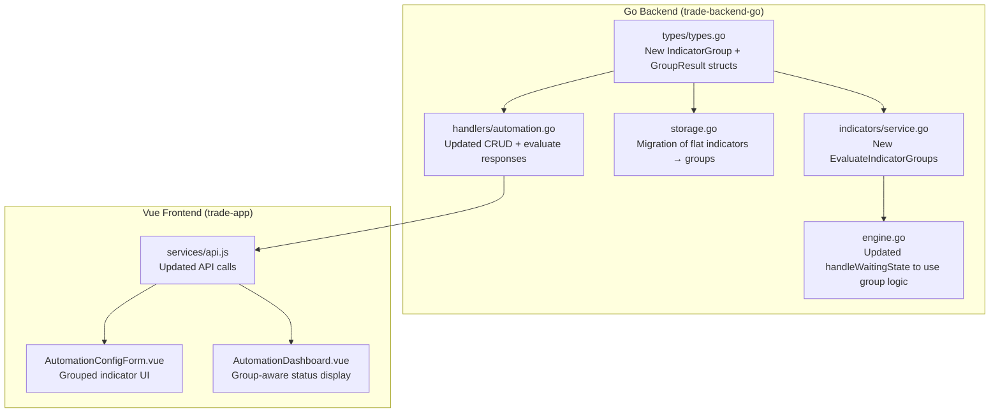
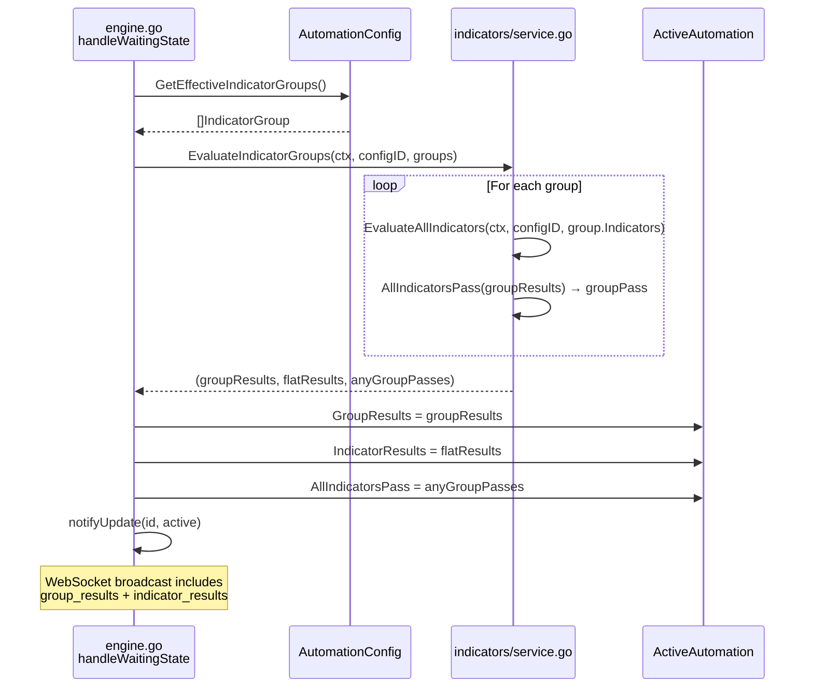
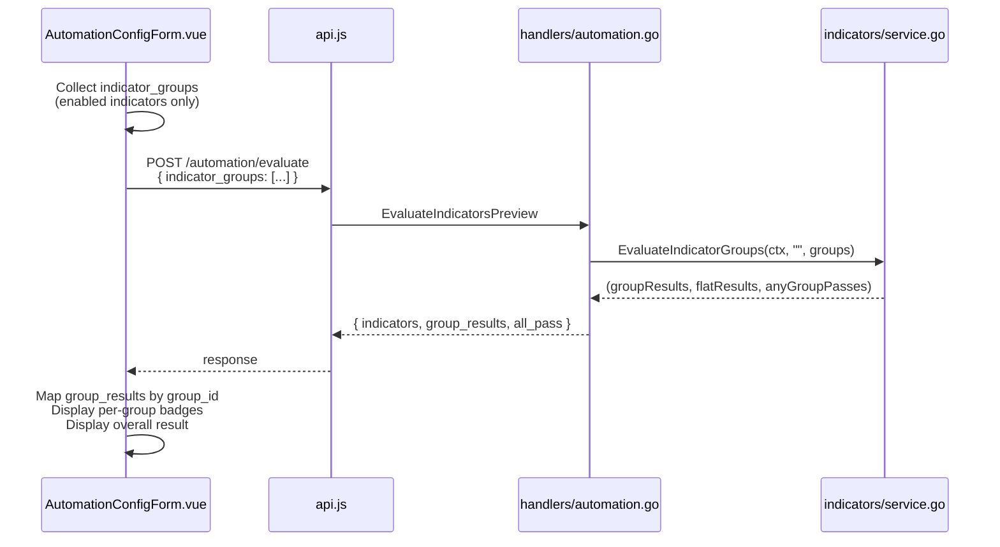
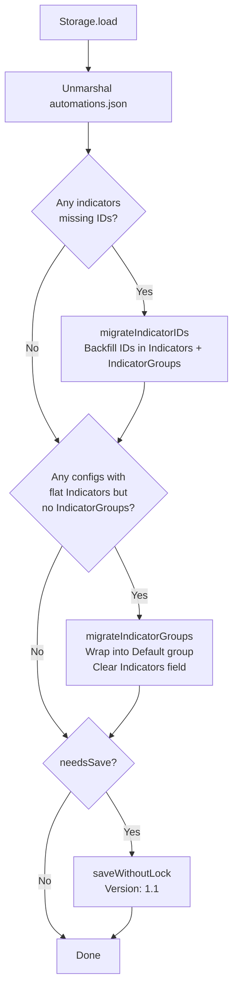

# Technical Architecture: Indicator Groups for Trade Automation

**Issue:** [#29 — Allow multiple combinations of indicators to enter a trade](https://github.com/schardosin/juicytrade/issues/29)
**Requirements:** [requirements.md](https://github.com/schardosin/juicytrade/blob/fleet/issue-29-allow-multiple-combinations-of-indicators-to-enter/docs/issue-29-allow-multiple-combinations-of-indicators-to-enter/requirements.md)
**Status:** Draft

---

## Table of Contents

1. [System Overview](#1-system-overview)
2. [Data Model Changes](#2-data-model-changes)
3. [Evaluation Logic Changes](#3-evaluation-logic-changes)
4. [Storage Migration](#4-storage-migration)
5. [API Changes](#5-api-changes)
6. [Frontend Data Flow](#6-frontend-data-flow)
7. [File Change Inventory](#7-file-change-inventory)
8. [Component Interaction Diagrams](#8-component-interaction-diagrams)
9. [Trade-offs & Decisions](#9-trade-offs--decisions)
10. [Testing Strategy](#10-testing-strategy)

---

## 1. System Overview

### Problem

Currently, `AutomationConfig` has a flat `indicators []IndicatorConfig` array. All enabled indicators are evaluated with AND logic — every one must pass for the automation to proceed. Users wanting the same trade under different market conditions (e.g., "low VIX + tight gap" OR "high VIX + wider gap") must create duplicate automation configs that differ only in indicator thresholds.

### Solution

Introduce **Indicator Groups** — an intermediate grouping layer between the automation config and individual indicators. Groups provide OR-of-AND evaluation:

- **Within a group:** AND logic (all enabled indicators must pass) — same as today
- **Between groups:** OR logic (any group passing = green light)

### Affected Components



The **strategy-service** (Python) and **strategy-simulation-go** are **not affected** — they have no involvement with the automation engine.

---

## 2. Data Model Changes

### 2.1 New Type: `IndicatorGroup`

**File:** `trade-backend-go/internal/automation/types/types.go`

```go
// IndicatorGroup represents a named group of indicators evaluated with AND logic.
// Multiple groups are evaluated with OR logic — if any group passes, the overall check passes.
type IndicatorGroup struct {
    ID         string            `json:"id"`         // Unique identifier (e.g., "grp_<timestamp>_<random>")
    Name       string            `json:"name"`       // User-defined display name (e.g., "Low VIX")
    Indicators []IndicatorConfig `json:"indicators"` // Indicators in this group (AND logic)
}
```

**ID generation** follows the existing pattern used for indicators:

```go
func GenerateGroupID() string {
    return fmt.Sprintf("grp_%d_%s", time.Now().UnixNano(), randomString(4))
}
```

### 2.2 New Type: `GroupResult`

**File:** `trade-backend-go/internal/automation/types/types.go`

```go
// GroupResult contains the evaluation result for a single indicator group.
type GroupResult struct {
    GroupID          string            `json:"group_id"`
    GroupName        string            `json:"group_name"`
    Pass             bool              `json:"pass"`              // True if all enabled indicators in this group pass (AND)
    IndicatorResults []IndicatorResult `json:"indicator_results"` // Results for indicators in this group
}
```

### 2.3 Changes to `AutomationConfig`

**File:** `trade-backend-go/internal/automation/types/types.go`

The existing `AutomationConfig` struct gains one new field. The legacy `Indicators` field is **retained** for JSON backward compatibility during migration but becomes empty once migrated.

```go
type AutomationConfig struct {
    ID              string             `json:"id"`
    Name            string             `json:"name"`
    Description     string             `json:"description,omitempty"`
    Symbol          string             `json:"symbol"`
    Indicators      []IndicatorConfig  `json:"indicators"`                 // LEGACY — empty after migration
    IndicatorGroups []IndicatorGroup   `json:"indicator_groups,omitempty"` // NEW — source of truth
    EntryTime       string             `json:"entry_time"`
    EntryTimezone   string             `json:"entry_timezone"`
    Enabled         bool               `json:"enabled"`
    Recurrence      RecurrenceMode     `json:"recurrence"`
    TradeConfig     TradeConfiguration `json:"trade_config"`
    Created         time.Time          `json:"created"`
    Updated         time.Time          `json:"updated"`
}
```

**Key design rule:** After migration, `IndicatorGroups` is the single source of truth. The `Indicators` field is kept as an empty slice `[]` in JSON for backward compatibility (older frontends that don't know about groups won't crash) but is never read by the engine.

### 2.4 Changes to `ActiveAutomation`

**File:** `trade-backend-go/internal/automation/types/types.go`

```go
type ActiveAutomation struct {
    Config            *AutomationConfig `json:"config"`
    Status            AutomationStatus  `json:"status"`
    IndicatorResults  []IndicatorResult `json:"indicator_results"`            // RETAINED — flat list of ALL results (backward compat)
    GroupResults      []GroupResult     `json:"group_results,omitempty"`      // NEW — per-group results
    AllIndicatorsPass bool              `json:"all_indicators_pass"`          // RETAINED — now reflects OR-of-groups
    PlacedOrders      []PlacedOrder     `json:"placed_orders"`
    CurrentOrder      *PlacedOrder      `json:"current_order,omitempty"`
    StartedAt         time.Time         `json:"started_at"`
    LastEvaluation    time.Time         `json:"last_evaluation"`
    NextAction        *time.Time        `json:"next_action,omitempty"`
    ErrorCount        int               `json:"error_count"`
    Logs              []AutomationLog   `json:"logs"`
    Message           string            `json:"message,omitempty"`
    TradedToday       bool              `json:"traded_today"`
    LastTradeDate     string            `json:"last_trade_date,omitempty"`
}
```

**Backward compatibility strategy for `ActiveAutomation`:**

| Field | Behavior |
|-------|----------|
| `indicator_results` | Flat list of ALL indicator results across ALL groups. Populated by concatenating each group's results. Existing dashboard code and any external consumers continue to work. |
| `group_results` | NEW. Array of `GroupResult` objects, one per group. Contains the group-level pass/fail and the per-group indicator results. |
| `all_indicators_pass` | Semantics change: now `true` if **any** group passes (OR logic). The field name is kept for backward compatibility — it still answers "should the automation proceed?" |

### 2.5 Helper: `GetEffectiveIndicatorGroups`

A helper method on `AutomationConfig` to centralize the logic of "what groups should the engine use":

```go
// GetEffectiveIndicatorGroups returns the indicator groups to evaluate.
// If IndicatorGroups is populated, use it directly.
// If only legacy Indicators is populated, wrap them in a single "Default" group.
// This allows in-memory backward compatibility without requiring migration to have run.
func (c *AutomationConfig) GetEffectiveIndicatorGroups() []IndicatorGroup {
    if len(c.IndicatorGroups) > 0 {
        return c.IndicatorGroups
    }
    if len(c.Indicators) > 0 {
        return []IndicatorGroup{
            {
                ID:         "default",
                Name:       "Default",
                Indicators: c.Indicators,
            },
        }
    }
    return []IndicatorGroup{}
}
```

### 2.6 JSON Storage Schema

**File:** `automations.json`

Before (v1.0):
```json
{
  "version": "1.0",
  "updated_at": "...",
  "configs": {
    "config-id-1": {
      "id": "config-id-1",
      "name": "NDX Put Spread",
      "indicators": [
        { "id": "ind_1", "type": "vix", "enabled": true, "operator": "lt", "threshold": 15 },
        { "id": "ind_2", "type": "gap", "enabled": true, "operator": "lt", "threshold": 0 }
      ],
      "indicator_groups": null,
      ...
    }
  }
}
```

After (v1.1):
```json
{
  "version": "1.1",
  "updated_at": "...",
  "configs": {
    "config-id-1": {
      "id": "config-id-1",
      "name": "NDX Put Spread",
      "indicators": [],
      "indicator_groups": [
        {
          "id": "grp_1",
          "name": "Default",
          "indicators": [
            { "id": "ind_1", "type": "vix", "enabled": true, "operator": "lt", "threshold": 15 },
            { "id": "ind_2", "type": "gap", "enabled": true, "operator": "lt", "threshold": 0 }
          ]
        }
      ],
      ...
    }
  }
}
```

---

## 3. Evaluation Logic Changes

### 3.1 Current Evaluation Flow

The current flow in `indicators/service.go` is straightforward:

1. **`EvaluateAllIndicators(ctx, configID, configs []IndicatorConfig)`** — iterates through each `IndicatorConfig` sequentially, calls `EvaluateIndicator` for each, returns a flat `[]IndicatorResult`.
2. **`AllIndicatorsPass(results []IndicatorResult)`** — pure AND gate: returns `false` if any enabled indicator is stale OR failing.
3. **`engine.go` `handleWaitingState`** — calls `EvaluateAllIndicators` with `config.Indicators`, stores results on `active.IndicatorResults`, calls `AllIndicatorsPass`, and proceeds to trading only when `isEntryTime && active.AllIndicatorsPass`.

### 3.2 New Evaluation Functions

One new function is added to `indicators/service.go`. The existing `EvaluateAllIndicators` and `AllIndicatorsPass` are **kept unchanged** (they still work for flat indicator lists and are reused internally).

#### `EvaluateIndicatorGroups`

```go
// EvaluateIndicatorGroups evaluates all indicator groups and returns per-group results.
// All groups are always evaluated (no short-circuit) so the dashboard shows the full picture.
// Returns: (groupResults, flatResults, anyGroupPasses)
func (s *Service) EvaluateIndicatorGroups(
    ctx context.Context,
    configID string,
    groups []types.IndicatorGroup,
) ([]types.GroupResult, []types.IndicatorResult, bool) {

    groupResults := make([]types.GroupResult, 0, len(groups))
    allFlatResults := make([]types.IndicatorResult, 0)
    anyGroupPasses := false

    for _, group := range groups {
        // Evaluate all indicators within this group (reuses existing function)
        indicatorResults := s.EvaluateAllIndicators(ctx, configID, group.Indicators)

        // Determine if this group passes (AND logic within group)
        groupPass := s.AllIndicatorsPass(indicatorResults)

        groupResults = append(groupResults, types.GroupResult{
            GroupID:          group.ID,
            GroupName:        group.Name,
            Pass:             groupPass,
            IndicatorResults: indicatorResults,
        })

        // Collect flat results for backward compatibility
        allFlatResults = append(allFlatResults, indicatorResults...)

        // OR logic across groups
        if groupPass {
            anyGroupPasses = true
        }
    }

    return groupResults, allFlatResults, anyGroupPasses
}
```

**Key design decisions:**
- **No short-circuit:** All groups are always evaluated even if the first group passes. This is required by FR-2.6 so the dashboard can show every group's status.
- **Reuses existing functions:** `EvaluateAllIndicators` and `AllIndicatorsPass` are called per-group, preserving all existing indicator behavior including stale-data handling.
- **Returns three values:** group results, flat results (backward compat), and the OR result.

### 3.3 Engine Changes (`engine.go`)

The `handleWaitingState` function is updated to use the new group-based evaluation:

**Before (current code, ~line 415-425):**
```go
results := e.indicatorService.EvaluateAllIndicators(ctx, id, config.Indicators)
active.IndicatorResults = results
active.AllIndicatorsPass = e.indicatorService.AllIndicatorsPass(results)
```

**After:**
```go
groups := config.GetEffectiveIndicatorGroups()
groupResults, flatResults, anyGroupPasses := e.indicatorService.EvaluateIndicatorGroups(ctx, id, groups)
active.GroupResults = groupResults
active.IndicatorResults = flatResults
active.AllIndicatorsPass = anyGroupPasses
```

The rest of `handleWaitingState` is unchanged — it still checks `isEntryTime && active.AllIndicatorsPass` to proceed to trading. The `AllIndicatorsPass` field now represents "any group passes" which is semantically correct for the trading decision.

### 3.4 Stale Data Handling

Stale data behavior is preserved naturally by the per-group evaluation:

| Scenario | Group Result | Overall Result |
|----------|-------------|---------------|
| Group A: all fresh, all pass | ✅ Pass | — |
| Group A: one indicator stale | ❌ Fail (stale = fail) | — |
| Group A passes, Group B has stale data | A: ✅, B: ❌ | ✅ (OR: A passes) |
| All groups have stale data | All: ❌ | ❌ (no group passes) |

This matches FR-2.4: "A group with any stale enabled indicator is treated as failing. Other groups with fresh data can still pass."

### 3.5 Empty/Disabled Group Handling

Per FR-2.3, a group with **no enabled indicators** is treated as "always passes" (vacuously true). This falls out naturally from the existing `AllIndicatorsPass` logic, which returns `true` when there are no enabled indicators to fail.

**Edge case — empty `indicator_groups` array:** If a config has `indicator_groups: []` (no groups at all), `anyGroupPasses` will be `false` (no groups to pass). This is correct — a config with no indicator groups should not auto-trade.

---

## 4. Storage Migration

### 4.1 Migration Strategy

The migration follows the same pattern as the existing `migrateIndicatorIDs` function in `storage.go`. It runs automatically during `load()` and saves the migrated data back to disk.

### 4.2 New Migration Function: `migrateIndicatorGroups`

**File:** `trade-backend-go/internal/automation/storage.go`

```go
// migrateIndicatorGroups migrates configs with flat indicators to use indicator_groups.
// For each config that has indicators but no indicator_groups, wraps the indicators
// into a single "Default" group.
// Returns true if any migrations were made.
func (s *Storage) migrateIndicatorGroups() bool {
    migrated := false

    for _, config := range s.configs {
        // Skip if already has indicator groups
        if len(config.IndicatorGroups) > 0 {
            continue
        }

        // Skip if no indicators to migrate
        if len(config.Indicators) == 0 {
            continue
        }

        // Migrate: wrap flat indicators into a single "Default" group
        config.IndicatorGroups = []types.IndicatorGroup{
            {
                ID:         types.GenerateGroupID(),
                Name:       "Default",
                Indicators: config.Indicators,
            },
        }

        // Clear legacy field
        config.Indicators = []types.IndicatorConfig{}

        slog.Info("Migrated indicators to group",
            "automation", config.Name,
            "groupName", "Default",
            "indicatorCount", len(config.IndicatorGroups[0].Indicators))
        migrated = true
    }

    return migrated
}
```

### 4.3 Integration into `load()`

The migration is chained with the existing `migrateIndicatorIDs` in the `load()` function:

```go
func (s *Storage) load() error {
    // ... existing unmarshal code ...

    needsSave := false

    // Existing migration: ensure all indicators have IDs
    if s.migrateIndicatorIDs() {
        needsSave = true
    }

    // New migration: wrap flat indicators into groups
    if s.migrateIndicatorGroups() {
        needsSave = true
    }

    if needsSave {
        if err := s.saveWithoutLock(); err != nil {
            slog.Warn("Failed to save migrated configs", "error", err)
        }
    }

    return nil
}
```

**Note on migration ordering:** `migrateIndicatorIDs` runs first to ensure all indicators have IDs before they're wrapped into groups. This is important because group evaluation uses indicator IDs for caching.

### 4.4 Version Bump

The `saveWithoutLock` function updates the version string:

```go
func (s *Storage) saveWithoutLock() error {
    storageData := StorageData{
        Version:   "1.1",    // Bumped from "1.0"
        UpdatedAt: time.Now(),
        Configs:   s.configs,
    }
    // ... rest unchanged ...
}
```

### 4.5 `migrateIndicatorIDs` Update

The existing `migrateIndicatorIDs` must also iterate through `IndicatorGroups` to backfill IDs for indicators within groups (in case a future code path creates groups with indicators missing IDs):

```go
func (s *Storage) migrateIndicatorIDs() bool {
    migrated := false

    for _, config := range s.configs {
        // Migrate legacy flat indicators (still needed for first-load before group migration)
        for i := range config.Indicators {
            if config.Indicators[i].ID == "" {
                config.Indicators[i].ID = types.GenerateIndicatorID()
                migrated = true
            }
        }

        // Also migrate indicators within groups
        for g := range config.IndicatorGroups {
            for i := range config.IndicatorGroups[g].Indicators {
                if config.IndicatorGroups[g].Indicators[i].ID == "" {
                    config.IndicatorGroups[g].Indicators[i].ID = types.GenerateIndicatorID()
                    migrated = true
                }
            }
        }
    }

    return migrated
}
```

---

## 5. API Changes

### 5.1 Overview

All existing automation API endpoints continue to work. The changes are additive — new fields in request/response bodies. No new endpoints are needed.

### 5.2 Config CRUD Endpoints

#### `POST /api/automation/configs` — Create Config

**Request body change:** Accepts optional `indicator_groups` field. If provided, the backend stores it as-is. If not provided (legacy client), the backend relies on migration at load time.

```json
{
  "name": "NDX Multi-Condition",
  "symbol": "NDX",
  "indicators": [],
  "indicator_groups": [
    {
      "id": "grp_abc123",
      "name": "Low VIX",
      "indicators": [
        { "id": "ind_1", "type": "vix", "enabled": true, "operator": "lt", "threshold": 15 },
        { "id": "ind_2", "type": "gap", "enabled": true, "operator": "lt", "threshold": 0 }
      ]
    },
    {
      "id": "grp_def456",
      "name": "High VIX",
      "indicators": [
        { "id": "ind_3", "type": "vix", "enabled": true, "operator": "gt", "threshold": 20 },
        { "id": "ind_4", "type": "gap", "enabled": true, "operator": "lt", "threshold": 1 }
      ]
    }
  ],
  "entry_time": "12:25",
  "entry_timezone": "America/New_York",
  "trade_config": { ... }
}
```

**Response:** Returns the saved config with `indicator_groups` populated.

**Handler change (`handlers/automation.go` `CreateConfig`):** The current handler builds a default config with `NewAutomationConfig()` which initializes `Indicators: []IndicatorConfig{}`. Update `NewAutomationConfig` to also initialize `IndicatorGroups: []IndicatorGroup{}`. When the request body is bound, the `indicator_groups` field will be populated from JSON.

#### `PUT /api/automation/configs/:id` — Update Config

Same as create — the request body includes `indicator_groups`. The handler already binds the full config from JSON and saves it.

#### `GET /api/automation/configs` and `GET /api/automation/configs/:id`

**Response change:** Now includes `indicator_groups` field in each config. The `indicators` field will be an empty array `[]` for migrated configs.

No handler code changes needed — the response serializes the `AutomationConfig` struct which now includes the new field.

### 5.3 Evaluate Indicators Endpoints

#### `POST /api/automation/:id/evaluate` — Evaluate Saved Config

**Current response:**
```json
{
  "success": true,
  "data": {
    "indicators": [ ... ],
    "all_pass": true,
    "symbol": "NDX"
  }
}
```

**New response:**
```json
{
  "success": true,
  "data": {
    "indicators": [ ... ],
    "group_results": [
      {
        "group_id": "grp_abc123",
        "group_name": "Low VIX",
        "pass": true,
        "indicator_results": [ ... ]
      },
      {
        "group_id": "grp_def456",
        "group_name": "High VIX",
        "pass": false,
        "indicator_results": [ ... ]
      }
    ],
    "all_pass": true,
    "symbol": "NDX"
  }
}
```

**Handler change:** Instead of calling `EvaluateAllIndicators` with `config.Indicators`, call `EvaluateIndicatorGroups` with `config.GetEffectiveIndicatorGroups()`:

```go
// Before:
results := h.engine.GetIndicatorService().EvaluateAllIndicators(ctx, id, config.Indicators)
allPass := h.engine.GetIndicatorService().AllIndicatorsPass(results)

// After:
groups := config.GetEffectiveIndicatorGroups()
groupResults, flatResults, anyGroupPasses := h.engine.GetIndicatorService().EvaluateIndicatorGroups(ctx, id, groups)

c.JSON(http.StatusOK, gin.H{
    "success": true,
    "data": gin.H{
        "indicators":    flatResults,       // backward compat
        "group_results": groupResults,      // new
        "all_pass":      anyGroupPasses,    // OR-of-groups
        "symbol":        config.Symbol,
    },
})
```

#### `POST /api/automation/evaluate` — Evaluate Preview (Unsaved)

**Current behavior:** Accepts a `{ "indicators": [...] }` body and evaluates the flat list.

**New behavior:** Accept either format:
- `{ "indicator_groups": [...] }` — new format, evaluate as groups
- `{ "indicators": [...] }` — legacy format, wrap in a single "Default" group

**Handler change:**

```go
func (h *AutomationHandler) EvaluateIndicatorsPreview(c *gin.Context) {
    var body struct {
        Indicators      []types.IndicatorConfig `json:"indicators"`
        IndicatorGroups []types.IndicatorGroup  `json:"indicator_groups"`
    }
    if err := c.ShouldBindJSON(&body); err != nil {
        // ... error handling ...
    }

    // Determine groups to evaluate
    var groups []types.IndicatorGroup
    if len(body.IndicatorGroups) > 0 {
        groups = body.IndicatorGroups
    } else if len(body.Indicators) > 0 {
        groups = []types.IndicatorGroup{
            {ID: "preview_default", Name: "Default", Indicators: body.Indicators},
        }
    } else {
        // ... default indicators fallback (existing behavior) ...
    }

    groupResults, flatResults, anyGroupPasses := h.engine.GetIndicatorService().EvaluateIndicatorGroups(
        c.Request.Context(), "", groups)

    c.JSON(http.StatusOK, gin.H{
        "success": true,
        "data": gin.H{
            "indicators":    flatResults,
            "group_results": groupResults,
            "all_pass":      anyGroupPasses,
        },
    })
}
```

### 5.4 WebSocket Broadcast

**Current broadcast structure** (constructed in `cmd/server/main.go` callback):

```go
updateData := map[string]interface{}{
    "status":              automation.Status,
    "message":             automation.Message,
    "indicator_results":   automation.IndicatorResults,
    "all_indicators_pass": automation.AllIndicatorsPass,
    "current_order":       automation.CurrentOrder,
    "placed_orders":       automation.PlacedOrders,
    "error_count":         automation.ErrorCount,
    "started_at":          automation.StartedAt,
    "last_evaluation":     automation.LastEvaluation,
    "logs":                automation.Logs,
}
```

**Change:** Add `group_results` to the broadcast map:

```go
updateData := map[string]interface{}{
    // ... all existing fields ...
    "group_results":       automation.GroupResults,       // NEW
}
```

The WebSocket message format remains:
```json
{
  "type": "automation_update",
  "automation_id": "config-id-1",
  "data": {
    "status": "waiting",
    "indicator_results": [ ... ],
    "group_results": [ ... ],
    "all_indicators_pass": true,
    ...
  },
  "timestamp": "..."
}
```

**No changes to `webSocketClient.js` or `BroadcastAutomationUpdate`** — they are generic message forwarders that pass the data map through unchanged.

---

## 6. Frontend Data Flow

### 6.1 Overview

The frontend changes are concentrated in two components — the config form and the dashboard. The API service (`api.js`) needs minimal changes since it already passes request/response data through generically. No new composables or stores are needed.

### 6.2 `AutomationConfigForm.vue` — Config Form Changes

This is the largest frontend change. The current form manages indicators as a flat array (`config.indicators`). It must be restructured to manage `config.indicator_groups`.

#### 6.2.1 Data Model in the Form

**Current local state:**
```js
config.indicators = [
  { id: 'ind_1', type: 'vix', enabled: true, operator: 'lt', threshold: 15, ... },
  { id: 'ind_2', type: 'gap', enabled: true, operator: 'lt', threshold: 0, ... },
]
```

**New local state:**
```js
config.indicator_groups = [
  {
    id: 'grp_abc123',
    name: 'Low VIX',
    indicators: [
      { id: 'ind_1', type: 'vix', enabled: true, operator: 'lt', threshold: 15, ... },
      { id: 'ind_2', type: 'gap', enabled: true, operator: 'lt', threshold: 0, ... },
    ]
  },
  {
    id: 'grp_def456',
    name: 'High VIX',
    indicators: [
      { id: 'ind_3', type: 'vix', enabled: true, operator: 'gt', threshold: 20, ... },
      { id: 'ind_4', type: 'gap', enabled: true, operator: 'lt', threshold: 1, ... },
    ]
  }
]
```

#### 6.2.2 Key Form Operations

| Operation | Current Implementation | New Implementation |
|-----------|----------------------|-------------------|
| **Load config** | `config.indicators` from API | `config.indicator_groups` from API. If only `indicators` is present (shouldn't happen post-migration), wrap in a default group client-side. |
| **Add indicator** | Push to `config.indicators` | Push to `config.indicator_groups[groupIndex].indicators` — the "Add Indicator" button is scoped per group. |
| **Remove indicator** | Splice from `config.indicators` | Splice from `config.indicator_groups[groupIndex].indicators` |
| **Toggle indicator** | `config.indicators[i].enabled` | `config.indicator_groups[groupIndex].indicators[i].enabled` |
| **Add group** | N/A | Push a new `{ id: generateGroupId(), name: 'Group N', indicators: [] }` to `config.indicator_groups` |
| **Remove group** | N/A | Splice from `config.indicator_groups` (with confirmation dialog if group has indicators) |
| **Rename group** | N/A | Edit `config.indicator_groups[groupIndex].name` (inline text field) |
| **Save** | Sends `config` with `indicators` | Sends `config` with `indicator_groups` (and `indicators: []`) |

#### 6.2.3 Group ID Generation (Frontend)

Follow the same pattern as indicator IDs (already generated frontend-side):

```js
function generateGroupId() {
  return `grp_${Date.now()}_${Math.random().toString(36).substring(2, 6)}`
}
```

#### 6.2.4 Test All Changes

**Current "Test All" flow:**
1. Collects all enabled indicators from `config.indicators`
2. Calls `POST /api/automation/evaluate` with `{ indicators: [...] }`
3. Maps results back to indicators by type + positional index
4. Displays per-indicator pass/fail badges

**New "Test All" flow:**
1. Collects all groups from `config.indicator_groups` (keeping only enabled indicators per group for the request)
2. Calls `POST /api/automation/evaluate` with `{ indicator_groups: [...] }`
3. Response now includes `group_results` — map results back to groups by `group_id`
4. Display per-group pass/fail badge on each group header
5. Display per-indicator pass/fail within each group (same as today, just scoped)
6. Display overall result: "Group 'Low VIX' passed ✓" or "No groups passing"

**Important:** The result matching should use `group_id` + `indicator.id` (not type + position) for reliability, fixing the existing duplicate-type collision bug noted in the codebase exploration.

#### 6.2.5 Default Group on New Config

When creating a new automation config, the form should initialize with a single empty group:

```js
config.indicator_groups = [
  { id: generateGroupId(), name: 'Default', indicators: [] }
]
```

### 6.3 `AutomationDashboard.vue` — Dashboard Changes

#### 6.3.1 WebSocket Data Consumption

**Current `handleAutomationUpdate`:**
```js
const handleAutomationUpdate = (message) => {
  const automationId = message.automation_id
  statuses.value[automationId] = {
    ...statuses.value[automationId],
    ...message.data,
    state: message.data.status,
    is_running: ['waiting', 'evaluating', 'trading', 'monitoring'].includes(message.data.status)
  }
}
```

**Change:** No change needed to `handleAutomationUpdate` — it already merges all `message.data` fields into the status object. The new `group_results` field will be available automatically at `statuses[id].group_results`.

#### 6.3.2 Dashboard Indicator Display

**Current:** The dashboard shows a flat list of indicator results as badges/chips on the automation card, each showing type, value, pass/fail.

**New:** The dashboard groups indicators by their group, with visual separation:

```
┌─────────────────────────────────────────────┐
│ NDX Put Spread                    ● Running │
│                                             │
│ ┌── Low VIX ✅ ──────────────────────────┐  │
│ │  VIX < 15  ✓  12.50                    │  │
│ │  Gap < 0%  ✓  -0.35%                   │  │
│ └────────────────────────────────────────┘  │
│                  OR                          │
│ ┌── High VIX ❌ ─────────────────────────┐  │
│ │  VIX > 20  ✗  12.50                    │  │
│ │  Gap < 1%  ✓  -0.35%                   │  │
│ └────────────────────────────────────────┘  │
│                                             │
│ Overall: ✅ Passing (Low VIX)              │
└─────────────────────────────────────────────┘
```

**Implementation approach:**
- If `group_results` is present in the status, render grouped view
- If `group_results` is absent (pre-migration data), fall back to flat `indicator_results` display (backward compat)
- The overall status badge uses `all_indicators_pass` (unchanged field)

#### 6.3.3 Single-Group Experience

Per FR-3.4, when there's only one group, the dashboard should feel lightweight:
- Do NOT show the "OR" divider (only relevant with 2+ groups)
- Show the group name as a subtle label, not a prominent container
- The overall visual should be nearly identical to today's flat display

### 6.4 `services/api.js` — API Service Changes

Minimal changes needed since the service is a thin pass-through:

#### Evaluate Preview

**Current:**
```js
async previewAutomationIndicators(indicatorsData) {
  const response = await apiClient.post(`${API_BASE_URL}/automation/evaluate`, indicatorsData);
  return response.data;
}
```

**Change:** The function signature stays the same — the caller (config form) now passes `{ indicator_groups: [...] }` instead of `{ indicators: [...] }`. No change to `api.js` needed.

#### Config CRUD

No changes — `createAutomationConfig(configData)` and `updateAutomationConfig(configId, configData)` already pass through the full config object. The new `indicator_groups` field is included automatically.

---

## 7. File Change Inventory

### 7.1 Go Backend Files

| File | Action | Description |
|------|--------|-------------|
| `trade-backend-go/internal/automation/types/types.go` | **Modify** | Add `IndicatorGroup` struct, `GroupResult` struct, `GenerateGroupID()` func, `GetEffectiveIndicatorGroups()` method on `AutomationConfig`, add `IndicatorGroups` field to `AutomationConfig`, add `GroupResults` field to `ActiveAutomation` |
| `trade-backend-go/internal/automation/indicators/service.go` | **Modify** | Add `EvaluateIndicatorGroups()` method |
| `trade-backend-go/internal/automation/engine.go` | **Modify** | Update `handleWaitingState` to call `EvaluateIndicatorGroups` instead of `EvaluateAllIndicators`, update log messages to include group info |
| `trade-backend-go/internal/automation/storage.go` | **Modify** | Add `migrateIndicatorGroups()`, update `load()` to chain migrations, update `migrateIndicatorIDs()` to also iterate groups, bump version to "1.1" |
| `trade-backend-go/internal/automation/models.go` | **Modify** | Add type aliases for `IndicatorGroup` and `GroupResult` (this file re-exports all types from `types/`) |
| `trade-backend-go/internal/api/handlers/automation.go` | **Modify** | Update `EvaluateIndicators` and `EvaluateIndicatorsPreview` handlers to use group evaluation and include `group_results` in response |
| `trade-backend-go/cmd/server/main.go` | **Modify** | Add `group_results` to the WebSocket broadcast data map in the automation update callback (~line 1559-1577) |

### 7.2 Frontend Files

| File | Action | Description |
|------|--------|-------------|
| `trade-app/src/components/automation/AutomationConfigForm.vue` | **Modify** | Major restructure of the "Entry Indicators" section: group containers, add/remove group, per-group add indicator, per-group test results, group name editing, "OR" dividers. This is the largest single-file change. |
| `trade-app/src/components/automation/AutomationDashboard.vue` | **Modify** | Update indicator display section to show grouped results when `group_results` is available, with "OR" visual dividers and per-group pass/fail badges |

### 7.3 Test Files

| File | Action | Description |
|------|--------|-------------|
| `trade-backend-go/internal/automation/indicators/service_test.go` | **Create or Modify** | Tests for `EvaluateIndicatorGroups`: single group, multiple groups with OR, stale data per-group, empty groups, disabled indicators |
| `trade-backend-go/internal/automation/storage_test.go` | **Create or Modify** | Tests for `migrateIndicatorGroups`: migration from flat to grouped, already-migrated skip, empty indicators skip |
| `trade-backend-go/internal/automation/types/types_test.go` | **Create or Modify** | Tests for `GetEffectiveIndicatorGroups`: groups present, legacy only, both empty |
| `trade-app/tests/automation/` | **Create or Modify** | Frontend tests for grouped indicator form behavior and dashboard display |

---

## 8. Component Interaction Diagrams

### 8.1 Evaluation Cycle (Runtime)



### 8.2 Config Form → Test All → API



### 8.3 Storage Migration on Load



---

## 9. Trade-offs & Decisions

### D1: Keep `indicator_results` flat list in `ActiveAutomation`

**Decision:** Retain the flat `indicator_results` alongside `group_results`.

**Rationale:** The existing dashboard code, WebSocket handler, and any external consumers read `indicator_results`. Rather than forcing a simultaneous frontend + backend migration, we keep the flat list for backward compatibility. The cost is minor redundancy (results appear in both fields).

**Alternative considered:** Remove `indicator_results` entirely and have clients use `group_results` only. Rejected because it would break the existing dashboard until updated, and the flat list has near-zero cost to maintain.

### D2: Keep `all_indicators_pass` field name unchanged

**Decision:** Reuse the existing boolean field with changed semantics (AND → OR-of-ANDs).

**Rationale:** The field answers the same business question ("should this automation proceed to trade?"). Renaming it would break all existing consumers. The name is admittedly slightly misleading with groups, but the semantic contract is preserved.

### D3: No short-circuit evaluation

**Decision:** Evaluate all groups even if the first one passes.

**Rationale:** Required by FR-2.6. The dashboard needs to show every group's status. Performance impact is negligible since indicators already share the 5-second quote cache — overlapping indicators across groups (e.g., same VIX type) will hit cache.

### D4: Migration runs on every load, not version-gated

**Decision:** The migration functions always run and are idempotent (they skip already-migrated configs).

**Rationale:** Follows the existing `migrateIndicatorIDs` pattern which also runs unconditionally. Version-gating would add complexity for no benefit since the migrations are cheap and idempotent.

### D5: Group IDs generated on frontend (same as indicator IDs)

**Decision:** Follow the existing pattern where indicator IDs are generated by the frontend (`ind_{timestamp}_{random}`). Group IDs follow the same pattern (`grp_{timestamp}_{random}`).

**Rationale:** Consistency with the existing indicator ID pattern. The backend accepts whatever ID the frontend provides. If the frontend doesn't provide one (shouldn't happen), the migration/save path can backfill.

### D6: `GetEffectiveIndicatorGroups` as defensive fallback

**Decision:** A helper method on `AutomationConfig` that wraps legacy `Indicators` into a virtual "Default" group if `IndicatorGroups` is empty.

**Rationale:** Belt-and-suspenders defense. Even if migration hasn't run (e.g., config created in-memory but not yet saved), the engine still works correctly. This prevents edge-case bugs during the transition.

---

## 10. Testing Strategy

### 10.1 Go Backend Unit Tests

#### `EvaluateIndicatorGroups` Tests (indicators/service_test.go)

| Test Case | Description |
|-----------|-------------|
| Single group, all pass | One group with 2 indicators, both pass → `anyGroupPasses = true` |
| Single group, one fails | One group with 2 indicators, one fails → `anyGroupPasses = false` |
| Two groups, first passes | Group A passes, Group B fails → `anyGroupPasses = true`, both group results populated |
| Two groups, second passes | Group A fails, Group B passes → `anyGroupPasses = true` |
| Two groups, both fail | Neither passes → `anyGroupPasses = false` |
| Stale data in one group | Group A has stale indicator (fails), Group B all fresh and passing → `anyGroupPasses = true` |
| All groups stale | Both groups have stale data → `anyGroupPasses = false` |
| Empty group (no indicators) | Group with empty indicators → group passes (vacuously true), `anyGroupPasses = true` |
| No groups | Empty groups slice → `anyGroupPasses = false` |
| Disabled indicators | Group with all disabled indicators → group passes |
| Flat results aggregation | Verify `flatResults` contains all indicators from all groups in correct order |

#### `GetEffectiveIndicatorGroups` Tests (types/types_test.go)

| Test Case | Description |
|-----------|-------------|
| Has IndicatorGroups | Returns IndicatorGroups directly |
| Has only Indicators (legacy) | Wraps in single "Default" group |
| Both empty | Returns empty slice |
| Both populated | IndicatorGroups takes priority |

#### Migration Tests (storage_test.go)

| Test Case | Description |
|-----------|-------------|
| Migrate flat indicators | Config with `Indicators` and no `IndicatorGroups` → creates "Default" group, clears `Indicators` |
| Already migrated | Config with `IndicatorGroups` → no change |
| Empty indicators | Config with no indicators and no groups → no change |
| Multiple configs | Mix of migrated and unmigrated → only unmigrated get migrated |
| Migration ordering | `migrateIndicatorIDs` runs before `migrateIndicatorGroups` — indicators get IDs before grouping |

### 10.2 Frontend Tests

#### AutomationConfigForm Tests

| Test Case | Description |
|-----------|-------------|
| Add group | Click "Add Group" → new group with default name appears |
| Remove group | Click remove on group → group removed from `indicator_groups` |
| Rename group | Edit group name → `indicator_groups[i].name` updated |
| Add indicator to group | Click "Add Indicator" on group → indicator added to that group |
| Remove indicator from group | Click remove on indicator → removed from group's indicators |
| Single group display | Only one group → lightweight display (no "OR" divider) |
| Test all with groups | Test all → per-group pass/fail badges shown |
| Save sends groups | Save → API call includes `indicator_groups`, `indicators` is empty |

#### AutomationDashboard Tests

| Test Case | Description |
|-----------|-------------|
| Group results display | WebSocket update with `group_results` → grouped display |
| Fallback to flat | WebSocket update without `group_results` → flat display (backward compat) |
| OR divider | 2+ groups → "OR" divider visible between groups |
| Single group | 1 group → no "OR" divider |

### 10.3 Regression Safety

- **All existing `go test ./...` tests must pass.** The changes to `EvaluateAllIndicators` and `AllIndicatorsPass` are zero (they're unchanged). Only callers are updated.
- **All existing `npx vitest run` tests must pass.** The dashboard's `handleAutomationUpdate` merges data generically and won't break.
- The migration is safe — it only runs when `IndicatorGroups` is empty, so already-migrated configs are untouched.
