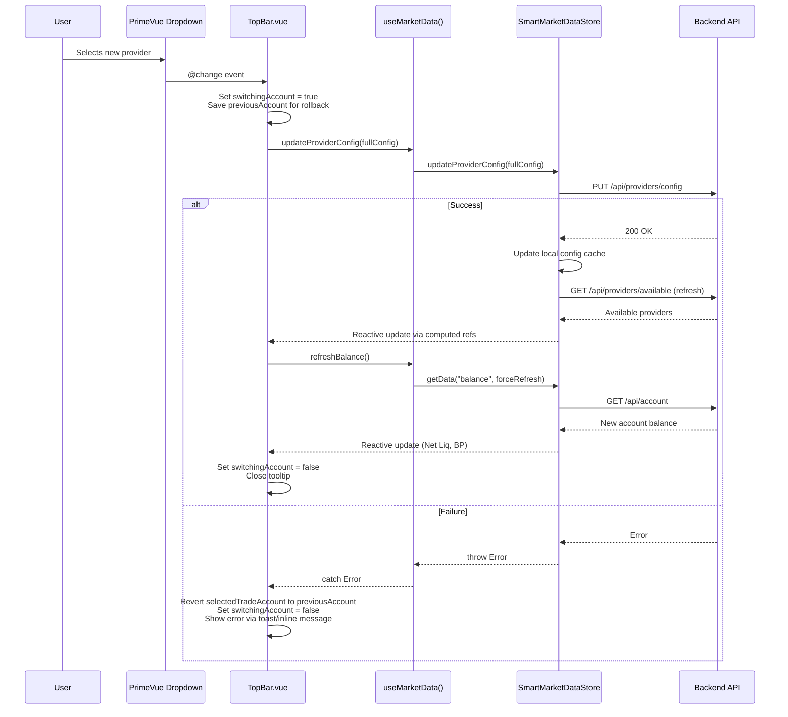

# Technical Design: Easy Broker Account Switch (Issue #34)

**Issue:** [#34 - Easy Broker Account Switch](https://github.com/schardosin/juicytrade/issues/34)
**Requirements:** [requirements.md](./requirements.md)
**Status:** Draft

---

## 1. Overview & Scope

This feature converts the "Trade Account" row inside the TopBar's provider configuration tooltip from a static label into an interactive PrimeVue Dropdown, allowing the user to quickly switch their active trade account provider without navigating to Settings.

### Key Constraints

- **No backend changes required.** The existing `PUT /api/providers/config` and `GET /api/providers/available` endpoints already provide everything needed.
- **Only the Trade Account row becomes interactive.** All other service rows (Stock Quotes, Options Chain, etc.) remain read-only labels.
- **Single file change.** Only `trade-app/src/components/TopBar.vue` needs modification. The composable (`useMarketData`) and store (`SmartMarketDataStore`) already expose all necessary methods.

### Files Affected

| File | Action | Description |
|------|--------|-------------|
| `trade-app/src/components/TopBar.vue` | **Modify** | Replace Trade Account static label with Dropdown; add tooltip interaction logic, loading/error states |

No new files need to be created.

---

## 2. Current Architecture

### Data Flow Today

The TopBar currently consumes provider data through the `useMarketData()` composable, which delegates to `SmartMarketDataStore`:

```
TopBar.vue
  └─ useMarketData()
       ├─ getProviderConfig()    → store.getReactiveData("providers.config")  → Vue computed ref
       ├─ getAvailableProviders()→ store.getReactiveData("providers.available") → Vue computed ref
       ├─ updateProviderConfig() → store.updateProviderConfig(newConfig)       → PUT /api/providers/config
       ├─ refreshBalance()       → store.getData("balance", {forceRefresh})    → GET /api/account
       └─ getBalance()           → store.getReactiveData("balance")            → Vue computed ref
```

### Provider Data Shapes

**`providers.config`** — Flat service-to-instance routing map:
```json
{
  "trade_account": "alpaca-paper-1",
  "stock_quotes": "tradier-live-1",
  "options_chain": "tradier-live-1",
  "historical_data": "tradier-live-1",
  "symbol_lookup": "tradier-live-1",
  "market_calendar": "tradier-live-1",
  "streaming_quotes": "tradier-live-1",
  "greeks": "tradier-live-1",
  "streaming_greeks": ""
}
```

**`providers.available`** — Map of instance IDs to provider metadata:
```json
{
  "alpaca-paper-1": {
    "instance_id": "alpaca-paper-1",
    "provider_type": "alpaca",
    "account_type": "paper",
    "paper": true,
    "display_name": "My Alpaca Paper",
    "capabilities": {
      "rest": ["expiration_dates", "stock_quotes", "options_chain", "trade_account", ...],
      "streaming": ["streaming_quotes", "trade_account"]
    }
  },
  "tradier-live-1": {
    "instance_id": "tradier-live-1",
    "provider_type": "tradier",
    "account_type": "live",
    "paper": false,
    "display_name": "My Tradier Live",
    "capabilities": {
      "rest": ["stock_quotes", "options_chain", "historical_data", ...],
      "streaming": ["streaming_quotes"]
    }
  }
}
```

### Tooltip Behavior Today

The tooltip is shown/hidden via simple `mouseenter`/`mouseleave` events on `.trade-account-indicator`:

```html
<div class="trade-account-indicator"
     @mouseenter="showProviderTooltip = true"
     @mouseleave="showProviderTooltip = false">
  ...
</div>
<div v-if="showProviderTooltip && ..." class="provider-tooltip">
  ...
</div>
```

The tooltip is positioned absolutely below the indicator. It is a child of `.trade-account-section`, so mouse movement from the indicator to the tooltip stays within the parent's DOM tree. However, the PrimeVue Dropdown's overlay panel is **teleported to `<body>`** by default (not a child of the tooltip), which means hovering over dropdown options would trigger `mouseleave` on the tooltip's parent and close it.

### Existing Dropdown Pattern in ProvidersTab

The Settings > Providers tab already uses PrimeVue Dropdown for the same purpose (selecting a provider for each service). The pattern used there:

```html
<Dropdown
  v-model="currentConfig[service.key]"
  :options="getAvailableInstancesForService(service.key)"
  option-label="label"
  option-value="value"
  @change="onProviderChange(service.key, $event.value)"
  class="provider-dropdown"
  :loading="updatingRouting"
  :disabled="updatingRouting"
/>
```

Options are built by filtering `providers.available` for instances whose `capabilities.rest` or `capabilities.streaming` includes the service key. Each option has shape `{ label: "Display Name (Paper)", value: "instance-id" }`.

---

## 3. Component Architecture

### Data Flow Diagram

```mermaid
flowchart TD
    subgraph TopBar.vue
        A[Trade Account Indicator] -->|mouseenter/mouseleave| B[Provider Tooltip]
        B --> C[Trade Account Row<br/>PrimeVue Dropdown]
        B --> D[Market Data Rows<br/>Read-only Labels]
        C -->|@change| E[handleTradeAccountSwitch]
    end

    subgraph "useMarketData() composable"
        F[getProviderConfig] -->|reactive computed| B
        G[getAvailableProviders] -->|reactive computed| C
        H[updateProviderConfig]
        I[refreshBalance]
    end

    subgraph SmartMarketDataStore
        J[providers.config cache]
        K[providers.available cache]
        L[balance cache]
    end

    subgraph "Backend (unchanged)"
        M["PUT /api/providers/config"]
        N["GET /api/providers/available"]
        O["GET /api/account"]
    end

    E -->|1. Build full config with new trade_account| H
    H -->|2. PUT request| M
    M -->|3. Backend restarts streams| M
    H -->|4. Force refresh available| N
    N -->|5. Update cache| K
    E -->|6. Force refresh balance| I
    I -->|7. GET request| O
    O -->|8. Update cache| L
    L -->|9. Reactive update| A
    K -->|10. Reactive update| B
```

### Sequence Diagram — Account Switch



---

## 4. Detailed Design: TopBar.vue Changes

### 4.1 New Imports

The TopBar already imports `useMarketData`, but needs to destructure additional methods that are currently not used:

```js
// Current (in setup):
const { lookupSymbols, getBalance, getAccountInfo, getAvailableProviders,
        getProviderConfig, isLoading, getError } = useMarketData();

// Add these:
const { updateProviderConfig, refreshBalance, refreshProviderData } = useMarketData();
```

> **Note:** `useMarketData()` is called once. The developer should add the new destructured methods to the same existing call.

### 4.2 New Reactive State

Add these refs/computeds inside `setup()`:

```js
// === Trade Account Switching State ===
const switchingAccount = ref(false);          // Loading state during switch
const switchError = ref(null);                // Error message if switch fails
const dropdownOpen = ref(false);              // Tracks whether dropdown overlay is open

// Selected trade account — local mutable ref that the Dropdown v-model binds to.
// Initialized from reactiveProviderConfig and kept in sync via a watcher.
const selectedTradeAccount = ref(null);
```

### 4.3 New Computed Properties

```js
// Build dropdown options: filter providers.available for trade_account capability
const tradeAccountOptions = computed(() => {
  const providers = reactiveAvailableProviders.value;
  if (!providers) return [];

  const options = [];
  for (const [instanceId, providerData] of Object.entries(providers)) {
    const restCapabilities = providerData.capabilities?.rest || [];
    if (restCapabilities.includes('trade_account')) {
      options.push({
        label: `${providerData.display_name || instanceId} (${providerData.paper ? 'Paper' : 'Live'})`,
        value: instanceId,
        paper: providerData.paper,
        displayName: providerData.display_name || instanceId
      });
    }
  }
  return options;
});

// Whether the dropdown should be effectively disabled (only 1 option or currently switching)
const tradeDropdownDisabled = computed(() => {
  return switchingAccount.value || tradeAccountOptions.value.length <= 1;
});
```

### 4.4 Watcher: Sync selectedTradeAccount with Config

The reactive provider config may change from external sources (e.g., Settings dialog). Keep the local `selectedTradeAccount` ref in sync:

```js
watch(
  () => reactiveProviderConfig.value?.trade_account,
  (newVal) => {
    if (newVal && !switchingAccount.value) {
      selectedTradeAccount.value = newVal;
    }
  },
  { immediate: true }
);
```

### 4.5 New Method: handleTradeAccountSwitch

This is the core method triggered by the Dropdown's `@change` event:

```js
const handleTradeAccountSwitch = async (event) => {
  const newInstanceId = event.value;
  const currentConfig = reactiveProviderConfig.value;

  // Guard: no change needed
  if (!newInstanceId || newInstanceId === currentConfig?.trade_account) {
    return;
  }

  // Save previous value for rollback
  const previousAccount = currentConfig?.trade_account;
  switchingAccount.value = true;
  switchError.value = null;

  try {
    // Build full config with only trade_account changed
    const updatedConfig = { ...currentConfig, trade_account: newInstanceId };
    await updateProviderConfig(updatedConfig);

    // Force refresh balance to show new account's Net Liq / BP
    await refreshBalance();

    // Success — close the tooltip after a brief moment
    setTimeout(() => {
      showProviderTooltip.value = false;
      dropdownOpen.value = false;
    }, 300);

  } catch (error) {
    console.error('Failed to switch trade account:', error);
    // Revert dropdown selection
    selectedTradeAccount.value = previousAccount;
    switchError.value = 'Failed to switch account. Please try again.';

    // Auto-clear error after 4 seconds
    setTimeout(() => {
      switchError.value = null;
    }, 4000);
  } finally {
    switchingAccount.value = false;
  }
};
```

### 4.6 Template Changes

#### 4.6.1 Tooltip Show/Hide — Replace Simple mouseenter/mouseleave

**Current** (on `.trade-account-indicator`):
```html
@mouseenter="showProviderTooltip = true"
@mouseleave="showProviderTooltip = false"
```

**New** — Move hover handling to the parent `.trade-account-section` and add dropdown-awareness:

```html
<div class="trade-account-section"
     @mouseenter="showProviderTooltip = true"
     @mouseleave="onTooltipAreaLeave">
```

This ensures the tooltip stays open when the mouse moves from the indicator to the tooltip (both are children of `.trade-account-section`). Remove the `@mouseenter`/`@mouseleave` from `.trade-account-indicator`.

#### 4.6.2 Replace Trade Account Static Label with Dropdown

**Current** Trade Account row in the tooltip:
```html
<div class="provider-category">
  <h5>Trading Services</h5>
  <div class="provider-item">
    <span class="service-name">Trade Account</span>
    <span class="provider-name">{{ formatProviderName('trade_account') }}</span>
  </div>
</div>
```

**New:**
```html
<div class="provider-category">
  <h5>Trading Services</h5>
  <div class="provider-item trade-account-row">
    <span class="service-name">Trade Account</span>
    <div class="trade-account-dropdown-wrapper">
      <Dropdown
        v-model="selectedTradeAccount"
        :options="tradeAccountOptions"
        option-label="label"
        option-value="value"
        :loading="switchingAccount"
        :disabled="tradeDropdownDisabled"
        @change="handleTradeAccountSwitch"
        @show="dropdownOpen = true"
        @hide="dropdownOpen = false"
        class="trade-account-dropdown"
        append-to="self"
        placeholder="Select account"
      />
      <div v-if="switchError" class="switch-error">
        <i class="pi pi-exclamation-triangle"></i>
        {{ switchError }}
      </div>
    </div>
  </div>
</div>
```

#### 4.6.3 Update the return Statement

Add all new refs, computeds, and methods to the `return` block:

```js
return {
  // ... existing returns ...

  // New: Trade account switching
  selectedTradeAccount,
  tradeAccountOptions,
  tradeDropdownDisabled,
  switchingAccount,
  switchError,
  dropdownOpen,
  handleTradeAccountSwitch,
  onTooltipAreaLeave,
};
```

---

## 5. Tooltip Interaction Model

This is the trickiest part of the implementation. The core challenge:

> PrimeVue Dropdown's overlay panel is teleported to `<body>` by default. When the user opens the dropdown inside the tooltip and hovers over the options, the mouse leaves the tooltip's DOM tree, triggering `mouseleave` and closing the tooltip.

### Solution: `append-to="self"` + Parent-Level Hover

The design uses a **two-pronged approach**:

#### 5.1 Use `append-to="self"` on the Dropdown

PrimeVue 3.x Dropdown supports the `appendTo` prop. Setting `append-to="self"` renders the dropdown overlay panel **inline as a child of the Dropdown's own DOM element**, rather than teleporting it to `<body>`.

**Why this works:** When the overlay is a DOM child of the Dropdown, which is a child of the tooltip, which is a child of `.trade-account-section`, mouse movement to the overlay options never leaves the `.trade-account-section` subtree. No `mouseleave` fires.

**Trade-off:** `append-to="self"` can cause clipping if the parent has `overflow: hidden`. The tooltip currently has `overflow: hidden` on its root (via `border-radius` + no explicit overflow) and `overflow-y: auto` on `.tooltip-content`. The developer must ensure the dropdown overlay is not clipped by:
- Adding `overflow: visible` to `.trade-account-dropdown-wrapper`
- The tooltip's `min-width: 320px` provides enough horizontal room
- The dropdown overlay will extend below the tooltip, which is fine since the tooltip is absolutely positioned with high `z-index`

#### 5.2 Move mouseenter/mouseleave to `.trade-account-section`

**Current:** Events are on `.trade-account-indicator` only.
**New:** Events are on `.trade-account-section` (the parent that contains both the indicator and the tooltip).

This means the tooltip stays open when the user moves their mouse from the indicator into the tooltip content — which was actually already working due to DOM nesting, but making it explicit on the parent is cleaner and guarantees stability.

#### 5.3 `onTooltipAreaLeave` — Conditional Close

The `mouseleave` handler on `.trade-account-section` must check whether the dropdown overlay is open before closing the tooltip:

```js
const onTooltipAreaLeave = () => {
  // Don't close the tooltip if the dropdown is currently open
  // (user might be interacting with dropdown options)
  if (dropdownOpen.value) {
    return;
  }
  showProviderTooltip.value = false;
};
```

The `dropdownOpen` ref is toggled by the Dropdown's `@show` and `@hide` events. When the user selects an option (or clicks outside), the Dropdown fires `@hide`, setting `dropdownOpen = false`. At that point, if the mouse is outside the section, the tooltip can close.

#### 5.4 Edge Case: Mouse Leaves While Dropdown is Open, Then Dropdown Closes

If the user opens the dropdown, moves their mouse outside the tooltip area (but the dropdown overlay catches the mouse), then selects an option (closing the dropdown), the tooltip should also close since the mouse is no longer over the section.

This is handled by the `@hide` event on the Dropdown:

```js
// Inside the @hide handler or a watcher on dropdownOpen:
// After dropdown closes, check if mouse is still over the section
// If handleTradeAccountSwitch was called, the tooltip closes after success (see 4.5)
// If the user just closed the dropdown without selecting, we rely on
// the next mouseleave event to close it naturally.
```

In practice, when `append-to="self"` is used, the overlay is DOM-nested inside `.trade-account-section`, so the mouse never actually "leaves" the section while interacting with the dropdown. This makes the edge case largely theoretical.

#### 5.5 Summary of Tooltip Lifecycle

| User Action | Tooltip State | Mechanism |
|-------------|--------------|-----------|
| Mouse enters `.trade-account-section` | Opens | `@mouseenter` sets `showProviderTooltip = true` |
| Mouse moves within tooltip (including dropdown trigger) | Stays open | Mouse is within `.trade-account-section` DOM tree |
| Mouse clicks dropdown to open overlay | Stays open | `dropdownOpen = true` via `@show`; `onTooltipAreaLeave` checks this |
| Mouse hovers over dropdown options | Stays open | With `append-to="self"`, overlay is inside `.trade-account-section` |
| User selects an account | Closes after switch | `handleTradeAccountSwitch` closes tooltip on success (300ms delay) |
| Mouse leaves `.trade-account-section` with dropdown closed | Closes | `onTooltipAreaLeave` closes tooltip |
| Mouse leaves `.trade-account-section` with dropdown open | Stays open | `onTooltipAreaLeave` returns early; closes when dropdown hides |
| User clicks outside tooltip area | Closes | Standard mouseleave; dropdown auto-closes too |

---

## 6. Data Flow & Filtering

### 6.1 Filtering for Trade-Capable Providers

The `tradeAccountOptions` computed property iterates over `reactiveAvailableProviders.value` (an object map, not an array) and checks each provider's `capabilities.rest` array for `"trade_account"`:

```js
const restCapabilities = providerData.capabilities?.rest || [];
if (restCapabilities.includes('trade_account')) { ... }
```

**Why only `rest`, not `streaming`?** The `trade_account` capability in `streaming` indicates the provider can stream account updates (balance changes, order fills) — it does not mean it's a different account. A provider always appears in `rest` if it supports trade account operations. Filtering by `rest` is sufficient and matches the pattern used in `ProvidersTab.vue`.

### 6.2 Building the Full Config for Update

The `updateProviderConfig` method in `SmartMarketDataStore` sends the **full config object** to the backend. The design follows this same pattern:

```js
const updatedConfig = { ...currentConfig, trade_account: newInstanceId };
await updateProviderConfig(updatedConfig);
```

This spreads the current config (preserving all other service routings) and only overrides `trade_account`. This is consistent with how `ProvidersTab.vue` works and matches the backend's expectation.

### 6.3 Post-Switch Refresh Chain

After `updateProviderConfig` succeeds, the `SmartMarketDataStore` automatically:
1. Saves the new config locally
2. Force-refreshes `providers.available` from the backend
3. Clears cached chart data

The TopBar's design additionally calls `refreshBalance()` to update Net Liq and Buying Power for the new account. This is necessary because:
- Balance data is fetched from `GET /api/account`, which uses the `trade_account` provider routing
- After switching, the backend routes the balance request to the new provider
- The reactive `watch` on `reactiveBalance` in the TopBar already handles updating the display

### 6.4 Option Display Format

Each dropdown option displays:
- **Provider display name** (e.g., "My Alpaca Paper") — from `providerData.display_name`
- **Account type badge** — "(Paper)" or "(Live)" — derived from `providerData.paper`

This matches the format used by `formatProviderName()` and is consistent with how the TopBar indicator already displays the account.

---

## 7. Loading, Error & Edge Case Handling

### 7.1 Loading State During Switch

When `switchingAccount` is `true`:
- The PrimeVue Dropdown shows its built-in loading spinner (via `:loading="switchingAccount"`)
- The Dropdown is disabled to prevent double-clicks (`:disabled="tradeDropdownDisabled"` which checks `switchingAccount.value`)
- The TopBar's account balance area will show its existing loading state as the balance refreshes

### 7.2 Error Handling & Rollback

If the `updateProviderConfig` call fails:
1. `selectedTradeAccount` is reverted to `previousAccount` — the Dropdown visually shows the old selection
2. `switchError` is set with a user-friendly message
3. An inline error message appears below the Dropdown (red text with warning icon)
4. The error auto-clears after 4 seconds
5. The tooltip stays open so the user can see the error and retry

**Design Decision — Inline Error vs. Toast:**
An inline error within the tooltip is preferred over a toast notification because:
- The context is immediately visible (right below where the action happened)
- Toast notifications can be missed or feel disconnected from the tooltip
- The error auto-clears, so it doesn't permanently pollute the UI

### 7.3 Single Provider Case

When `tradeAccountOptions` has only 1 item:
- `tradeDropdownDisabled` computed returns `true`
- The Dropdown renders in a disabled visual state — the user can see the current account but cannot interact
- PrimeVue Dropdown natively shows a disabled appearance (muted colors, no pointer cursor)

This satisfies FR-4 and AC-11: the user understands there are no alternative accounts.

### 7.4 No Providers Available

If `tradeAccountOptions` is empty (edge case — no providers configured at all):
- The Dropdown shows the placeholder "Select account"
- It is disabled since there are no options
- This is a degenerate case that shouldn't occur in normal usage (the Setup Wizard requires configuring at least one trade account)

### 7.5 Provider Data Not Yet Loaded

If `reactiveAvailableProviders.value` or `reactiveProviderConfig.value` is `null` (data still loading):
- The existing `providersLoading` computed already gates the tooltip: `v-if="showProviderTooltip && !providersLoading && !providersError"`
- The tooltip simply won't show until provider data is ready
- No special handling needed in the Dropdown logic

---

## 8. Styling Guidelines

### 8.1 Dropdown Sizing & Theme

The Dropdown must fit within the tooltip's Trade Account row. Key styling:

```css
.trade-account-dropdown-wrapper {
  display: flex;
  flex-direction: column;
  align-items: flex-end;
  position: relative;
}

.trade-account-dropdown {
  width: 180px;           /* Fits within the tooltip's right column */
  font-size: var(--font-size-base);
}

/* Override PrimeVue defaults for compact appearance */
:deep(.trade-account-dropdown .p-dropdown) {
  background: var(--bg-secondary);
  border: 1px solid var(--border-secondary);
  border-radius: var(--radius-sm);
  min-height: unset;
  height: 28px;           /* Compact to fit in tooltip row */
}

:deep(.trade-account-dropdown .p-dropdown-label) {
  padding: 2px 8px;
  font-size: var(--font-size-base);
  color: var(--text-primary);
}

:deep(.trade-account-dropdown .p-dropdown-trigger) {
  width: 24px;
}

/* Overlay panel styling (with append-to="self") */
:deep(.trade-account-dropdown .p-dropdown-panel) {
  background: var(--bg-tertiary);
  border: 1px solid var(--border-secondary);
  border-radius: var(--radius-sm);
  box-shadow: var(--shadow-md);
}

:deep(.trade-account-dropdown .p-dropdown-item) {
  padding: var(--spacing-xs) var(--spacing-sm);
  font-size: var(--font-size-base);
  color: var(--text-primary);
}

:deep(.trade-account-dropdown .p-dropdown-item:hover) {
  background: var(--bg-quaternary);
}

:deep(.trade-account-dropdown .p-dropdown-item.p-highlight) {
  background: var(--color-info);
  color: white;
}
```

### 8.2 Trade Account Row Layout

The Trade Account `.provider-item` row needs to accommodate the Dropdown instead of a static text label:

```css
.trade-account-row {
  flex-wrap: wrap;        /* Allow error message to wrap below */
  gap: var(--spacing-xs);
}

.trade-account-row .service-name {
  flex-shrink: 0;
}
```

### 8.3 Error Message Styling

```css
.switch-error {
  width: 100%;
  display: flex;
  align-items: center;
  gap: var(--spacing-xs);
  color: var(--color-danger);
  font-size: var(--font-size-xs);
  padding-top: var(--spacing-xs);
}

.switch-error i {
  font-size: var(--font-size-xs);
}
```

### 8.4 Theme Consistency

All colors use CSS custom properties from the existing design system (`theme.css`). The dark theme `aura-dark-noir` is applied globally via PrimeVue's theming. The `:deep()` selectors ensure PrimeVue internal elements inherit the right colors. No hardcoded color values.

### 8.5 Overflow Handling for `append-to="self"`

When using `append-to="self"`, the dropdown overlay renders inline. Ensure it isn't clipped:

```css
.trade-account-dropdown-wrapper {
  overflow: visible;
}

/* Ensure tooltip content doesn't clip the dropdown overlay */
.tooltip-content {
  overflow: visible;      /* Override the current overflow-y: auto if it clips */
}

/* The tooltip itself needs overflow visible too */
.provider-tooltip {
  overflow: visible;
}
```

**Trade-off:** Changing `overflow` on `.tooltip-content` from `auto` to `visible` means the tooltip won't scroll if content exceeds `max-height: 400px`. Since the tooltip content is a fixed set of ~10 rows that comfortably fits within 400px, this is acceptable. If future additions push the content beyond 400px, this decision should be revisited.

---

## 9. File Change Summary

### `trade-app/src/components/TopBar.vue`

This is the **only file** that needs modification. Changes organized by section:

#### Template Changes

| Location | Change |
|----------|--------|
| `.trade-account-section` | Add `@mouseenter` and `@mouseleave="onTooltipAreaLeave"` |
| `.trade-account-indicator` | Remove `@mouseenter` and `@mouseleave` |
| Trading Services → Trade Account `.provider-item` | Replace `<span class="provider-name">` with `<Dropdown>` wrapped in `.trade-account-dropdown-wrapper`, add error message div |

#### Script Changes (inside `setup()`)

| Addition | Purpose |
|----------|---------|
| Destructure `updateProviderConfig`, `refreshBalance` from `useMarketData()` | Access update and refresh methods |
| `const switchingAccount = ref(false)` | Loading state for account switch |
| `const switchError = ref(null)` | Error message display |
| `const dropdownOpen = ref(false)` | Track dropdown overlay visibility |
| `const selectedTradeAccount = ref(null)` | Dropdown v-model binding |
| `const tradeAccountOptions = computed(...)` | Filtered dropdown options |
| `const tradeDropdownDisabled = computed(...)` | Disabled state logic |
| `watch(() => reactiveProviderConfig.value?.trade_account, ...)` | Sync local ref with config |
| `const handleTradeAccountSwitch = async (event) => { ... }` | Core switch handler |
| `const onTooltipAreaLeave = () => { ... }` | Conditional tooltip close |
| Update `return { ... }` block | Expose new refs/methods to template |

#### Style Changes (scoped CSS)

| Addition | Purpose |
|----------|---------|
| `.trade-account-row` styles | Layout for dropdown in tooltip row |
| `.trade-account-dropdown-wrapper` styles | Wrapper positioning and overflow |
| `.trade-account-dropdown` + `:deep()` overrides | PrimeVue Dropdown compact styling |
| `.switch-error` styles | Inline error message appearance |
| `.provider-tooltip` overflow update | Prevent clipping of dropdown overlay |
| `.tooltip-content` overflow update | Prevent clipping of dropdown overlay |

---

## 10. Testing Guidance

### Manual Test Scenarios

| # | Scenario | Expected Result | Maps to AC |
|---|----------|----------------|------------|
| T1 | Hover over trade account indicator | Tooltip shows with Dropdown in Trade Account row, other rows are labels | AC-1, AC-10 |
| T2 | Click the Trade Account dropdown | Shows list of all trade-capable providers with name + Paper/Live | AC-2, AC-3 |
| T3 | Select a different provider | Loading spinner, API call fires with full config (only trade_account changed), tooltip closes | AC-4, AC-8 |
| T4 | After successful switch | TopBar indicator shows new provider name + badge; Net Liq and BP update | AC-5, AC-6 |
| T5 | Open dropdown and hover over options | Tooltip stays open, no flicker | AC-7 |
| T6 | Open dropdown, move mouse outside, then dropdown auto-closes | Tooltip closes cleanly | AC-7 |
| T7 | Simulate API failure (e.g., disconnect network) | Error shown inline, dropdown reverts to previous selection | AC-9 |
| T8 | Configure only one trade-capable provider | Dropdown renders but is disabled | AC-11 |
| T9 | Switch accounts, then open Settings > Providers | Settings reflects the new routing | Regression |
| T10 | Switch accounts via Settings, then hover TopBar | TopBar dropdown shows the updated selection | Regression |

### Automated Test Considerations

A Vitest unit test for the TopBar's trade account switching logic should:
- Mock `useMarketData()` to return controlled reactive refs and mock `updateProviderConfig`/`refreshBalance`
- Verify `tradeAccountOptions` correctly filters providers by `trade_account` capability
- Verify `handleTradeAccountSwitch` calls `updateProviderConfig` with the correct full config
- Verify error rollback sets `selectedTradeAccount` back to previous value
- Verify `onTooltipAreaLeave` does not close tooltip when `dropdownOpen` is true

---

## Appendix: Design Decisions & Trade-offs

| Decision | Alternatives Considered | Rationale |
|----------|------------------------|-----------|
| `append-to="self"` for Dropdown | Default teleport to `<body>` + `dropdownOpen` flag to suppress mouseleave | Simpler DOM nesting avoids the teleport/mouseleave problem entirely. Clipping risk is low given the tooltip's generous min-width. |
| Inline error in tooltip | Toast notification via PrimeVue's ToastService | Error is contextually relevant to the dropdown; toast can feel disconnected. Auto-clear keeps the UI clean. |
| 300ms delay before closing tooltip on success | Immediate close | Brief delay gives the user visual confirmation that the switch was acknowledged before the tooltip disappears. |
| Full config spread (`{ ...currentConfig, trade_account: newId }`) | Send only `{ trade_account: newId }` | Matches the existing pattern used by `SmartMarketDataStore.updateProviderConfig` and `ProvidersTab`, which always sends full config. Backend supports partial merge but the frontend pattern is full-send. |
| Move hover events to `.trade-account-section` | Keep on `.trade-account-indicator` + add duplicate events on `.provider-tooltip` | Cleaner: single parent wraps both elements. Less event handler duplication. |
| Local `selectedTradeAccount` ref with watcher sync | Bind Dropdown directly to `reactiveProviderConfig.value.trade_account` | Direct binding to a computed ref is read-only. Local ref enables optimistic UI updates and rollback on error. Watcher keeps it in sync with external changes (e.g., Settings dialog). |
