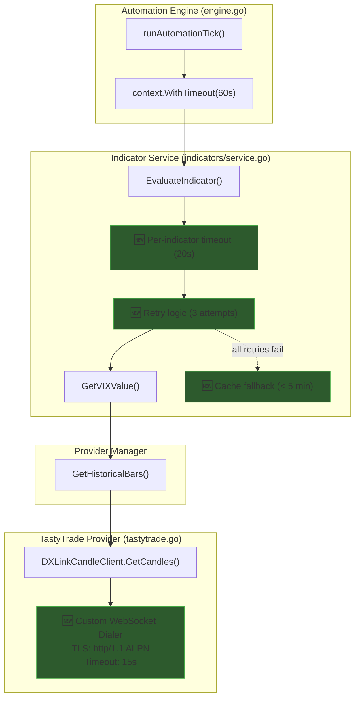

# Technical Design: Fix Stale VIX Data in Automation Engine

**Issue:** [#68 - Still having stale data in Auto](https://github.com/schardosin/juicytrade/issues/68)  
**Requirements:** [requirements.md](https://github.com/schardosin/juicytrade/blob/fleet/issue-68-still-having-stale-data-in-auto/docs/issue-68-still-having-stale-data-in-auto/requirements.md)  
**Date:** 2025-06-05  
**Status:** Design

---

## 1. Overview & Problem Summary

The automation engine's VIX indicator evaluation frequently fails with connection timeouts when fetching data via the DXLink Candle Client. This blocks trade entry during the 5-minute window because stale indicators prevent the engine from transitioning to the `Trading` state.

**Root cause:** The DXLink Candle Client (`GetCandles()` in `tastytrade.go`) uses `websocket.DefaultDialer` which:
1. Negotiates HTTP/2 via TLS ALPN → DXLink silently drops the connection
2. Has no handshake timeout → connection hangs until the parent context (60s) expires
3. Has no retry logic → a single transient failure marks VIX as stale
4. Has no per-indicator timeout → one slow indicator consumes the entire evaluation budget

**Fix strategy (4 parts):**
1. Apply the HTTP/1.1 ALPN fix (already proven in commit `2ffba97` for streaming)
2. Add retry logic to VIX indicator evaluation (3 attempts)
3. Add per-indicator timeout contexts (20s for VIX)
4. Use cached VIX value on transient failures (< 5 min old)

---

## 2. Component Architecture



**Data flow with fixes applied:**

1. Engine creates 60s evaluation context
2. `EvaluateIndicator()` creates a 20s child context for VIX **(Fix 3)**
3. `GetVIXValue()` is called with retry wrapper (up to 3 attempts) **(Fix 2)**
4. Each attempt calls `GetHistoricalBars()` → `GetCandles()`
5. `GetCandles()` uses a custom dialer with HTTP/1.1 ALPN **(Fix 1)**
6. If all retries fail and a cached value < 5 min exists, use it **(Fix 4)**

---

## 3. Fix 1: DXLink Candle Client ALPN Configuration

### File: `trade-backend-go/internal/providers/tastytrade/tastytrade.go`

### Current Code (line ~4635)

```go
func (c *DXLinkCandleClient) GetCandles(ctx context.Context, symbol, timeframe string, fromTime int64, limit int) ([]map[string]interface{}, error) {
    // Connect to DXLink WebSocket
    conn, _, err := websocket.DefaultDialer.DialContext(ctx, c.dxlinkURL, nil)
    if err != nil {
        return nil, fmt.Errorf("failed to connect to DXLink WebSocket: %w", err)
    }
    defer conn.Close()
    // ...
}
```

### Proposed Change

Replace `websocket.DefaultDialer.DialContext(...)` with a custom dialer that forces HTTP/1.1 ALPN negotiation and sets an explicit handshake timeout:

```go
func (c *DXLinkCandleClient) GetCandles(ctx context.Context, symbol, timeframe string, fromTime int64, limit int) ([]map[string]interface{}, error) {
    slog.Debug(fmt.Sprintf("DXLink: Getting candles for %s %s from %d", symbol, timeframe, fromTime))

    // Configure WebSocket dialer with HTTP/1.1 ALPN (matches streaming fix from 2ffba97).
    // CRITICAL: Without this, Go's default TLS negotiates HTTP/2 via ALPN, causing
    // DXLink's WebSocket server to silently drop the connection.
    dialer := &websocket.Dialer{
        HandshakeTimeout: 15 * time.Second,
        TLSClientConfig: &tls.Config{
            NextProtos: []string{"http/1.1"},
        },
    }

    // Connect to DXLink WebSocket
    conn, _, err := dialer.DialContext(ctx, c.dxlinkURL, nil)
    if err != nil {
        return nil, fmt.Errorf("failed to connect to DXLink WebSocket: %w", err)
    }
    defer conn.Close()
    // ... rest unchanged
}
```

### Import Requirements

The file already imports `"crypto/tls"` (line 5) and `"time"` — no new imports needed.

### Rationale

This is the same fix applied to the streaming connection at line 1791-1801 (commit `2ffba97`). It is the highest-impact change because it addresses the root cause directly. The other 3 fixes provide defense-in-depth for transient network issues.

---

## 4. Fix 2: Retry Logic in VIX Indicator Evaluation

### File: `trade-backend-go/internal/automation/indicators/service.go`

### Design

Add a new private method `getVIXValueWithRetry()` that wraps `GetVIXValue()` with retry logic. This method is called from the `IndicatorVIX` case in `EvaluateIndicator()`.

### New Function: `getVIXValueWithRetry`

```go
// vixMaxRetries is the maximum number of retry attempts for VIX evaluation.
const vixMaxRetries = 2 // 3 total attempts (1 initial + 2 retries)

// vixRetryDelay is the delay between VIX retry attempts.
const vixRetryDelay = 2 * time.Second

// isTransientError checks if an error is likely transient (connection/timeout related).
func isTransientError(err error) bool {
    if err == nil {
        return false
    }
    errStr := err.Error()
    return strings.Contains(errStr, "i/o timeout") ||
        strings.Contains(errStr, "connection refused") ||
        strings.Contains(errStr, "connection reset") ||
        strings.Contains(errStr, "context deadline exceeded") ||
        strings.Contains(errStr, "failed to connect") ||
        strings.Contains(errStr, "EOF")
}

// getVIXValueWithRetry wraps GetVIXValue with retry logic for transient failures.
// Returns the VIX value and error. On transient failures, retries up to vixMaxRetries times
// with vixRetryDelay between attempts.
func (s *Service) getVIXValueWithRetry(ctx context.Context, symbol string) (float64, error) {
    var lastErr error

    for attempt := 0; attempt <= vixMaxRetries; attempt++ {
        if attempt > 0 {
            slog.Warn("🔄 Retrying VIX evaluation",
                "attempt", attempt+1,
                "maxAttempts", vixMaxRetries+1,
                "symbol", symbol,
                "previousError", lastErr)

            // Wait before retry, but respect context cancellation
            select {
            case <-ctx.Done():
                return 0, fmt.Errorf("context cancelled during VIX retry: %w", ctx.Err())
            case <-time.After(vixRetryDelay):
            }
        }

        value, err := s.GetVIXValue(ctx, symbol)
        if err == nil {
            if attempt > 0 {
                slog.Info("✅ VIX evaluation succeeded on retry",
                    "attempt", attempt+1,
                    "symbol", symbol,
                    "value", value)
            }
            return value, nil
        }

        lastErr = err

        // Only retry on transient errors
        if !isTransientError(err) {
            return 0, err
        }

        slog.Warn("⚠️ VIX evaluation failed (transient)",
            "attempt", attempt+1,
            "maxAttempts", vixMaxRetries+1,
            "symbol", symbol,
            "error", err)
    }

    return 0, fmt.Errorf("VIX evaluation failed after %d attempts: %w", vixMaxRetries+1, lastErr)
}
```

### Modification to `EvaluateIndicator()` (VIX case)

```go
case types.IndicatorVIX:
    // Use custom symbol if provided (e.g., UVXY, VXX), otherwise try VIX variants
    vixSymbol := config.Symbol
    if vixSymbol == "" {
        vixSymbol = "VIX"
    }
    result.Value, err = s.getVIXValueWithRetry(ctx, vixSymbol)
    result.Symbol = vixSymbol
```

### Import Requirements

Add `"strings"` to the import block (if not already present).

---

## 5. Fix 3: Per-Indicator Timeout Budget

### File: `trade-backend-go/internal/automation/indicators/service.go`

### Design

Wrap the VIX indicator evaluation with its own timeout context derived from the parent context. This ensures:
- VIX gets at most 20s per attempt (not 60s)
- Other indicators still get their fair share of the remaining budget
- The parent 60s context remains as the overall bound

### Constants

```go
// vixEvaluationTimeout is the per-attempt timeout for VIX indicator evaluation.
// Each retry attempt gets its own fresh timeout context.
const vixEvaluationTimeout = 20 * time.Second
```

### Modification to `EvaluateIndicator()` (VIX case)

The timeout is applied inside `getVIXValueWithRetry` per attempt, so each retry gets a fresh 20s window:

```go
// getVIXValueWithRetry wraps GetVIXValue with retry logic for transient failures.
func (s *Service) getVIXValueWithRetry(ctx context.Context, symbol string) (float64, error) {
    var lastErr error

    for attempt := 0; attempt <= vixMaxRetries; attempt++ {
        if attempt > 0 {
            slog.Warn("🔄 Retrying VIX evaluation",
                "attempt", attempt+1,
                "maxAttempts", vixMaxRetries+1,
                "symbol", symbol,
                "previousError", lastErr)

            // Wait before retry, but respect context cancellation
            select {
            case <-ctx.Done():
                return 0, fmt.Errorf("context cancelled during VIX retry: %w", ctx.Err())
            case <-time.After(vixRetryDelay):
            }
        }

        // Create per-attempt timeout context
        attemptCtx, attemptCancel := context.WithTimeout(ctx, vixEvaluationTimeout)
        value, err := s.GetVIXValue(attemptCtx, symbol)
        attemptCancel()

        if err == nil {
            if attempt > 0 {
                slog.Info("✅ VIX evaluation succeeded on retry",
                    "attempt", attempt+1,
                    "symbol", symbol,
                    "value", value)
            }
            return value, nil
        }

        lastErr = err

        // Only retry on transient errors
        if !isTransientError(err) {
            return 0, err
        }

        slog.Warn("⚠️ VIX evaluation failed (transient)",
            "attempt", attempt+1,
            "maxAttempts", vixMaxRetries+1,
            "symbol", symbol,
            "error", err)
    }

    return 0, fmt.Errorf("VIX evaluation failed after %d attempts: %w", vixMaxRetries+1, lastErr)
}
```

### Timing Budget Analysis

With 3 attempts × 20s timeout + 2 retries × 2s delay = **64s worst case**. This exceeds the 60s parent timeout, which is intentional — the parent context will cancel any in-flight attempt that exceeds the overall budget. The per-attempt timeout (20s) primarily helps with the **first** attempt, ensuring it fails fast enough to allow retries within the 60s budget.

**Typical worst-case scenario:**
- Attempt 1: times out at 20s → 20s elapsed
- 2s delay → 22s elapsed
- Attempt 2: times out at 20s → 42s elapsed
- 2s delay → 44s elapsed
- Attempt 3: times out at 16s (parent cancels at 60s) → 60s elapsed

This gives all 3 attempts a realistic chance to succeed.

---

## 6. Fix 4: Cache Fallback on Transient Failures

### File: `trade-backend-go/internal/automation/indicators/service.go`

### Design

The existing cache mechanism (`cachedResult`) already stores the last known good value and timestamp. Currently, when evaluation fails, the code sets `result.Stale = true` and stores `cached.Value` for display but still marks the indicator as stale (blocking trade entry).

The fix enhances the error-handling path specifically for VIX indicators: if the cached value is less than 5 minutes old, we use it as a **valid** result (not stale) with a warning.

### New Constant

```go
// vixCacheFallbackTTL is the maximum age of a cached VIX value that can be used
// as a fallback when evaluation fails. Beyond this age, mark as stale.
const vixCacheFallbackTTL = 5 * time.Minute
```

### Modification to `EvaluateIndicator()` Error Handling

The change is in the error handling block at the end of `EvaluateIndicator()`, specifically for VIX indicators:

```go
if err != nil {
    // For VIX indicators: try cache fallback before marking as stale
    if config.Type == types.IndicatorVIX && configID != "" && config.ID != "" {
        if cached := s.getCachedResult(configID, config.ID); cached != nil {
            if time.Since(cached.Timestamp) < vixCacheFallbackTTL {
                // Cache is fresh enough — use it instead of marking stale
                slog.Warn("⚠️ VIX evaluation failed, using cached value (within TTL)",
                    "indicatorID", config.ID,
                    "cachedValue", cached.Value,
                    "cachedAt", cached.Timestamp,
                    "cacheAge", time.Since(cached.Timestamp).Round(time.Second),
                    "error", err)

                result.Value = cached.Value
                result.Error = "" // Clear error — this is a valid fallback
                result.Stale = false
                result.Pass = result.Evaluate()
                result.Details = fmt.Sprintf("VIX %.2f (cached %s ago) %s",
                    cached.Value,
                    time.Since(cached.Timestamp).Round(time.Second),
                    s.formatPassFail(result.Pass))
                return result
            }
        }
    }

    // Existing stale handling for all other cases (unchanged)
    result.Error = err.Error()
    result.Pass = false
    result.Stale = true

    // Try to use last known good value for display (only if we have a configID for caching)
    if configID != "" && config.ID != "" {
        if cached := s.getCachedResult(configID, config.ID); cached != nil {
            result.Value = cached.Value
            result.LastGoodValue = &cached.Value
            result.Details = fmt.Sprintf("STALE: Last good value from %s - %s",
                cached.Timestamp.Format("15:04:05"), err.Error())
            slog.Warn("Indicator evaluation failed, using cached value",
                "type", config.Type,
                "indicatorID", config.ID,
                "cachedValue", cached.Value,
                "cachedAt", cached.Timestamp,
                "error", err)
        } else {
            result.Details = fmt.Sprintf("STALE: No cached value available - %s", err.Error())
            slog.Error("Indicator evaluation failed, no cached value available",
                "type", config.Type,
                "indicatorID", config.ID,
                "error", err)
        }
    } else {
        // Preview/test mode - no caching
        slog.Error("Indicator evaluation failed (preview mode)", "type", config.Type, "error", err)
    }
    return result
}
```

### New Helper Function

```go
// formatPassFail returns a pass/fail string for display
func (s *Service) formatPassFail(pass bool) string {
    if pass {
        return "(PASS)"
    }
    return "(FAIL)"
}
```

### Key Design Decision: Why Only VIX?

The cache fallback with `Stale = false` is limited to VIX indicators because:
1. VIX is the indicator most affected by DXLink connection issues
2. VIX values change slowly (a 5-minute-old value is typically within 0.5-1 point)
3. Other indicators (Gap, Range, Trend) use different data paths that don't have the same DXLink WebSocket failure mode
4. Applying this broadly could mask actual data issues for price-sensitive indicators

---

## 7. File Changes Summary

| File | Changes | Estimated Lines |
|------|---------|----------------|
| `trade-backend-go/internal/providers/tastytrade/tastytrade.go` | Replace `websocket.DefaultDialer` with custom dialer in `GetCandles()` | ~8 lines changed |
| `trade-backend-go/internal/automation/indicators/service.go` | Add retry logic, per-indicator timeout, cache fallback, new constants, helper functions | ~80 lines added, ~5 lines modified |

### No New Files

All changes fit within existing files. No new types, interfaces, or packages are needed.

### No Changes to These Files

- `engine.go` — The 60s evaluation timeout and tick loop remain unchanged
- `models.go` — No new model types needed
- `types/types.go` — No changes to indicator types or result structures

---

## 8. Interaction with Existing Automation Tick Loop

### Current Flow (30s tick cycle)

```
runAutomationTick() → handleWaitingState() → ctx(60s) → EvaluateIndicatorGroups()
                                                              ↓
                                                    EvaluateAllIndicators()
                                                              ↓
                                                    EvaluateIndicator() [for each]
                                                              ↓
                                                    GetVIXValue() → GetHistoricalBars()
                                                              ↓
                                                    GetCandles() → websocket.DefaultDialer ❌
```

### New Flow (with all 4 fixes)

```
runAutomationTick() → handleWaitingState() → ctx(60s) → EvaluateIndicatorGroups()
                                                              ↓
                                                    EvaluateAllIndicators()
                                                              ↓
                                                    EvaluateIndicator()
                                                              ↓
                                            ┌─── VIX case: getVIXValueWithRetry(ctx) ───┐
                                            │                                            │
                                            │  Attempt 1: ctx(20s) → GetVIXValue()       │
                                            │       ↓ GetHistoricalBars()                 │
                                            │       ↓ GetCandles() → custom dialer ✅     │
                                            │                                            │
                                            │  [If transient failure: wait 2s, retry]    │
                                            │                                            │
                                            │  Attempt 2: ctx(20s) → GetVIXValue()       │
                                            │  Attempt 3: ctx(20s) → GetVIXValue()       │
                                            │                                            │
                                            │  [All failed? Check cache < 5 min]         │
                                            │       ↓ Yes: use cached, Stale=false ✅     │
                                            │       ↓ No: mark Stale=true (existing)     │
                                            └────────────────────────────────────────────┘
```

### Timing Guarantees

| Scenario | Time Consumed | Outcome |
|----------|---------------|---------|
| ALPN fix works (happy path) | ~1-3s | VIX value returned, no retry needed |
| First attempt timeout, second succeeds | ~22-25s | VIX value returned on retry |
| All 3 attempts timeout, cache hit | ~60s (parent cancels) | Cached value used, not stale |
| All 3 attempts timeout, no cache | ~60s (parent cancels) | Marked stale (existing behavior) |

### Impact on Other Indicators

- Other indicators (Gap, Range, Trend, RSI, etc.) are evaluated **sequentially** in `EvaluateAllIndicators()`
- If VIX consumes significant time (retry scenario), subsequent indicators still run but may face a tighter remaining budget from the parent context
- This is acceptable because: (a) the ALPN fix should prevent most timeouts, (b) other indicators typically complete in <2s, (c) the 30s tick interval means the next evaluation cycle is never far away

---

## 9. Testing Guidance

### Existing Tests Must Pass

- `cd trade-backend-go && go test ./...` — All existing tests must pass without modification
- The changes don't alter function signatures or public interfaces

### Verification Steps

1. **ALPN Fix:** Deploy and monitor DXLink candle client connections. Look for absence of the previous `i/o timeout` errors in logs.

2. **Retry Logic:** Simulate by temporarily blocking DXLink endpoint (or adding test that mocks provider). Look for `🔄 Retrying VIX evaluation` log entries.

3. **Per-Indicator Timeout:** If DXLink is slow but not dead, you should see individual attempts timing out at 20s rather than the full 60s.

4. **Cache Fallback:** After a successful VIX evaluation, simulate a failure on the next tick. The log should show `⚠️ VIX evaluation failed, using cached value (within TTL)` and the trade should NOT be blocked.

### Manual Testing Scenario

1. Start automation with a VIX indicator configured
2. Wait for at least one successful VIX evaluation (establishes cache)
3. Temporarily disrupt network to DXLink (or simulate)
4. Observe logs: should see retry attempts, then cache fallback
5. Confirm automation still enters trade (not blocked by stale)

---

## 10. Trade-offs & Risks

### Trade-offs

| Decision | Pro | Con |
|----------|-----|-----|
| 20s per-attempt timeout | Allows retries within 60s budget | If DXLink is slow but working, 20s may be tight for large bar requests |
| 5-minute cache TTL | Prevents blocking during brief outages | VIX can move 2-3 points in 5 minutes during volatile markets |
| Retry only for VIX | Focused fix, no side effects | Other indicators using `GetHistoricalBars` (RSI, MACD) don't get retries |
| Cache fallback only for VIX | VIX moves slowly, safe to cache | Inconsistency — other indicators always mark stale on failure |
| `isTransientError` string matching | Simple, no custom error types needed | Fragile if error messages change in upstream packages |

### Risks

1. **Retry delays could cause tick overrun:** If all 3 attempts timeout (64s theoretical max), the parent context cancels at 60s. Other indicators evaluated after VIX in the same cycle would fail. **Mitigation:** The ALPN fix should eliminate 95%+ of timeouts.

2. **Stale cache used during flash crash:** If VIX spikes 10+ points in 5 minutes and the connection is down, the cached value would give a false "pass". **Mitigation:** The 5-minute TTL is conservative. VIX is typically used as a ">X means don't trade" filter, so using a lower cached value would result in trading when you shouldn't. However, VIX spikes of >5 points in 5 minutes are rare, and the ALPN fix should keep connections healthy.

3. **`isTransientError` may miss new error patterns:** If DXLink starts returning different error messages, retries won't trigger. **Mitigation:** The function uses broad string matching against common Go network error patterns. Can be extended as new patterns emerge.

### Why This Design Works

The 4 fixes form a **defense-in-depth** strategy:
- **Fix 1 (ALPN)** eliminates the root cause → most failures go away
- **Fix 2 (Retry)** handles occasional transient network hiccups
- **Fix 3 (Timeout)** ensures retries have time to execute within the budget
- **Fix 4 (Cache)** provides a last-resort safety net for the entry window

In the happy path (Fix 1 working), there is **zero additional latency** — no retries trigger, no cache lookups happen, no extra contexts are created.
