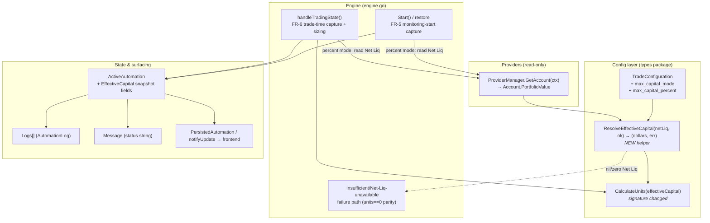

# Technical Design — Auto Mode: Percentage-based Max Capital (Issue #73)

**Issue:** [#73 — Auto Mode with percentage for Max Capital](https://github.com/schardosin/juicytrade/issues/73)
**Requirements:** [requirements.md](./requirements.md)
**Author:** @architect
**Status:** Draft — awaiting PO review
**Scope:** `trade-backend-go` (Go). Frontend UI (config form + display) is designed separately by @ux; this document defines the backend contract the UI consumes.

---

## 1. Overview & Goals

Today the automation **Max Capital** is a fixed dollar amount stored on
`TradeConfiguration.MaxCapital` (`float64`, JSON `max_capital`). Position sizing
is `units = floor(MaxCapital / (spreadWidth × 100))` via
`TradeConfiguration.CalculateUnits()`.

This design adds an **opt-in percentage mode**: the user may express Max Capital
as a percentage of the account's **Net Liquidating Value (Net Liq.)**. At sizing
time the backend resolves an **effective dollar capital** and feeds it into the
*existing, unchanged* units formula.

### Design principles

1. **Opt-in & backward-compatible.** New fields default to `fixed`. Existing
   configs (no mode field) load and behave byte-for-byte as today (AC-4, AC-7).
2. **No change to sizing math.** We only substitute the dollar amount that flows
   into `CalculateUnits`. Iron Condor wider-side selection is untouched.
3. **Single resolution point.** All "fixed vs. percent → dollars" logic lives in
   one new helper (`ResolveEffectiveCapital`) so there is exactly one place to
   audit and test.
4. **Fail safe.** In percentage mode, if Net Liq. cannot be determined at trade
   time, we do **not** place a mis-sized order — we reuse the existing
   insufficient-capital failure path (FR-8).
5. **Two capture points only.** Effective capital is snapshotted at monitoring
   start (FR-5) and at trade time (FR-6). No continuous recomputation.

---

## 2. Current State (as-is)

All paths under `trade-backend-go/`.

### Data model
- `TradeConfiguration` — `internal/automation/types/types.go:150-168`.
  - `MaxCapital float64 \`json:"max_capital"\`` — line 154. Default `5000` in
    `NewTradeConfiguration()` (`types.go:486`).
  - `IronCondorSideConfig{ TargetDelta float64 \`json:"target_delta"\`; Width int \`json:"width"\` }` — `types.go:143-147`.
- `AutomationConfig.TradeConfig` — `types.go:190` (JSON path `trade_config.max_capital`).
- Persistence: JSON file `automations.json` via `internal/automation/storage.go`
  (`load()` :60, `save()` :161). Migrations run on load.

### Sizing
- `TradeConfiguration.CalculateUnits() int` — `types.go:568-593`:
  `maxRiskPerUnit = width × 100`; `units = int(MaxCapital / maxRiskPerUnit)`
  (integer truncation = floor); returns `0` when `units < 1`.
  Iron Condor uses `max(PutSideConfig.Width, CallSideConfig.Width)`.
- Callers: `engine.go:627` (initial placement), `:939`, `:982` (delta-drift
  re-placement).

### Account
- `models.Account` — `internal/models/models.go:156-181`.
  - `PortfolioValue *float64 \`json:"portfolio_value"\`` — line 163.
  - `Equity *float64 \`json:"equity"\`` — line 164. **Both nullable.**
- `ProviderManager.GetAccount(ctx) (*models.Account, error)` — `internal/providers/manager.go:384-391`.
  Providers populate `PortfolioValue`: Alpaca `alpaca.go:551`, Tradier
  `tradier.go:1303`, Tastytrade `tastytrade.go:1563`, Schwab `schwab/account.go:85`
  (from `liquidationValue`).

### Engine lifecycle
- `Engine` struct — `engine.go:19-30` (holds `providerManager`, `storage`,
  `runtimeState`, `activeAutomations`, `updateCallbacks`).
- `(*Engine).Start(id)` — `engine.go:179-220`: builds `ActiveAutomation`
  (`Status: StatusWaiting`, :199-204), `AddLog("info","Automation started")`
  (:205), launches `go runAutomation(...)` (:214), `notifyUpdate` (:217).
- `(*Engine).handleTradingState(...)` — `engine.go:618-734`: calls
  `CalculateUnits()` (:627); `units==0` → `StatusFailed` +
  `"Insufficient capital for minimum position size"` + `AddLog("error",…)` +
  `notifyUpdate`, then `return` (:628-635). Strike-find/placement errors
  increment `ErrorCount`; `>=3` daily → back to `waiting`, else → `failed`
  (:643-721). Success → `StatusMonitoring` (:728).
- `ActiveAutomation` — `types.go:236-254`: `Status`, `Message` (:250),
  `Logs []AutomationLog` (:249), `ErrorCount` (:248). **No capital field.**
- `AutomationLog{ Timestamp, Level, Message, Details }` — `types.go:228-234`;
  `AddLog(level, message, details...)` — `types.go:530-545` (caps at 100).
- `notifyUpdate(id, a)` — `engine.go:74-83`: `go persistState()` +
  fan-out to `updateCallbacks`.

### Runtime restoration
- `PersistedAutomation` — `runtime_state.go:24-35`: persists `ConfigID`,
  `Status`, `StartedAt`, `TradedToday`, `LastTradeDate`, `ErrorCount`,
  `Message`, `CurrentOrder`, `PlacedOrders`. **Logs and capital are not
  persisted.** Config is re-loaded from `automations.json` by `ConfigID`.
- `isRecoverableStatus` — `runtime_state.go:168-176`: recoverable =
  `waiting, evaluating, trading, monitoring`.
- `(*Engine).restoreFromPersistentState()` — `engine.go:101-162` (from
  `NewEngine` :57): reloads config, `RestoreAutomation(persisted, config)`
  (`runtime_state.go:179-212`), resumes `go runAutomation(...)` (:145).
  `StatusTrading` is reset to `StatusEvaluating` on restore.

---

## 3. Component Architecture

The change is localized to `internal/automation` plus a read-only dependency on
`ProviderManager.GetAccount`. No provider code changes.



**Key seam:** account value flows into sizing **only** through `ResolveEffectiveCapital`.
`CalculateUnits` no longer reads `MaxCapital` directly — it receives the resolved
dollar amount as a parameter, keeping the fixed-mode path identical.

---

## 4. Data Model Changes

### 4.1 `TradeConfiguration` — new fields

Add two fields to `TradeConfiguration` (`internal/automation/types/types.go`,
alongside `MaxCapital` at line 154). Follow snake_case JSON tags per project
convention.

```go
// MaxCapitalMode selects how MaxCapital is interpreted for position sizing.
// "" (empty) and "fixed" are equivalent (backward compatibility).
type MaxCapitalMode string

const (
    MaxCapitalModeFixed   MaxCapitalMode = "fixed"
    MaxCapitalModePercent MaxCapitalMode = "percent"
)

// ...within TradeConfiguration:
MaxCapital        float64        `json:"max_capital"`                   // existing (line 154) — dollars, used in fixed mode
MaxCapitalMode    MaxCapitalMode `json:"max_capital_mode,omitempty"`    // NEW — "" defaults to fixed
MaxCapitalPercent float64        `json:"max_capital_percent,omitempty"` // NEW — 1..100, used in percent mode
```

**Rationale for `omitempty` + empty-default:**
- Existing `automations.json` entries have neither field. On unmarshal
  `MaxCapitalMode` is `""` and `MaxCapitalPercent` is `0`. We treat `""` as
  `fixed` everywhere (see 5.1), so legacy configs run unchanged (AC-7, FR-9).
- `omitempty` keeps serialized configs clean; fixed-mode configs never write a
  `max_capital_percent`.

**Field semantics:**
- `fixed` mode: `MaxCapital` is authoritative (dollars). `MaxCapitalPercent`
  ignored.
- `percent` mode: `MaxCapitalPercent` is authoritative (1–100). `MaxCapital`
  is retained (not cleared) so the UI can preserve the user's last fixed value
  when toggling modes (FR-2), but it is **not** used for sizing in percent mode.

**Validation** (enforced in the handler that saves configs and defensively in
`ResolveEffectiveCapital`):
- `percent` mode: `1 <= MaxCapitalPercent <= 100`. Out-of-range → reject on
  save (400) and, as a safety net at runtime, error (see 5.1).
- `fixed` mode: `MaxCapital >= 100` (unchanged min from FR-2).

**Constructor:** `NewTradeConfiguration()` (`types.go:486`) sets
`MaxCapitalMode: MaxCapitalModeFixed` explicitly so newly-created configs are
unambiguous. (Legacy loads still rely on the empty-string-means-fixed rule.)

### 4.2 `ActiveAutomation` — effective-capital snapshot fields

Add snapshot fields so the resolved dollar value is surfaced to status and
persisted for display (`types.go:236-254`):

```go
// Effective capital snapshot (percent mode audit; also populated in fixed mode for a uniform display).
EffectiveCapital        float64    `json:"effective_capital,omitempty"`         // resolved dollars used/planned for sizing
EffectiveCapitalNetLiq  float64    `json:"effective_capital_net_liq,omitempty"` // Net Liq read (percent mode only)
EffectiveCapitalPercent float64    `json:"effective_capital_percent,omitempty"` // percentage applied (percent mode only)
EffectiveCapitalAt      *time.Time `json:"effective_capital_at,omitempty"`      // when the snapshot was captured
```

These are the machine-readable counterpart to the human-readable `Message` and
`Logs`. They enable a future dedicated dashboard field (Q1) **without** a further
backend change — see §10.

### 4.3 JSON contract summary

Config (`trade_config` object) gains:

| JSON field | Type | Range | Meaning |
|---|---|---|---|
| `max_capital` | number | `>=100` | Fixed dollars (existing; used in fixed mode) |
| `max_capital_mode` | string | `fixed` \| `percent` | Sizing mode; absent/empty ⇒ `fixed` |
| `max_capital_percent` | number | `1..100` | Percent of Net Liq (used in percent mode) |

Status (`ActiveAutomation`) gains the four `effective_capital*` fields above.

---

## 5. Effective Capital Resolution

### 5.1 New helper: `ResolveEffectiveCapital`

Add a single resolution function on `TradeConfiguration` (types package). It is
the **only** place that maps mode → dollars.

```go
// ResolveEffectiveCapital computes the dollar capital to feed into CalculateUnits.
//   fixed  : returns MaxCapital (netLiq ignored).
//   percent: returns round(NetLiq * pct/100). Requires a valid, positive netLiq.
// netLiqOK indicates the caller successfully read a usable Net Liq value.
// Returns an error only in percent mode when netLiq is unusable or pct invalid.
func (tc *TradeConfiguration) ResolveEffectiveCapital(netLiq float64, netLiqOK bool) (float64, error) {
    if tc.MaxCapitalMode != MaxCapitalModePercent { // "" or "fixed"
        return tc.MaxCapital, nil
    }
    if tc.MaxCapitalPercent < 1 || tc.MaxCapitalPercent > 100 {
        return 0, fmt.Errorf("invalid max_capital_percent %.2f (must be 1..100)", tc.MaxCapitalPercent)
    }
    if !netLiqOK || netLiq <= 0 {
        return 0, fmt.Errorf("net liquidating value unavailable or non-positive")
    }
    effective := math.Round(netLiq * tc.MaxCapitalPercent / 100.0) // Q2: round to nearest dollar
    return effective, nil
}
```

- **Fixed mode** returns `MaxCapital` unchanged and never errors → guarantees
  AC-4 (byte-for-byte identical fixed behavior) regardless of account state.
- **Percent mode** applies `NetLiq × (pct/100)`, satisfying AC-3
  (`$10,000 × 60% = $6,000`).

### 5.2 Revised `CalculateUnits`

Change `CalculateUnits()` to take the resolved dollar amount as a parameter,
so it no longer reads `tc.MaxCapital` directly. This makes the fixed path and
percent path share one sizing implementation.

```go
// Before: func (tc *TradeConfiguration) CalculateUnits() int  (reads tc.MaxCapital)
// After:
func (tc *TradeConfiguration) CalculateUnits(effectiveCapital float64) int {
    width := tc.Width
    if tc.Strategy == StrategyIronCondor && tc.PutSideConfig != nil && tc.CallSideConfig != nil {
        // unchanged wider-side rule (max of the two side widths)
        if tc.PutSideConfig.Width > tc.CallSideConfig.Width {
            width = tc.PutSideConfig.Width
        } else {
            width = tc.CallSideConfig.Width
        }
    }
    if width <= 0 {
        return 0
    }
    maxRiskPerUnit := float64(width) * 100.0
    units := int(effectiveCapital / maxRiskPerUnit) // floor via truncation, unchanged
    if units < 1 {
        return 0
    }
    return units
}
```

**All three call sites** (`engine.go:627`, `:939`, `:982`) must resolve capital
first and pass it in. In fixed mode the resolved value equals `tc.MaxCapital`,
so the delta-drift re-placement sites keep their exact current numeric result.
For percent mode, the delta-drift re-placement sites (§6.3) reuse the
**trade-time snapshot** rather than re-reading the account, to keep sizing
stable across re-placements within the same trade.

> **Alternative considered:** keep `CalculateUnits()` param-less and mutate a
> transient field. Rejected — hidden state and harder to test. An explicit
> parameter is the cleanest, most testable seam and matches Go conventions.

### 5.3 Net Liq source field (FR-4 decision)

**Decision: use `Account.PortfolioValue` as the primary Net Liq source, with
`Account.Equity` as fallback.**

Reasoning:
- Across the providers, `PortfolioValue` is the field consistently populated
  with the account's net liquidating / total portfolio value — most explicitly
  Schwab, which maps it from the broker's `liquidationValue`
  (`schwab/account.go:85`). Alpaca, Tradier, and Tastytrade all populate
  `PortfolioValue`.
- Both fields are `*float64` (nullable), so a nil-safe read is mandatory.

Resolution order (helper in `engine.go`, e.g. `readNetLiq(acct *models.Account) (float64, bool)`):
1. If `acct == nil` → `(0, false)`.
2. If `acct.PortfolioValue != nil && *acct.PortfolioValue > 0` → `(*PortfolioValue, true)`.
3. Else if `acct.Equity != nil && *acct.Equity > 0` → `(*Equity, true)`.
4. Else → `(0, false)` (triggers FR-8 failure in percent mode).

This keeps a single, provider-agnostic definition of Net Liq and degrades
safely when a provider leaves the field unpopulated.

### 5.4 Rounding (Q2 recommended answer)

**Recommendation: round the effective dollar amount to the nearest whole dollar
(`math.Round`) before the units calculation.**

- The units result is floored regardless, so rounding rarely changes `units`; it
  is chosen for **clean audit/display** (e.g. show `$6,000`, not
  `$5,999.9994`).
- Deterministic and trivially testable; matches the issue's `$6,000` example
  exactly.
- This is the value stored in `EffectiveCapital` and shown in status/log, so the
  displayed dollar figure and the sizing input are always identical (no
  discrepancy between "what we showed" and "what we used").

---

## 6. Capture Points (FR-5 / FR-6)

The requirements define **two** capture points. Each performs the same
sequence: read the account → resolve effective capital → write the snapshot
fields → log → surface to status.

### 6.1 Shared helper: `captureEffectiveCapital`

Add one engine helper reused by both points to avoid duplication:

```go
// captureEffectiveCapital reads the account (percent mode only), resolves the
// effective dollar capital, stamps the snapshot fields on the ActiveAutomation,
// and appends an audit log. Returns the effective capital and an error.
// Caller must hold e.mu when mutating `active`.
func (e *Engine) captureEffectiveCapital(ctx context.Context, active *types.ActiveAutomation, phase string) (float64, error) {
    tc := &active.Config.TradeConfig
    var netLiq float64
    var netLiqOK bool
    if tc.MaxCapitalMode == types.MaxCapitalModePercent {
        acct, err := e.providerManager.GetAccount(ctx)
        if err != nil {
            netLiqOK = false
        } else {
            netLiq, netLiqOK = readNetLiq(acct) // §5.3
        }
    }
    eff, err := tc.ResolveEffectiveCapital(netLiq, netLiqOK)
    now := time.Now()
    active.EffectiveCapitalAt = &now
    if err != nil {
        // percent-mode failure; snapshot the failure context, let caller decide flow
        active.EffectiveCapitalNetLiq = netLiq
        active.EffectiveCapitalPercent = tc.MaxCapitalPercent
        active.AddLog("error", fmt.Sprintf("[%s] cannot resolve capital: %v", phase, err))
        return 0, err
    }
    active.EffectiveCapital = eff
    if tc.MaxCapitalMode == types.MaxCapitalModePercent {
        active.EffectiveCapitalNetLiq = netLiq
        active.EffectiveCapitalPercent = tc.MaxCapitalPercent
        active.AddLog("info", fmt.Sprintf("[%s] capital: $%.0f (%.1f%% of Net Liq $%.0f)",
            phase, eff, tc.MaxCapitalPercent, netLiq),
            fmt.Sprintf("mode=percent net_liq=%.2f pct=%.2f effective=%.2f", netLiq, tc.MaxCapitalPercent, eff))
    } else {
        active.EffectiveCapitalNetLiq = 0
        active.EffectiveCapitalPercent = 0
        active.AddLog("info", fmt.Sprintf("[%s] capital: $%.0f (fixed)", phase, eff))
    }
    return eff, nil
}
```

`phase` is `"monitoring-start"` or `"trade-time"` so both the log and the status
message are self-describing.

### 6.2 FR-5 — Monitoring-start capture

**Location:** `(*Engine).Start(id)` — `engine.go:179-220`, right after the
`ActiveAutomation` is built and `AddLog("info","Automation started")` (:205),
**before** launching the goroutine.

**Concurrency caveat:** `Start()` holds `e.mu` (`engine.go:180`) and
`GetAccount` is a network call. Do **not** hold the lock across the network
call. Recommended pattern:
- Read the account **before** acquiring `e.mu` (or in the launched goroutine's
  first step), then take the lock only to write the snapshot fields + log +
  `notifyUpdate`.
- Simplest robust option: perform the FR-5 capture as the **first action inside
  the launched `runAutomation` goroutine** (which does not hold `e.mu`),
  guarded by a brief `e.mu.Lock()` only around the `active` mutation. This
  keeps `Start()` fast and lock-clean.

**Semantics of FR-5 failure:** at monitoring start this is informational. If
Net Liq is unavailable in percent mode, log a **warning** and set `Message` to
indicate capital could not yet be confirmed, but **do not fail** the automation
— it should keep monitoring and try again at trade time (the account may become
available). This matches FR-5's intent ("confirms the feature is working") while
reserving hard failure for the actual trade moment (FR-6/FR-8).

After capture: `active.Message = fmt.Sprintf("Monitoring — capital $%.0f", eff)`
(or a "capital pending" message on failure) and call `e.notifyUpdate(id, active)`.

### 6.3 FR-6 — Trade-time capture

**Location:** `(*Engine).handleTradingState(...)` — `engine.go:618-734`,
replacing the direct `CalculateUnits()` call at line 627.

**Before (current):**
```go
units := active.Config.TradeConfig.CalculateUnits()
if units == 0 { /* insufficient capital → StatusFailed */ }
```

**After:**
```go
// FR-6: resolve effective capital from Net Liq read at THIS moment.
eff, capErr := e.captureEffectiveCapital(ctx, active, "trade-time")
if capErr != nil {
    // FR-8: Net Liq unavailable/zero (percent mode) OR invalid pct.
    // Mirror the existing insufficient-capital failure path (see §7).
    e.handleCapitalFailure(id, active, capErr)
    return
}
units := active.Config.TradeConfig.CalculateUnits(eff)
if units == 0 {
    // existing insufficient-capital path, unchanged (engine.go:628-635)
    active.Status = types.StatusFailed
    active.Message = "Insufficient capital for minimum position size"
    active.AddLog("error", "Insufficient capital")
    e.notifyUpdate(id, active)
    return
}
```

The trade-time snapshot (`eff`) is stored on `active.EffectiveCapital`. The
delta-drift re-placement sites (`engine.go:939`, `:982`) call
`CalculateUnits(active.EffectiveCapital)` — reusing the trade-time snapshot so
re-placements within the same trade do not re-hit the account and stay size-
stable (§5.2).

**Note on `ctx`:** `handleTradingState` already creates a 60s context
(`engine.go:619`) — reuse it for `GetAccount`.

### 6.4 How the dollar value is surfaced

- **Status message (`Message`):** set to include the resolved dollars at both
  points (e.g. `"Trading — capital $6,000 (60% of $10,000)"`). Pushed to the
  frontend via `notifyUpdate → updateCallbacks`.
- **Machine-readable fields:** the four `effective_capital*` fields (§4.2)
  carry the same data structurally for any UI that wants a dedicated field.
- **Log:** the `AddLog` entries in `captureEffectiveCapital` provide the audit
  trail (§9).

---

## 7. Failure Handling (FR-8)

### 7.1 Requirement

In percent mode, if Net Liq cannot be retrieved at **trade time** (provider
error, missing field, or zero), the automation must **not** place a mis-sized
order. It must log a clear error and follow the existing failure path.

### 7.2 Design — mirror the existing insufficient-capital / strike-find path

Introduce `handleCapitalFailure` that mirrors the existing behavior. There are
two existing precedents:
- `units==0` insufficient capital → terminal `StatusFailed` (`engine.go:628-635`).
- strike-find/placement error → `ErrorCount++`; `>=3` in a daily-recurrence mode
  → back to `StatusWaiting` (retry next cycle), else → `StatusFailed`
  (`engine.go:643-721`).

**Decision:** treat Net-Liq-unavailable like the **strike-find failure** path
(transient-capable), *not* the hard insufficient-capital path — because Net Liq
being momentarily unreadable (provider hiccup) is typically transient and should
be retried under a recurring schedule, exactly as a transient strike-find
failure is. An invalid **configured percentage** (out of 1..100), by contrast, is
a permanent misconfiguration and should go straight to `StatusFailed`.

```go
func (e *Engine) handleCapitalFailure(id string, active *types.ActiveAutomation, err error) {
    e.mu.Lock()
    defer e.mu.Unlock()
    active.AddLog("error", fmt.Sprintf("Cannot size position: %v", err))

    if isPermanentCapitalError(err) { // invalid pct config → permanent
        active.Status = types.StatusFailed
        active.Message = "Invalid Max Capital percentage configuration"
        e.notifyUpdate(id, active)
        return
    }

    // transient (Net Liq unavailable): mirror strike-find failure handling
    active.ErrorCount++
    if active.Config.Recurrence.IsDaily() && active.ErrorCount < 3 {
        active.Status = types.StatusWaiting
        active.Message = "Net Liq unavailable — will retry"
    } else {
        active.Status = types.StatusFailed
        active.Message = "Net Liq unavailable — cannot size position"
    }
    e.notifyUpdate(id, active)
}
```

> `isPermanentCapitalError` distinguishes the invalid-percentage error from the
> Net-Liq-unavailable error (e.g. via a sentinel error / `errors.Is`). @dev
> should implement the two errors returned by `ResolveEffectiveCapital` (§5.1)
> as distinguishable sentinels.

The exact recurrence/retry predicate (`IsDaily`, threshold `3`) must match the
existing logic at `engine.go:643-721` — @dev should reuse the same helper /
branch structure verbatim so behavior is identical to the strike-find path
(FR-8 "mirror the existing handling"). This satisfies AC-8.

### 7.3 Fixed mode is never affected

`ResolveEffectiveCapital` never returns an error in fixed mode, so this failure
path is unreachable for fixed configs — guaranteeing no behavioral change
(AC-4).

---

## 8. Persistence & Runtime Restoration (FR-9)

### 8.1 Config persistence

The two new `TradeConfiguration` fields (`max_capital_mode`,
`max_capital_percent`) are part of `AutomationConfig.TradeConfig`, which is
already serialized to `automations.json` by `storage.go` (`save()` :161). No new
persistence plumbing is required — they ride along automatically. Save is
triggered by `Create`/`Update`/`Delete`/`SetEnabled` as today.

### 8.2 Backward-compatible load (migration)

Legacy `automations.json` entries have no `max_capital_mode`. On load
(`storage.go:60`) they unmarshal to `MaxCapitalMode == ""`, which the resolution
logic treats as `fixed`. **No explicit migration is strictly required.** For
cleanliness, @dev may add a small normalization in the existing migration hook
that sets `MaxCapitalMode = "fixed"` when empty, but this is optional and must
not change behavior (AC-7).

### 8.3 Runtime state (`automation_runtime_state.json`)

`PersistedAutomation` (`runtime_state.go:24-35`) persists live runtime status but
**not** the config (config is re-loaded by `ConfigID`). Two decisions:

1. **Do we persist the effective-capital snapshot?**
   **Decision: persist the last snapshot for display continuity**, so a UI
   showing "Capital Used: $6,000" survives a restart. Add matching fields to
   `PersistedAutomation`:
   ```go
   EffectiveCapital        float64    `json:"effective_capital,omitempty"`
   EffectiveCapitalNetLiq  float64    `json:"effective_capital_net_liq,omitempty"`
   EffectiveCapitalPercent float64    `json:"effective_capital_percent,omitempty"`
   EffectiveCapitalAt      *time.Time `json:"effective_capital_at,omitempty"`
   ```
   Populate them in `Save` (`runtime_state.go:59-104`) from the `ActiveAutomation`,
   and copy them back in `RestoreAutomation` (`runtime_state.go:179-212`).

2. **Re-resolution on restart.**
   `RestoreAutomation` rebuilds from persisted status; the resumed
   `runAutomation` loop will reach `handleTradingState` again and perform a
   **fresh** trade-time capture (§6.3) before placing any order — so the
   authoritative sizing value is always re-read at the real trade moment,
   regardless of what was persisted. The persisted snapshot is **display-only**.
   `isRecoverableStatus` (`runtime_state.go:168-176`) is unchanged; percent-mode
   automations recover exactly like fixed-mode ones.

This satisfies FR-9 (persist + survive restart) and AC-7 (legacy configs load
and run unchanged).

---

## 9. Logging & Audit Fields (FR-7)

All logging uses the existing `ActiveAutomation.AddLog(level, message, details...)`
(`types.go:530`), which stamps `Timestamp`, `Level`, `Message`, optional
`Details`, and caps at 100 entries. No new log struct is needed.

**Percent mode — at each capture point** (produced by `captureEffectiveCapital`):
- **Message:** `"[trade-time] capital: $6,000 (60.0% of Net Liq $10,000)"`
- **Details:** `"mode=percent net_liq=10000.00 pct=60.00 effective=6000.00"`

**Fixed mode:**
- **Message:** `"[monitoring-start] capital: $5,000 (fixed)"` (no Details needed).

**Failure (FR-8):**
- **Message:** `"Cannot size position: net liquidating value unavailable or non-positive"`
- Followed by the status-transition message (`"Net Liq unavailable — will retry"`
  or `"… cannot size position"`).

This records — at both monitoring start and trade time — the Net Liq read, the
percentage, and the resolved effective capital, fully satisfying FR-7 and the
audit portion of AC-6.

---

## 10. API / Contract Impact

### 10.1 Config endpoints
The automation create/update handlers already serialize the full
`TradeConfiguration`. The two new fields flow through the existing request/
response bodies unchanged. **Add server-side validation** (percent 1..100; fixed
`>=100`) in the config-save handler so bad values are rejected with a 400 before
persistence.

### 10.2 Status / streaming payload
`ActiveAutomation` is what `updateCallbacks` push to the frontend (via the
existing status/WebSocket surface). Adding the four `effective_capital*` fields
(§4.2) is an **additive, backward-compatible** JSON change — existing consumers
ignore unknown fields.

### 10.3 Q1 impact on the backend contract (recommended answer)

**Q1 — dedicated dashboard field vs. status message + log — does NOT change the
backend contract.**

The backend already exposes everything both options need:
- The human-readable `message` (existing) → satisfies the "status + log" option.
- The structured `effective_capital`, `effective_capital_net_liq`,
  `effective_capital_percent`, `effective_capital_at` fields → let @ux render a
  dedicated card line (`"Capital Used: $6,000 (60% of $10,000)"`) **with no
  further backend work**.

So Q1 is purely a **frontend/UX** decision. Recommendation to the customer:
implement **both** cheaply — keep the status+log (audit) and add the dedicated
dashboard line using the structured fields (best UX). Either way, the backend
design here is sufficient.

---

## 11. Testing Strategy

New tests live co-located per Go convention (`*_test.go`), stdlib `testing`, no
testify; mock brokers via `httptest.NewServer` where an account read is needed
(matching existing engine test patterns). Covers AC-9.

### 11.1 `types` package — `ResolveEffectiveCapital` / `CalculateUnits`
- **Fixed mode:** `ResolveEffectiveCapital(anything)` returns `MaxCapital`; never
  errors (AC-4).
- **Percent AC-3:** Net Liq `10000`, pct `60` → `6000.0`; `CalculateUnits(6000)`
  with width `5` → `floor(6000/500)=12` units.
- **Rounding (Q2):** Net Liq `10001`, pct `33.33` → `round(3333.33)=3333`.
- **Invalid pct:** `0`, `100.1`, negative → error (permanent sentinel).
- **Net Liq unusable:** `netLiqOK=false` or `netLiq<=0` in percent mode → error
  (transient sentinel).
- **Defaulting:** `MaxCapitalMode == ""` behaves as fixed.
- **Iron Condor:** wider side selection unchanged; `CalculateUnits(eff)` uses
  `max(putWidth, callWidth)`.

### 11.2 `engine` package
- **`readNetLiq`:** nil account; `PortfolioValue` set; only `Equity` set;
  both nil/zero → correct `(value, ok)`.
- **Monitoring-start capture (FR-5):** percent mode logs & sets snapshot; Net Liq
  unavailable → warning + keeps monitoring (no fail).
- **Trade-time capture (FR-6):** percent mode sizes from the trade-time Net Liq;
  snapshot fields + log populated; status message includes dollars (AC-5/AC-6).
- **Failure path (FR-8/AC-8):** percent mode + Net Liq unavailable at trade time
  → no order placed; error logged; status transitions mirror strike-find
  handling (retry vs. fail per recurrence). Invalid pct → `StatusFailed`.
- **Regression (AC-4):** fixed-mode config sizes identically to pre-change
  behavior (compare units before/after refactor).

### 11.3 Persistence / restore
- Legacy config JSON (no mode field) loads, runs as fixed (AC-7).
- Percent config round-trips through `automations.json`.
- Runtime state persists & restores the effective-capital snapshot; restored
  percent automation re-resolves at the next trade-time capture.

---

## 12. Implementation Guidance & File Change List

Ordered for @dev. Each step is independently compilable/testable.

1. **`internal/automation/types/types.go`**
   - Add `MaxCapitalMode` type + `MaxCapitalModeFixed`/`MaxCapitalModePercent`
     consts.
   - Add `MaxCapitalMode` + `MaxCapitalPercent` fields to `TradeConfiguration`
     (§4.1).
   - Add `ResolveEffectiveCapital(netLiq float64, netLiqOK bool) (float64, error)`
     with two distinguishable sentinel errors (§5.1, §7.2).
   - Change `CalculateUnits()` → `CalculateUnits(effectiveCapital float64)` (§5.2).
   - Add the four `EffectiveCapital*` fields to `ActiveAutomation` (§4.2).
   - Set `MaxCapitalMode: MaxCapitalModeFixed` in `NewTradeConfiguration()`.
   - Add `import "math"`.

2. **`internal/automation/engine.go`**
   - Add `readNetLiq(acct *models.Account) (float64, bool)` (§5.3).
   - Add `captureEffectiveCapital(ctx, active, phase)` (§6.1).
   - FR-5: capture at monitoring start (first action in the `runAutomation`
     goroutine launched by `Start`, §6.2) — respect the `e.mu` caveat.
   - FR-6: in `handleTradingState`, replace the `CalculateUnits()` call
     (line 627) with capture → `CalculateUnits(eff)` (§6.3).
   - Update the two delta-drift call sites (`:939`, `:982`) to pass
     `active.EffectiveCapital`.
   - Add `handleCapitalFailure(id, active, err)` mirroring the strike-find path
     (§7.2).

3. **`internal/automation/runtime_state.go`**
   - Add the four `EffectiveCapital*` fields to `PersistedAutomation` (§8.3).
   - Populate them in `Save` and copy them in `RestoreAutomation`.

4. **`internal/automation/storage.go`** (optional)
   - Normalize empty `MaxCapitalMode` → `"fixed"` in the migration hook (§8.2).
     Optional; must not change behavior.

5. **Config-save handler** (`internal/api/handlers/…` automation handler)
   - Validate: percent → `1..100`; fixed → `>=100`. Reject invalid with 400.

6. **Tests** — per §11, co-located `*_test.go` in `types` and `automation`.

7. **Frontend** — out of scope here; @ux designs the mode toggle + display using
   the config fields and the `effective_capital*` status fields (§10).

**Do NOT change:** provider code, `ProviderManager.GetAccount`, the Iron Condor
width-selection logic, or the units floor math.

---

## 13. Open Questions — Recommended Answers

- **Q1 (display location):** **No backend contract impact.** The design exposes
  both a human-readable `message` and structured `effective_capital*` fields, so
  @ux can implement status+log, a dedicated dashboard line, or both, with zero
  additional backend work. **Recommendation:** do both — status+log for audit,
  dedicated card line for UX. (§10.3)

- **Q2 (rounding):** **Round the effective dollar amount to the nearest whole
  dollar (`math.Round`) before the units calculation.** Clean audit/display,
  deterministic, matches the `$6,000` example, and keeps the displayed figure
  identical to the sizing input. (§5.4)

---

*Prepared by @architect. Awaiting @po review, then @ux for the config-form UI.*
