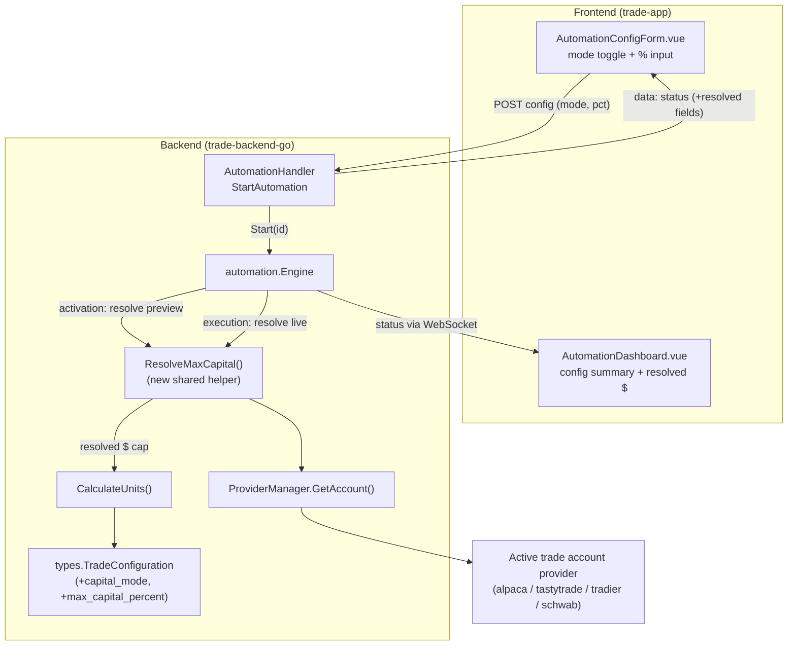

# Technical Design — Auto Mode: Percentage-based Max Capital

**Issue:** [#75](https://github.com/schardosin/juicytrade/issues/75) — Auto Mode with percentage for Max Capital
**Author:** @architect
**Status:** Draft — pending PO review
**Requirements:** [requirements.md](./requirements.md)

---

## Table of Contents

1. **Overview** — Summary of the change and design goals.
2. **Design Principles & Constraints** — No-fallback rule, backward compatibility, scope.
3. **Component Architecture** — Component diagram of the affected pieces (backend + frontend).
4. **Backend Data Model** — `TradeConfiguration` field additions, JSON contract, defaults/migration.
5. **Capital Resolution Service** — The single shared helper that resolves percentage → dollars against Net Liq, including no-fallback failure handling.
6. **Resolution Point A — Auto Trade Activation (preview)** — Changes to `Engine.Start`, surfacing the resolved figure to the frontend.
7. **Resolution Point B — Trade Execution (live)** — Changes to `handleTradingState` and delta-drift replacement paths, before `CalculateUnits()`.
8. **Sizing Calculation** — How `CalculateUnits()` consumes the resolved cap (formula unchanged).
9. **API Contract Changes** — Activation response payload and status shape returned to the frontend.
10. **Frontend Contract** — Data flow to `AutomationConfigForm.vue` and `AutomationDashboard.vue` (handoff notes for @ux).
11. **Logging & Auditability** — What is logged at activation and execution, and on failure.
12. **Sequence Diagrams** — Activation and execution flows (mermaid).
13. **Error Handling Matrix** — Every failure condition and its outcome.
14. **File-by-File Change List** — Concrete implementation guidance for @dev.
15. **Testing Strategy** — Unit/integration tests mapped to acceptance criteria.
16. **Risks & Trade-offs** — Decisions made and their rationale.

---

## 1. Overview

Today an automation's Max Capital is a fixed dollar amount stored as
`trade_config.max_capital` and consumed by `TradeConfiguration.CalculateUnits()`
(`units = int(max_capital / (width * 100))`). This issue adds a **capital mode**
so Max Capital can instead be expressed as a **percentage of the active trade
account's Net Liq** (`account.equity`).

The percentage is resolved to a concrete dollar amount at **two moments**:

- **Auto Trade activation** — resolved once and surfaced to the frontend so the
  user sees what will be risked when the automation starts.
- **Trade execution** — re-resolved with live account data immediately before
  position sizing, so the actual size reflects the account state at trade time.

If Net Liq cannot be read or is non-positive at either moment, the operation
**fails with a clear error and log entry** — there is no fallback to a fixed
amount or default.

### Design goals
- **Minimal, localized change.** Reuse the existing `TradeConfiguration`,
  `Engine`, and `ProviderManager.GetAccount()`; add one small shared resolver.
- **Backward compatible.** Existing configs (no mode) behave exactly as before.
- **No new endpoints.** Reuse the activation response's existing `data: status`
  payload to carry the resolved figure back to the frontend.
- **Auditable.** Every resolution and failure is logged in the automation log.

---

## 2. Design Principles & Constraints

| Principle | Implication |
|-----------|-------------|
| **No fallback** | Any failure to obtain a valid Net Liq → hard failure. Never substitute a default or the stored fixed `max_capital`. |
| **Backward compatibility** | `capital_mode` absent/empty ⇒ treated as `fixed`. Existing `max_capital` continues to drive sizing untouched. |
| **Single source of truth for resolution** | One shared function resolves percentage → dollars; used by both activation and execution so the math cannot diverge. |
| **Net Liq only** | Percentage base is strictly `account.equity` of the active trade account. No buying power / cash / portfolio value. |
| **Formula unchanged** | `CalculateUnits()` keeps `units = int(cap / (width*100))`. Only the `cap` value's origin changes. |
| **Active trade account only** | Resolution always reads via `ProviderManager.GetAccount()` (the `trade_account`-mapped provider). No account selection change. |

`account.Equity` is a `*float64` (nullable pointer) in `models.Account`. "Net Liq
unavailable" therefore includes: `GetAccount` error, nil `Account`, `nil` Equity
pointer, or a non-positive value (`<= 0`).

---

## 3. Component Architecture



**Affected files (summary; full list in §14):**
- `internal/automation/types/types.go` — new fields + a resolver method.
- `internal/automation/engine.go` — activation resolution in `Start`, live
  resolution in `handleTradingState` and the two delta-drift replacement paths.
- `internal/automation/types/types.go` (or `engine.go`) — resolved-value carrier
  on `ActiveAutomation`.
- `trade-app` — `AutomationConfigForm.vue`, `AutomationDashboard.vue` (UI detail owned by @ux).

---

## 4. Backend Data Model

### 4.1 New fields on `TradeConfiguration`

Add two fields to `TradeConfiguration` (`internal/automation/types/types.go`).
Both use `snake_case` JSON tags and `omitempty` so existing persisted configs and
API payloads remain valid.

```go
// CapitalMode selects how MaxCapital is interpreted.
type CapitalMode string

const (
    CapitalModeFixed   CapitalMode = "fixed"   // MaxCapital is a dollar amount (default / legacy)
    CapitalModePercent CapitalMode = "percent" // MaxCapital derived from % of account Net Liq
)

type TradeConfiguration struct {
    // ... existing fields ...
    MaxCapital float64 `json:"max_capital"` // Fixed dollar cap (used when mode == fixed)

    // NEW:
    CapitalMode      CapitalMode `json:"capital_mode,omitempty"`       // "fixed" | "percent"; empty => fixed
    MaxCapitalPercent float64    `json:"max_capital_percent,omitempty"` // 1..100, used when mode == percent
    // ... existing fields ...
}
```

**Field rationale**
- `capital_mode` is a small typed enum (mirrors the existing `TradeStrategy`,
  `RecurrenceMode` patterns in this file).
- `max_capital_percent` is `float64` to allow a small number of decimals if
  @ux chooses; validation enforces `1 <= pct <= 100`. Stored as the whole
  percent (e.g., `60` means 60%), matching the requirements' examples.
- The existing `max_capital` field is retained unchanged and continues to be the
  authoritative value in `fixed` mode. In `percent` mode it is **ignored** for
  sizing (each UI mode keeps its own value per FR-2; the backend simply uses
  whichever field the mode selects).

### 4.2 Backward compatibility & migration

- **No data migration needed.** Persisted configs are JSON. Older configs have no
  `capital_mode` key → Go unmarshals it to the zero value `""`. A single helper
  normalizes empty → `fixed`:

```go
// EffectiveCapitalMode returns the mode, defaulting empty to fixed.
func (tc *TradeConfiguration) EffectiveCapitalMode() CapitalMode {
    if tc.CapitalMode == "" {
        return CapitalModeFixed
    }
    return tc.CapitalMode
}
```

- `NewTradeConfiguration()` sets `CapitalMode: CapitalModeFixed` explicitly for
  newly created configs (keeps `MaxCapital: 5000` default). This is cosmetic —
  behavior for empty is identical.

### 4.3 Validation

Validation lives in the config create/update path and (defensively) at
activation. Enforced rules:

| Mode | Rule |
|------|------|
| `fixed` | `max_capital >= 100` (existing behavior; unchanged). |
| `percent` | `1 <= max_capital_percent <= 100`, else reject with a clear message. |

The frontend enforces the same bounds (FR-2). The backend must **also** validate
(never trust the client) — reject invalid `percent` configs at create/update, and
re-check at activation as a safety net.

---

## 5. Capital Resolution Service

A **single shared function** resolves a config's effective dollar cap. Both the
activation path and the execution path call it, guaranteeing identical math and
identical no-fallback semantics.

Recommended location: a method on `*Engine` (it already holds `providerManager`),
with the pure math factored into a testable helper on `TradeConfiguration`.

### 5.1 Pure math helper (unit-testable, no I/O)

```go
// ResolveMaxCapitalFromNetLiq computes the dollar cap for the given net liq.
// Returns an error (no fallback) when the config is percent-mode but netLiq is
// non-positive, or when the percent is out of range.
func (tc *TradeConfiguration) ResolveMaxCapital(netLiq *float64) (float64, error) {
    if tc.EffectiveCapitalMode() == CapitalModeFixed {
        return tc.MaxCapital, nil
    }
    // percent mode
    pct := tc.MaxCapitalPercent
    if pct < 1 || pct > 100 {
        return 0, fmt.Errorf("invalid max_capital_percent %.2f (must be 1..100)", pct)
    }
    if netLiq == nil || *netLiq <= 0 {
        return 0, fmt.Errorf("net liq unavailable or non-positive; cannot resolve percentage cap")
    }
    return *netLiq * (pct / 100.0), nil
}
```

### 5.2 Engine-level resolver (fetches Net Liq, applies no-fallback)

```go
// resolveTradeCapital fetches the active trade account's Net Liq (when needed)
// and returns the resolved dollar cap. On any failure in percent mode it returns
// an error — the caller must fail the operation (no fallback).
func (e *Engine) resolveTradeCapital(ctx context.Context, tc *types.TradeConfiguration) (resolved float64, netLiq float64, err error) {
    if tc.EffectiveCapitalMode() == types.CapitalModeFixed {
        return tc.MaxCapital, 0, nil
    }
    account, aerr := e.providerManager.GetAccount(ctx)
    if aerr != nil {
        return 0, 0, fmt.Errorf("failed to fetch account for Net Liq: %w", aerr)
    }
    if account == nil || account.Equity == nil || *account.Equity <= 0 {
        return 0, 0, fmt.Errorf("Net Liq (account.equity) unavailable or non-positive")
    }
    cap, rerr := tc.ResolveMaxCapital(account.Equity)
    if rerr != nil {
        return 0, *account.Equity, rerr
    }
    return cap, *account.Equity, nil
}
```

`netLiq` is returned separately so the caller can log the value that was read
(FR-8). In `fixed` mode no account call is made (avoids unnecessary provider I/O).

---

## 6. Resolution Point A — Auto Trade Activation (preview)

### 6.1 Where it happens

`Engine.Start(id string) error` (`engine.go`) is the activation entry point,
called by `AutomationHandler.StartAutomation`. Today it loads the config, creates
the `ActiveAutomation` (status `waiting`), subscribes symbols, and launches the
loop. We insert the activation-time resolution **before** the automation is
registered as active, so a failure aborts the start cleanly.

### 6.2 New carrier fields on `ActiveAutomation`

To surface the resolved figure to the frontend via the existing status payload,
add three fields to `ActiveAutomation` (`types.go`):

```go
type ActiveAutomation struct {
    // ... existing fields ...

    // Capital resolution (percent mode). Zero/omitted in fixed mode.
    ResolvedMaxCapital  float64 `json:"resolved_max_capital,omitempty"`  // dollars resolved at activation
    ResolvedNetLiq      float64 `json:"resolved_net_liq,omitempty"`      // Net Liq read at activation
    ResolvedAt          *time.Time `json:"resolved_at,omitempty"`        // timestamp of the activation resolution
}
```

These are runtime-only (part of `ActiveAutomation`, not persisted config). They
are refreshed again at execution time (§7) so the dashboard can show the latest
resolved value.

### 6.3 Modified `Start` flow

```go
func (e *Engine) Start(id string) error {
    e.mu.Lock()
    defer e.mu.Unlock()

    if _, exists := e.activeAutomations[id]; exists {
        return fmt.Errorf("automation %s is already running", id)
    }
    config, err := e.storage.Get(id)
    if err != nil { return err }
    if !config.Enabled { return fmt.Errorf("automation %s is disabled", id) }

    // NEW: activation-time capital resolution (percent mode only).
    ctx, cancel := context.WithTimeout(context.Background(), 15*time.Second)
    defer cancel()

    active := &types.ActiveAutomation{
        Config:    config,
        Status:    types.StatusWaiting,
        StartedAt: time.Now(),
        Logs:      make([]types.AutomationLog, 0),
    }
    active.AddLog("info", "Automation started")

    if config.TradeConfig.EffectiveCapitalMode() == types.CapitalModePercent {
        resolved, netLiq, rerr := e.resolveTradeCapital(ctx, &config.TradeConfig)
        if rerr != nil {
            // NO FALLBACK: activation fails.
            active.AddLog("error", fmt.Sprintf(
                "Activation failed: cannot resolve %.2f%% of Net Liq: %v",
                config.TradeConfig.MaxCapitalPercent, rerr))
            slog.Error("Activation failed - Net Liq resolution", "id", id, "error", rerr)
            return fmt.Errorf("cannot activate: %w", rerr)
        }
        now := time.Now()
        active.ResolvedMaxCapital = resolved
        active.ResolvedNetLiq = netLiq
        active.ResolvedAt = &now
        active.AddLog("info", fmt.Sprintf(
            "Capital resolved at activation: %.2f%% of Net Liq $%.2f = $%.2f",
            config.TradeConfig.MaxCapitalPercent, netLiq, resolved))
    }

    e.activeAutomations[id] = active
    e.stopChannels[id] = make(chan struct{})
    e.subscribeIndicatorSymbols(config)
    go e.runAutomation(id, e.stopChannels[id])

    slog.Info("Automation started", "id", id, "name", config.Name)
    e.notifyUpdate(id, active)
    return nil
}
```

Because `Start` returns an `error`, `StartAutomation` already maps a failed start
to HTTP 400 with the error message — the no-fallback behavior surfaces to the UI
with **no handler change required** for the failure case (see §9).

> **Note on `context.Background()`:** `Start` currently has no request context.
> Using a 15s-timeout background context here is consistent with other engine
> methods (e.g., `subscribeIndicatorSymbols`). If the team prefers to thread the
> request context, `StartAutomation` can pass `c.Request.Context()` into a new
> `Start(ctx, id)` signature — a small, optional refinement noted in §16.

---

## 7. Resolution Point B — Trade Execution (live)

### 7.1 Where it happens

Position size is computed via `CalculateUnits()` at **three** call sites in
`engine.go`:

1. `handleTradingState` (line ~627) — the primary trade placement path.
2. `handleOrderAdjustment` → Iron Condor delta-drift replacement (line ~939).
3. `handleOrderAdjustment` → credit-spread delta-drift replacement (line ~982).

All three must size from the **live-resolved** cap in percent mode. To keep the
change localized and DRY, we resolve the cap **once per trade attempt** and pass
the resolved dollar value into sizing.

### 7.2 Design: resolve then size

`CalculateUnits()` reads `tc.MaxCapital`. Rather than change its signature
everywhere, introduce a sibling that accepts the resolved cap explicitly, and
have the engine compute units from the live-resolved value:

```go
// CalculateUnitsWithCapital is CalculateUnits but with the cap supplied by the
// caller (already resolved from fixed $ or % of Net Liq).
func (tc *TradeConfiguration) CalculateUnitsWithCapital(resolvedMaxCapital float64) int {
    width := tc.Width
    if tc.Strategy == StrategyIronCondor && tc.PutSideConfig != nil && tc.CallSideConfig != nil {
        if tc.PutSideConfig.Width > tc.CallSideConfig.Width {
            width = tc.PutSideConfig.Width
        } else {
            width = tc.CallSideConfig.Width
        }
    }
    if width <= 0 { return 0 }
    units := int(resolvedMaxCapital / (float64(width) * 100.0))
    if units < 1 { return 0 }
    return units
}

// CalculateUnits stays for backward compatibility (fixed-mode callers/tests):
func (tc *TradeConfiguration) CalculateUnits() int {
    return tc.CalculateUnitsWithCapital(tc.MaxCapital)
}
```

### 7.3 Modified `handleTradingState`

Replace the current `units := active.Config.TradeConfig.CalculateUnits()` with a
resolve-then-size block at the top of the trading state:

```go
ctx, cancel := context.WithTimeout(context.Background(), 60*time.Second)
defer cancel()

// LIVE resolution (percent mode re-fetches current Net Liq; fixed returns MaxCapital).
resolvedCap, netLiq, rerr := e.resolveTradeCapital(ctx, &active.Config.TradeConfig)
if rerr != nil {
    // NO FALLBACK: fail the trade.
    e.mu.Lock()
    active.AddLog("error", fmt.Sprintf("Trade blocked: cannot resolve capital: %v", rerr))
    e.failOrDeferTrade(active, "Net Liq unavailable at execution") // see note below
    e.mu.Unlock()
    e.notifyUpdate(id, active)
    return
}
if active.Config.TradeConfig.EffectiveCapitalMode() == types.CapitalModePercent {
    now := time.Now()
    active.ResolvedMaxCapital = resolvedCap
    active.ResolvedNetLiq = netLiq
    active.ResolvedAt = &now
    active.AddLog("info", fmt.Sprintf(
        "Capital resolved at execution: %.2f%% of Net Liq $%.2f = $%.2f",
        active.Config.TradeConfig.MaxCapitalPercent, netLiq, resolvedCap))
}

units := active.Config.TradeConfig.CalculateUnitsWithCapital(resolvedCap)
if units == 0 {
    // existing "Insufficient capital" handling, unchanged
}
```

**Failure state on execution:** The existing code marks `StatusFailed` (once
mode) or defers to next trading day (daily recurrence, after error threshold).
The Net-Liq failure should follow the **same** state semantics as an order
placement failure so recurrence behaves consistently: increment `ErrorCount`,
log the reason, and for `once` set `StatusFailed`; for `daily` set
`StatusWaiting` and (past threshold) `TradedToday`. `failOrDeferTrade` in the
snippet is a documentation placeholder — @dev may inline this to match the
existing `err != nil` block in `handleTradingState` rather than add a helper, as
long as the outcome matches the **Error Handling Matrix (§13)**.

### 7.4 Delta-drift replacement paths

In `handleOrderAdjustment`, both replacement branches currently call
`config.CalculateUnits()`. Change both to reuse the **already-resolved** cap for
this trade attempt. The simplest, race-free approach: read
`active.ResolvedMaxCapital` (set at the start of the trade in §7.3) when in
percent mode, else use fixed:

```go
resolvedCap := config.MaxCapital
if config.EffectiveCapitalMode() == types.CapitalModePercent {
    resolvedCap = active.ResolvedMaxCapital // resolved for this trade attempt
}
units := config.CalculateUnitsWithCapital(resolvedCap)
```

Delta-drift replacement happens within the same order lifecycle as the initial
placement, so reusing the value resolved at trade start (§7.3) is correct and
avoids extra provider calls mid-adjustment. (Re-fetching per replacement is an
option but adds latency and inconsistency; see §16 trade-off.)

---

## 8. Sizing Calculation

The formula is unchanged (FR-6, AC-7):

```
units = int(resolved_max_capital / (width * 100))
```

- `fixed` mode: `resolved_max_capital = max_capital` (identical to today).
- `percent` mode: `resolved_max_capital = net_liq * (max_capital_percent / 100)`.
- Iron Condor still sizes off the wider side's width (logic preserved inside
  `CalculateUnitsWithCapital`).
- `units < 1` still yields `0`, driving the existing "Insufficient capital"
  failure path.

**Worked example (AC-4/AC-7):** Net Liq $10,000, `max_capital_percent = 60`,
put spread `width = 20`:
`resolved = 10000 * 0.60 = $6,000`; `units = int(6000 / (20*100)) = int(3.0) = 3`.

---

## 9. API Contract Changes

No new endpoints. Two existing surfaces carry the new data.

### 9.1 Config create/update (`POST/PUT /api/automation/configs`)

Request/response `trade_config` object gains two optional fields:

```jsonc
{
  "trade_config": {
    "strategy": "put_spread",
    "width": 20,
    "target_delta": 0.05,
    "max_capital": 5000,              // used when capital_mode = "fixed"
    "capital_mode": "percent",        // NEW: "fixed" | "percent" (absent => "fixed")
    "max_capital_percent": 60,        // NEW: 1..100, used when capital_mode = "percent"
    "order_type": "limit"
    // ... existing fields ...
  }
}
```

Validation errors return the existing shape:
`{ "success": false, "message": "max_capital_percent must be between 1 and 100" }`.

### 9.2 Activation (`POST /api/automation/:id/start`)

The handler already returns `data: status` where `status` is the
`ActiveAutomation`. With the new carrier fields (§6.2), a successful percent-mode
activation returns:

```jsonc
{
  "success": true,
  "message": "Automation started successfully",
  "data": {
    "config": { /* ... */ },
    "status": "waiting",
    "resolved_max_capital": 6000,     // NEW — dollars the user will risk
    "resolved_net_liq": 10000,        // NEW — Net Liq read at activation
    "resolved_at": "2026-07-12T22:31:00Z", // NEW
    "logs": [ /* includes the resolution info log */ ]
  }
}
```

On **failure** (no fallback), `Start` returns an error and the existing handler
responds HTTP 400:

```jsonc
{
  "success": false,
  "message": "cannot activate: Net Liq (account.equity) unavailable or non-positive"
}
```

### 9.3 Status / WebSocket updates

`GetAutomationStatus`, `GetAllStatus`, and the WebSocket status broadcasts all
serialize `ActiveAutomation`, so `resolved_max_capital` / `resolved_net_liq` /
`resolved_at` flow to the dashboard automatically after activation and again
after each execution-time resolution — **no handler changes needed** beyond the
struct additions.

---

## 10. Frontend Contract (handoff to @ux)

This section defines the data contract only. Visual/interaction design is owned
by @ux; the notes below constrain the contract they must satisfy.

### 10.1 `AutomationConfigForm.vue`
- Current: single currency `InputNumber` bound to `config.trade_config.max_capital`
  (min 100) at ~line 426; default object at ~line 913 sets `max_capital: 5000`.
- Add to the reactive config default: `capital_mode: 'fixed'`,
  `max_capital_percent: 60` (a sensible starting value; @ux to confirm).
- Add a **toggle / two-option selector** ("Fixed Amount ($)" vs "Percentage (%)")
  bound to `config.trade_config.capital_mode`.
- When `capital_mode === 'fixed'`: show the existing currency input (min 100),
  bound to `max_capital` — unchanged.
- When `capital_mode === 'percent'`: show a percentage input bound to
  `max_capital_percent`, constrained `1..100`, with a validation message when out
  of range (AC-2). Each mode retains its own value (FR-2).
- **Preview aid (FR-4a):** where the form previews sizing/strikes, if account
  Net Liq is available client-side, it *may* display `net_liq * pct/100` as a
  best-effort resolved figure. This is display-only; the authoritative resolution
  is server-side at activation/execution. If no cheap client-side Net Liq source
  exists, this preview can be omitted without affecting correctness (@ux decides).

### 10.2 `AutomationDashboard.vue`
- Current: config summary shows `${{ formatNumber(config.trade_config?.max_capital) }}`
  (~line 185).
- New behavior driven by `capital_mode`:
  - `fixed`: show `$<max_capital>` (unchanged).
  - `percent`: show the percentage (e.g., `60%`). When the status payload carries
    `resolved_max_capital > 0` (post-activation/live), also show the resolved
    dollar amount, e.g., `60% (≈ $6,000)`.
- The dashboard reads `resolved_max_capital` / `resolved_net_liq` from the
  automation status object (already delivered via status endpoints + WebSocket,
  §9.3). No new API calls required.

### 10.3 Frontend conventions to respect
- JavaScript + Options API with `setup()`; PrimeVue components; scoped CSS + CSS
  custom properties (per AGENTS.md). `snake_case` field names on the wire.

---

## 11. Logging & Auditability (FR-8)

All logging uses the existing `ActiveAutomation.AddLog(level, message)` (persisted
in `Logs`, capped at 100) plus `slog` for server logs. Emoji prefixes optional per
project style.

| Moment | Level | Log content |
|--------|-------|-------------|
| Activation (percent, success) | info | `Capital resolved at activation: <pct>% of Net Liq $<netliq> = $<resolved>` |
| Activation (percent, failure) | error | `Activation failed: cannot resolve <pct>% of Net Liq: <reason>` |
| Execution (percent, success) | info | `Capital resolved at execution: <pct>% of Net Liq $<netliq> = $<resolved>` |
| Execution (percent, failure) | error | `Trade blocked: cannot resolve capital: <reason>` |
| Fixed mode | (none new) | No extra logs; behavior unchanged. |

Failure reasons are explicit: `GetAccount` error, `account.equity` missing/nil,
non-positive Net Liq, or out-of-range percent. This makes every percentage-based
risk decision auditable from the automation log.

---

## 12. Sequence Diagrams

### 12.1 Activation (percent mode)

```mermaid
sequenceDiagram
    participant UI as AutomationConfigForm
    participant H as AutomationHandler
    participant E as Engine.Start
    participant R as resolveTradeCapital
    participant PM as ProviderManager
    participant P as Trade Account Provider

    UI->>H: POST /automation/:id/start
    H->>E: Start(id)
    E->>E: load config, build ActiveAutomation
    alt capital_mode == percent
        E->>R: resolve(ctx, tradeConfig)
        R->>PM: GetAccount(ctx)
        PM->>P: GetAccount
        P-->>PM: Account{equity}
        PM-->>R: Account
        alt equity valid (>0)
            R-->>E: resolved $, netLiq
            E->>E: set ResolvedMaxCapital/NetLiq/At; log info
            E-->>H: nil (success)
            H-->>UI: 200 data.status{resolved_max_capital,...}
        else equity nil / <= 0 / error
            R-->>E: error (NO FALLBACK)
            E->>E: log error, do NOT register active
            E-->>H: error
            H-->>UI: 400 {success:false, message}
        end
    else capital_mode == fixed
        E-->>H: nil (uses max_capital)
        H-->>UI: 200 data.status
    end
```

### 12.2 Trade execution (percent mode)

```mermaid
sequenceDiagram
    participant Loop as runAutomationTick
    participant TS as handleTradingState
    participant R as resolveTradeCapital
    participant PM as ProviderManager
    participant Calc as CalculateUnitsWithCapital

    Loop->>TS: status == trading
    TS->>R: resolve(ctx, tradeConfig)  %% live re-fetch
    R->>PM: GetAccount(ctx)
    PM-->>R: Account{equity}
    alt equity valid
        R-->>TS: resolved $, netLiq
        TS->>TS: update Resolved* fields; log info
        TS->>Calc: units = resolved / (width*100)
        Calc-->>TS: units
        alt units >= 1
            TS->>TS: find strikes, place order → monitoring
        else units == 0
            TS->>TS: Insufficient capital → fail/defer
        end
    else equity invalid / error
        R-->>TS: error (NO FALLBACK)
        TS->>TS: log error; fail (once) / defer (daily)
    end
```

---

## 13. Error Handling Matrix

| # | Condition | Mode | Moment | Outcome |
|---|-----------|------|--------|---------|
| 1 | `capital_mode` empty | — | any | Treated as `fixed`; use `max_capital`. Unchanged behavior. |
| 2 | `max_capital_percent` < 1 or > 100 | percent | create/update | Reject config with 400 + message. |
| 3 | `max_capital_percent` < 1 or > 100 | percent | activation (defensive) | `Start` returns error → 400. |
| 4 | `GetAccount` returns error | percent | activation | `Start` fails → 400, error log. **No fallback.** |
| 5 | `account == nil` or `equity == nil` | percent | activation | `Start` fails → 400, error log. **No fallback.** |
| 6 | `equity <= 0` | percent | activation | `Start` fails → 400, error log. **No fallback.** |
| 7 | `GetAccount` error / equity invalid | percent | execution | Trade fails: `once` → `StatusFailed`; `daily` → defer per existing ErrorCount logic. Error log. **No fallback.** |
| 8 | Resolved cap too small (`units == 0`) | either | execution | Existing "Insufficient capital" failure path (unchanged). |
| 9 | Delta-drift replacement | percent | execution | Reuse cap resolved at trade start; no re-fetch. |
| 10 | `fixed` mode | fixed | any | No account call; identical to today (AC-3). |

---

## 14. File-by-File Change List (implementation guidance for @dev)

**Backend — `trade-backend-go`**

1. `internal/automation/types/types.go`
   - Add `CapitalMode` type + `CapitalModeFixed`/`CapitalModePercent` consts.
   - Add `CapitalMode` and `MaxCapitalPercent` fields to `TradeConfiguration`
     (snake_case, `omitempty`).
   - Add `EffectiveCapitalMode()`, `ResolveMaxCapital(netLiq *float64)`,
     `CalculateUnitsWithCapital(cap float64)`; refactor `CalculateUnits()` to
     delegate to it.
   - Set `CapitalMode: CapitalModeFixed` in `NewTradeConfiguration()`.
   - Add `ResolvedMaxCapital`, `ResolvedNetLiq`, `ResolvedAt` to `ActiveAutomation`.

2. `internal/automation/engine.go`
   - Add `resolveTradeCapital(ctx, *TradeConfiguration)` engine method.
   - `Start`: perform activation-time resolution + no-fallback failure; set
     Resolved* fields; log.
   - `handleTradingState`: live resolution before sizing; use
     `CalculateUnitsWithCapital`; fail/defer on error.
   - `handleOrderAdjustment` (both IC and spread branches): size from the
     trade's resolved cap.

3. `internal/api/handlers/automation.go`
   - Add `max_capital_percent` range validation to `CreateConfig` and
     `UpdateConfig` (percent mode). No change needed to `StartAutomation`
     (error already surfaces as 400; success payload already returns status).

**Frontend — `trade-app`** (contract per §10; visuals by @ux)

4. `src/components/automation/AutomationConfigForm.vue`
   - Add `capital_mode` + `max_capital_percent` to the config default (~line 913).
   - Add mode toggle + conditional inputs (~line 426 area) with 1..100 validation.

5. `src/components/automation/AutomationDashboard.vue`
   - Mode-aware config summary (~line 185): `$amount` for fixed; `pct%` (+ resolved
     `$` when present) for percent.

---

## 15. Testing Strategy (maps to AC-9)

**Go backend (`go test ./...`, stdlib `testing`, `httptest` for provider mocks):**

- `types_test.go`
  - `ResolveMaxCapital`: fixed returns `max_capital`; percent math
    (`10000 @ 60% = 6000`); out-of-range pct → error; nil/`<=0` netLiq → error
    (no fallback). *(AC-6, AC-7)*
  - `CalculateUnitsWithCapital`: spread + Iron Condor wider-side; `units < 1 → 0`.
  - `EffectiveCapitalMode`: empty → fixed. *(AC-3)*
- Engine tests (mock provider via existing `httptest`/mock patterns)
  - Activation success sets Resolved* fields; activation failure (nil equity,
    `GetAccount` error, `equity<=0`) returns error and does **not** register the
    automation. *(AC-4, AC-6)*
  - Execution re-fetches Net Liq and sizes from live value; execution failure
    fails/defers correctly. *(AC-5, AC-6)*
  - Backward compat: fixed config sizes exactly as before, makes no account call. *(AC-3)*
- Handler tests: `CreateConfig`/`UpdateConfig` reject percent out of 1..100. *(AC-2)*

**Frontend (`npx vitest run`, @vue/test-utils):**
- Toggle swaps inputs; percent input rejects <1 / >100 with a message. *(AC-1, AC-2)*
- Dashboard renders `$` for fixed and `pct%` (+ resolved `$`) for percent. *(AC-8)*

---

## 16. Risks & Trade-offs

| Decision | Alternative | Rationale |
|----------|-------------|-----------|
| Reuse activation response `data.status` for the resolved figure | Add a separate `/preview-capital` endpoint | Zero new endpoints; the resolved value is naturally part of the running automation's state and already streamed to the dashboard. A dedicated endpoint would duplicate resolution logic and add surface area. |
| Add `CalculateUnitsWithCapital` and keep `CalculateUnits` | Change `CalculateUnits` signature everywhere | Preserves backward compatibility for existing callers/tests; the fixed-mode path and current unit tests stay valid. |
| Resolve once per trade attempt; delta-drift reuses that value | Re-fetch Net Liq on every replacement | Delta-drift replacements are within one order lifecycle (seconds/minutes); re-fetching adds latency and could cause size to jump mid-adjustment. Resolving at trade start is consistent and cheaper. |
| `Start` uses a background context with timeout | Thread request context through `Start(ctx, id)` | Matches existing engine conventions and keeps the change minimal. Threading the context is a clean optional refinement if the team wants request-scoped cancellation on activation. |
| Store percent as whole number `float64` (e.g., `60`) | Store fraction `0.60` | Matches the requirements' examples and the UI (1..100), reduces ambiguity in logs and payloads. |
| No data migration | Backfill `capital_mode: "fixed"` on load | `EffectiveCapitalMode()` normalizes empty → fixed at read time; migration adds risk for zero behavioral benefit (AC-3). |

**Residual risks**
- **Provider Net Liq semantics:** `account.equity` maps to Alpaca `Equity` and
  tastytrade `net-liquidating-value`; Tradier/Schwab must populate `Equity` for
  percent mode to work. If a provider leaves `Equity` nil, percent mode correctly
  **fails** (no fallback) rather than mis-sizing — surfaced clearly in logs.
- **Live Net Liq latency at execution:** one extra `GetAccount` call in the
  trading path (percent mode only). Bounded by the existing 60s trading context;
  acceptable for the automation cadence.

