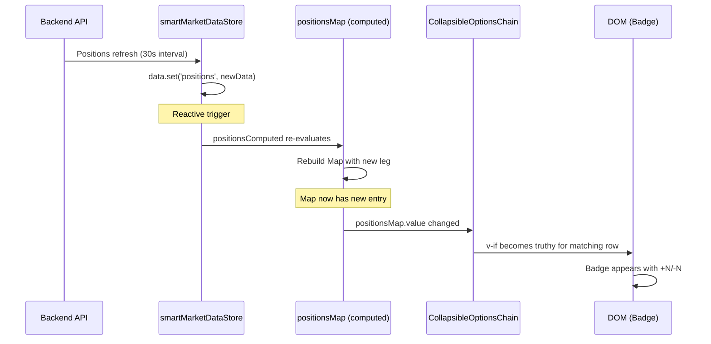

# Technical Architecture: Show Existing Positions in the Options Chain

**Issue:** [#77](https://github.com/schardosin/juicytrade/issues/77)  
**Date:** 2026-07-14  
**Status:** Draft

## Table of Contents

1. **System Overview** — High-level component interaction and data flow
2. **Data Flow & Position Map Strategy** — How positions are fetched, mapped, and consumed
3. **Component Architecture** — Integration points in CollapsibleOptionsChain.vue
4. **Position Map Data Structure** — Key format, aggregation logic, O(1) lookup design
5. **Badge Component Design** — Visual design, template placement, CSS approach
6. **Reactive Update Lifecycle** — How the UI responds to position data changes
7. **Mobile Responsiveness** — Layout adjustments for mobile/tablet
8. **File Change Summary** — All files to be modified with scope of changes
9. **Implementation Guidance** — Key patterns, edge cases, testing approach

---

## 1. System Overview

This feature is **frontend-only**. No backend API changes are required. The positions data is already available reactively in `smartMarketDataStore` and auto-refreshes every 30 seconds. The feature adds a visual badge to each options chain row that has a matching open position.

### Component Interaction Diagram

```mermaid
graph TB
    subgraph "Data Layer (Existing)"
        SMS[smartMarketDataStore]
        WS[WebSocket / Periodic API]
        WS -->|positions update every 30s| SMS
    end

    subgraph "Composable Layer (Existing)"
        UMD[useMarketData composable]
        SMS -->|getFilteredPositions| UMD
    end

    subgraph "View Layer (Existing)"
        OTV[OptionsTrading.vue]
        OTV -->|uses| UMD
    end

    subgraph "Component Layer (Modified)"
        COC[CollapsibleOptionsChain.vue]
        OTV -->|:symbol prop| COC
        COC -->|uses| UMD
        COC -->|builds| PM[positionsMap computed]
        PM -->|O(1) lookup per row| BADGE[Position Badge]
    end

    style COC fill:#2a4a2a,stroke:#00c851
    style PM fill:#2a4a2a,stroke:#00c851
    style BADGE fill:#2a4a2a,stroke:#00c851
```

### Design Decisions

| Decision | Choice | Rationale |
|----------|--------|-----------|
| Data access pattern | Direct composable in CollapsibleOptionsChain | Component already imports `useMarketData`; no prop drilling needed from parent |
| Lookup key format | Option symbol string (e.g., `SPX250718C05500000`) | Each options row already exposes `symbol` via `getCallOption()`/`getPutOption()`; eliminates composite key complexity |
| Badge placement | Inside existing `.option-data` grid, overlaid via CSS `position: absolute` | Avoids changing grid column count (which would break layout for all rows) |
| Position aggregation | Pre-computed `Map<symbol, netQty>` per symbol change | O(1) per-row lookup; recomputed only when positions data or symbol changes |

---

## 2. Data Flow & Position Map Strategy

### Current Data Path (Existing)

```
Backend API → smartMarketDataStore.data.get('positions') → getFilteredPositions(symbol) → computed ref
```

The `getFilteredPositions(symbol)` method already:
1. Handles all response formats (enhanced `symbol_groups`, legacy `position_groups`, flat `positions`)
2. Filters by symbol group (handles weekly variants like SPXW/SPX)
3. Returns a reactive computed with `{ positions: [...legs], filtered_count }` 

Each leg in `positions` has:
```javascript
{
  symbol: "SPX250718C05500000",   // Option contract symbol
  qty: 2,                         // Positive = long, negative = short
  strike_price: 5500,             // From parsed symbol or direct field
  option_type: "call",            // "call" or "put"
  expiry_date: "2025-07-18",     // YYYY-MM-DD
  underlying_symbol: "SPX",
  asset_class: "us_option",
  // ... other fields (avg_entry_price, cost_basis, etc.)
}
```

### New Data Path (This Feature)

```
getFilteredPositions(symbol) → positionsMap computed → per-row badge render
```

The `positionsMap` is a `computed` that transforms the positions array into a `Map<string, number>` keyed by option symbol:

```javascript
// Built once when positions or symbol changes
const positionsMap = computed(() => {
  const map = new Map();
  const positionsData = positionsComputed.value;
  if (!positionsData?.positions) return map;
  
  for (const leg of positionsData.positions) {
    if (!leg.symbol) continue;
    const existing = map.get(leg.symbol) || 0;
    map.set(leg.symbol, existing + leg.qty);  // Net aggregation (FR-4)
  }
  return map;
});
```

**Key insight:** The option symbols in positions data use the same format as those in the options chain data (e.g., `SPX250718C05500000`). This was confirmed by examining `OptionsTrading.vue` lines 427-429 where `optionsManager.flattenedData.value.find(opt => opt.symbol === position.symbol)` successfully matches chain options to position symbols. This means we can key the map directly by `symbol` for exact matching — no composite key needed.

---

## 3. Component Architecture

### Integration Points in CollapsibleOptionsChain.vue

The component uses the **Options API with `setup()` function** pattern. Here are the specific integration points:

#### 3.1 Import Addition
```javascript
// Already imported:
import { useMarketData } from "../composables/useMarketData.js";

// In setup():
const { getOptionPrice, getOptionGreeks } = useMarketData();
// ADD: getPositionsForSymbol
const { getOptionPrice, getOptionGreeks, getPositionsForSymbol } = useMarketData();
```

#### 3.2 Positions Computed (in `setup()`)
```javascript
// NEW: Reactive positions data filtered for current symbol
const positionsComputed = computed(() => {
  return getPositionsForSymbol(props.symbol).value;
});

// NEW: O(1) lookup map keyed by option symbol → net qty
const positionsMap = computed(() => {
  const map = new Map();
  const data = positionsComputed.value;
  if (!data?.positions) return map;
  
  for (const leg of data.positions) {
    if (!leg.symbol) continue;
    const current = map.get(leg.symbol) || 0;
    map.set(leg.symbol, current + leg.qty);
  }
  return map;
});
```

#### 3.3 Per-Row Accessor Method
```javascript
// NEW: Get position quantity for a specific option symbol
const getPositionQty = (symbol) => {
  if (!symbol) return 0;
  return positionsMap.value.get(symbol) || 0;
};
```

#### 3.4 Template Return
```javascript
return {
  // ... existing returns ...
  getPositionQty,  // NEW
};
```

### Template Integration Point

The badge is inserted inside the `.call-side` and `.put-side` containers, within the existing `.option-data` div. It appears as a small absolutely-positioned element that doesn't alter the grid flow.

```html
<!-- Call Side (existing structure, badge added) -->
<div class="call-side">
  <div v-if="getCallOption(expiration, strike)" class="option-data" ...>
    <!-- Position Badge (NEW) -->
    <span
      v-if="getPositionQty(getCallOption(expiration, strike)?.symbol)"
      class="position-badge"
      :class="getPositionQty(getCallOption(expiration, strike)?.symbol) > 0 ? 'position-long' : 'position-short'"
    >
      {{ getPositionQty(getCallOption(expiration, strike)?.symbol) > 0 ? '+' : '' }}{{ getPositionQty(getCallOption(expiration, strike)?.symbol) }}
    </span>
    <!-- existing cells: vol, delta, theta, bid, ask -->
  </div>
</div>
```

The same pattern applies to the put side.

---

## 4. Position Map Data Structure

### Key Design: Symbol-Based Lookup

```
Map<optionSymbol: string, netQuantity: number>
```

**Example map state:**
```javascript
Map {
  "SPX250718C05500000" => 2,    // Long 2 calls at 5500 strike, Jul 18 expiry
  "SPX250718P05400000" => -5,   // Short 5 puts at 5400 strike, Jul 18 expiry
  "SPXW250711C05600000" => 1,   // Long 1 weekly call
}
```

### Aggregation Logic (FR-4: Multiple Positions at Same Strike)

Multiple position legs with the same symbol (from different strategies) are aggregated by summing their `qty` values:

```javascript
// Strategy A has: SPX250718C05500000, qty: +2
// Strategy B has: SPX250718C05500000, qty: +1
// Map result: SPX250718C05500000 → +3 (displayed as "+3")
```

If the net aggregation results in `0`, no badge is shown (the position has been fully closed by offsetting legs).

### Performance Analysis

| Operation | Complexity | Frequency |
|-----------|-----------|-----------|
| Build positionsMap | O(n) where n = position leg count | Once per positions data change (~30s) |
| Lookup per row | O(1) Map.get() | Per visible row render |
| Re-render on position update | O(visible rows) | Only when positionsMap ref changes |

For a typical user with 5-20 open positions, the map build is negligible. The per-row lookup is O(1) regardless of position count.

---

## 5. Badge Component Design

### Visual Specification

The badge is a small, compact inline element positioned at the leading edge of the option-data area.

```
┌─────────────────────────────────────────────────────────┐
│ [+2] │  Vol  │ Delta │ Theta │  Bid  │  Ask  │  STRIKE  │  ...puts... │
└─────────────────────────────────────────────────────────┘
       ↑ position badge (absolute, left edge)
```

### CSS Implementation

```css
/* Position Badge - compact indicator */
.position-badge {
  position: absolute;
  left: 2px;
  top: 50%;
  transform: translateY(-50%);
  font-size: var(--font-size-xs);         /* 10px */
  font-weight: var(--font-weight-bold);   /* 700 */
  padding: 1px 4px;
  border-radius: var(--radius-sm);        /* 4px */
  line-height: 1;
  z-index: 1;
  pointer-events: none;                   /* Don't interfere with click events */
  white-space: nowrap;
}

/* Long position: green tint */
.position-badge.position-long {
  background-color: rgba(0, 200, 81, 0.2);   /* --color-success with alpha */
  color: var(--color-success);                /* #00c851 */
  border: 1px solid rgba(0, 200, 81, 0.4);
}

/* Short position: red tint */
.position-badge.position-short {
  background-color: rgba(255, 68, 68, 0.2);  /* --color-danger with alpha */
  color: var(--color-danger);                 /* #ff4444 */
  border: 1px solid rgba(255, 68, 68, 0.4);
}
```

### Positioning Strategy

The `.option-data` div already has `position: relative` behavior via its grid layout. We add `position: relative` explicitly to ensure the badge's absolute positioning context:

```css
.call-side .option-data,
.put-side .option-data {
  position: relative;
}
```

The badge is placed at the **left edge** for calls and the **right edge** for puts to maintain visual symmetry around the strike column:

```css
/* Put side badge on right edge (mirror of call side) */
.put-side .position-badge {
  left: auto;
  right: 2px;
}
```

### Size Constraints

- Badge height: ~14px (10px font + 2px padding + 2px border)
- Row height: typically 32-36px (unchanged)
- Badge width: varies by content (~18px for "+1", ~22px for "-10")
- **No row height increase** — badge fits within existing row padding

---

## 6. Reactive Update Lifecycle

### Scenario: Position Opens



### Scenario: Position Closes

Same flow but in reverse — when a position leg disappears from the API response, the Map entry is removed (or nets to 0), the `v-if` condition becomes falsy, and the badge is removed from the DOM.

### Scenario: Symbol Changes

When `props.symbol` changes:
1. `positionsComputed` re-evaluates (calls `getFilteredPositions` with new symbol)
2. `positionsMap` rebuilds for the new symbol's positions
3. All badges update to reflect positions for the new underlying

This is handled automatically by Vue's reactivity system since `positionsComputed` depends on `props.symbol`.

---

## 7. Mobile Responsiveness

### Current Mobile Behavior

The component already handles mobile via `useMobileDetection()`:
- Hides Vol and Theta columns (`v-if="!isMobile"`)
- Adjusts grid from `1fr 1fr 1fr 1fr 1fr` → `1fr 1fr 1fr` (3 columns: Delta, Bid, Ask)
- Reduces strike column width from 100px → 70px

### Badge on Mobile

The position badge uses absolute positioning, so it overlays the existing grid without disrupting column flow. Key considerations:

1. **Badge remains visible** — since it's absolutely positioned within the `.option-data` container, it appears regardless of which columns are shown
2. **No layout shift** — absolute positioning means no flexbox/grid reflow
3. **Mobile-specific adjustment** — On mobile the reduced padding means the badge may overlap the first visible column (Delta). We add a small left-padding bump when a position badge is present:

```css
@media (max-width: 768px) {
  .position-badge {
    font-size: 9px;          /* Slightly smaller on mobile */
    padding: 1px 3px;
  }
}
```

Since the badge is only 14-16px wide and positioned at the edge, it won't obscure the main data cells. The `pointer-events: none` ensures tap targets for bid/ask are unaffected.

---

## 8. File Change Summary

| File | Change Type | Scope |
|------|-------------|-------|
| `trade-app/src/components/CollapsibleOptionsChain.vue` | **Modified** | Add `getPositionsForSymbol` import, `positionsMap` computed, `getPositionQty` method, badge template elements, badge CSS styles |

**Total files changed: 1**

This is a single-file change. No new components, composables, or services are needed.

### Detailed Changes in CollapsibleOptionsChain.vue

#### `<script>` section changes:
1. Destructure `getPositionsForSymbol` from `useMarketData()` call (~line 279)
2. Add `positionsComputed` computed property (~after line 351)
3. Add `positionsMap` computed property (immediately after)
4. Add `getPositionQty(symbol)` helper method
5. Expose `getPositionQty` in the `return` statement

#### `<template>` section changes:
1. Add position badge `<span>` inside the call-side `.option-data` div (before the first `<div>` cell)
2. Add position badge `<span>` inside the put-side `.option-data` div (after the last `<div>` cell)

#### `<style>` section changes:
1. Add `.position-badge` base styles
2. Add `.position-badge.position-long` styles
3. Add `.position-badge.position-short` styles
4. Add `.call-side .option-data` and `.put-side .option-data` `position: relative`
5. Add `.put-side .position-badge` right-alignment override
6. Add mobile media query adjustments

---

## 9. Implementation Guidance

### Step-by-Step Implementation Order

1. **Add the positions data access** — Destructure `getPositionsForSymbol` from the existing `useMarketData()` call in `setup()`
2. **Build the lookup map** — Add `positionsComputed` and `positionsMap` computed properties
3. **Add the accessor** — Create `getPositionQty(symbol)` and expose in `return`
4. **Add CSS styles** — Add all badge-related CSS in the `<style scoped>` section
5. **Add call-side badge** — Insert the badge span in the call-side template
6. **Add put-side badge** — Insert the badge span in the put-side template
7. **Test** — Verify with real positions data

### Edge Cases to Handle

| Edge Case | Handling |
|-----------|----------|
| No positions for current symbol | `positionsMap` is empty Map → `getPositionQty` returns 0 → no badges shown |
| Position symbol doesn't match any visible strike | Badge simply doesn't render (no matching row) |
| Net quantity is 0 (offsetting legs) | `v-if="getPositionQty(...)"` is falsy for 0 → no badge |
| Very large quantity (e.g., 999) | Badge expands horizontally; absolute positioning prevents layout disruption |
| Symbol change while chain is expanded | `positionsMap` reactively rebuilds; old badges disappear, new ones appear |
| Positions data loading (null state) | `positionsComputed.value?.positions` guard returns empty map |
| Weekly symbols (SPXW → SPX grouping) | Already handled by `getFilteredPositions()` in the store |

### Testing Strategy

1. **Unit test** (`tests/CollapsibleOptionsChain-positions.test.js`):
   - Mock `useMarketData` to return known positions
   - Verify badge renders for matching strikes
   - Verify no badge for non-matching strikes
   - Verify aggregation of multiple legs
   - Verify badge disappears when net qty = 0

2. **Visual verification**:
   - Expand an expiration with known positions
   - Confirm green badge with `+N` for long positions
   - Confirm red badge with `-N` for short positions
   - Confirm no layout shift on rows without positions
   - Test mobile viewport

### Code Snippet: Complete Integration (Reference)

```javascript
// In setup(), after existing useMarketData() destructuring:
const { getOptionPrice, getOptionGreeks, getPositionsForSymbol } = useMarketData();

// After existing reactive state declarations:
const positionsComputed = computed(() => {
  return getPositionsForSymbol(props.symbol).value;
});

const positionsMap = computed(() => {
  const map = new Map();
  const data = positionsComputed.value;
  if (!data?.positions) return map;
  for (const leg of data.positions) {
    if (!leg.symbol) continue;
    const current = map.get(leg.symbol) || 0;
    map.set(leg.symbol, current + leg.qty);
  }
  return map;
});

const getPositionQty = (symbol) => {
  if (!symbol) return 0;
  return positionsMap.value.get(symbol) || 0;
};
```

```html
<!-- Call side badge (inside .option-data, as first child) -->
<span
  v-if="getPositionQty(getCallOption(expiration, strike)?.symbol)"
  class="position-badge"
  :class="getPositionQty(getCallOption(expiration, strike)?.symbol) > 0 ? 'position-long' : 'position-short'"
>
  {{ getPositionQty(getCallOption(expiration, strike)?.symbol) > 0 ? '+' : '' }}{{ getPositionQty(getCallOption(expiration, strike)?.symbol) }}
</span>
```

```html
<!-- Put side badge (inside .option-data, as last child) -->
<span
  v-if="getPositionQty(getPutOption(expiration, strike)?.symbol)"
  class="position-badge"
  :class="getPositionQty(getPutOption(expiration, strike)?.symbol) > 0 ? 'position-long' : 'position-short'"
>
  {{ getPositionQty(getPutOption(expiration, strike)?.symbol) > 0 ? '+' : '' }}{{ getPositionQty(getPutOption(expiration, strike)?.symbol) }}
</span>
```

### Trade-offs Documented

| Trade-off | Chosen Approach | Alternative Considered |
|-----------|----------------|----------------------|
| Badge positioning | CSS absolute within `.option-data` | Adding a new grid column — rejected because it changes ALL rows including those without positions |
| Data access | Composable direct in component | Prop from parent (OptionsTrading.vue) — rejected because it adds coupling and the component already uses `useMarketData` |
| Lookup key | Option symbol (string match) | Composite key (expiry-strike-type) — rejected because symbol match is simpler, already proven in codebase, and eliminates float comparison issues |
| Aggregation | Pre-computed Map in single computed | Per-row filtering — rejected for O(n) per-row performance |
| Badge as child component | Inline span with classes | Separate `PositionBadge.vue` component — rejected for such a simple element; avoids extra component overhead per row |

---

## Appendix: Acceptance Criteria Mapping

| AC | Design Element |
|----|---------------|
| AC-1: Green badge +N for long call | `position-long` class + positive qty format |
| AC-2: Red badge -N for short put | `position-short` class + negative qty format |
| AC-3: No indicators when no positions | Empty positionsMap → `v-if` falsy |
| AC-4: Net aggregate for multi-leg | `map.set(symbol, existing + leg.qty)` summation |
| AC-5: Reactive updates | Vue computed reactivity chain from store → map → template |
| AC-6: Mobile visibility | Absolute positioning + mobile CSS adjustments |
| AC-7: No performance degradation | O(1) per-row lookups, Map built once per data change |
