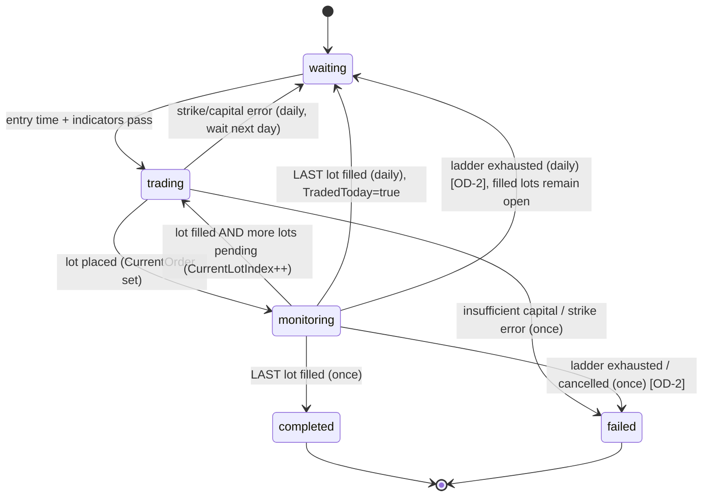
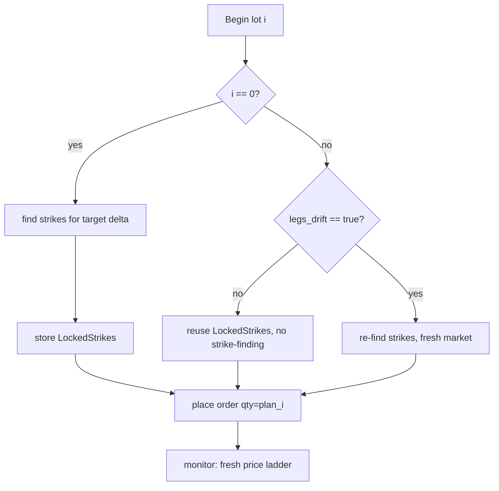

# Technical Design — Auto Mode with Multiple Trades (Lot Size)

**Issue:** [#81 — Auto Mode with multiple trades](https://github.com/schardosin/juicytrade/issues/81)
**Repository:** schardosin/juicytrade
**Branch:** `fleet/issue-81-auto-mode-with-multiple-trades`
**Author:** @architect
**Status:** Draft — pending PO review
**Requirements:** [requirements.md](https://github.com/schardosin/juicytrade/blob/fleet/issue-81-auto-mode-with-multiple-trades/docs/issue-81-auto-mode-with-multiple-trades/requirements.md)

---

## Table of Contents

1. **Overview & Goals** — what we're building and the guiding principles.
2. **Current Architecture (as-is)** — how single-order automation works today.
3. **Design Approach** — the order-plan model layered onto the existing state machine.
4. **Data Model Changes** — new config fields and runtime state.
5. **Order Plan Computation** — the total-first-then-split algorithm.
6. **State Machine Changes** — sequential lot execution, per-lot pricing, drift control.
7. **Component / Flow Diagrams** — mermaid diagrams of the new lifecycle.
8. **Backward Compatibility & Edge Cases** — OD-1, OD-2, single-order guarantees.
9. **Validation & API** — config validation for the new fields.
10. **Frontend Changes** — form fields and progress display.
11. **File-Level Change List (for @dev)** — exact files, functions, and edits.
12. **Testing Strategy** — unit and QA test coverage.
13. **Risks, Trade-offs & Decisions** — explicit reasoning.
14. **Acceptance Criteria Traceability** — mapping AC → design element.

---

## 1. Overview & Goals

Today, when an automation fires, the engine computes a single capital-derived
`units` quantity, finds strikes, places **one** order, and monitors that order to
fill. This feature adds a **lot size** so the same capital-derived total can be
executed as **multiple smaller, strictly-sequential orders**, each priced fresh
to the live market when it begins.

**Guiding principles for this design:**

- **Zero regression.** Single-order runs (`lot_size ≤ 1`) must behave *byte-for-byte*
  as today. The multi-order machinery is only engaged when `lot_size ≥ 2` produces
  more than one lot (OD-1, approved).
- **Reuse, don't rewrite.** All pricing (price ladder, starting offset, min credit,
  attempt interval/count), strike-finding, order placement, monitoring, tracking,
  and persistence code paths are reused **per lot**. No new external dependencies
  (NFR-2).
- **Total-first, then split.** Capital sizing is unchanged; `CalculateUnitsWithCapital`
  remains the single hard cap. Lot size only *slices* that total — it never increases
  exposure (FR-3).
- **Sequential only.** Lot N+1 starts only after lot N is completely filled (FR-4).
  No parallelism, no TWAP.
- **Concurrency-safe.** All new run state is guarded by the engine's existing
  `sync.RWMutex` (`e.mu`) discipline and survives restart via the existing
  runtime-state persistence (NFR-3).

## 2. Current Architecture (as-is)

The automation engine (`trade-backend-go/internal/automation/engine.go`) is a
**per-automation goroutine running a 30-second tick loop** (`runAutomation` →
`runAutomationTick`) that drives a status state machine:

```
idle → waiting → (entry time + indicators pass) → trading → monitoring → completed/failed
                    ↑___________________ daily: reset to waiting ___________________|
```

Key handlers and their responsibilities (all methods on `*Engine`):

| Handler | Responsibility |
|---------|----------------|
| `handleWaitingState` | Checks entry time + indicators; on pass calls `handleTradingState` inline. For `daily`, skips if `TradedToday`. |
| `handleTradingState` | Resolves capital (`resolveTradeCapital`), computes `units := CalculateUnitsWithCapital(resolvedCap)`, finds strikes (`findStrikesForDelta` / `findStrikesForIronCondor`), places **one** order (`placeSpreadOrder` / `placeIronCondorOrder`), sets `CurrentOrder`, appends to `PlacedOrders`, transitions to `monitoring`. |
| `handleMonitoringState` | Polls `checkOrderStatus`. On `filled` → creates `AutomationPosition`, then **terminal**: `once` → `completed`, `daily` → set `TradedToday=true`, `LastTradeDate`, clear `CurrentOrder`, back to `waiting`. On `cancelled/rejected` → fail/retry. On `open/pending` → `handleOrderAdjustment`. |
| `handleOrderAdjustment` | After `AttemptInterval`, if `AttemptNumber >= MaxAttempts` → exhaustion (fail for `once`, wait-next-day for `daily`). Else, if `DeltaDriftLimit > 0`, checks drift (`checkDeltaDrift` / `checkDeltaDriftIronCondor`) and replaces strikes; otherwise walks the price ladder down by `PriceLadderStep` (`replaceOrderWithNewPrice`). |

Relevant state on `types.ActiveAutomation`:
`Status`, `CurrentOrder *PlacedOrder`, `PlacedOrders []PlacedOrder`, `TradedToday`,
`LastTradeDate`, `ErrorCount`, `ResolvedMaxCapital` (percent mode).

Capital sizing lives entirely in `types.TradeConfiguration.CalculateUnitsWithCapital`
(`types/types.go`) — `units = int(resolvedMaxCapital / (width × 100))`, returning `0`
when insufficient. **This formula is not touched.**

Persistence: `runtime_state.go` snapshots `Status`, `CurrentOrder`, `PlacedOrders`,
`TradedToday`, `LastTradeDate`, `ErrorCount`, `Message` for recoverable statuses.

## 3. Design Approach

The cleanest fit is to introduce an **explicit order plan** on the active
automation and make the monitoring "filled" branch **advance the plan** instead of
always going terminal.

**Core idea:**

1. When entering the trading state, compute the **total** units exactly as today,
   then derive an **order plan** — an ordered slice of per-lot quantities
   (e.g. `[2,2,2,1]`).
2. Place **lot 0** using the existing placement path. Record its selected strikes on
   the run state (the "locked legs") so later lots can reuse them.
3. Monitoring proceeds unchanged **within a lot**. When a lot fills, instead of going
   terminal, the engine checks: *are there more lots?* If yes → **re-enter trading
   for the next lot** (transition back to a trading sub-step). If no → the existing
   terminal behavior runs (`completed` / `daily` reset), which now correctly means
   "**all** lots filled" (FR-7).
4. **Fresh pricing per lot** is automatic: re-entering the trading path recomputes the
   starting price from the current market mid via the existing `placeSpreadOrder`
   logic (FR-5).
5. **Strike behavior per lot** is governed by `legs_drift`:
   - `false` → reuse the locked legs from lot 0; delta-drift replacement is disabled
     for the whole run (skip `checkDeltaDrift`).
   - `true` → re-select strikes before each new lot; existing mid-order drift still
     applies (FR-6).

**Why an order plan (vs. a running counter)?** An explicit `[]int` plan makes the
remainder rule (FR-2) a pure, unit-testable function, makes progress reporting trivial
("lot 2 of 4"), and serializes cleanly into the existing runtime-state JSON for
crash recovery. It also keeps `handleTradingState` from needing to re-derive the split
on every re-entry.

**Why reuse the trading→monitoring loop per lot (vs. a blocking inner loop)?** The
engine is a cooperative tick-based state machine with a `stopChan` for cancellation
and restart recovery. A blocking `for` loop inside one handler would break
cancellation responsiveness, market-hours checks, and persistence cadence. Advancing
the plan through the existing state transitions preserves all of that for free.

## 4. Data Model Changes

### 4.1 Config fields — `types.TradeConfiguration` (`internal/automation/types/types.go`)

Add two fields to the existing struct (placed near the other trade parameters):

```go
type TradeConfiguration struct {
    // ... existing fields ...
    LotSize   int  `json:"lot_size,omitempty"`   // Units per order. 0/1 = single order (today's behavior).
    LegsDrift bool `json:"legs_drift,omitempty"` // false = all lots reuse first lot's strikes, no drift at all.
    // ... existing fields ...
}
```

**Naming decision:** the requirements left the final name to the architect (FR-6).
We adopt **`legs_drift`** (as proposed) — it reads naturally with its semantics:
`legs_drift=false` ⇒ legs are frozen; `legs_drift=true` ⇒ legs may drift/re-select.

**Backward compatibility (NFR-1, E-5):** both use `omitempty` and the Go zero value
is the legacy default (`LotSize=0`, `LegsDrift=false`). Persisted configs without
these keys deserialize cleanly and behave exactly as today. **No storage migration
is required** — automation configs are stored as JSON and new keys simply default.

`NewTradeConfiguration()` should set explicit defaults for clarity:
`LotSize: 1` (equivalent to 0 for behavior), `LegsDrift: false`.

### 4.2 A pure helper — effective lot size

Add a method on `TradeConfiguration` to normalize the value once:

```go
// EffectiveLotSize returns the configured lot size, treating 0 (unset) as 1.
func (tc *TradeConfiguration) EffectiveLotSize() int {
    if tc.LotSize < 1 {
        return 1
    }
    return tc.LotSize
}
```

### 4.3 Runtime plan state — `types.ActiveAutomation` (`types/types.go`)

Add fields to track the in-flight multi-order plan:

```go
type ActiveAutomation struct {
    // ... existing fields ...

    // Multi-order (lot size) execution state.
    OrderPlan       []int            `json:"order_plan,omitempty"`        // Per-lot quantities, e.g. [2,2,2,1].
    CurrentLotIndex int              `json:"current_lot_index,omitempty"` // 0-based index of the lot currently being placed/monitored.
    LockedStrikes   *StrikeSelection `json:"locked_strikes,omitempty"`    // Strikes from lot 0 (spread), reused when legs_drift=false.
    LockedICStrikes *IronCondorStrikeSelection `json:"locked_ic_strikes,omitempty"` // Iron Condor equivalent.
}
```

- `OrderPlan` is derived **once** when entering trading for lot 0 and is not
  recomputed on subsequent lots.
- `CurrentLotIndex` advances after each lot fills. The run is complete when
  `CurrentLotIndex == len(OrderPlan)-1` and that lot fills.
- `LockedStrikes` / `LockedICStrikes` capture lot 0's exact strikes for the
  `legs_drift=false` reuse path. Only one is populated depending on strategy.

### 4.4 Persistence — `internal/automation/runtime_state.go`

Add the same four fields to `PersistedAutomation` and copy them in both `Save`
(snapshot) and `RestoreAutomation` (restore). This lets a mid-plan automation resume
correctly after a server restart (it re-enters `monitoring` on the current lot, or
`trading` for the next lot). Because these are additive JSON fields with `omitempty`,
older persisted state files load with empty plans and fall through to single-order
behavior — safe.

## 5. Order Plan Computation

A single pure function, unit-testable in isolation, implements FR-2. Place it in
`types/types.go` next to `CalculateUnitsWithCapital`:

```go
// SplitIntoLots splits a capital-derived total into sequential per-lot quantities.
//   totalUnits: the hard cap from CalculateUnitsWithCapital (never exceeded).
//   lotSize:    units per order (values < 1 are treated as 1).
// Returns an ordered slice whose elements sum EXACTLY to totalUnits.
//   - fullLots  = totalUnits / lotSize
//   - remainder = totalUnits % lotSize   -> appended as a final smaller lot
// Examples:
//   (7, 2) -> [2, 2, 2, 1]
//   (6, 2) -> [2, 2, 2]
//   (5, 5) -> [5]
//   (3, 5) -> [3]      (lot larger than total => single lot for the total)
//   (0, _) -> []       (insufficient capital => no lots)
func SplitIntoLots(totalUnits, lotSize int) []int {
    if totalUnits <= 0 {
        return []int{}
    }
    if lotSize < 1 {
        lotSize = 1
    }
    plan := make([]int, 0)
    full := totalUnits / lotSize
    rem := totalUnits % lotSize
    for i := 0; i < full; i++ {
        plan = append(plan, lotSize)
    }
    if rem > 0 {
        plan = append(plan, rem)
    }
    return plan
}
```

**Invariants (must hold, and are asserted by tests):**

- `sum(plan) == totalUnits` for all inputs (FR-3, AC-4). Lot size never increases
  exposure — it is a strict partition of the same total.
- `lot_size ≤ 1` ⇒ the loop would yield `totalUnits` lots of 1 unit. To keep
  **exact** single-order legacy behavior, the engine treats a single-order case
  specially: **when `EffectiveLotSize()==1`, the plan is set to a single lot
  `[totalUnits]`** and none of the multi-order code paths engage (see §6.1). This
  guarantees OD-1 zero regression rather than placing `totalUnits` one-unit orders.

> Design note: We intentionally special-case `lotSize==1` to `[totalUnits]` instead
> of relying on `SplitIntoLots(total, 1)` (which would produce `total` one-lots).
> The multi-order path is only for `lot_size ≥ 2`.

## 6. State Machine Changes

The state machine keeps the same statuses. We thread the order plan through
`handleTradingState` and `handleMonitoringState`. The transitions become:

```
waiting --(entry + indicators)--> trading[lot 0]
trading[lot i] --order placed--> monitoring[lot i]
monitoring[lot i] --filled + more lots--> trading[lot i+1]     (NEW edge)
monitoring[lot i] --filled + last lot---> completed (once) / waiting+TradedToday (daily)
monitoring[lot i] --exhausted/cancelled--> stop (per OD-2, existing behavior)
```

### 6.1 `handleTradingState` — build/advance the plan

Introduce a distinction between **plan initialization** (lot 0) and **lot advance**
(lot i≥1). Recommended structure: keep `handleTradingState` as the entry point for
lot 0 and extract a shared `placeLot(ctx, id, active, lotIndex)` helper used by both
lot 0 and the advance path.

**Lot 0 (plan init), inside `handleTradingState` after `units` is computed and `units != 0`:**

```go
lotSize := active.Config.TradeConfig.EffectiveLotSize()
var plan []int
if lotSize <= 1 {
    plan = []int{units}                 // single-order legacy path (OD-1)
} else {
    plan = types.SplitIntoLots(units, lotSize)
}
e.mu.Lock()
active.OrderPlan = plan
active.CurrentLotIndex = 0
active.LockedStrikes = nil
active.LockedICStrikes = nil
active.AddLog("info", fmt.Sprintf("Order plan: %d lot(s) totaling %d units %v", len(plan), units, plan))
e.mu.Unlock()
```

Then place lot 0 via the shared placement logic (see §6.3). On success, record
`LockedStrikes`/`LockedICStrikes` from the strikes just selected, set `CurrentOrder`,
append to `PlacedOrders`, transition to `monitoring` — **exactly as today**.

### 6.2 `handleMonitoringState` — advance instead of terminating

In the `case "filled":` branch, after the `AutomationPosition` is created and tracked,
replace the direct terminal logic with a plan check:

```go
morePending := active.CurrentLotIndex < len(active.OrderPlan)-1
if morePending {
    filledQty := active.OrderPlan[active.CurrentLotIndex]
    active.CurrentLotIndex++
    active.CurrentOrder = nil
    active.ErrorCount = 0
    active.Status = types.StatusTrading   // re-enter trading for the next lot
    active.AddLog("info", fmt.Sprintf(
        "Lot %d of %d filled (%d units). Starting next lot.",
        active.CurrentLotIndex, len(active.OrderPlan), filledQty))
    // notifyUpdate + return; next tick (or inline call) runs trading for the new lot
} else {
    // LAST lot filled -> today's terminal behavior, unchanged:
    //   once  -> StatusCompleted
    //   daily -> TradedToday=true, LastTradeDate=today, CurrentOrder=nil, back to waiting
}
```

**Fresh pricing (FR-5, AC-6)** falls out naturally: re-entering `trading` re-runs the
placement path, which reads the current market mid and recomputes the starting limit
price for the new lot. Lots never reuse the prior lot's fill price.

To avoid a 30s stall between lots, the trading→next-lot transition may be executed
**inline** (call the placement path for the next lot at the end of the filled branch),
mirroring how `handleWaitingState` calls `handleTradingState` inline today. Either
inline or next-tick is functionally correct. **Recommendation: next-tick** for
simplicity and to keep mutex critical sections small — the ≤30s gap matches existing
cadence. (@dev may choose inline if latency matters; document the choice.)

### 6.3 Per-lot placement & strike selection (`legs_drift`)

Extract a `placeLot(ctx, id, active, lotIndex)` helper (or branch within
`handleTradingState`) that:

1. Reads `qty := active.OrderPlan[lotIndex]`.
2. Determines strikes:
   - **`lotIndex == 0`:** find strikes via existing `findStrikesForDelta` /
     `findStrikesForIronCondor`; store into `LockedStrikes`/`LockedICStrikes`.
   - **`lotIndex >= 1` and `legs_drift == false`:** reuse `LockedStrikes` /
     `LockedICStrikes` — **no strike-finding call at all**.
   - **`lotIndex >= 1` and `legs_drift == true`:** re-run `findStrikesForDelta` /
     `findStrikesForIronCondor` against the current market (may differ from lot 0).
3. Places the order with `qty` via existing `placeSpreadOrder` / `placeIronCondorOrder`
   (these already accept `units int` — pass the lot quantity). Pricing is recomputed
   fresh inside these functions from the current market mid.
4. Sets `CurrentOrder`, appends to `PlacedOrders`, transitions to `monitoring`.

### 6.4 Delta-drift gating (`legs_drift == false`) — `handleOrderAdjustment`

Today, `handleOrderAdjustment` performs mid-order delta-drift replacement whenever
`config.DeltaDriftLimit > 0`. Per FR-6 / AC-7, when `legs_drift == false` **in a
multi-order run**, drift replacement must be disabled for the entire run (no strike
changes at start or mid-order). Gate the drift block:

```go
// Disable mid-order strike drift when running a multi-lot plan with frozen legs.
driftAllowed := config.DeltaDriftLimit > 0
if len(active.OrderPlan) > 1 && !active.Config.TradeConfig.LegsDrift {
    driftAllowed = false
}
if driftAllowed {
    // ... existing checkDeltaDrift / checkDeltaDriftIronCondor block ...
}
// price-ladder walk-down proceeds as today
```

**OD-1 (single order, approved):** when `len(active.OrderPlan) <= 1` (single-order
run, i.e. `lot_size ≤ 1`), the gate above is a no-op and today's delta-drift behavior
is preserved **exactly**, regardless of the `legs_drift` value. This is the explicit
zero-regression guarantee.

## 7. Component / Flow Diagrams

### 7.1 State machine (multi-lot lifecycle)



### 7.2 Sequential lot execution (sequence diagram, total 6, lot_size 2)

```mermaid
sequenceDiagram
    participant Tick as Tick Loop
    participant Trade as handleTradingState / placeLot
    participant Mon as handleMonitoringState
    participant Prov as ProviderManager

    Tick->>Trade: enter trading (lot 0)
    Trade->>Trade: units=6, plan=[2,2,2], lockStrikes(lot0)
    Trade->>Prov: place order qty=2 @ fresh price
    Trade->>Mon: status=monitoring
    Mon->>Prov: poll status -> filled
    Mon->>Mon: position tracked; lot 0 of 3 done; CurrentLotIndex=1
    Mon->>Trade: status=trading (lot 1)
    Trade->>Prov: place order qty=2 @ fresh price (reuse locked strikes)
    Mon->>Prov: poll -> filled; CurrentLotIndex=2
    Mon->>Trade: status=trading (lot 2)
    Trade->>Prov: place order qty=2 @ fresh price
    Mon->>Prov: poll -> filled; LAST lot
    Mon->>Mon: once -> completed / daily -> TradedToday=true
```

### 7.3 Strike selection decision per lot



## 8. Backward Compatibility & Edge Cases

| ID | Scenario | Behavior |
|----|----------|----------|
| **E-1 / OD-2** | Mid-plan lot exhausts its ladder / max attempts / cancelled without filling | Reuse today's single-order exhaustion path in `handleOrderAdjustment` & the `cancelled/rejected` branch. **Stop** placing further lots. Earlier filled lots remain **open positions** (already tracked). `once` → `failed`; `daily` → `TradedToday=true`, wait next day. No new terminal state needed — because plan advance only happens on `filled`, an exhausted lot naturally halts the plan. |
| **E-2** | `totalUnits < lot_size` (e.g. total 3, lot 5) | `SplitIntoLots(3,5)` → `[3]`. Single lot for the total. Not an error (FR-2). |
| **E-3** | Insufficient capital (`totalUnits == 0`) | Unchanged: `handleTradingState` already fails with "Insufficient capital…" before any plan is built. `SplitIntoLots(0,_)` → `[]` as defense-in-depth. |
| **E-4 / OD-2** | Strike-finding fails on a later lot (`legs_drift=true`) | Reuse existing strike-finding error/retry logic in the placement path (`ErrorCount++`, `>=3` → fail/wait-next-day). Filled lots remain open. |
| **E-5 / NFR-1** | Persisted config or runtime state without `lot_size`/`legs_drift`/plan fields | Deserialize with zero values; `EffectiveLotSize()==1` ⇒ single-order path. Runs identically to before (AC-10). |
| **Restart mid-plan** | Server restarts while `CurrentLotIndex=1` of `[2,2,2]` | Runtime state persists `OrderPlan`, `CurrentLotIndex`, `LockedStrikes`, `CurrentOrder`. On restore: if `monitoring`, resume monitoring current lot; if `trading` was in-flight, `RestoreAutomation` reverts to `evaluating` (existing behavior) — the plan is preserved so re-evaluation re-enters trading at the current lot. **@dev note:** ensure restore does not reset `CurrentLotIndex`. |

**Daily "traded today" (FR-7, AC-9):** `TradedToday` is set **only** in the LAST-lot
branch of `handleMonitoringState`. Intermediate lot fills do **not** set it, so a daily
automation will not reset for the next day until the entire plan has filled.

**`once` completion (FR-7):** `StatusCompleted` is reached **only** after the last lot
fills, for the same reason.

## 9. Validation & API

### 9.1 Backend validation — `internal/api/handlers/automation.go`

A `lot_size` validation must run in both `CreateConfig` and `UpdateConfig`, alongside
the existing `validateCapitalConfig` call. Add a small validator (prefer a dedicated
function for clarity):

```go
func validateLotConfig(tc *types.TradeConfiguration) error {
    // Unset (0) is allowed and means single-order. Negative is rejected.
    if tc.LotSize < 0 {
        return fmt.Errorf("lot_size must be an integer >= 1 (or unset for single order); got %d", tc.LotSize)
    }
    return nil
}
```

- `lot_size` is an `int`, so JSON binding already rejects non-integer/float payloads.
- Reject `lot_size < 0` with a clear `<success:false, message>` 400 response,
  matching NFR-4 conventions (FR-9, AC-1).
- `legs_drift` is a bool; no range validation needed (FR-9).
- Call the new validator in both handlers immediately after `validateCapitalConfig`.

**Note on defaults preservation:** `CreateConfig` resets `TradeConfig` to
`NewTradeConfiguration()` when `Strategy == ""`, preserving only capital fields today.
Since `NewTradeConfiguration()` now defaults `LotSize:1, LegsDrift:false`, this path is
safe. When a client submits `lot_size`/`legs_drift` **with** a strategy (the normal
case), the values bind directly onto `config.TradeConfig` and are preserved.

### 9.2 API surface

No new endpoints. The existing create/update/get automation endpoints carry the two
new fields transparently within `trade_config`. `GET` status responses surface
`order_plan` and `current_lot_index` on the `ActiveAutomation` payload for the UI
progress display (FR-8, AC-11).

## 10. Frontend Changes

`trade-app/src/components/automation/AutomationConfigForm.vue` (Vue 3, Options API
with `setup()`, PrimeVue). Two additions to the trade-config form and the default
config object; one progress display.

### 10.1 Form fields

Add two fields in the trade-parameters `form-grid` (near `delta_drift_limit`, lines
~617–629), following the existing `InputNumber` / toggle patterns:

- **Lot Size** — `InputNumber`, `v-model="config.trade_config.lot_size"`, `:min="1"`,
  integer, `:useGrouping="false"`, hint: *"Units per order. Leave 1 for a single
  order; ≥2 splits the total into sequential lots."*
- **Legs Drift** — a PrimeVue `InputSwitch` (or `Checkbox`),
  `v-model="config.trade_config.legs_drift"`, hint: *"When off, all lots reuse the
  first lot's strikes with no drift. When on, strikes are re-selected before each lot
  and mid-order delta drift applies."*

### 10.2 Default config object

In the `config` reactive default (lines ~947–967), add:

```js
lot_size: 1,
legs_drift: false,
```

### 10.3 Progress display (FR-8, AC-11)

Where the running automation's status/orders are shown (the automation status/monitor
component consuming `ActiveAutomation`), render **"Lot {current_lot_index+1} of
{order_plan.length}"** and the per-lot filled count from `placed_orders`. Exact visual
design is delegated to @ux; the data (`order_plan`, `current_lot_index`,
`placed_orders`) is available on the status payload. Guard for the single-order/legacy
case (`order_plan` empty or length ≤ 1) to show today's single-order status unchanged.

## 11. File-Level Change List (for @dev)

### Backend — `trade-backend-go`

| # | File | Change |
|---|------|--------|
| 1 | `internal/automation/types/types.go` | Add `LotSize int` + `LegsDrift bool` JSON fields to `TradeConfiguration`. Add `EffectiveLotSize()` method. Add `SplitIntoLots(totalUnits, lotSize int) []int` pure func (§5). Set defaults in `NewTradeConfiguration()` (`LotSize:1`). Add `OrderPlan []int`, `CurrentLotIndex int`, `LockedStrikes *StrikeSelection`, `LockedICStrikes *IronCondorStrikeSelection` to `ActiveAutomation`. |
| 2 | `internal/automation/engine.go` — `handleTradingState` | After `units` computed & non-zero: build `OrderPlan` (single lot when `EffectiveLotSize()<=1`, else `SplitIntoLots`), set `CurrentLotIndex=0`, clear locked strikes, log plan. Refactor placement into `placeLot(ctx,id,active,lotIndex)` (or inline branch) handling strike selection per §6.3 and passing `plan[lotIndex]` as `units`. Store `LockedStrikes`/`LockedICStrikes` on lot 0. |
| 3 | `internal/automation/engine.go` — `handleMonitoringState` (`case "filled"`) | Replace terminal-only logic with plan-advance (§6.2): if more lots pending → `CurrentLotIndex++`, clear `CurrentOrder`, reset `ErrorCount`, set `Status=trading`, log "Lot X of N filled"; else run existing terminal (`once`→completed, `daily`→TradedToday/reset). |
| 4 | `internal/automation/engine.go` — `handleOrderAdjustment` | Gate the delta-drift block: `driftAllowed = DeltaDriftLimit>0 && !(len(OrderPlan)>1 && !LegsDrift)` (§6.4). Price-ladder walk-down unchanged. |
| 5 | `internal/automation/engine.go` — `placeLot`/next-lot entry | Optional: allow inline placement for the next lot on fill to avoid ≤30s gap. Default: next-tick (recommended). |
| 6 | `internal/automation/runtime_state.go` | Add `OrderPlan`, `CurrentLotIndex`, `LockedStrikes`, `LockedICStrikes` to `PersistedAutomation`; copy in `Save` and `RestoreAutomation`. Ensure restore does not zero `CurrentLotIndex`. |
| 7 | `internal/api/handlers/automation.go` | Add `validateLotConfig(tc)`; call it after `validateCapitalConfig` in `CreateConfig` and `UpdateConfig` (§9.1). |

### Frontend — `trade-app`

| # | File | Change |
|---|------|--------|
| 8 | `src/components/automation/AutomationConfigForm.vue` | Add Lot Size `InputNumber` + Legs Drift toggle to the trade-params grid; add `lot_size:1, legs_drift:false` to the default config object (§10.1–10.2). |
| 9 | Automation status/monitor component (the one rendering `ActiveAutomation` orders/status) | Add "Lot X of N" + per-lot fill progress from `order_plan` / `current_lot_index` / `placed_orders`, guarded for single-order legacy (§10.3). Final visuals per @ux. |

### Tests (see §12)

| # | File | Change |
|---|------|--------|
| 10 | `internal/automation/types/types_test.go` (+ `qa_` variant) | Table tests for `SplitIntoLots` and `EffectiveLotSize` (all §5 examples + sum invariant). |
| 11 | `internal/automation/engine` tests | Sequential fill advance, `legs_drift` reuse vs. re-select, drift-gating, daily/once completion, OD-2 exhaustion, restart recovery. Use `httptest` mock provider per existing convention (no testify). |
| 12 | `internal/api/handlers/automation_*_test.go` | Validation: reject `lot_size<0`; accept unset/≥1. |

## 12. Testing Strategy

Follows project convention: Go stdlib `testing` (no testify), `httptest.NewServer`
for mock broker APIs, `qa_` prefix for edge/concurrency cases.

**Unit — `SplitIntoLots` (pure, `types_test.go`):**
- `(7,2)→[2,2,2,1]`, `(6,2)→[2,2,2]`, `(5,5)→[5]`, `(3,5)→[3]`, `(0,2)→[]`,
  `(1,3)→[1]`.
- Invariant test: for a grid of totals × lot sizes, assert `sum(plan)==total` and
  every element `>0` and `<=lotSize`.

**Unit — `EffectiveLotSize`:** `0→1`, `-3→1`, `1→1`, `4→4`.

**Engine (integration with mock provider):**
- **AC-2:** total 6, lot 2 → 3 orders of 2, sequential; completed only after all 3.
- **AC-3:** total 7, lot 2 → `[2,2,2,1]`, 4 orders in order.
- **AC-5:** lot N+1 not placed until N fills (assert placement ordering via mock).
- **AC-6:** each lot re-prices from current mid (vary mock mid between lots; assert
  differing starting limit prices).
- **AC-7 (`legs_drift=false`):** all lots use lot-0 strikes; `checkDeltaDrift` never
  triggers a replacement even when mock delta drifts.
- **AC-8 (`legs_drift=true`):** strikes re-selected per lot; mid-order drift still
  replaces.
- **AC-9:** daily → `TradedToday` true only after last lot; once → completed only
  after last lot.
- **AC-10 / OD-1:** `lot_size` unset/1 → single order, byte-identical path, delta
  drift behaves exactly as today.
- **OD-2 (`qa_`):** middle lot exhausts ladder → stop; earlier positions remain open;
  `once`→failed, `daily`→wait-next-day.
- **Restart (`qa_`):** persist mid-plan state, restore, confirm `CurrentLotIndex` and
  `OrderPlan` survive and the run resumes on the correct lot.

**API handler tests:** reject `lot_size<0` (400, clear message); accept unset and ≥1.

**Regression:** run full `cd trade-backend-go && go test ./...` and
`cd trade-app && npx vitest run` — existing automation tests must pass unchanged.

## 13. Risks, Trade-offs & Decisions

| Decision | Rationale | Alternative rejected |
|----------|-----------|----------------------|
| Explicit `OrderPlan []int` on run state | Pure/testable split, trivial progress reporting, clean persistence, no re-derivation | Running counter — harder to report, error-prone on remainder |
| Advance plan via existing state transitions (next-tick) | Preserves cancellation, market-hours, persistence cadence; minimal mutex scope | Blocking inner `for` loop — breaks stopChan responsiveness & recovery |
| Special-case `lotSize==1`→`[total]` | Guarantees OD-1 zero regression (no `total` one-unit orders) | Always `SplitIntoLots` — would fragment legacy single orders |
| Drift gate keyed on `len(OrderPlan)>1 && !LegsDrift` | Ensures single-order runs are never affected by the new flag (OD-1) | Gate on `LegsDrift` alone — would change single-order behavior, regression |
| Reuse `placeSpreadOrder`/`placeIronCondorOrder` (already take `units`) | No signature churn; per-lot pricing is automatic | New placement funcs — unnecessary duplication |
| No storage migration | Additive `omitempty` JSON fields default safely | Versioned migration — overkill for additive fields |

**Risks & mitigations:**
- **Partial fills of a single lot.** Today's engine treats order status as
  binary `filled`/`open` via `checkOrderStatus`; multi-leg spreads fill atomically at
  the broker. Plan-advance only fires on a full `filled`, so partial handling is
  unchanged from today. *No new risk introduced.* (Broker-reported partials are a
  pre-existing concern, out of scope here.)
- **Latency between lots (≤30s next-tick).** Acceptable and matches existing cadence;
  inline option documented if @dev wants tighter sequencing.
- **Capital drift in percent mode across lots.** Total is resolved **once** at plan
  build (lot 0) using `ResolvedMaxCapital`; lots reuse that total. This preserves
  "never exceed capital" (FR-3) and matches how delta-drift replacement already reuses
  the start-of-trade resolved cap.
- **Concurrency.** All plan-state mutations occur inside `e.mu.Lock()` sections, same
  discipline as existing handlers (NFR-3).

## 14. Acceptance Criteria Traceability

| AC | Covered by |
|----|-----------|
| AC-1 (field exists, persists, UI, `<1` rejected) | §4.1, §9.1, §10.1 |
| AC-2 (6, lot 2 → 3×2 sequential) | §5, §6.1–6.2 |
| AC-3 (7, lot 2 → [2,2,2,1]) | §5 `SplitIntoLots` |
| AC-4 (sum == total, never exceed) | §5 invariant, §13 (percent resolved once) |
| AC-5 (N+1 after N fills) | §6.2 advance-on-filled |
| AC-6 (fresh price per lot) | §6.2–6.3 (re-enter placement path) |
| AC-7 (`legs_drift=false`: same strikes, no drift) | §6.3 reuse locked, §6.4 drift gate |
| AC-8 (`legs_drift=true`: re-select + mid-order drift) | §6.3 re-find, §6.4 gate allows |
| AC-9 (once/daily; daily TradedToday after all) | §6.2 last-lot branch, §8 |
| AC-10 (legacy config unchanged) | §4.1 defaults, §5 collapse, §6.4 OD-1 gate |
| AC-11 (observe progress) | §4.3 state, §9.2 payload, §10.3 UI |

---

*Design authored by @architect. Grounded in
`trade-backend-go/internal/automation/{engine.go,types/types.go,runtime_state.go}`,
`internal/api/handlers/automation.go`, and
`trade-app/src/components/automation/AutomationConfigForm.vue`.*


